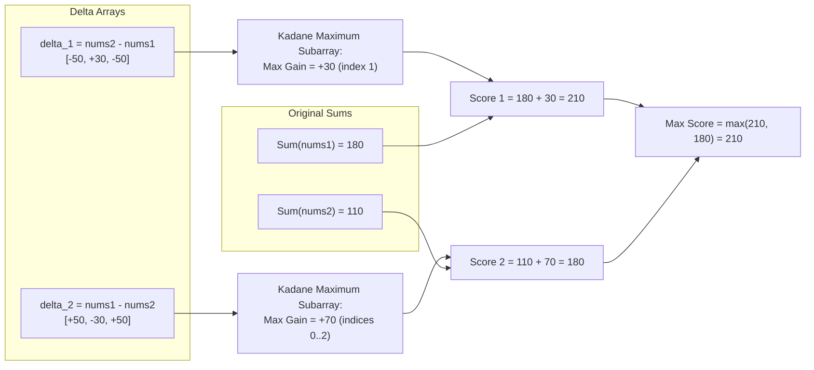

# Guided Example: Maximum Score of Spliced Array

## 1. Problem Overview & Representative Instance

We are given two 0-indexed integer arrays `nums1` and `nums2`, both of identical length $n$. We are permitted to perform at most one splice operation:
- Select a contiguous range of indices $[l, r]$ where $0 \le l \le r < n$.
- Swap the subarray slice $nums1[l..r]$ with $nums2[l..r]$.

The score of an array is defined as the sum of its elements. The goal is to maximize the score of either `nums1` or `nums2` after at most one optional splice operation.

Consider the representative instance:
- `nums1 = [60, 60, 60]`
- `nums2 = [10, 90, 10]`

Original sums:
- $S_1 = 60 + 60 + 60 = 180$
- $S_2 = 10 + 90 + 10 = 110$

If we swap the single element at index 1 between the two arrays:
- `nums1` becomes `[60, 90, 60]` with sum $60 + 90 + 60 = 210$.
- `nums2` becomes `[10, 60, 10]` with sum $10 + 60 + 10 = 80$.

The maximum achievable score is $210$.

## 2. Mathematical & Algorithmic Principles

Let $S_1 = \sum_{k=0}^{n-1} nums1[k]$ and $S_2 = \sum_{k=0}^{n-1} nums2[k]$ be the baseline sums.

When replacing subarray $nums1[l..r]$ with $nums2[l..r]$, the revised sum $S_1'$ becomes:

$$S_1' = S_1 + \sum_{k=l}^r \big(nums2[k] - nums1[k]\big)$$

Similarly, replacing subarray $nums2[l..r]$ with $nums1[l..r]$ produces revised sum $S_2'$:

$$S_2' = S_2 + \sum_{k=l}^r \big(nums1[k] - nums2[k]\big)$$

### Reduction to Maximum Subarray Sum (Kadane's Algorithm)
Define the element-wise difference vectors:
- $\delta_1[k] = nums2[k] - nums1[k]$ (gain obtained by importing elements from `nums2` into `nums1`)
- $\delta_2[k] = nums1[k] - nums2[k] = -\delta_1[k]$ (gain obtained by importing elements from `nums1` into `nums2`)

Maximizing $S_1'$ over all intervals $[l, r]$ is equivalent to maximizing the contiguous subarray sum on $\delta_1$:

$$\max_{0 \le l \le r < n} S_1' = S_1 + \max \left( 0, \, \max_{l \le r} \sum_{k=l}^r \delta_1[k] \right)$$

Kadane's algorithm computes the maximum contiguous subarray sum in a single linear pass using the local recurrence:

$$\text{curr}[k] = \max(\delta[k], \, \text{curr}[k-1] + \delta[k])$$
$$\text{max\_gain} = \max_k \text{curr}[k]$$

Because doing zero swaps yields a gain of $0$, the maximum achievable score is:

$$\max \Big( S_1 + \max(0, \text{max\_gain}(\delta_1)), \, S_2 + \max(0, \text{max\_gain}(\delta_2)) \Big)$$

| Optimization Target | Base Sum | Gain Vector | Optimal Subarray Objective |
|---|---|---|---|
| Maximize $nums1$ score | $S_1 = \sum nums1$ | $\delta_1 = nums2 - nums1$ | $\max_{l \le r} \sum_{k=l}^r \delta_1[k]$ |
| Maximize $nums2$ score | $S_2 = \sum nums2$ | $\delta_2 = nums1 - nums2$ | $\max_{l \le r} \sum_{k=l}^r \delta_2[k]$ |

## 3. Step-by-Step Walkthrough with Intermediate State

We analyze the representative instance: `nums1 = [60, 60, 60]` and `nums2 = [10, 90, 10]`.
Baseline sums: $S_1 = 180$, $S_2 = 110$.

### Phase 1: Maximizing `nums1` via $\delta_1 = nums2 - nums1$
- Index 0: $\delta_1[0] = 10 - 60 = -50$.
  - $\text{curr} = -50$, $\text{max\_gain}_1 = -50$.
- Index 1: $\delta_1[1] = 90 - 60 = +30$.
  - Extending prior: $-50 + 30 = -20$.
  - Starting fresh at index 1: $+30$.
  - Best local choice: $\text{curr} = \max(30, -20) = 30$.
  - $\text{max\_gain}_1 = \max(-50, 30) = 30$.
- Index 2: $\delta_1[2] = 10 - 60 = -50$.
  - Extending prior: $30 + (-50) = -20$.
  - Starting fresh: $-50$.
  - $\text{curr} = \max(-50, -20) = -20$.
  - $\text{max\_gain}_1 = \max(30, -20) = 30$.

Best gain for `nums1` is $+30$ at slice $[1, 1]$.
Max score for `nums1`: $S_1 + 30 = 180 + 30 = 210$.

### Phase 2: Maximizing `nums2` via $\delta_2 = nums1 - nums2$
- Index 0: $\delta_2[0] = 60 - 10 = +50$.
  - $\text{curr} = 50$, $\text{max\_gain}_2 = 50$.
- Index 1: $\delta_2[1] = 60 - 90 = -30$.
  - Extending prior: $50 + (-30) = 20$.
  - Starting fresh: $-30$.
  - $\text{curr} = \max(-30, 20) = 20$.
  - $\text{max\_gain}_2 = \max(50, 20) = 50$.
- Index 2: $\delta_2[2] = 60 - 10 = +50$.
  - Extending prior: $20 + 50 = 70$.
  - Starting fresh: $+50$.
  - $\text{curr} = \max(50, 70) = 70$.
  - $\text{max\_gain}_2 = \max(50, 70) = 70$.

Best gain for `nums2` is $+70$ at slice $[0, 2]$ (the full array).
Max score for `nums2`: $S_2 + 70 = 110 + 70 = 180$.

### Final Global Selection:
$$\max(210, 180) = 210$$

## 4. Comprehensive State Trace

The execution progression of Kadane's dynamic program across both difference arrays is recorded below.

| Step Index $k$ | $nums1[k]$ | $nums2[k]$ | $\delta_1[k]$ | $\text{curr}_1[k]$ | $\text{max\_gain}_1$ | $\delta_2[k]$ | $\text{curr}_2[k]$ | $\text{max\_gain}_2$ |
|---|---|---|---|---|---|---|---|---|
| Init | - | - | - | 0 | $-\infty$ | - | 0 | $-\infty$ |
| 0 | 60 | 10 | -50 | -50 | -50 | +50 | +50 | +50 |
| 1 | 60 | 90 | +30 | +30 | +30 | -30 | +20 | +50 |
| 2 | 60 | 10 | -50 | -20 | +30 | +50 | +70 | +70 |

Final comparison:
- Best candidate from $nums1$: $180 + \max(0, 30) = 210$
- Best candidate from $nums2$: $110 + \max(0, 70) = 180$
- Optimal result: $210$

## 5. Algorithmic Correctness & Soundness

1. **Exact Additive Duality:**
   Because swapping subarray $[l, r]$ alters only the elements within indices $l \le k \le r$, all outside elements remain fixed. The difference between the new sum and the original sum is exactly $\sum_{k=l}^r (nums2[k] - nums1[k])$. Thus, the search for the optimal interval $[l, r]$ is mathematically isomorphic to finding the contiguous subarray of maximum sum on the delta sequence.

2. **Completeness of Kadane's Algorithm:**
   Kadane's algorithm explores all ending positions $r$ and, for each $r$, implicitly considers the optimal prefix $l \le r$ that maximizes $\sum_{k=l}^r \delta[k]$. Its correctness for the standard maximum subarray sum problem guarantees that no contiguous interval can achieve a higher gain.

## 6. Edge Cases & Anti-Patterns

- **No Swap Advantageous:**
  - If all elements of `nums1` are greater than or equal to `nums2`, $\delta_1 \le 0$ everywhere. Kadane's maximum will be $\le 0$, so $\max(0, \text{gain}) = 0$. The baseline sum $S_1$ is preserved.
- **Single Element Arrays ($n = 1$):**
  - Only one swap is possible (or zero swaps), resulting in $\max(nums1[0], nums2[0])$.
- **Identical Arrays:**
  - All differences are zero. Maximum gain is 0, returning the common sum.
- **Anti-Pattern (Brute Force Range Enumeration):**
  - Checking all $\mathcal{O}(n^2)$ index pairs $[l, r]$ with prefix sums takes $\mathcal{O}(n^2)$ time, which is too slow for $n = 10^5$. Linear Kadane scans compute the optimal bounds in $\mathcal{O}(n)$.

## 7. Complexity Analysis

- **Time Complexity:** $\mathcal{O}(n)$ where $n$ is the length of `nums1` and `nums2`. We compute the initial array sums in $\mathcal{O}(n)$ and execute Kadane's algorithm twice (once for $\delta_1$ and once for $\delta_2$), each taking a single linear pass of length $n$. Total time is strictly $\mathcal{O}(n)$.
- **Space Complexity:** $\mathcal{O}(1)$ auxiliary space if the difference $\delta[k]$ is evaluated on-the-fly during iteration, storing only running scalars for sums and maximum subarray gains.
