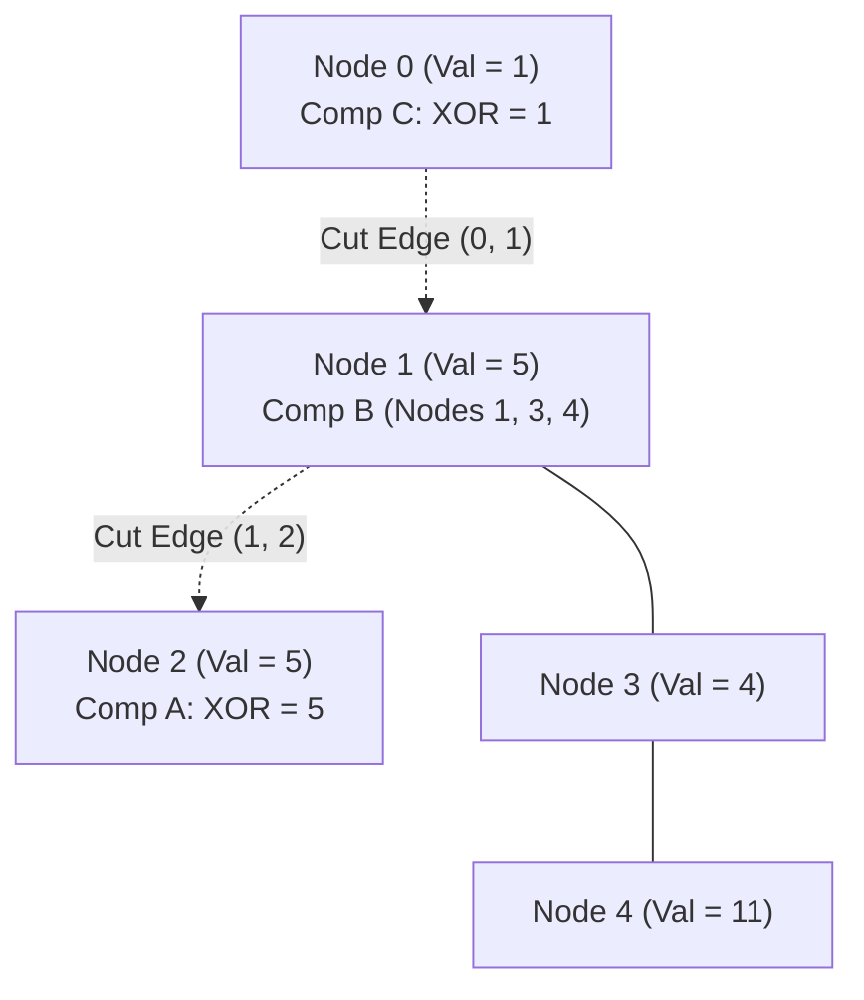

# Guided Example: Minimum Score After Removals on a Tree

## 1. Problem Overview & Representative Instance

An undirected tree with $n$ nodes labeled from $0$ to $n - 1$ is given, where each node $i$ has an integer value $nums[i]$. The tree structure is specified by $n - 1$ edges.

We must choose exactly two distinct edges to remove. Removing two edges partitions the tree into three disconnected components. For any such partition:
1. Compute the bitwise XOR sum of the node values within each of the three resulting components, denoted $x_1, x_2, x_3$.
2. The **score** of the partition is the difference between the largest and smallest component XOR sums:
   $$\text{score} = \max(x_1, x_2, x_3) - \min(x_1, x_2, x_3)$$

The objective is to find the minimum possible score obtainable across all valid pairs of removed edges.

Consider the representative instance:
- `nums = [1, 5, 5, 4, 11]` (length $n = 5$)
- `edges = [[0, 1], [1, 2], [1, 3], [3, 4]]`

Node values:
- Node 0: $1$
- Node 1: $5$
- Node 2: $5$
- Node 3: $4$
- Node 4: $11$

Total tree XOR sum:
$$S = 1 \oplus 5 \oplus 5 \oplus 4 \oplus 11 = 14$$

## 2. Mathematical & Algorithmic Principles

Designating node $0$ as the tree root establishes a parent-child hierarchy. Every edge in the tree connects a child node $u$ to its parent $p$. Removing that edge detaches the entire subtree rooted at $u$.

Let $xor[u]$ denote the bitwise XOR sum of all nodes in the subtree rooted at $u$, and let $S$ be the total XOR sum of all $n$ nodes.

When two edges detaching subtrees rooted at $u$ and $v$ are removed, their structural relationship falls into one of two topological configurations:

### Case 1: Nested Subtrees (Ancestor-Descendant Relationship)
Assume without loss of generality that $u$ is an ancestor of $v$ (so $v$ resides inside $u$'s subtree):
- **Component A (Detached subtree $v$):**
  $$x_A = xor[v]$$
- **Component B (Subtree $u$ stripped of subtree $v$):**
  $$x_B = xor[u] \oplus xor[v]$$
- **Component C (Rest of the tree containing root):**
  $$x_C = S \oplus xor[u]$$

### Case 2: Disjoint Subtrees (Independent Branches)
Neither $u$ nor $v$ is an ancestor of the other:
- **Component A (Detached subtree $u$):**
  $$x_A = xor[u]$$
- **Component B (Detached subtree $v$):**
  $$x_B = xor[v]$$
- **Component C (Rest of the tree containing root):**
  $$x_C = S \oplus xor[u] \oplus xor[v]$$

### Ancestry Testing via DFS Timestamps
During a single preprocessing DFS traversal, we record entry time $in[u]$ and exit time $out[u]$:
- Node $u$ is an ancestor of $v$ if and only if $in[u] \le in[v] < out[u]$.
This enables $\mathcal{O}(1)$ classification of the topological relationship between any pair of cut edges.

| Cut Relationship | Component A XOR | Component B XOR | Component C XOR (Root Component) |
|---|---|---|---|
| Nested ($u$ is ancestor of $v$) | $xor[v]$ | $xor[u] \oplus xor[v]$ | $S \oplus xor[u]$ |
| Disjoint (neither is ancestor) | $xor[u]$ | $xor[v]$ | $S \oplus xor[u] \oplus xor[v]$ |

## 3. Step-by-Step Walkthrough with Intermediate State

We root the representative tree at node $0$ and compute subtree XOR sums:
- Node 4: Leaf $\implies xor[4] = 11$.
- Node 3: Children $\{4\} \implies xor[3] = nums[3] \oplus xor[4] = 4 \oplus 11 = 15$.
- Node 2: Leaf $\implies xor[2] = 5$.
- Node 1: Children $\{2, 3\} \implies xor[1] = nums[1] \oplus xor[2] \oplus xor[3] = 5 \oplus 5 \oplus 15 = 15$.
- Node 0: Root $\implies xor[0] = nums[0] \oplus xor[1] = 1 \oplus 15 = 14 = S$.

The 4 edges correspond to cutting under nodes $\{1, 2, 3, 4\}$. We evaluate potential edge pairs:

### Pair 1: Cut edges under Node 1 and Node 2
- Topology: Node 1 is an ancestor of Node 2 (Nested).
- Component XOR formulas:
  - $x_A = xor[2] = 5$
  - $x_B = xor[1] \oplus xor[2] = 15 \oplus 5 = 10$
  - $x_C = S \oplus xor[1] = 14 \oplus 15 = 1$
- Triplet: $\{5, 10, 1\}$.
- Score: $\max(5, 10, 1) - \min(5, 10, 1) = 10 - 1 = 9$.

### Pair 2: Cut edges under Node 1 and Node 3
- Topology: Node 1 is an ancestor of Node 3 (Nested).
- Component XOR formulas:
  - $x_A = xor[3] = 15$
  - $x_B = xor[1] \oplus xor[3] = 15 \oplus 15 = 0$
  - $x_C = S \oplus xor[1] = 14 \oplus 15 = 1$
- Triplet: $\{15, 0, 1\}$.
- Score: $\max(15, 0, 1) - \min(15, 0, 1) = 15 - 0 = 15$.

### Pair 3: Cut edges under Node 2 and Node 3
- Topology: Neither is an ancestor of the other (Disjoint).
- Component XOR formulas:
  - $x_A = xor[2] = 5$
  - $x_B = xor[3] = 15$
  - $x_C = S \oplus xor[2] \oplus xor[3] = 14 \oplus 5 \oplus 15 = 4$
- Triplet: $\{5, 15, 4\}$.
- Score: $\max(5, 15, 4) - \min(5, 15, 4) = 15 - 4 = 11$.

### Pair 4: Cut edges under Node 2 and Node 4
- Topology: Node 2 and Node 4 are in disjoint subtrees (Disjoint).
- Component XOR formulas:
  - $x_A = xor[2] = 5$
  - $x_B = xor[4] = 11$
  - $x_C = S \oplus xor[2] \oplus xor[4] = 14 \oplus 5 \oplus 11 = 0$
- Triplet: $\{5, 11, 0\}$.
- Score: $11 - 0 = 11$.

The minimal score across all combinations is $9$, achieved by cutting under Node 1 and Node 2.

## 4. Comprehensive State Trace

The table below catalogs the evaluation of every unordered pair of edge cuts in the representative tree.

| Cut Pair $(u, v)$ | Topological Category | Component A ($x_A$) | Component B ($x_B$) | Component C ($x_C$) | Minimum Value | Maximum Value | Computed Score |
|---|---|---|---|---|---|---|---|
| $(1, 2)$ | Nested ($1 \to 2$) | $xor[2] = 5$ | $15 \oplus 5 = 10$ | $14 \oplus 15 = 1$ | 1 | 10 | 9 (Optimal) |
| $(1, 3)$ | Nested ($1 \to 3$) | $xor[3] = 15$ | $15 \oplus 15 = 0$ | $14 \oplus 15 = 1$ | 0 | 15 | 15 |
| $(1, 4)$ | Nested ($1 \to 4$) | $xor[4] = 11$ | $15 \oplus 11 = 4$ | $14 \oplus 15 = 1$ | 1 | 11 | 10 |
| $(2, 3)$ | Disjoint | $xor[2] = 5$ | $xor[3] = 15$ | $14 \oplus 5 \oplus 15 = 4$ | 4 | 15 | 11 |
| $(2, 4)$ | Disjoint | $xor[2] = 5$ | $xor[4] = 11$ | $14 \oplus 5 \oplus 11 = 0$ | 0 | 11 | 11 |
| $(3, 4)$ | Nested ($3 \to 4$) | $xor[4] = 11$ | $15 \oplus 11 = 4$ | $14 \oplus 15 = 1$ | 1 | 11 | 10 |

## 5. Algorithmic Correctness & Soundness

1. **Partition Exhaustiveness:**
   Any pair of edges in a tree corresponds uniquely to the edges connecting some child $u$ to its parent, and some child $v$ to its parent. Because a tree has no cycles, cutting two edges always breaks the vertex set into exactly three connected components.

2. **XOR Cancellation Property:**
   Bitwise XOR is self-inverting ($y \oplus y = 0$). For nested cuts with $v \in \text{subtree}(u)$, the nodes in $\text{subtree}(u) \setminus \text{subtree}(v)$ have XOR sum precisely $xor[u] \oplus xor[v]$. For disjoint cuts, removing both subtrees leaves the root component with XOR sum $S \oplus xor[u] \oplus xor[v]$. In all cases, the three component XORs satisfy $x_A \oplus x_B \oplus x_C = S$, ensuring global consistency.

## 6. Edge Cases & Anti-Patterns

- **Minimal Tree ($n = 3$):**
  - Exactly 2 edges exist. Both must be removed, leaving 3 isolated nodes. The score is $\max(nums) - \min(nums)$.
- **Star Graph (Root connected to all leaves):**
  - All subtrees are disjoint leaves. Nested cuts never occur; all evaluated pairs follow the disjoint formula.
- **Path Graph (Linear Chain):**
  - Every cut pair is nested. Ancestry reduces to comparing depth indices.
- **Anti-Pattern (Re-traversing Tree for Each Edge Pair):**
  - Running a fresh DFS or BFS for each pair of cut edges takes $\mathcal{O}(n^3)$ time, causing timeouts for $n = 1000$. Precomputing subtree XORs and ancestry intervals reduces each pair evaluation to $\mathcal{O}(1)$ arithmetic operations.

## 7. Complexity Analysis

- **Time Complexity:** $\mathcal{O}(n^2)$. Preprocessing subtree XOR sums and DFS timestamps requires $\mathcal{O}(n)$ time. Evaluating all $\binom{n-1}{2} = \frac{(n-1)(n-2)}{2} = \mathcal{O}(n^2)$ pairs takes $\mathcal{O}(1)$ time per pair. For $n \le 1000$, $\approx 5 \times 10^5$ operations execute in under 50 milliseconds.
- **Space Complexity:** $\mathcal{O}(n)$ auxiliary space to store the adjacency list, subtree XOR array, and entry/exit timestamps.
