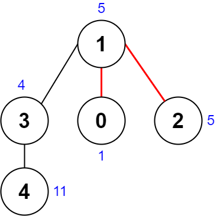
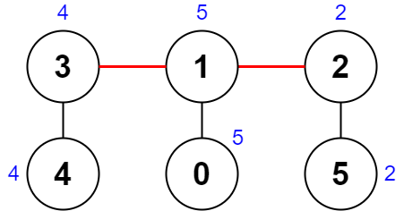

### 1. Description

There is an undirected connected tree with `n` nodes labeled from `0` to $n - 1$ and $n - 1$ edges.

You are given a **0-indexed** integer array `nums` of length `n` where $\text{nums}[i]$ represents the value of the $i^{\text{th}}$ node. You are also given a 2D integer array `edges` of length $n - 1$ where $\text{edges}[i] = [a_{i}, b_{i}]$ indicates that there is an edge between nodes $a_{i}$ and $b_{i}$ in the tree.

Remove two **distinct** edges of the tree to form three connected components. For a pair of removed edges, the following steps are defined:

- Get the XOR of all the values of the nodes for **each** of the three components respectively.

- The **difference** between the **largest** XOR value and the **smallest** XOR value is the **score** of the pair.

- For example, say the three components have the node values: `[4,5,7]`, `[1,9]`, and `[3,3,3]`. The three XOR values are `4 ^ 5 ^ 7 = <u>**6**</u>`, `1 ^ 9 = <u>**8**</u>`, and `3 ^ 3 ^ 3 = <u>**3**</u>`. The largest XOR value is `8` and the smallest XOR value is `3`. The score is then $8 - 3 = 5$.

Return *the **minimum** score of any possible pair of edge removals on the given tree*.

### 2. Function Contract

**Inputs**

- `nums`: Input parameter (`List[int]`).
- `edges`: Input parameter (`List[List[int]]`).

**Return value**

- Returns `int`.

### 3. Examples

#### Example 1

- **Input:** `nums = [1,5,5,4,11], edges = [[0,1],[1,2],[1,3],[3,4]]`
- **Output:** `9`
- **Explanation:** The diagram above shows a way to make a pair of removals.
- The 1^st component has nodes [1,3,4] with values [5,4,11]. Its XOR value is 5 ^ 4 ^ 11 = 10.
- The 2^nd component has node [0] with value [1]. Its XOR value is 1 = 1.
- The 3^rd component has node [2] with value [5]. Its XOR value is 5 = 5.
The score is the difference between the largest and smallest XOR value which is 10 - 1 = 9.
It can be shown that no other pair of removals will obtain a smaller score than 9.

#### Example 2

- **Input:** `nums = [5,5,2,4,4,2], edges = [[0,1],[1,2],[5,2],[4,3],[1,3]]`
- **Output:** `0`
- **Explanation:** The diagram above shows a way to make a pair of removals.
- The 1^st component has nodes [3,4] with values [4,4]. Its XOR value is 4 ^ 4 = 0.
- The 2^nd component has nodes [1,0] with values [5,5]. Its XOR value is 5 ^ 5 = 0.
- The 3^rd component has nodes [2,5] with values [2,2]. Its XOR value is 2 ^ 2 = 0.
The score is the difference between the largest and smallest XOR value which is 0 - 0 = 0.
We cannot obtain a smaller score than 0.

### 4. Constraints

- $n = \text{nums.length}$

- $3 \le n \le 1000$

- $1 \le \text{nums}[i] \le 10^{8}$

- $\text{edges.length} = n - 1$

- $\text{edges}[i].length = 2$

- $0 \le a_{i}, b_{i} < n$

- $a_{i} \neq b_{i}$

- `edges` represents a valid tree.
