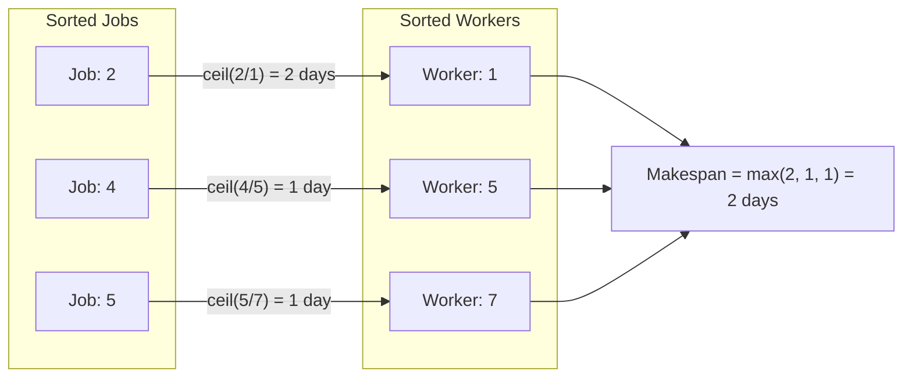

# Guided Example: Find Minimum Time to Finish All Jobs II

## 1. Problem Overview & Representative Instance

We are given two integer arrays, `jobs` and `workers`, where $jobs[i]$ denotes the workload of the $i$-th job and $workers[j]$ represents the daily capacity of the $j$-th worker. Each worker must be assigned to execute exactly one job, and all workers operate simultaneously and independently.

The time required for a worker with capacity $w$ to complete a job with workload $j$ is given by ceiling division:

$$\text{time}(j, w) = \left\lceil \frac{j}{w} \right\rceil = \left\lfloor \frac{j + w - 1}{w} \right\rfloor$$

Because all assignments proceed in parallel, the total completion time (the makespan) is governed by the slowest worker-job pair:

$$\text{Makespan} = \max_{i} \left\lceil \frac{jobs[\pi(i)]}{workers[i]} \right\rceil$$

where $\pi$ is a bijection assigning each worker to a unique job. The objective is to construct a matching $\pi$ that minimizes this makespan.

Consider the representative instance:
- Workloads: `jobs = [5, 2, 4]`
- Worker capacities: `workers = [1, 7, 5]`

If jobs were paired naively with workers in input order:
- Job 5 with Worker 1 $\implies \lceil 5 / 1 \rceil = 5$ days.
- Job 2 with Worker 7 $\implies \lceil 2 / 7 \rceil = 1$ day.
- Job 4 with Worker 5 $\implies \lceil 4 / 5 \rceil = 1$ day.
Makespan: $\max(5, 1, 1) = 5$ days.

However, an optimal assignment finishes all jobs in only $2$ days.

## 2. Mathematical & Algorithmic Principles

To minimize the maximum ratio $\lceil j / w \rceil$, we analyze an exchange argument between any two pairs.

### Exchange Lemma for Bottleneck Ratios
Suppose we have two jobs with workloads $j_1 \le j_2$ and two workers with capacities $w_1 \le w_2$.
There are two possible assignments:
1. **Sorted Assignment (Order-Preserving):** Pair $(j_1, w_1)$ and $(j_2, w_2)$.
   $$\text{Makespan}_{\text{sorted}} = \max\left( \left\lceil \frac{j_1}{w_1} \right\rceil, \, \left\lceil \frac{j_2}{w_2} \right\rceil \right)$$
2. **Inverted Assignment (Crossed):** Pair $(j_1, w_2)$ and $(j_2, w_1)$.
   $$\text{Makespan}_{\text{inverted}} = \max\left( \left\lceil \frac{j_1}{w_2} \right\rceil, \, \left\lceil \frac{j_2}{w_1} \right\rceil \right)$$

Because $j_1 \le j_2$ and $w_1 \le w_2$:
- $\frac{j_1}{w_1} \le \frac{j_2}{w_1} \implies \left\lceil \frac{j_1}{w_1} \right\rceil \le \left\lceil \frac{j_2}{w_1} \right\rceil$
- $\frac{j_2}{w_2} \le \frac{j_2}{w_1} \implies \left\lceil \frac{j_2}{w_2} \right\rceil \le \left\lceil \frac{j_2}{w_1} \right\rceil$

Therefore:
$$\max\left( \left\lceil \frac{j_1}{w_1} \right\rceil, \, \left\lceil \frac{j_2}{w_2} \right\rceil \right) \le \left\lceil \frac{j_2}{w_1} \right\rceil \le \text{Makespan}_{\text{inverted}}$$

The order-preserving matching never produces a bottleneck strictly greater than the crossed matching. By uncrossing inversions iteratively, any arbitrary matching can be transformed into the monotonically sorted matching without increasing the makespan.

### Integer Arithmetic Formulation
Ceiling division for positive integers $a, b > 0$ can be computed using exact integer arithmetic:

$$\left\lceil \frac{a}{b} \right\rceil = \frac{a + b - 1}{b}$$

| Pairing Method | Worker Capacity Order | Job Workload Order | Bottleneck Bound |
|---|---|---|---|
| Monotonic Co-Sorted | Ascending: $w_1 \le w_2 \le \dots \le w_n$ | Ascending: $j_1 \le j_2 \le \dots \le j_n$ | Globally minimal makespan |
| Unsorted / Inverted | Arbitrary permutations | Arbitrary permutations | Suboptimal or equivalent |

## 3. Step-by-Step Walkthrough with Intermediate State

We execute the sorted pairing on `jobs = [5, 2, 4]` and `workers = [1, 7, 5]`.

### Step 1: Sorting Both Sequences
- Sort workloads: $jobs_{\text{sorted}} = [2, 4, 5]$
- Sort capacities: $workers_{\text{sorted}} = [1, 5, 7]$

### Step 2: Evaluating Co-Sorted Pairs
- **Pair 0:** Job $j_0 = 2$, Worker $w_0 = 1$
  - Integer calculation: $(2 + 1 - 1) // 1 = 2 // 1 = 2$.
  - Completion time: $2$ days.
  - Running bottleneck: $\max(0, 2) = 2$.

- **Pair 1:** Job $j_1 = 4$, Worker $w_1 = 5$
  - Integer calculation: $(4 + 5 - 1) // 5 = 8 // 5 = 1$.
  - Completion time: $1$ day.
  - Running bottleneck: $\max(2, 1) = 2$.

- **Pair 2:** Job $j_2 = 5$, Worker $w_2 = 7$
  - Integer calculation: $(5 + 7 - 1) // 7 = 11 // 7 = 1$.
  - Completion time: $1$ day.
  - Running bottleneck: $\max(2, 1) = 2$.

### Global Output:
The overall makespan is $2$ days.

## 4. Comprehensive State Trace

The table below contrasts the naive unaligned pairing against the optimal co-sorted matching.

| Evaluation Metric | Pair 0 | Pair 1 | Pair 2 | Bottleneck Result |
|---|---|---|---|---|
| Input Alignment Workload | $jobs[0] = 5$ | $jobs[1] = 2$ | $jobs[2] = 4$ | - |
| Input Alignment Capacity | $workers[0] = 1$ | $workers[1] = 7$ | $workers[2] = 5$ | - |
| Input Alignment Days | $\lceil 5/1 \rceil = 5$ | $\lceil 2/7 \rceil = 1$ | $\lceil 4/5 \rceil = 1$ | $\max(5, 1, 1) = 5$ days |
| Sorted Alignment Workload | $jobs_{\text{sorted}}[0] = 2$ | $jobs_{\text{sorted}}[1] = 4$ | $jobs_{\text{sorted}}[2] = 5$ | - |
| Sorted Alignment Capacity | $workers_{\text{sorted}}[0] = 1$ | $workers_{\text{sorted}}[1] = 5$ | $workers_{\text{sorted}}[2] = 7$ | - |
| Sorted Alignment Days | $\lceil 2/1 \rceil = 2$ | $\lceil 4/5 \rceil = 1$ | $\lceil 5/7 \rceil = 1$ | $\max(2, 1, 1) = 2$ days |

## 5. Algorithmic Correctness & Soundness

1. **Inversion Elimination Argument:**
   Let $\pi$ be an arbitrary optimal matching that does not preserve sorted order. There must exist two indices $i < j$ such that $workers[i] \le workers[j]$ but $jobs[\pi(i)] > jobs[\pi(j)]$. Swapping the job assignments to pair $workers[i]$ with $jobs[\pi(j)]$ and $workers[j]$ with $jobs[\pi(i)]$ is guaranteed by the Exchange Lemma not to increase $\max(\text{time}_i, \text{time}_j)$. Because the number of inversions strictly decreases with each adjacent swap, a finite sequence of uncrossing operations transforms $\pi$ into the identity matching without degrading the makespan.

2. **Precision of Integer Division:**
   Using the formula $(a + b - 1) // b$ avoids IEEE 754 floating-point rounding errors on large numbers, guaranteeing exact day boundaries.

## 6. Edge Cases & Anti-Patterns

- **Exact Divisibility ($jobs[i] = k \cdot workers[i]$):**
  - For $jobs = [12]$, $workers = [4]$, $(12 + 4 - 1) // 4 = 15 // 4 = 3$, matching $12 / 4 = 3$.
- **All Pairs Completed in 1 Day ($jobs[i] \le workers[i]$ everywhere):**
  - If the largest job does not exceed the capacity of its assigned worker, all pairs require exactly 1 day.
- **Identical Elements / Multiplicities:**
  - Duplicate workloads or worker capacities sort stably without impacting bottleneck evaluations.
- **Anti-Pattern (Binary Search on Answer):**
  - While binary search over possible days $[1, \max(jobs)]$ paired with greedy checking works, sorting and direct element-wise pairing solves the problem in a single pass without extra logarithmic search overhead.

## 7. Complexity Analysis

- **Time Complexity:** $\mathcal{O}(n \log n)$ where $n$ is the length of `jobs` and `workers`. Sorting both arrays takes $\mathcal{O}(n \log n)$ comparisons. The subsequent element-wise zipped scan takes linear $\mathcal{O}(n)$ time.
- **Space Complexity:** $\mathcal{O}(1)$ auxiliary space beyond the in-place sorting memory, as the ceiling division and running maximum are evaluated with scalar counters.
