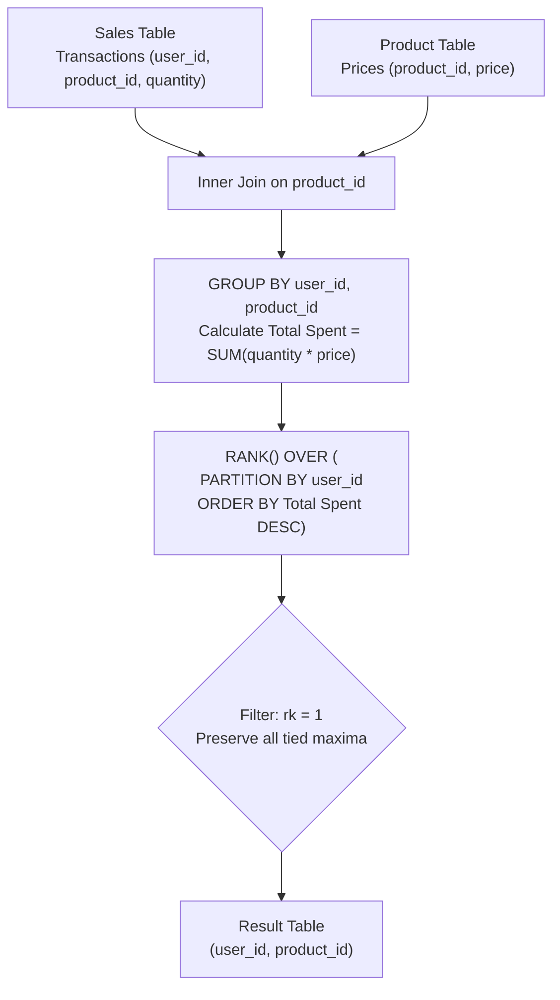

# Guided Example: Product Sales Analysis IV

## 1. Problem Overview & Representative Instance

We are given two relational database tables:
1. `Sales`: Contains transaction records with columns `sale_id`, `product_id`, `user_id`, and `quantity`. A user may purchase the same product across multiple separate sales transactions.
2. `Product`: Contains product catalog data with columns `product_id` and unit `price`.

The objective is to identify, for every `user_id`, the product (or products) on which that user spent the most money. Total expenditure for a user on a given product is the sum of `quantity * price` across all transactions involving that specific user and product. If a user spends the exact same maximum amount on multiple distinct products (a tie), all such tied products must be returned in the result.

Consider the representative instance:

Representative input data:
- Catalog Prices (`Product`):
  - Product 1: price $= 10$
  - Product 2: price $= 25$
  - Product 3: price $= 15$
- Transactions (`Sales`):
  - User 101:
    - Sale 1: Product 1, quantity 10
    - Sale 2: Product 3, quantity 7
  - User 102:
    - Sale 3: Product 1, quantity 9
    - Sale 4: Product 2, quantity 6
    - Sale 5: Product 3, quantity 10
    - Sale 6: Product 1, quantity 6

## 2. Mathematical & Algorithmic Principles

For each unique pair $(u, p) \in \text{Users} \times \text{Products}$, total customer expenditure is given by the linear combination:

$$\operatorname{Spent}(u, p) = \sum_{s \in \text{Sales} \atop s.u = u, \, s.p = p} s.\text{quantity} \times \operatorname{Price}(p)$$

For each user $u$, we define their maximum expenditure:

$$M(u) = \max_{p} \operatorname{Spent}(u, p)$$

The target output set is all pairs $(u, p)$ achieving this maximum:

$$\mathcal{R} = \{(u, p) \mid \operatorname{Spent}(u, p) = M(u)\}$$

### Relational Strategy: `RANK()` vs `ROW_NUMBER()`
- A query using `ROW_NUMBER()` arbitrarily selects only a single product per user, silently dropping valid tied products.
- Using `DENSE_RANK()` or `RANK()` partitioned by `user_id` and ordered by `SUM(quantity * price) DESC` assigns rank $1$ to every product whose expenditure equals $M(u)$.
- Filtering `WHERE rk = 1` retains all tied leaders simultaneously without requiring a separate correlated subquery.

| Operation Step | Relational Operator | Purpose in Pipeline |
|---|---|---|
| Join Tables | `Sales JOIN Product USING (product_id)` | Matches unit prices with transaction quantities |
| Grouping | `GROUP BY user_id, product_id` | Collapses multiple sales into total expenditure per product |
| Aggregation | `SUM(quantity * price)` | Computes total spending for the user-product pair |
| Window Ranking | `RANK() OVER (PARTITION BY user_id ORDER BY ... DESC)` | Assigns rank 1 to the highest expenditure(s) per user |
| Final Filter | `WHERE rk = 1` | Retains all products achieving the user's maximum expenditure |

## 3. Step-by-Step Walkthrough with Intermediate State

We compute the joined transactions and aggregate spending for each user.

### Step 1: Aggregate Expenditure for User 101
- Product 1:
  - Sale 1: $10 \text{ units} \times 10 = 100$.
  - Total spent on Product 1: $100$.
- Product 3:
  - Sale 2: $7 \text{ units} \times 15 = 105$.
  - Total spent on Product 3: $105$.

Ranking for User 101:
- Product 3: Spent $105 \implies \text{rk} = 1$.
- Product 1: Spent $100 \implies \text{rk} = 2$.
Winning product for User 101: `(101, 3)`.

### Step 2: Aggregate Expenditure for User 102
- Product 1:
  - Sale 3: $9 \text{ units} \times 10 = 90$.
  - Sale 6: $6 \text{ units} \times 10 = 60$.
  - Total spent on Product 1: $90 + 60 = 150$.
- Product 2:
  - Sale 4: $6 \text{ units} \times 25 = 150$.
  - Total spent on Product 2: $150$.
- Product 3:
  - Sale 5: $10 \text{ units} \times 15 = 150$.
  - Total spent on Product 3: $150$.

Ranking for User 102:
All three products tied at total expenditure of $150$:
- Product 1: Spent $150 \implies \text{rk} = 1$.
- Product 2: Spent $150 \implies \text{rk} = 1$.
- Product 3: Spent $150 \implies \text{rk} = 1$.
Winning products for User 102: `(102, 1)`, `(102, 2)`, `(102, 3)`.

### Step 3: Global Output Construction
Filtering all tuples with $\text{rk} = 1$ yields:
- `(101, 3)`
- `(102, 1)`
- `(102, 2)`
- `(102, 3)`

## 4. Comprehensive State Trace

The full state of aggregated expenditures and assigned window ranks is recorded below.

| User ID | Product ID | Total Quantity Purchased | Unit Price | Total Spending Computed | Assigned Rank (`rk`) | Final Filter Inclusion |
|---|---|---|---|---|---|---|
| 101 | 3 | 7 | 15 | $7 \times 15 = 105$ | 1 | Included (Sole maximum) |
| 101 | 1 | 10 | 10 | $10 \times 10 = 100$ | 2 | Excluded ($\text{rk} > 1$) |
| 102 | 1 | $9 + 6 = 15$ | 10 | $15 \times 10 = 150$ | 1 | Included (Tied maximum) |
| 102 | 2 | 6 | 25 | $6 \times 25 = 150$ | 1 | Included (Tied maximum) |
| 102 | 3 | 10 | 15 | $10 \times 15 = 150$ | 1 | Included (Tied maximum) |

## 5. Algorithmic Correctness & Soundness

1. **Multi-Sale Aggregation Completeness:**
   Grouping by `(user_id, product_id)` ensures that all distinct purchases of the same product by the same user are combined into a single aggregated total before ranking occurs.

2. **Tie Preservation Invariant:**
   The standard SQL `RANK()` function assigns identical rank numbers to rows that share the same sorting key value. Because `rk = 1` captures all rows that tie for the first rank position within their partition, every product reaching the maximal expenditure is guaranteed inclusion without arbitrary truncation.

## 6. Edge Cases & Anti-Patterns

- **Single Purchase per User:**
  - When a user makes only one purchase, that product trivially has rank 1.
- **Three-Way or Multi-Way Ties:**
  - When all products purchased by a user yield the exact same dollar amount, all products receive rank 1 and are returned.
- **Anti-Pattern (`ROW_NUMBER()` Truncation):**
  - Using `ROW_NUMBER() OVER (...)` enforces a deterministic tie-breaker (often physical disk order), incorrectly suppressing legitimate tied maximums.
- **Anti-Pattern (Correlated Subquery per Row):**
  - Computing `WHERE (user_id, spending) IN (SELECT user_id, MAX(spending) ...)` requires evaluating repeated scans over intermediate tables. A windowed CTE calculates ranks in a single pass.

## 7. Complexity Analysis

- **Time Complexity:** $\mathcal{O}(S \log S + P)$, where $S$ is the number of rows in `Sales` and $P$ is the number of rows in `Product`. Hash-joining `Sales` and `Product` requires $\mathcal{O}(S + P)$. Grouping and sorting the user-product spending aggregates by `(user_id, spent DESC)` takes $\mathcal{O}(U \log U)$ where $U \le S$ is the count of distinct `(user_id, product_id)` pairs.
- **Space Complexity:** $\mathcal{O}(S)$ intermediate buffer memory to hold joined records and grouped window partitions.
