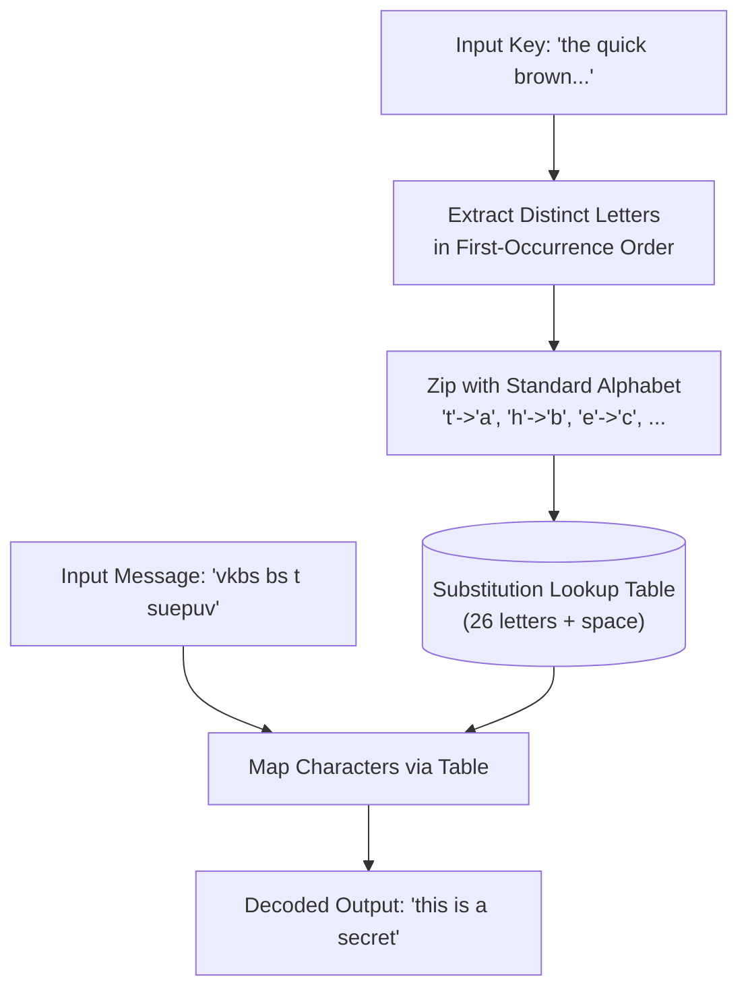

# Guided Example: Decode the Message

## 1. Problem Overview & Representative Instance

We are given two strings, `key` and `message`, representing a cipher key and an encoded text respectively. A substitution cipher table is constructed from `key` according to the following rules:
1. Scan `key` from left to right.
2. The first time an unmapped lowercase English letter appears, map it to the next available letter in the standard alphabet (`'a'`, `'b'`, `'c'`, $\dots$, `'z'`).
3. Subsequent appearances of an already mapped letter are skipped.
4. Spaces `' '` are preserved as spaces and are never assigned an alphabet substitution.

Once all 26 lowercase English letters are mapped, `message` is decoded by replacing each encoded letter with its mapped counterpart while preserving all spaces.

Consider the representative instance:
- `key = "the quick brown fox jumps over the lazy dog"`
- `message = "vkbs bs t suepuv"`

Because `key` contains every letter of the alphabet at least once (a pangram), scanning its distinct characters in order of first appearance defines the complete substitution table. Decoding `"vkbs bs t suepuv"` yields `"this is a secret"`.

## 2. Mathematical & Algorithmic Principles

Let $\Sigma = \{\text{'a'}, \text{'b'}, \dots, \text{'z'}\}$ be the English lowercase alphabet of size $|\Sigma| = 26$.
The input `key` is a sequence of characters $k_0, k_1, \dots, k_{m-1} \in \Sigma \cup \{\text{' '}\}$.

### Formal Extraction of Cipher Permutation
We define the ordered sequence of distinct characters $U = \langle u_0, u_1, \dots, u_{25} \rangle$ where:
- $u_j \in \Sigma$ is the $(j+1)$-th unique letter encountered in `key` from left to right.
- The mapping $f: \Sigma \to \Sigma$ is established as:
  $$f(u_j) = \text{chr}(\text{ord}(\text{'a'}) + j)$$
- For the space delimiter, $f(\text{' '}) = \text{' '}$.

Decoding the message $M = m_0 m_1 \dots m_{\ell-1}$ consists of applying the substitution $f$ pointwise:

$$\operatorname{Decode}(M) = f(m_0) f(m_1) \dots f(m_{\ell-1})$$

| Cipher Step | State Maintained | Action on Encountering Character $c$ |
|---|---|---|
| First occurrence of letter $c$ | Map index $j \in [0, 25]$ | Store $f(c) = \text{chr}(\text{'a'} + j)$, increment $j$ |
| Duplicate occurrence of letter $c$ | None | Ignored, mapping preserved |
| Space character `' '` | Fixed anchor | Statically assigned $f(\text{' '}) = \text{' '}$ |

## 3. Step-by-Step Walkthrough with Intermediate State

We construct the mapping table from `key = "the quick brown fox jumps over the lazy dog"`.

### Phase 1: Constructing the Substitution Mapping
Scanning `key` left to right:
- `'t'`: 1st new letter $\to \text{'a'}$
- `'h'`: 2nd new letter $\to \text{'b'}$
- `'e'`: 3rd new letter $\to \text{'c'}$
- `' '`: Space skipped.
- `'q'`: 4th new letter $\to \text{'d'}$
- `'u'`: 5th new letter $\to \text{'e'}$
- `'i'`: 6th new letter $\to \text{'f'}$
- `'c'`: 7th new letter $\to \text{'g'}$
- `'k'`: 8th new letter $\to \text{'h'}$
- `' '`: Space skipped.
- `'b'`: 9th new letter $\to \text{'i'}$
- `'r'`: 10th new letter $\to \text{'j'}$
- `'o'`: 11th new letter $\to \text{'k'}$
- `'w'`: 12th new letter $\to \text{'l'}$
- `'n'`: 13th new letter $\to \text{'m'}$
- Continuing across the remaining words:
  - `'f'` $\to \text{'n'}$, `'x'` $\to \text{'o'}$
  - `'j'` $\to \text{'p'}$, `'m'` $\to \text{'q'}$, `'p'` $\to \text{'r'}$, `'s'` $\to \text{'s'}$
  - `'v'` $\to \text{'t'}$, `'l'` $\to \text{'u'}$, `'a'` $\to \text{'v'}$, `'z'` $\to \text{'w'}$, `'y'` $\to \text{'x'}$
  - `'d'` $\to \text{'y'}$, `'g'` $\to \text{'z'}$

All 26 letters are registered.

### Phase 2: Decoding the Target Message
Input message: `message = "vkbs bs t suepuv"`

1. Word 1 (`"vkbs"`):
   - `'v'` $\to \text{'t'}$
   - `'k'` $\to \text{'h'}$
   - `'b'` $\to \text{'i'}$
   - `'s'` $\to \text{'s'}$
   - Result: `"this"`
2. Delimiter: `' '` $\to \text{' '}$
3. Word 2 (`"bs"`):
   - `'b'` $\to \text{'i'}$
   - `'s'` $\to \text{'s'}$
   - Result: `"is"`
4. Delimiter: `' '` $\to \text{' '}$
5. Word 3 (`"t"`):
   - `'t'` $\to \text{'a'}$
   - Result: `"a"`
6. Delimiter: `' '` $\to \text{' '}$
7. Word 4 (`"suepuv"`):
   - `'s'` $\to \text{'s'}$
   - `'u'` $\to \text{'e'}$
   - `'e'` $\to \text{'c'}$
   - `'p'` $\to \text{'r'}$
   - `'u'` $\to \text{'e'}$
   - `'v'` $\to \text{'t'}$
   - Result: `"secret"`

Concatenating decoded tokens: `"this is a secret"`.

## 4. Comprehensive State Trace

The table below illustrates the first-appearance ordering and corresponding plaintext assignments.

| First-Appearance Order | Key Character ($c$) | Target Alphabet Substitution ($f(c)$) | Representative Message Occurrence | Decoded Character Output |
|---|---|---|---|---|
| 0 | `'t'` | `'a'` | $message[8]$ (`'t'`) | `'a'` |
| 1 | `'h'` | `'b'` | - | - |
| 2 | `'e'` | `'c'` | $message[12]$ (`'e'`) | `'c'` |
| 3 | `'q'` | `'d'` | - | - |
| 4 | `'u'` | `'e'` | $message[11], [14]$ (`'u'`) | `'e'` |
| 7 | `'k'` | `'h'` | $message[1]$ (`'k'`) | `'h'` |
| 8 | `'b'` | `'i'` | $message[2], [5]$ (`'b'`) | `'i'` |
| 16 | `'p'` | `'r'` | $message[13]$ (`'p'`) | `'r'` |
| 17 | `'s'` | `'s'` | $message[3], [6], [10]$ (`'s'`) | `'s'` |
| 19 | `'v'` | `'t'` | $message[0], [15]$ (`'v'`) | `'t'` |
| Anchor | `' '` | `' '` | $message[4], [7], [9]$ (`' '`) | `' '` |

## 5. Algorithmic Correctness & Soundness

1. **Bijective Invertibility on Letters:**
   Because each newly discovered letter from `key` is paired with an incrementing alphabet pointer without reuse or reassignment, the mapping $f: \Sigma \to \Sigma$ is a true bijection (one-to-one and onto).

2. **Delimiter Separation:**
   Spaces are handled as an invariant fixed point ($f(\text{' '}) = \text{' '}$) and are never added into the alphabet counter progression. Word boundaries and spacing structures are preserved identically.

## 6. Edge Cases & Anti-Patterns

- **Duplicate Letters in Key:**
  - In `"the lazy dog"`, `'t'` and `'e'` reappear. The membership check `c not in table` prevents resetting or advancing the target alphabet pointer.
- **Alphabetical Key (Identity Cipher):**
  - If `key` begins with `"abcdefghijklmnopqrstuvwxyz"`, the mapping is the identity permutation ($f(c) = c$).
- **Rotated or Reverse Alphabet Keys:**
  - Reverse alphabetical keys map `'z'` to `'a'` and `'a'` to `'z'`.
- **Anti-Pattern (Searching Key for Each Message Character):**
  - Finding the first index of each message character inside `key` repeatedly results in $\mathcal{O}(|message| \cdot |key|)$ complexity. Pre-indexing into a direct lookup array achieves $\mathcal{O}(1)$ decode time per character.

## 7. Complexity Analysis

- **Time Complexity:** $\mathcal{O}(|key| + |message|)$. Constructing the hash table requires a single pass over `key` of length at most a few thousand characters. Decoding `message` takes a single pass of length $|message|$. With alphabet size $|\Sigma| = 26$, lookup operations run in $\mathcal{O}(1)$ time.
- **Space Complexity:** $\mathcal{O}(|\Sigma|) = \mathcal{O}(1)$ auxiliary space to store the 26 character translation mappings.
