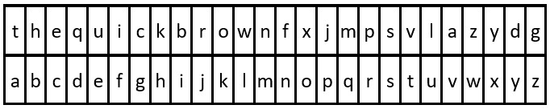
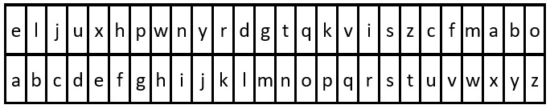

## Description

You are given the strings `key` and `message`, which represent a cipher key and a secret message, respectively. The steps to decode `message` are as follows:

- Use the **first** appearance of all 26 lowercase English letters in `key` as the **order** of the substitution table.

- Align the substitution table with the regular English alphabet.

- Each letter in `message` is then **substituted** using the table.

- Spaces `' '` are transformed to themselves.

- For example, given $key = "<u>**hap**</u>p<u>**y**</u> <u>**bo**</u>y"$ (actual key would have **at least one** instance of each letter in the alphabet), we have the partial substitution table of (`'h' -> 'a'`, `'a' -> 'b'`, `'p' -> 'c'`, `'y' -> 'd'`, `'b' -> 'e'`, `'o' -> 'f'`).

Return *the decoded message*.
### Function Contract

- `n`: Input parameter.
- Returns expected result.

### Examples

#### Example 1

- **Input:** $key = "the quick brown fox jumps over the lazy dog", message = "vkbs bs t suepuv"$
- **Output:** `"this is a secret"`
- **Explanation:** The diagram above shows the substitution table.
It is obtained by taking the first appearance of each letter in "<u>**the**</u> <u>**quick**</u> <u>**brown**</u> <u>**f**</u>o<u>**x**</u> <u>**j**</u>u<u>**mps**</u> o<u>**v**</u>er the <u>**lazy**</u> <u>**d**</u>o<u>**g**</u>".
#### Example 2

- **Input:** $key = "eljuxhpwnyrdgtqkviszcfmabo", message = "zwx hnfx lqantp mnoeius ycgk vcnjrdb"$
- **Output:** `"the five boxing wizards jump quickly"`
- **Explanation:** The diagram above shows the substitution table.
It is obtained by taking the first appearance of each letter in "<u>**eljuxhpwnyrdgtqkviszcfmabo**</u>".
### Constraints

- $26 \le \text{key.length} \le 2000$

- `key` consists of lowercase English letters and `' '`.

- `key` contains every letter in the English alphabet (`'a'` to `'z'`) **at least once**.

- $1 \le \text{message.length} \le 2000$

- `message` consists of lowercase English letters and `' '`.