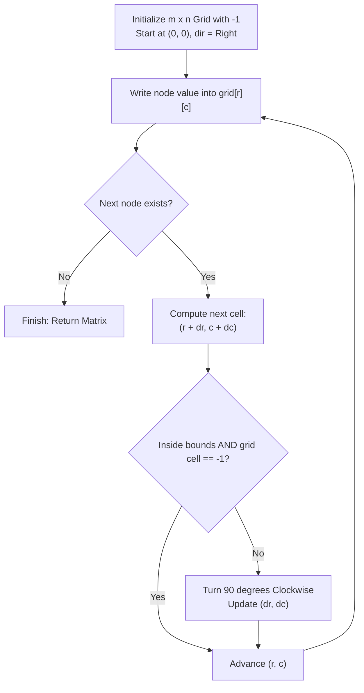

# Guided Example: Spiral Matrix IV

## 1. Problem Overview & Representative Instance

We are given two integers $m$ and $n$, representing the height and width of an $m \times n$ grid, and the head of a singly-linked list of integers.

The objective is to populate the $m \times n$ matrix in a clockwise **spiral order**, starting from the top-left corner $(0, 0)$ and proceeding:
- Right across the top row
- Down the rightmost available column
- Left across the bottom available row
- Up the leftmost available column
- Repeating inward in concentric rectangular layers.

Each visited cell is assigned the value of the current linked list node, after which the list advances to its successor. If the linked list terminates before all $m \times n$ cells are filled, all remaining unvisited cells must be filled with $-1$. The fully populated 2D matrix is returned.

Consider the representative instance:
- Grid dimensions: $m = 3$ (rows), $n = 5$ (columns)
- Linked list: `[3, 0, 2, 6, 8, 1, 7, 9, 4, 2, 5, 5, 0]` (contains 13 values)

Total grid cells: $3 \times 5 = 15$. Because the list has 13 elements, exactly $15 - 13 = 2$ cells will remain unpopulated by nodes and must retain the sentinel value $-1$.

## 2. Mathematical & Algorithmic Principles

Populating a matrix along a discrete spiral curve is governed by a directional vector state machine.

### Direction Vector Cycling
The four cardinal directions cycle clockwise:
1. **Right ($k = 0$):** $(\Delta r, \Delta c) = (0, 1)$
2. **Down ($k = 1$):** $(\Delta r, \Delta c) = (1, 0)$
3. **Left ($k = 2$):** $(\Delta r, \Delta c) = (0, -1)$
4. **Up ($k = 3$):** $(\Delta r, \Delta c) = (-1, 0)$

This can be indexed compactly using the 5-element direction tuple $\mathbf{D} = (0, 1, 0, -1, 0)$, where direction $k \in \{0, 1, 2, 3\}$ has step vector:

$$(\Delta r_k, \Delta c_k) = (\mathbf{D}[k], \mathbf{D}[k+1])$$

### Boundary Invariant & Collision Detection
Pre-initializing every cell of the $m \times n$ matrix with sentinel value $-1$ unifies boundary checking:
- A prospective coordinate $(r', c') = (r + \Delta r_k, c + \Delta c_k)$ is valid if and only if:
  $$0 \le r' < m \quad \land \quad 0 \le c' < n \quad \land \quad grid[r'][c'] = -1$$
- If $(r', c')$ violates any of these three clauses (either running off the grid perimeter or colliding with a cell filled on a previous turn), a $90^\circ$ clockwise turn is executed:
  $$k \leftarrow (k + 1) \bmod 4$$

Because the path forms a self-avoiding spiral in a finite rectangle, a valid open neighbor is guaranteed to exist until all reachable positions are exhausted.

| Direction $k$ | Heading Name | Coordinate Delta $(\Delta r, \Delta c)$ | Turn Trigger Condition |
|---|---|---|---|
| 0 | Right | $(0, +1)$ | $c + 1 \ge n$ or cell already filled |
| 1 | Down | $(+1, 0)$ | $r + 1 \ge m$ or cell already filled |
| 2 | Left | $(0, -1)$ | $c - 1 < 0$ or cell already filled |
| 3 | Up | $(-1, 0)$ | $r - 1 < 0$ or cell already filled |

## 3. Step-by-Step Walkthrough with Intermediate State

We trace the representative instance: $m = 3, n = 5$, list of length 13.
Matrix initially: all 15 cells set to $-1$.
Start at $(r, c) = (0, 0)$, direction $k = 0$ (Right).

### Outer Perimeter Traverse:
- **Heading Right ($k = 0$):**
  - $(0, 0) \leftarrow 3$
  - $(0, 1) \leftarrow 0$
  - $(0, 2) \leftarrow 2$
  - $(0, 3) \leftarrow 6$
  - $(0, 4) \leftarrow 8$
  - Prospective $(0, 5)$ out of bounds $\implies$ Turn to Down ($k = 1$).

- **Heading Down ($k = 1$):**
  - $(1, 4) \leftarrow 1$
  - $(2, 4) \leftarrow 7$
  - Prospective $(3, 4)$ out of bounds $\implies$ Turn to Left ($k = 2$).

- **Heading Left ($k = 2$):**
  - $(2, 3) \leftarrow 9$
  - $(2, 2) \leftarrow 4$
  - $(2, 1) \leftarrow 2$
  - $(2, 0) \leftarrow 5$
  - Prospective $(2, -1)$ out of bounds $\implies$ Turn to Up ($k = 3$).

- **Heading Up ($k = 3$):**
  - $(1, 0) \leftarrow 5$
  - Prospective $(0, 0)$ already filled ($3 \ne -1$) $\implies$ Turn to Right ($k = 0$).

### Inner Layer Traverse:
- **Heading Right ($k = 0$):**
  - $(1, 1) \leftarrow 0$
  - Node 13 placed. The linked list pointer becomes null!
  - Traversal terminates immediately.

### Sentinel Remainder:
Cells $(1, 2)$ and $(1, 3)$ remain unvisited and retain $-1$.

Final populated matrix:
- Row 0: `[3, 0, 2, 6, 8]`
- Row 1: `[5, 0, -1, -1, 1]`
- Row 2: `[5, 2, 4, 9, 7]`

## 4. Comprehensive State Trace

The sequence of written node values and coordinates is summarized in chronological traversal order.

| Step Index | Node Value | Placed Coordinate $(r, c)$ | Direction Before Step | Transition Decision / Boundary Met | Direction After Step |
|---|---|---|---|---|---|
| 1 | 3 | $(0, 0)$ | Right | Cell empty | Right |
| 2 | 0 | $(0, 1)$ | Right | Cell empty | Right |
| 3 | 2 | $(0, 2)$ | Right | Cell empty | Right |
| 4 | 6 | $(0, 3)$ | Right | Cell empty | Right |
| 5 | 8 | $(0, 4)$ | Right | Right edge hit ($c = 4$) | Down |
| 6 | 1 | $(1, 4)$ | Down | Cell empty | Down |
| 7 | 7 | $(2, 4)$ | Down | Bottom edge hit ($r = 2$) | Left |
| 8 | 9 | $(2, 3)$ | Left | Cell empty | Left |
| 9 | 4 | $(2, 2)$ | Left | Cell empty | Left |
| 10 | 2 | $(2, 1)$ | Left | Cell empty | Left |
| 11 | 5 | $(2, 0)$ | Left | Left edge hit ($c = 0$) | Up |
| 12 | 5 | $(1, 0)$ | Up | Hit occupied $(0, 0)$ | Right |
| 13 | 0 | $(1, 1)$ | Right | List exhausted | Terminate |
| - | -1 | $(1, 2)$ | - | Unreached | - |
| - | -1 | $(1, 3)$ | - | Unreached | - |

## 5. Algorithmic Correctness & Soundness

1. **Topological Boundary Guarantee:**
   Because each filled cell is marked by a non-negative value ($\ne -1$), already filled cells act as dynamic internal walls. Together with the outer matrix boundaries, the active path is strictly constrained to a shrinking rectangular corridor, ensuring the path never self-intersects or cycles infinitely.

2. **Early Termination Soundness:**
   Pre-filling the entire matrix with $-1$ decouples the termination condition: when the linked list ends, execution halts without requiring explicit scans to fill the remaining cells with $-1$.

## 6. Edge Cases & Anti-Patterns

- **Single Row ($m = 1, n > 1$):**
  - Traversal moves solely to the right until hitting $n - 1$ or exhausting nodes. No turns down or left are possible.
- **Single Column ($m > 1, n = 1$):**
  - Traversal immediately turns down at $(0, 0)$ and proceeds downwards.
- **Single Cell ($m = 1, n = 1$):**
  - The lone cell $(0, 0)$ receives the head node, terminating instantly.
- **List Longer than Matrix Capacity ($L > m \cdot n$):**
  - Traversal stops when all $m \cdot n$ cells are filled, discarding any excess trailing nodes.
- **Anti-Pattern (Simulating Boundary Layers with Four Explicit Loops):**
  - Writing four nested loops per layer requires fragile index boundary tracking (`top`, `bottom`, `left`, `right`) with special checks for single-row or single-column remainder layers. A unified collision-detection state machine with direction vectors handles all geometries uniformly.

## 7. Complexity Analysis

- **Time Complexity:** $\mathcal{O}(m \cdot n)$. Pre-allocating the $m \times n$ matrix takes $\mathcal{O}(m \cdot n)$ operations. Advancing along the spiral visits at most $\min(L, m \cdot n)$ cells, with $\mathcal{O}(1)$ work per step to test directions and write values.
- **Space Complexity:** $\mathcal{O}(m \cdot n)$ auxiliary space to store the output 2D array.