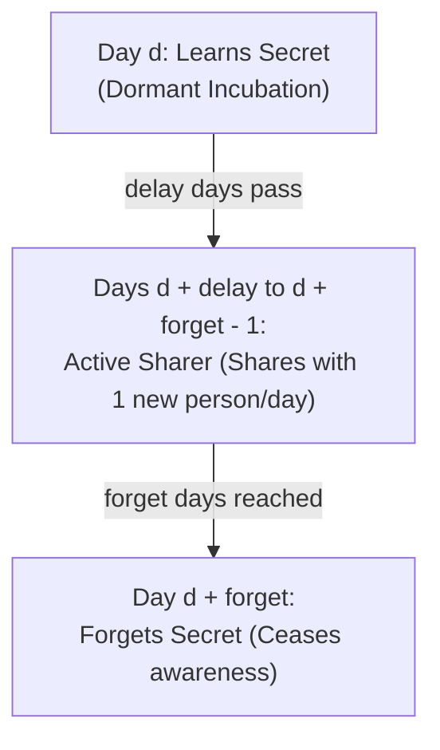

# Guided Example: Number of People Aware of a Secret

## 1. Problem Overview & Representative Instance

On day 1, exactly one person discovers a secret. The spread of the secret is governed by two parameters: `delay` and `forget`:
- A person who learns the secret on day $d$ enters a dormant incubation period of length `delay`.
- Starting on day $d + \text{delay}$ and on every day through day $d + \text{forget} - 1$, they share the secret with exactly $1$ new person each day.
- At the beginning of day $d + \text{forget}$, they forget the secret completely, ceasing both to remember it and to share it.

Given the time horizon $n$, `delay`, and `forget`, the goal is to determine the total number of people who know the secret at the end of day $n$, modulo $10^9 + 7$.

Consider the representative instance:
- Horizon: $n = 6$
- Incubation delay: $delay = 2$
- Forgetting lifetime: $forget = 4$

Timeline for person A who discovered the secret on Day 1:
- Day 1: Knows secret, incubating.
- Day 2: Knows secret, incubating.
- Day 3: Starts sharing ($1 + 2 = 3$). Shares with person B.
- Day 4: Continues sharing ($1 + 3 = 4$). Shares with person C.
- Day 5: Forgets secret ($1 + 4 = 5$).

At the end of day 6, exactly $5$ people know the secret.

## 2. Mathematical & Algorithmic Principles

Let $new[d]$ denote the number of new people who learn the secret on day $d$.
Base condition:
$$new[1] = 1, \quad new[d] = 0 \text{ for } d \le 0$$

### Cohort Sharing Dynamics
A person who learned the secret on day $j$ is actively sharing on day $d$ if and only if day $d$ falls within their active window:

$$j + \text{delay} \le d \le j + \text{forget} - 1 \iff d - \text{forget} + 1 \le j \le d - \text{delay}$$

Since each active sharer introduces exactly one new person on day $d$:

$$new[d] = \sum_{j = d - \text{forget} + 1}^{d - \text{delay}} new[j] \pmod{10^9 + 7}$$

Let $S(d) = \sum_{j = d - \text{forget} + 1}^{d - \text{delay}} new[j]$ be the count of currently active sharers on day $d$.
When transitioning from day $d - 1$ to day $d$, the sharing pool updates via sliding window:

$$S(d) = S(d - 1) + new[d - \text{delay}] - new[d - \text{forget}] \pmod{10^9 + 7}$$

### Final Headcount at Day $n$
At the end of day $n$, a person still remembers the secret if and only if they have not yet forgotten it—that is, their learning day $j$ satisfies $j + \text{forget} > n$:

$$\text{Total Aware} = \sum_{j = \max(1, n - \text{forget} + 1)}^n new[j] \pmod{10^9 + 7}$$

| Lifecycle Phase | Condition on Learning Day $j$ Relative to Current Day $d$ | Status on Day $d$ |
|---|---|---|
| Incubating | $d - \text{delay} < j \le d$ | Knows secret, cannot share |
| Actively Sharing | $d - \text{forget} + 1 \le j \le d - \text{delay}$ | Knows secret, shares with 1 person |
| Forgotten | $j \le d - \text{forget}$ | Completely unaware of secret |

## 3. Step-by-Step Walkthrough with Intermediate State

We trace days $1$ through $6$ with $delay = 2$ and $forget = 4$.
Modulus: $M = 10^9 + 7$.
Array $new$ tracks new recipients by day.

- **Day 1:**
  - Initial discoverer: $new[1] = 1$.
  - Active sharers: $S = 0$.
  - People aware at end of day 1: $\{1\} \implies 1$.

- **Day 2:**
  - $j$ eligible to share must satisfy $j \le 2 - 2 = 0$. None exist.
  - Active sharers: $S = 0$.
  - New recipients: $new[2] = 0$.
  - People aware: $\{1\} \implies 1$.

- **Day 3:**
  - Person from Day 1 reaches $1 + 2 = 3$ and enters the sharing window.
  - Active sharers: $S = S + new[3 - 2] - new[3 - 4] = 0 + 1 - 0 = 1$.
  - New recipients: $new[3] = S = 1$ (Person B).
  - People aware: $\{1, 3\} \implies 2$.

- **Day 4:**
  - Active sharers: $S = S + new[4 - 2] - new[4 - 4] = 1 + 0 - 0 = 1$.
  - New recipients: $new[4] = S = 1$ (Person C).
  - People aware: $\{1, 3, 4\} \implies 3$.

- **Day 5:**
  - Person A (from Day 1) reaches $1 + 4 = 5$ and forgets the secret.
  - Person B (from Day 3) reaches $3 + 2 = 5$ and begins sharing.
  - Active sharers: $S = S + new[5 - 2] - new[5 - 4] = 1 + 1 - 1 = 1$.
  - New recipients: $new[5] = S = 1$ (Person D).
  - People who still remember (cohorts $\ge 5 - 4 + 1 = 2$): $new[2] + new[3] + new[4] + new[5] = 0 + 1 + 1 + 1 = 3$.

- **Day 6:**
  - Person C (from Day 4) reaches $4 + 2 = 6$ and begins sharing.
  - Person B is still sharing.
  - Active sharers: $S = S + new[6 - 2] - new[6 - 4] = 1 + 1 - 0 = 2$.
  - New recipients: $new[6] = S = 2$ (Persons E and F).
  - Cohorts still remembering (cohorts $\ge 6 - 4 + 1 = 3$):
    $$new[3] + new[4] + new[5] + new[6] = 1 + 1 + 1 + 2 = 5$$

Final answer for day 6 is $5$.

## 4. Comprehensive State Trace

The daily cohort additions and sliding active sharer counts are tabulated below.

| Day $d$ | New Sharer Incoming ($new[d - delay]$) | Expired Sharer ($new[d - forget]$) | Active Sharers ($S$) | New Recipient Count ($new[d]$) | Active Remembering Cohorts | Total Aware at End of Day |
|---|---|---|---|---|---|---|
| 1 | 0 | 0 | 0 | 1 (Seed) | $[1]$ | 1 |
| 2 | 0 | 0 | 0 | 0 | $[1]$ | 1 |
| 3 | 1 (Day 1) | 0 | 1 | 1 | $[1, 3]$ | 2 |
| 4 | 0 (Day 2) | 0 | 1 | 1 | $[1, 3, 4]$ | 3 |
| 5 | 1 (Day 3) | 1 (Day 1) | 1 | 1 | $[3, 4, 5]$ | 3 |
| 6 | 1 (Day 4) | 0 (Day 2) | 2 | 2 | $[3, 4, 5, 6]$ | 5 |

## 5. Algorithmic Correctness & Soundness

1. **Exact Cohort Accounting:**
   Every person belongs to a distinct cohort identified by their unique receipt date $j$. Because forgetting occurs strictly at $j + forget$, each cohort's contribution to both sharing and retention is a contiguous interval of days $[j + delay, j + forget - 1]$ for sharing, and $[j, j + forget - 1]$ for awareness.

2. **Sliding Window Invariant:**
   The variable $S$ maintains $\sum_{j = d - forget + 1}^{d - delay} new[j]$ by adding incoming cohorts and subtracting expired cohorts. Because additions and subtractions are preserved modulo $10^9 + 7$, $S$ equals the exact active sharer population at day $d$.

## 6. Edge Cases & Anti-Patterns

- **Minimal Horizon ($n \le delay$):**
  - No person ever reaches the sharing threshold. Only the initial person knows the secret, returning 1.
- **Narrow Active Window ($forget = delay + 1$):**
  - Each cohort shares for exactly one day before forgetting, yielding a constant-rate shift register.
- **No Forgetting Before Horizon ($forget \ge n$):**
  - No subtraction ever occurs. The recurrence simplifies to delayed Fibonacci-type exponential growth.
- **Negative Values in Modular Arithmetic:**
  - Subtracting expired counts can produce negative results if not guarded: $(S - expired + M) \pmod M$ ensures non-negative residues throughout.
- **Anti-Pattern (Simulating Individual Persons):**
  - Simulating individual agents creates an exponential number of objects ($\sim 2^n$). Aggregating people into daily cohort totals reduces the problem to linear scalar arithmetic.

## 7. Complexity Analysis

- **Time Complexity:** $\mathcal{O}(n)$. We iterate from day $1$ to day $n$, performing constant-time additions and sliding window updates per day. The final sum of the last $forget$ days takes at most $\mathcal{O}(forget) = \mathcal{O}(n)$ steps.
- **Space Complexity:** $\mathcal{O}(n)$ auxiliary space to store the daily cohort counts in an array of length $n + 1$.
