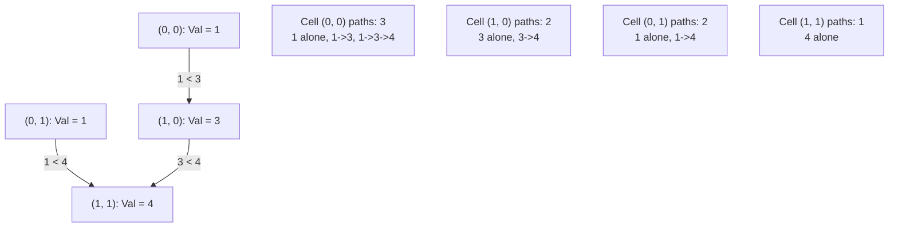

# Guided Example: Number of Increasing Paths in a Grid

## 1. Problem Overview & Representative Instance

We are given an $m \times n$ grid of positive integers. We can start a path at any cell and move to any of its four adjacent neighbors (up, down, left, right) provided that the neighboring cell has a strictly greater value than the current cell.

A valid path consists of a sequence of one or more cells:

$$(r_1, c_1) \to (r_2, c_2) \to \dots \to (r_k, c_k)$$

such that adjacent cells are orthogonally contiguous and strictly increasing: $grid[r_p][c_p] < grid[r_{p+1}][c_{p+1}]$ for all $1 \le p < k$. Single-cell paths ($k = 1$) are valid paths of length 1. The objective is to return the total count of distinct strictly increasing paths in the grid, modulo $10^9 + 7$.

Consider the representative instance:
- `grid = [[1, 1], [3, 4]]` ($m = 2, n = 2$)

Cell layout:
- $(0, 0) = 1$, $(0, 1) = 1$
- $(1, 0) = 3$, $(1, 1) = 4$

Total distinct paths include:
- 4 single-cell paths of length 1: $[(0,0)]$, $[(0,1)]$, $[(1,0)]$, $[(1,1)]$.
- 3 two-cell paths of length 2: $[(0,0) \to (1,0)]$, $[(0,1) \to (1,1)]$, $[(1,0) \to (1,1)]$.
- 1 three-cell path of length 3: $[(0,0) \to (1,0) \to (1,1)]$.
Total count: $4 + 3 + 1 = 8$.

## 2. Mathematical & Algorithmic Principles

Because every step requires a strictly larger value ($grid[x][y] > grid[i][j]$), paths can never form cycles. The grid naturally induces a Directed Acyclic Graph (DAG) $\mathcal{G} = (V, E)$ where:
- $V = \{(i, j) \mid 0 \le i < m, \, 0 \le j < n\}$.
- Directed edges point from strictly smaller cells to strictly larger adjacent cells:
  $$E = \{((i, j), (x, y)) \mid |i - x| + |j - y| = 1 \land grid[i][j] < grid[x][y]\}$$

### Dynamic Programming Recurrence
Let $P(i, j)$ denote the number of strictly increasing paths that **originate** at cell $(i, j)$:
1. The path consisting solely of cell $(i, j)$ contributes $1$.
2. For each outgoing neighbor $(x, y)$ such that $((i, j), (x, y)) \in E$, any valid increasing path originating at $(x, y)$ can be prepended by $(i, j)$, generating $P(x, y)$ additional distinct paths.

Thus, the recurrence relation is:

$$P(i, j) = 1 + \sum_{(x, y) \in \mathcal{N}(i, j) \atop grid[x][y] > grid[i][j]} P(x, y) \pmod{10^9 + 7}$$

### Topological Processing Order
Since $\mathcal{G}$ is a DAG, the recurrence can be solved using either:
- **Memoized Depth-First Search:** Recursively evaluate $P(i, j)$ caching visited states.
- **Topological Sorting by Value:** Sort all cell coordinates in descending order of their numerical values and propagate path sums iteratively.

The global count of all paths is the sum over all starting cells:

$$\text{Total Paths} = \sum_{i=0}^{m-1} \sum_{j=0}^{n-1} P(i, j) \pmod{10^9 + 7}$$

| Component | Mathematical Definition | Role in Formulation |
|---|---|---|
| Single-Cell Base Case | $+1$ term in $P(i, j)$ | Path containing only the starting cell |
| Valid Outgoing Edge | Orthogonal neighbor with $grid[x][y] > grid[i][j]$ | Path extension step |
| Memoized State $P(i, j)$ | Total increasing paths starting at $(i, j)$ | Sub-problem solution |
| Global Sum | $\sum_{i, j} P(i, j) \pmod{10^9 + 7}$ | Total count of all increasing paths |

## 3. Step-by-Step Walkthrough with Intermediate State

We evaluate the cells of `grid = [[1, 1], [3, 4]]` in descending topological order: $4 \to 3 \to 1 \to 1$.

### Step 1: Cell $(1, 1)$ with Value 4
- Neighbors:
  - Up $(0, 1)$ has value $1 \ngtr 4$.
  - Left $(1, 0)$ has value $3 \ngtr 4$.
- Outgoing edges: None.
- Paths starting at $(1, 1)$: $P(1, 1) = 1$ (the single-cell path $[4]$).

### Step 2: Cell $(1, 0)$ with Value 3
- Neighbors:
  - Up $(0, 0)$ has value $1 \ngtr 3$.
  - Right $(1, 1)$ has value $4 > 3$.
- Outgoing edges: To $(1, 1)$.
- Recurrence: $P(1, 0) = 1 + P(1, 1) = 1 + 1 = 2$.
- Paths starting at $(1, 0)$: $[3]$ and $[3 \to 4]$.

### Step 3: Cell $(0, 1)$ with Value 1
- Neighbors:
  - Down $(1, 1)$ has value $4 > 1$.
  - Left $(0, 0)$ has value $1 \ngtr 1$ (equality is not strictly increasing).
- Outgoing edges: To $(1, 1)$.
- Recurrence: $P(0, 1) = 1 + P(1, 1) = 1 + 1 = 2$.
- Paths starting at $(0, 1)$: $[1]$ and $[1 \to 4]$.

### Step 4: Cell $(0, 0)$ with Value 1
- Neighbors:
  - Right $(0, 1)$ has value $1 \ngtr 1$.
  - Down $(1, 0)$ has value $3 > 1$.
- Outgoing edges: To $(1, 0)$.
- Recurrence: $P(0, 0) = 1 + P(1, 0) = 1 + 2 = 3$.
- Paths starting at $(0, 0)$: $[1]$, $[1 \to 3]$, and $[1 \to 3 \to 4]$.

### Global Summation:
$$\text{Total} = P(1, 1) + P(1, 0) + P(0, 1) + P(0, 0) = 1 + 2 + 2 + 3 = 8$$

## 4. Comprehensive State Trace

The table below catalogs the evaluations of each cell in order of computation.

| Evaluation Step | Cell $(i, j)$ | Cell Value | Valid Increasing Neighbors | Neighbor State Contributions | Computed $P(i, j)$ | Distinct Originating Paths |
|---|---|---|---|---|---|---|
| 1 | $(1, 1)$ | 4 | None | None | 1 | $[4]$ |
| 2 | $(1, 0)$ | 3 | $\{(1, 1)\}$ | $P(1, 1) = 1$ | $1 + 1 = 2$ | $[3]$, $[3 \to 4]$ |
| 3 | $(0, 1)$ | 1 | $\{(1, 1)\}$ | $P(1, 1) = 1$ | $1 + 1 = 2$ | $[1_{(0,1)}]$, $[1_{(0,1)} \to 4]$ |
| 4 | $(0, 0)$ | 1 | $\{(1, 0)\}$ | $P(1, 0) = 2$ | $1 + 2 = 3$ | $[1_{(0,0)}]$, $[1_{(0,0)} \to 3]$, $[1_{(0,0)} \to 3 \to 4]$ |

## 5. Algorithmic Correctness & Soundness

1. **Acyclicity Invariant:**
   For any directed edge $((i, j), (x, y))$, $grid[x][y] - grid[i][j] \ge 1$. Along any directed path of length $k$, the cell values form a strictly increasing sequence of integers: $v_1 < v_2 < \dots < v_k$. Because values cannot increase indefinitely within a finite set of integers, the graph has no directed cycles.

2. **Bijection of Path Extensions:**
   Any increasing path of length $\ge 2$ starting at $(i, j)$ consists of $(i, j)$ followed by an increasing path starting at some neighbor $(x, y)$ with $grid[x][y] > grid[i][j]$. Conversely, prepending $(i, j)$ to any path starting at $(x, y)$ creates a unique valid increasing path. Therefore, summing $P(x, y)$ across all strictly increasing neighbors counts all extended paths with no omissions or duplications.

## 6. Edge Cases & Anti-Patterns

- **All Identical Values:**
  - If every cell in `grid` has the same integer value, no step can be strictly increasing. Every cell has $P(i, j) = 1$, and total paths equals $m \times n$.
- **Single Cell ($m = 1, n = 1$):**
  - No neighbors exist. $P(0, 0) = 1$. Total paths is 1.
- **Strict Inequalities Only:**
  - Stepping to an equal neighbor ($grid[x][y] == grid[i][j]$) is forbidden. Guarding transitions with strict inequality `$grid[x][y] > grid[i][j]$` prevents invalid zero-cost steps.
- **Anti-Pattern (DFS without Memoization):**
  - Exploring paths via plain DFS leads to exponential branching ($\sim 4^{m \cdot n}$), which times out on grids with $m, n \le 1000$. Memoizing $P(i, j)$ visits each cell and edge exactly once.

## 7. Complexity Analysis

- **Time Complexity:** $\mathcal{O}(m \cdot n)$. Each of the $m \times n$ cells is memoized once. From each cell, at most 4 orthogonal neighbors are inspected. The total number of state visits and transitions is bounded by $4 m n = \mathcal{O}(m \cdot n)$.
- **Space Complexity:** $\mathcal{O}(m \cdot n)$ auxiliary space to store the memoization table and support the recursion stack depth.
