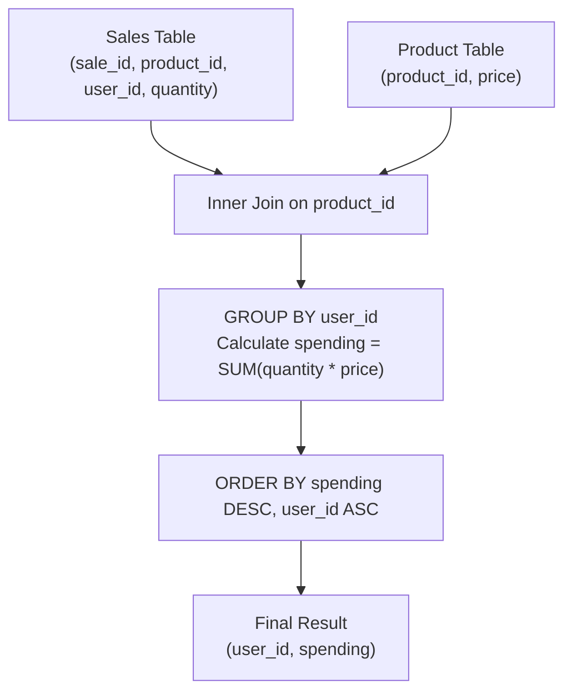

# Guided Example: Product Sales Analysis V

## 1. Problem Overview & Representative Instance

We are given two relational database tables:
1. `Sales`: Contains transaction records with columns `sale_id`, `product_id`, `user_id`, and `quantity`.
2. `Product`: Contains product catalog data with columns `product_id` and unit `price`.

The objective is to compute the total expenditure for each user across all their purchases. Total expenditure is the sum of `quantity * price` across all transactions associated with each `user_id`. The final output must report `user_id` and their total `spending`, ordered by:
1. `spending` in descending order.
2. If spending values tie, by `user_id` in ascending order.

Consider the representative instance:

Representative input data:
- Catalog Prices (`Product`):
  - Product 1: price $= 10$
  - Product 2: price $= 25$
  - Product 3: price $= 15$
- Transactions (`Sales`):
  - User 101:
    - Sale 1: Product 1, quantity 10
    - Sale 2: Product 2, quantity 1
  - User 102:
    - Sale 3: Product 3, quantity 3
    - Sale 4: Product 3, quantity 2
  - User 103:
    - Sale 5: Product 2, quantity 3

## 2. Mathematical & Algorithmic Principles

For each user $u \in \text{Users}$, total expenditure is defined as the linear sum:

$$\operatorname{Spending}(u) = \sum_{s \in \text{Sales} \atop s.\text{user\_id} = u} s.\text{quantity} \times \operatorname{Price}(s.\text{product\_id})$$

The relational plan implements this via:
1. **Natural Equi-Join:** Matching each transaction in `Sales` with its catalog price in `Product` via `product_id`.
2. **Partitioned Aggregation:** Grouping records strictly by `user_id` (`GROUP BY user_id`) and summing the computed line item costs `quantity * price`.
3. **Deterministic Dual-Key Sort:** Ordering the aggregated rows by the primary key `spending DESC` and the deterministic secondary tie-breaker `user_id ASC`.

| Pipeline Stage | SQL Construct | Purpose in Query Execution |
|---|---|---|
| Join | `Sales JOIN Product USING (product_id)` | Associates unit price with each sold quantity |
| Aggregation | `SUM(quantity * price)` | Computes total dollar amount spent per user |
| Grouping | `GROUP BY user_id` | Aggregates all purchases made by the same user |
| Sorting | `ORDER BY spending DESC, user_id ASC` | Orders highest spenders first with deterministic user tie-break |

## 3. Step-by-Step Walkthrough with Intermediate State

We compute the line-item costs for all sales and aggregate spending by user.

### Step 1: Line Item Calculations
- Sale 1: User 101, Product 1 (qty 10, price 10) $\implies 10 \times 10 = 100$.
- Sale 2: User 101, Product 2 (qty 1, price 25) $\implies 1 \times 25 = 25$.
- Sale 3: User 102, Product 3 (qty 3, price 15) $\implies 3 \times 15 = 45$.
- Sale 4: User 102, Product 3 (qty 2, price 15) $\implies 2 \times 15 = 30$.
- Sale 5: User 103, Product 2 (qty 3, price 25) $\implies 3 \times 25 = 75$.

### Step 2: Group Aggregation by User
- **User 101:**
  - Sales: Sale 1 ($100$) + Sale 2 ($25$).
  - Total Spending: $100 + 25 = 125$.
- **User 102:**
  - Sales: Sale 3 ($45$) + Sale 4 ($30$).
  - Total Spending: $45 + 30 = 75$.
- **User 103:**
  - Sales: Sale 5 ($75$).
  - Total Spending: $75$.

### Step 3: Multi-Key Sorting
Comparing aggregated totals:
1. User 101: Spending $= 125$. Highest total, sorts first.
2. User 102 and User 103: Both have spending $= 75$ (tie).
   - Tie-breaker applied: Ascending `user_id`.
   - $102 < 103$, so User 102 precedes User 103.

Final sorted result table:
1. `(101, 125)`
2. `(102, 75)`
3. `(103, 75)`

## 4. Comprehensive State Trace

The full state of joined records and aggregated group totals is recorded below.

| Transaction ID (`sale_id`) | User ID (`user_id`) | Product ID | Quantity | Unit Price | Line Item Cost | Group Cumulative Spending |
|---|---|---|---|---|---|---|
| 1 | 101 | 1 | 10 | 10 | 100 | 100 |
| 2 | 101 | 2 | 1 | 25 | 25 | $100 + 25 = 125$ |
| 3 | 102 | 3 | 3 | 15 | 45 | 45 |
| 4 | 102 | 3 | 2 | 15 | 30 | $45 + 30 = 75$ |
| 5 | 103 | 2 | 3 | 25 | 75 | 75 |

Final Output Rows:

| Output Position | `user_id` | Total `spending` | Sorting Rule Applied |
|---|---|---|---|
| 1 | 101 | 125 | Highest spending |
| 2 | 102 | 75 | Tied spending, smaller `user_id` ($102 < 103$) |
| 3 | 103 | 75 | Tied spending, larger `user_id` |

## 5. Algorithmic Correctness & Soundness

1. **Equi-Join Linearity:**
   Because `Product` contains unique product entries on its primary key `product_id`, each row in `Sales` joins with exactly one row in `Product`. No sales transactions are duplicated or omitted.

2. **Total Order of Output:**
   Sorting by `spending DESC` orders users by total expenditure. Because `user_id` is unique across users, appending `user_id ASC` as the secondary sort key forms a strict total order over all returned rows, eliminating nondeterminism in query output.

## 6. Edge Cases & Anti-Patterns

- **Multiple Purchases of Same Product by Single User:**
  - User 102 purchased Product 3 in two separate sales (Sale 3 and Sale 4). Grouping by `user_id` alone sums all line items correctly.
- **Tied Spending Across Users:**
  - When distinct users spend identical amounts (Users 102 and 103), the secondary sort key `user_id ASC` ensures deterministic ordering.
- **Anti-Pattern (Grouping by Product ID as well):**
  - Including `product_id` in the `GROUP BY` clause would report spending per user-product combination rather than the overall user total. Grouping must be strictly by `user_id`.

## 7. Complexity Analysis

- **Time Complexity:** $\mathcal{O}(S + P + U \log U)$ where $S$ is the number of rows in `Sales`, $P$ is the number of rows in `Product`, and $U$ is the number of distinct users. The hash join takes $\mathcal{O}(S + P)$. Hash aggregation by `user_id` takes $\mathcal{O}(S)$. Sorting the resulting $U$ user records takes $\mathcal{O}(U \log U)$ time.
- **Space Complexity:** $\mathcal{O}(P + U)$ memory for hash tables storing the product price catalog and intermediate user aggregations.
