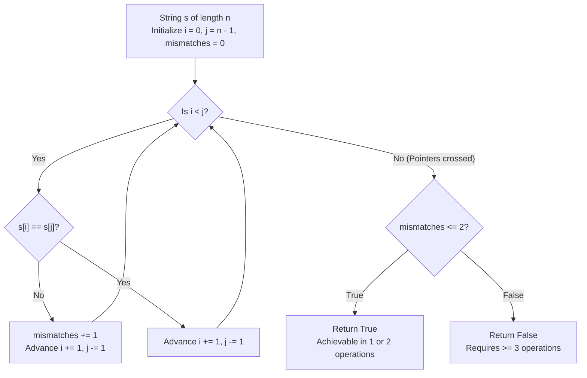

# Guided Example: Valid Palindrome IV

## 1. Problem Overview & Representative Instance

We are given a 0-indexed string $s$ consisting of lowercase English letters. In a single operation, we can change any character of $s$ to any other lowercase English letter.

The objective is to determine whether it is possible to make $s$ a palindrome by performing **either 1 or 2 operations**. If $s$ can be transformed into a palindrome in exactly 1 or exactly 2 operations, return `true`; otherwise, return `false`.

Consider the representative instance:
- String: $s = \text{"abcdba"}$
- String length: $n = 6$

Symmetric pairs $(s[i], s[n - 1 - i])$:
- Index pair $(0, 5)$: $s[0] = \text{'a'}, s[5] = \text{'a'}$ (Equal)
- Index pair $(1, 4)$: $s[1] = \text{'b'}, s[4] = \text{'b'}$ (Equal)
- Index pair $(2, 3)$: $s[2] = \text{'c'}, s[3] = \text{'d'}$ (Mismatched)

There is exactly 1 mismatched symmetric pair. Changing character $s[3]$ from `'d'` to `'c'` produces $\text{"abccba"}$, which is a valid palindrome achieved in exactly 1 operation. The function returns `true`.

## 2. Mathematical & Algorithmic Principles

A string $s$ of length $n$ is a palindrome if and only if:

$$s[i] = s[n - 1 - i] \quad \text{for all } 0 \le i < \left\lfloor \frac{n}{2} \right\rfloor$$

Let the mismatch set $\mathcal{M}$ be the collection of symmetric index pairs whose characters currently differ:

$$\mathcal{M} = \left\{ i \;\middle|\; 0 \le i < \left\lfloor \frac{n}{2} \right\rfloor \land s[i] \ne s[n - 1 - i] \right\}$$

Let $k = |\mathcal{M}|$ be the total count of mismatched pairs.

### Mismatch Budget Analysis:
1. **Case $k = 2$:**
   There are two mismatched pairs $\{i_1, i_2\}$. In operation 1, set $s[i_1] \leftarrow s[n - 1 - i_1]$. In operation 2, set $s[i_2] \leftarrow s[n - 1 - i_2]$. Both pairs are reconciled in exactly 2 operations, yielding a palindrome.
2. **Case $k = 1$:**
   There is one mismatched pair $i_1$. Changing $s[i_1] \leftarrow s[n - 1 - i_1]$ reconciles it in exactly 1 operation.
3. **Case $k = 0$ (Already a Palindrome):**
   - If $n$ is odd, changing the unique center character $s[\lfloor n/2 \rfloor]$ to any other letter takes 1 operation and preserves palindromic symmetry.
   - For any length $n \ge 2$, changing both characters of any symmetric pair $(s[i], s[n - 1 - i])$ to a common new character takes exactly 2 operations and preserves palindromic symmetry.
   - For $n = 1$, changing the lone character takes 1 operation and remains a 1-character palindrome.
   Thus, $k = 0$ is always achievable in 1 or 2 operations.
4. **Case $k \ge 3$:**
   A single character change can affect at most one symmetric pair $(i, n - 1 - i)$. Therefore, 2 operations can repair at most 2 mismatched pairs. If $k \ge 3$, at least $k - 2 \ge 1$ mismatched pair will remain unresolved, making it impossible to produce a palindrome.

Consequently, the necessary and sufficient condition is:

$$k \le 2$$

| Mismatch Count $k$ | Feasible Transformation | Operations Needed | Result |
|---|---|---|---|
| $k = 0$ | Change center character (odd $n$) or change a mirrored pair | 1 or 2 | `true` |
| $k = 1$ | Fix the lone mismatched pair | 1 | `true` |
| $k = 2$ | Fix both mismatched pairs independently | 2 | `true` |
| $k \ge 3$ | Two operations can resolve at most 2 pairs | At least 3 | `false` |

## 3. Step-by-Step Walkthrough with Intermediate State

We evaluate $s = \text{"abcdba"}$ with $n = 6$.
Indices range from $0$ to $5$. Pointers: $i = 0$ (left), $j = 5$ (right).
Accumulator: $\text{mismatch\_count} = 0$.

- **Iteration 1 ($i = 0, j = 5$):**
  - Characters: $s[0] = \text{'a'}$, $s[5] = \text{'a'}$.
  - Equal $\implies$ no mismatch.
  - Advance: $i = 1, j = 4$.

- **Iteration 2 ($i = 1, j = 4$):**
  - Characters: $s[1] = \text{'b'}$, $s[4] = \text{'b'}$.
  - Equal $\implies$ no mismatch.
  - Advance: $i = 2, j = 3$.

- **Iteration 3 ($i = 2, j = 3$):**
  - Characters: $s[2] = \text{'c'}$, $s[3] = \text{'d'}$.
  - Mismatch detected ($s[2] \ne s[3]$).
  - Increment: $\text{mismatch\_count} = 0 + 1 = 1$.
  - Advance: $i = 3, j = 2$.

- **Termination:**
  - $i \ge j$ ($3 \ge 2$), loop terminates.
  - Test condition: $\text{mismatch\_count} \le 2 \implies 1 \le 2$ (Holds).
  - Output: `true`.

## 4. Comprehensive State Trace

The evaluation of symmetric pairs across the string is summarized below.

| Step Index | Left Pointer $i$ | Right Pointer $j$ | Left Character $s[i]$ | Right Character $s[j]$ | Comparison Result | Cumulative Mismatches |
|---|---|---|---|---|---|---|
| 1 | 0 | 5 | `'a'` | `'a'` | Match | 0 |
| 2 | 1 | 4 | `'b'` | `'b'` | Match | 0 |
| 3 | 2 | 3 | `'c'` | `'d'` | Mismatch | 1 |
| Loop End | 3 | 2 | - | - | Crossed ($i \ge j$) | 1 ($\le 2 \implies$ `true`) |

Verification on counter-example $s = \text{"abcdef"}$ ($n = 6$):

| Pair Index | Left $s[i]$ | Right $s[5-i]$ | Match Status | Cumulative Mismatches | Feasibility Check |
|---|---|---|---|---|---|
| 0 | `'a'` | `'f'` | Mismatch | 1 | Feasible so far |
| 1 | `'b'` | `'e'` | Mismatch | 2 | Feasible so far |
| 2 | `'c'` | `'d'` | Mismatch | 3 | Exceeds budget ($3 > 2 \implies$ `false`) |

## 5. Algorithmic Correctness & Soundness

1. **Independent Sub-problem Disjointness:**
   Each symmetric pair $(i, n - 1 - i)$ occupies disjoint character indices. Changing a character at index $i$ impacts only the symmetry of pair $i$, having zero effect on any other pair $j \ne i$. Therefore, repairing $k$ mismatched pairs requires exactly $k$ independent modifications.

2. **Sufficiency of the Inward Two-Pointer Scan:**
   Because the pairs partition the characters of the string completely (with at most one unconstrained center character for odd lengths), counting mismatched pairs by moving two pointers symmetrically inward from both ends inspects every constraint exactly once.

## 6. Edge Cases & Anti-Patterns

- **Already Palindromic ($k = 0$):**
  - Even though $0$ changes are needed to be a palindrome, the problem allows 1 or 2 operations. Modifying the center element or a symmetric pair preserves palindromicity, so $k = 0$ returns `true`.
- **Single Character String ($n = 1$):**
  - Pointers satisfy $i = 0, j = 0 \implies i \not< j$. Loop does not execute, mismatch count is $0 \le 2$, returning `true`.
- **Early Exit Optimization:**
  - If the mismatch count reaches 3 at any point during the scan, the algorithm can terminate immediately and return `false`.
- **Anti-Pattern (Generating Combinatorial Edits):**
  - Testing all pairs of possible character substitutions generates $\mathcal{O}(26^2 \cdot n^2)$ combinations. Inspecting symmetric pairs directly solves the problem in $\mathcal{O}(n)$ time.

## 7. Complexity Analysis

- **Time Complexity:** $\mathcal{O}(n)$, where $n$ is the length of string $s$. The two pointers meet at the center after $\lfloor n / 2 \rfloor$ comparisons. Each comparison takes $\mathcal{O}(1)$ time.
- **Space Complexity:** $\mathcal{O}(1)$ auxiliary space. Only two pointer indices and a scalar mismatch counter are stored.
