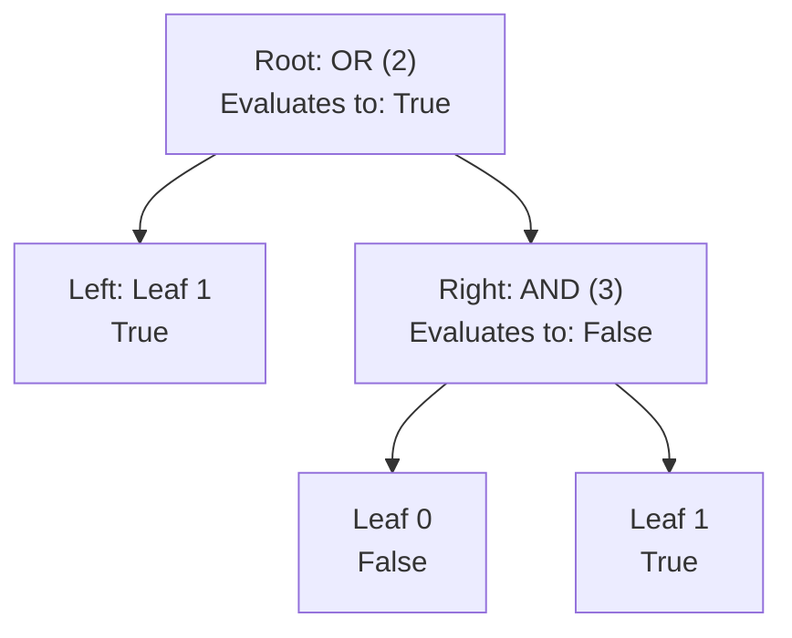

# Guided Example: Evaluate Boolean Binary Tree

## 1. Problem Overview & Representative Instance

We are given the root of a full binary tree where every node has either 0 children (a leaf) or 2 children (an internal node). The node values are defined as follows:
- **Leaf Nodes:**
  - $0$: Represents boolean `false`
  - $1$: Represents boolean `true`
- **Internal Nodes:**
  - $2$: Represents boolean OR ($\lor$)
  - $3$: Represents boolean AND ($\land$)

The evaluation of a node proceeds recursively:
- A leaf evaluates to its intrinsic boolean value.
- An internal node evaluates by recursively evaluating its left and right subtrees and applying its boolean operator to the two child results.

The task is to return the boolean evaluation of the entire tree rooted at `root`.

Consider the representative instance:
- `root = [2, 1, 3, null, null, 0, 1]`

Tree structure:
- Root (Node 0): Operator $2$ ($\text{OR}$)
- Left child (Node 1): Leaf $1$ ($\text{true}$)
- Right child (Node 2): Operator $3$ ($\text{AND}$)
  - Left child of Node 2 (Node 3): Leaf $0$ ($\text{false}$)
  - Right child of Node 2 (Node 4): Leaf $1$ ($\text{true}$)

## 2. Mathematical & Algorithmic Principles

Let $T$ denote a node in the expression tree. The evaluation function $\mathcal{E}(T)$ maps each node to a boolean value in $\{\text{false}, \text{true}\}$ via structural induction:

$$\mathcal{E}(T) = \begin{cases} \text{false} & \text{if } T \text{ is a leaf and } T.\text{val} = 0 \\ \text{true} & \text{if } T \text{ is a leaf and } T.\text{val} = 1 \\ \mathcal{E}(T.\text{left}) \lor \mathcal{E}(T.\text{right}) & \text{if } T.\text{val} = 2 \\ \mathcal{E}(T.\text{left}) \land \mathcal{E}(T.\text{right}) & \text{if } T.\text{val} = 3 \end{cases}$$

### Post-Order Dependency Graph
Because the value of an internal node strictly depends on the evaluations of its descendants, computation requires a bottom-up post-order traversal:
1. Base cases (leaves) are evaluated first.
2. Operator nodes combine child evaluations according to standard propositional logic truth tables.
3. The root produces the final proposition truth value.

| Node Type | Node Value | Operation / Semantic Meaning | Truth Table Output |
|---|---|---|---|
| Leaf | 0 | Literal False | $\text{false}$ |
| Leaf | 1 | Literal True | $\text{true}$ |
| Internal | 2 | Disjunction ($\lor$) | $\text{true}$ if either child is $\text{true}$; else $\text{false}$ |
| Internal | 3 | Conjunction ($\land$) | $\text{true}$ if both children are $\text{true}$; else $\text{false}$ |

## 3. Step-by-Step Walkthrough with Intermediate State

We evaluate the representative tree using post-order depth-first traversal.

### Step 1: Evaluate Left Subtree of Root
- The left child of the root is Node 1.
- Node 1 has no children (leaf).
- Value is $1 \implies \mathcal{E}(\text{Node 1}) = \text{true}$.

### Step 2: Evaluate Right Subtree of Root (Subtree at Node 2)
Node 2 holds operator $3$ ($\text{AND}$). It requires evaluating both of its children:
- **Evaluate Node 3 (left child of Node 2):**
  - Node 3 is a leaf with value $0 \implies \mathcal{E}(\text{Node 3}) = \text{false}$.
- **Evaluate Node 4 (right child of Node 2):**
  - Node 4 is a leaf with value $1 \implies \mathcal{E}(\text{Node 4}) = \text{true}$.
- **Apply AND Operator at Node 2:**
  $$\mathcal{E}(\text{Node 2}) = \mathcal{E}(\text{Node 3}) \land \mathcal{E}(\text{Node 4}) = \text{false} \land \text{true} = \text{false}$$

### Step 3: Evaluate Root (Node 0)
- The root holds operator $2$ ($\text{OR}$).
- Left child evaluated to: $\text{true}$.
- Right child evaluated to: $\text{false}$.
- **Apply OR Operator at Root:**
  $$\mathcal{E}(\text{Node 0}) = \text{true} \lor \text{false} = \text{true}$$

The final evaluation of the entire tree is `true`.

## 4. Comprehensive State Trace

The execution sequence and resolved boolean values are summarized in post-order order below.

| Traversal Order | Node ID | Node Value | Node Classification | Subtree Operand Left | Subtree Operand Right | Resolved Truth Value |
|---|---|---|---|---|---|---|
| 1 | Node 1 | 1 | Leaf | - | - | `true` |
| 2 | Node 3 | 0 | Leaf | - | - | `false` |
| 3 | Node 4 | 1 | Leaf | - | - | `true` |
| 4 | Node 2 | 3 | Operator ($\land$) | `false` | `true` | `false` |
| 5 | Node 0 | 2 | Operator ($\lor$) | `true` | `false` | `true` |

## 5. Algorithmic Correctness & Soundness

1. **Structural Induction on Finite Trees:**
   Every leaf has depth bounded by the finite height of the tree. The base cases for literals $0$ and $1$ are exact. Since every internal node connects two smaller disjoint subtrees, the induction step mirrors the definition of boolean logic operations, guaranteeing global soundness.

2. **Full Binary Tree Regularity:**
   The problem guarantees that every node has either 0 or 2 children. This ensures that unary dangling branches never occur, so binary operators ($\lor, \land$) always receive two well-defined operands.

## 6. Edge Cases & Anti-Patterns

- **Single Leaf Root (`root = [0]` or `[1]`):**
  - The root has no children and immediately returns `false` or `true`.
- **Short-Circuit Evaluation:**
  - In an OR node, if the left subtree evaluates to `true`, the right subtree can optionally be skipped. In an AND node, if the left subtree evaluates to `false`, the right subtree can be skipped.
- **Anti-Pattern (Level-Order Breadth-First Evaluation):**
  - Evaluating nodes top-down via BFS without resolving child values first requires building expression strings or post-order dependency graphs. Standard recursive post-order DFS directly matches the natural evaluation grammar.

## 7. Complexity Analysis

- **Time Complexity:** $\mathcal{O}(N)$, where $N$ is the number of nodes in the binary tree. Every node is visited exactly once in the recursive traversal, performing $\mathcal{O}(1)$ boolean operations per node.
- **Space Complexity:** $\mathcal{O}(H)$, where $H$ is the height of the binary tree, corresponding to the recursion call stack depth. In the worst case of an unbalanced tree, $H \le N$; for a balanced tree, $H = \mathcal{O}(\log N)$.
