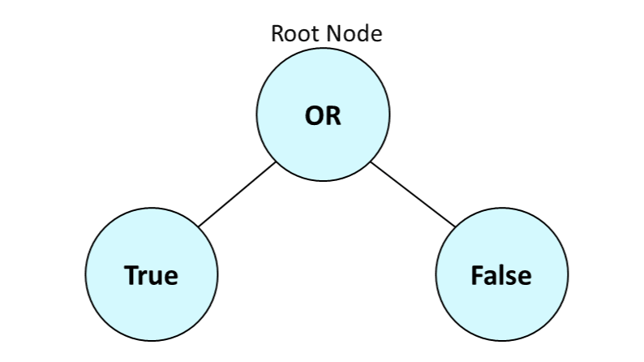
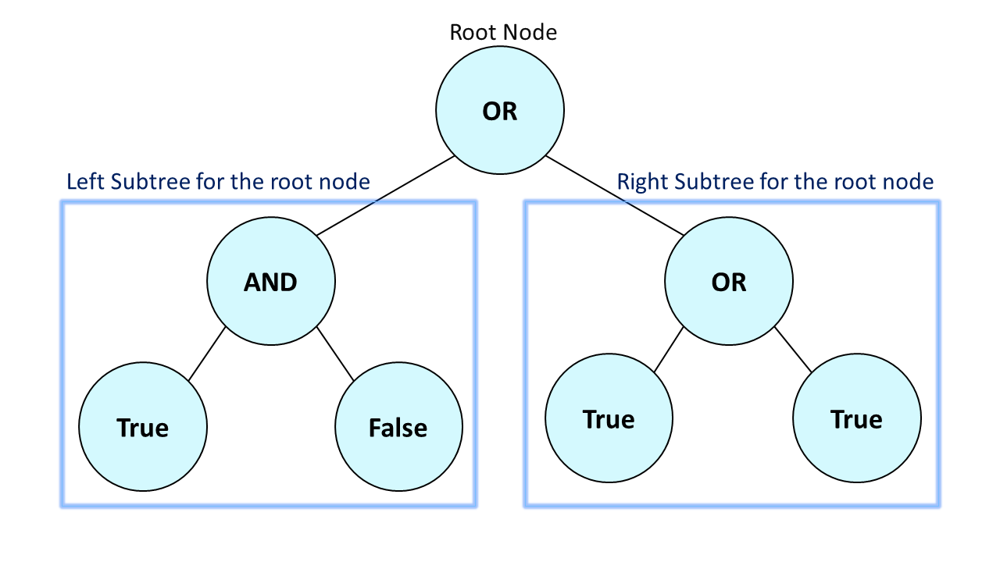

[TOC]

## Solution

---

### Overview

We are given a full binary tree where the leaf nodes store boolean values (`True` or `False`), and non-leaf nodes store boolean operations (**AND** or **OR**). Our task is to return the evaluation result of the root node.

The evaluation result of any leaf node is given by its stored boolean value, while for a non-leaf node, the evaluation result is determined by applying the boolean operation stored in the node to the evaluations of its children.

**Key Observations:**
1. The given tree is a full binary tree. This implies that there will be no nodes in the tree with exactly one child node.
2. Leaf nodes have either the value `0` or `1`, where `0` represents `False` and `1` represents `True`. Non-leaf nodes have either the value `2` or `3`, where `2` represents the boolean **OR** and `3` represents the boolean **AND**.

> **Note:**
> * The Boolean **OR** returns `True` if at least one of the conditions is `True`. For example, `True OR False` evaluates to `True`. The Boolean **AND** returns `True` only if both conditions are `True`. For example, `True AND False` evaluates to `False`.
> * A leaf node is a node that has zero children.

---

### Approach 1: Recursion (Depth First Search)

#### Intuition

Let's assume that we want to evaluate the tree shown below:



In the tree depicted above, the root node has exactly two leaf child nodes. The tree can be evaluated as `True OR False`, resulting in `True`. However, there may be cases where the root node has non-leaf children. For example:



Let's assume that `evaluateTree(Node)` denotes the boolean result after evaluating a subtree rooted at any node of the tree, given by `Node`. For the tree given above, it can be observed that `evaluateTree(root)` is determined by performing the stored boolean operation in the root on `evaluateTree(left child of root)` and `evaluateTree(right child of root)`.

We need to evaluate the children of the root node in order to calculate the evaluation of the root node. Therefore, the most intuitive way to solve this problem is through recursion.

Let's adapt our recursive solution based on these insights:

* The base case occurs when we have reached a leaf node while traversing the tree. In this case, we will return the boolean value of the leaf node.

* Calculate the evaluation for the left child and the right child of the current node recursively. The evaluation for the current node is given by performing the stored operation on the results of the left and right child.

* Return the boolean evaluation for the current node. This evaluation might be useful for calculating the evaluation of the parents or ancestors of the current node.

#### Algorithm

1. If the root node is a leaf node (left and right children are `null`), return the boolean value of the root node.
2. Initialize `evaluateLeftSubtree` with `evaluateTree(left child of root)` and `evaluateRightSubtree` with `evaluateTree(right child of root)`.
3. There are two cases possible for non-leaf roots:
  * if the value of the root node is `2`, return the boolean **OR** of `evaluateLeftSubtree` and `evaluateRightSubtree`.
  * if the value of the root node is `3`, return the boolean **AND** of `evaluateLeftSubtree` and `evaluateRightSubtree`.

!?!../Documents/2331/slideshow1.json:960,540!?!

#### Implementation

```python
class Solution:
    def evaluateTree(self, root: Optional[TreeNode]) -> bool:
        if not root.left and not root.right:
            # Handles the case for leaf nodes.
            return root.val != 0

        # Store the evaluations for the left subtree and right subtree.
        evaluate_left_subtree = self.evaluateTree(root.left)
        evaluate_right_subtree = self.evaluateTree(root.right)
        if root.val == 2:
            evaluate_root = evaluate_left_subtree or evaluate_right_subtree
        else:
            evaluate_root = evaluate_left_subtree and evaluate_right_subtree

        return evaluate_root
```

#### Complexity Analysis

Let $n$ be the number of nodes in the tree.

- Time complexity: $O(n)$

  We make a recursive call on every node of the tree exactly once. Since we visit each node of the tree exactly once, the time complexity can be stated as $O(n)$.

- Space complexity: $O(n)$

  The space complexity of the algorithm is primarily determined by two factors: the auxiliary space used and the recursion stack space. The auxiliary space is $O(1)$ because we have created two boolean variables.

  Additionally, the recursion stack space can grow up to $O(n)$ in the worst case, constrained by the length of the path traversed up to a particular node, as each recursive call may add a node to the stack.

  Therefore, the overall space complexity is the sum of these two components, resulting in $O(1) + O(n)$, which simplifies to $O(n)$.

---

### Approach 2: Iterative approach (Depth First Search)

#### Intuition

The evaluation of the root node is given by the sum of the evaluation of the subtrees rooted at the left child and right child of the root node. Therefore, if we want to calculate the evaluation of the root, we must know the evaluation of the subtrees rooted at the left child and right child of the root.

While solving iteratively, we need to choose a data structure that can mimic the evaluation process of depth-first search in the previous case. Therefore, we can use a stack data structure to perform a traversal on the tree iteratively.

> A stack is a data structure that follows the Last-In, First-Out (LIFO) principle, allowing elements to be inserted and removed from only one end, typically referred to as the "top" of the stack.

Analogous to the recursive approach discussed above, where the function `evaluateTree(Node)` calculates the evaluation for a subtree rooted at `Node`, we define that if the element at the top of the stack in the current iteration is `Node`, we will calculate its evaluation in this iteration.

The stack contains the root node of the tree in the first iteration. If the root is a leaf node (in the case where the tree has a single node) or both the left and right children of the root node are leaf nodes, the root node can be evaluated directly.

In other cases, we cannot evaluate the root node directly. Therefore, we must calculate the evaluated values of the right and left children, which will be used to determine the evaluation of the root node. Consequently, we will push the left child and right child of the current node onto the stack without popping the root node from the stack. Since the stack follows the Last In, First Out (LIFO) principle, we will calculate the evaluations of the left child and right child of the root node before reaching the root node again.

In this approach, we need to store the evaluations of the left child and right child of `Node`, where `Node` is the root of the subtree we evaluate. One option is to store the evaluations in the data of the node itself. We were storing the boolean operations for non-leaf nodes in the data. Therefore, once the node is evaluated, we don't need the boolean operation stored in it. However, it is not considered good practice to mutate the given input.

Using a hashmap is another method to store the evaluations of the nodes. A hashmap provides constant lookup and insertion time for the nodes. After evaluating a node, we can store its evaluated value in a hashmap, which can be used to evaluate other elements of the stack.

In cases where the current node is a leaf node or both children of the current node have already been evaluated, we can pop the top element of the stack and add the evaluated value to the hashmap with the current node as the key. However, in cases where the children have not been evaluated, we will push both children of the current node onto the stack.

#### Algorithm

1. Initialize a stack `st` with the `root` node. Also, create a hashmap `evaluated` with `node` data type for the key and `boolean` for values.
2. Iterate until `st` is empty:
- Initialise the top element of the `st` with `topNode`.
- If the `topNode` is a leaf node:
- Pop the top element of `st` and add the value of the node to `evaluated` with the node as the key.
- If both the children of `topNode` are present in the hashmap `evaluated`:
- If the value of `topNode` is 2:
- Store the evaluation of `topNode` as `boolean OR` of the evaluations of the children of `topNode` in `evaluated`.
- If the value of `topNode` is 3:
- Store the evaluation of `topNode` as `boolean AND` of the evaluations of the children of `topNode` in `evaluated`.
- Pop the top element of `st`.
- If any of the children of `topNode` are not present in `evaluated`:
- Push the left and right child of `topNode` in `st`.
4. Return the evaluated boolean value of `root` stored in `evaluated`.

!?!../Documents/2331/slideshow2.json:960,540!?!

#### Implementation

```python
class Solution:
    def evaluateTree(self, root: Optional[TreeNode]) -> bool:
        stack = [root]
        evaluated = {}

        while stack:
            top_node = stack[-1]

            # If the node is a leaf node, store its value in the evaluated dictionary
            # and continue
            if not top_node.left and not top_node.right:
                stack.pop()
                evaluated[top_node] = top_node.val == 1
                continue

            # If both the children have already been evaluated, use their
            # values to evaluate the current node.
            if top_node.left in evaluated and top_node.right in evaluated:
                stack.pop()
                if top_node.val == 2:
                    evaluated[top_node] = evaluated[top_node.left] or evaluated[top_node.right]
                else:
                    evaluated[top_node] = evaluated[top_node.left] and evaluated[top_node.right]
            else:
                # If both the children are not leaf nodes, push the current
                # node along with its left and right child back into the stack.
                if top_node.left:
                    stack.append(top_node.left)
                if top_node.right:
                    stack.append(top_node.right)

        return evaluated[root]
```

#### Complexity Analysis

Let $n$ be the number of nodes in the tree.

* Time complexity: $O(n)$

  We iterate through the tree using a stack with constant insertion and deletion time. Additionally, we iterate through every node at most two times. Therefore, the time complexity is $O(n)$.

* Space complexity: $O(n)$

  Since every node can be inserted into the stack at most once, the stack can contain at most $n$ nodes. The hashmap stores the value of every node as a key exactly once. Therefore, the overall space complexity is $O(n)$.

---