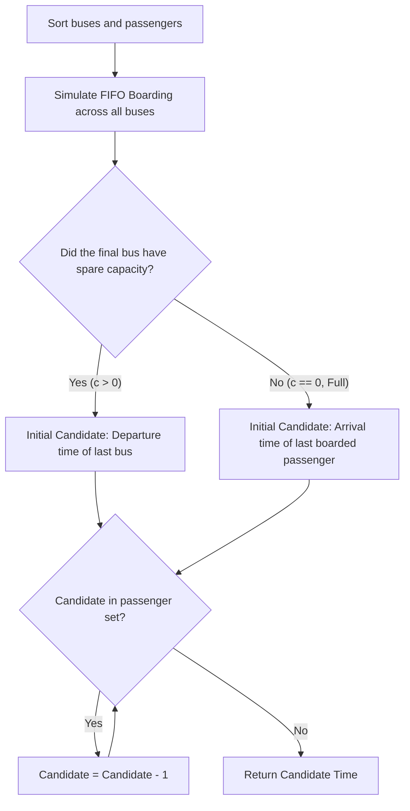

# Guided Example: The Latest Time to Catch a Bus

## 1. Problem Overview & Representative Instance

We are given:
- An integer array `buses` representing departure times of buses.
- An integer array `passengers` representing arrival times of other passengers at the bus station.
- An integer `capacity` denoting the maximum number of passengers that can board any single bus.

Buses depart strictly at their scheduled times. Passengers board sequentially in ascending order of arrival time:
- A passenger arriving at time $p$ can only board a bus departing at time $b$ if $p \le b$.
- Each bus boards at most `capacity` eligible passengers before departing.
- You wish to catch a bus.
- You **cannot** arrive at the same time as any other passenger (arrival times must be strictly distinct).
- Arriving earlier gives you priority in the queue over passengers who arrive later.

The goal is to determine the latest possible integer arrival time that guarantees you board a bus.

Consider the representative instance:
- `buses = [10, 20]`
- `passengers = [2, 17, 18, 19]`
- `capacity = 2`

Timeline:
- Bus 1 (Departs at 10, capacity 2): Passenger at 2 boards. 1 seat remains empty, but no other passenger arrives $\le 10$. Bus 1 departs.
- Bus 2 (Departs at 20, capacity 2): Passengers at 17 and 18 board. Bus 2 reaches full capacity ($2$ passengers). Passengers at 19 is left behind.

Because Bus 2 is completely full, to catch this bus we must arrive before the last passenger who boarded (arrival time 18) and displace them. We cannot arrive at 18 or 17 (already occupied). Arriving at time 16 allows us to board Bus 2 alongside passenger 17, bumping passenger 18.

## 2. Mathematical & Algorithmic Principles

Boarding follows a deterministic first-in, first-out (FIFO) priority queue.

### Phase 1: Forward Boarding Simulation
Sorting both `buses` and `passengers` ascending allows a two-pointer linear simulation:
- For each bus departing at time $t$:
  - Maintain remaining seats $c \leftarrow \text{capacity}$.
  - While $c > 0$, unboarded passengers remain ($j < |\text{passengers}|$), and $passengers[j] \le t$:
    - Board passenger: $c \leftarrow c - 1, \, j \leftarrow j + 1$.

### Phase 2: Identifying the Upper Bound
After processing all buses, we examine the final bus:
1. **Case 1: Final Bus Departs with Empty Seats ($c > 0$):**
   The bus was not full. An individual arriving up to the exact departure time $t_{\text{last}} = buses[-1]$ would find an available seat. Initial candidate: $ans = buses[-1]$.
2. **Case 2: Final Bus Reached Full Capacity ($c = 0$):**
   No open seats were left. To secure a seat, one must displace at least the last passenger who boarded, who arrived at $t_{\text{last\_boarded}} = passengers[j-1]$. Initial candidate: $ans = passengers[j-1]$.

### Phase 3: Resolving Collision Constraints
The problem forbids sharing an arrival time with any other passenger ($ans \notin passengers$).
Starting from the initial candidate:
- While $ans$ coincides with any existing passenger arrival time ($passengers[k] == ans$):
  $$ans \leftarrow ans - 1$$
Because passenger arrival times are finite integers, decrementing $ans$ backwards guarantees discovering the maximal unoccupied integer time slot.

| Final Bus State | Boarding Constraint | Initial Candidate Value | Collision Resolution Action |
|---|---|---|---|
| Spare capacity ($c > 0$) | Must arrive $\le buses[-1]$ | $buses[-1]$ | Decrement until unused integer time |
| Full capacity ($c = 0$) | Must displace passenger $j-1$ | $passengers[j-1]$ | Decrement until unused integer time |

## 3. Step-by-Step Walkthrough with Intermediate State

We trace `buses = [10, 20]`, `passengers = [2, 17, 18, 19]`, `capacity = 2`.
Sorted schedules:
- `buses = [10, 20]`
- `passengers = [2, 17, 18, 19]`

### Step 1: Simulate Bus 1 ($t = 10$, capacity $= 2$)
- Passenger at index 0 arrives at $2 \le 10$: boards.
  - Remaining capacity: $c = 1$. Pointer: $j = 1$.
- Passenger at index 1 arrives at $17 > 10$: cannot board.
- Bus 1 departs with 1 passenger ($[2]$).

### Step 2: Simulate Bus 2 ($t = 20$, capacity $= 2$)
- Remaining capacity resets to $c = 2$.
- Passenger at index 1 arrives at $17 \le 20$: boards.
  - Remaining capacity: $c = 1$. Pointer: $j = 2$.
- Passenger at index 2 arrives at $18 \le 20$: boards.
  - Remaining capacity: $c = 0$. Pointer: $j = 3$.
- Capacity exhausted ($c = 0$).
- Passenger at index 3 arrives at $19$: cannot board.
- Bus 2 departs full with passengers $[17, 18]$.

### Step 3: Determining the Candidate
- The last bus departed with $c = 0$ (no spare seats).
- The last passenger who successfully boarded is at index $j - 1 = 2$, with arrival time $passengers[2] = 18$.
- Initial candidate: $ans = 18$.

### Step 4: Backward Collision Avoidance
- $ans = 18$: Matches $passengers[2] = 18$ (Conflict).
  - Decrement: $ans \leftarrow 17$, pointer moves to $j = 1$.
- $ans = 17$: Matches $passengers[1] = 17$ (Conflict).
  - Decrement: $ans \leftarrow 16$, pointer moves to $j = 0$.
- $ans = 16$: Does not match $passengers[0] = 2$. No conflict!
- Candidate $16$ is available and strictly valid.

Final latest arrival time is $16$.

## 4. Comprehensive State Trace

The boarding sequence across both buses and subsequent collision resolution is tabulated below.

| Timeline Event | Bus Time / Capacity | Passenger Index $j$ | Passenger Arrival | Action Taken | Remaining Bus Capacity $c$ |
|---|---|---|---|---|---|
| Bus 1 Arrival | 10 (cap 2) | 0 | 2 | Passenger boards | 1 |
| Bus 1 Departs | 10 | 1 | 17 | Exceeds departure ($17 > 10$) | 1 (Departs partially full) |
| Bus 2 Arrival | 20 (cap 2) | 1 | 17 | Passenger boards | 1 |
| Bus 2 Boarding | 20 (cap 1) | 2 | 18 | Passenger boards | 0 (Bus Full) |
| Bus 2 Departs | 20 | 3 | 19 | Capacity exhausted | 0 |

Collision Resolution:

| Candidate Time ($ans$) | Matched Passenger Check | Conflict Status | Next Action |
|---|---|---|---|
| 18 | $passengers[2] = 18$ | Conflict | Decrement $ans \to 17$ |
| 17 | $passengers[1] = 17$ | Conflict | Decrement $ans \to 16$ |
| 16 | $passengers[0] = 2$ | Free | Terminate and return 16 |

## 5. Algorithmic Correctness & Soundness

1. **Monotonicity of Queue Priority:**
   Arriving at time $T$ places a passenger immediately ahead of all passengers who arrived at times $> T$. If arriving at time $T$ allows one to board, arriving at any earlier unoccupied time $T' < T$ also guarantees boarding, establishing monotonicity.

2. **Tightness of Upper Bound:**
   If the last bus has empty capacity, no passenger can prevent an arrival at $buses[-1]$ from boarding. If the last bus is full, one must arrive earlier than the last boarded passenger to displace them. In both cases, searching downward from this supremum guarantees finding the maximum legal integer time without missing any valid earlier candidate.

## 6. Edge Cases & Anti-Patterns

- **Spare Seat on Last Bus:**
  - If `buses = [10]`, `passengers = [2]`, `capacity = 2`, the bus has 1 open seat. Candidate starts at $buses[-1] = 10$. Since 10 is unoccupied, the answer is 10.
- **Continuous Block of Occupied Times:**
  - If passengers occupy times $[2, 3, 4, 5]$ and bus departs at 5 with capacity 4, candidate retreats from 5 down to 1.
- **All Passengers Arrive After All Buses:**
  - Buses depart empty. Candidate is simply $buses[-1]$.
- **Anti-Pattern (Binary Search on Time):**
  - While binary search over arrival times is possible, it requires simulating the entire passenger queue for each midpoint. Simulating the queue once in sorted order and stepping backward from the ceiling runs in optimal linear time.

## 7. Complexity Analysis

- **Time Complexity:** $\mathcal{O}(B \log B + P \log P)$ where $B$ is the number of buses and $P$ is the number of passengers. Sorting `buses` and `passengers` dominates the runtime. The two-pointer boarding simulation inspects each bus and passenger once in $\mathcal{O}(B + P)$ time, and the backward collision loop visits at most $P$ entries.
- **Space Complexity:** $\mathcal{O}(1)$ auxiliary space beyond the sorting buffer, as simulation state uses two pointer indices and scalar variables.
