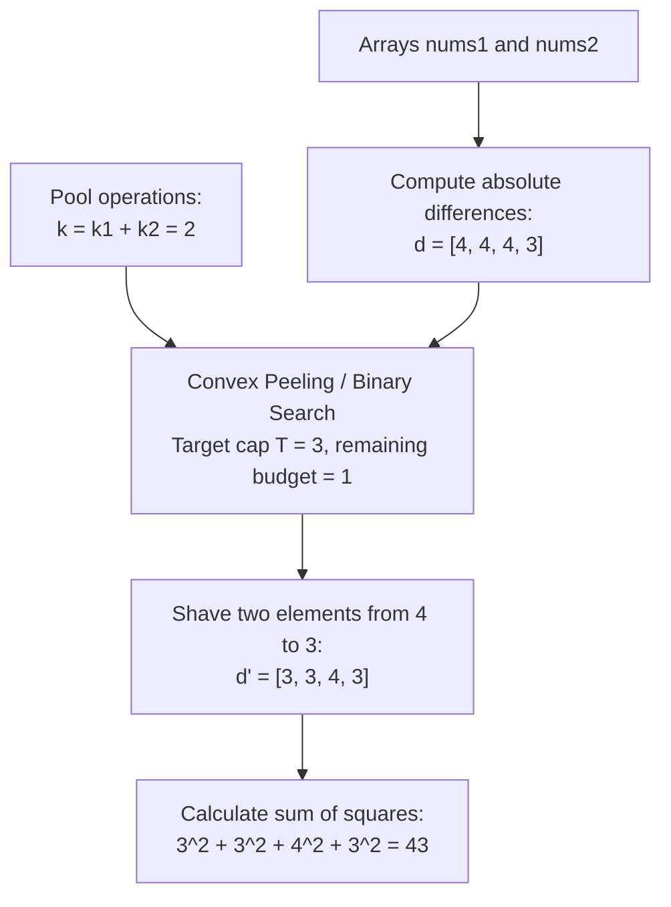

# Guided Example: Minimum Sum of Squared Difference

## 1. Problem Overview & Representative Instance

We are given two 0-indexed integer arrays, `nums1` and `nums2`, both of length $n$, along with two non-negative integers, $k1$ and $k2$:
- We can modify elements of `nums1` up to $k1$ times (each operation increases or decreases an element by 1).
- We can modify elements of `nums2` up to $k2$ times (each operation increases or decreases an element by 1).

The objective is to minimize the sum of squared differences:

$$\sum_{i=0}^{n-1} (nums1[i] - nums2[i])^2$$

Consider the representative instance:
- `nums1 = [1, 4, 10, 12]`
- `nums2 = [5, 8, 6, 9]`
- Operation allowances: $k1 = 1, k2 = 1$

Absolute differences:
- $d = [|1 - 5|, |4 - 8|, |10 - 6|, |12 - 9|] = [4, 4, 4, 3]$
- Initial sum of squares: $4^2 + 4^2 + 4^2 + 3^2 = 16 + 16 + 16 + 9 = 57$
- Combined reduction budget: $k = k1 + k2 = 1 + 1 = 2$

Applying the 2 operations to decrease two of the maximum differences from $4 \to 3$ leaves differences $[3, 3, 4, 3]$, reducing the sum of squares to $3^2 + 3^2 + 4^2 + 3^2 = 43$.

## 2. Mathematical & Algorithmic Principles

Let $d_i = |nums1[i] - nums2[i]|$. An operation incrementing or decrementing either $nums1[i]$ or $nums2[i]$ can reduce $d_i$ by $1$ (as long as $d_i > 0$). Because modifying $nums1[i]$ by $-1$ or $nums2[i]$ by $+1$ has an identical impact on $nums1[i] - nums2[i]$, the two operation counts pool into a single additive budget:

$$k = k1 + k2$$

The optimization problem is:

$$\min \sum_{i=0}^{n-1} d_i'^2 \quad \text{subject to} \quad 0 \le d_i' \le d_i, \quad \sum_{i=0}^{n-1} (d_i - d_i') \le k$$

### Convexity and Greedy Peak Shaving
The square function $f(x) = x^2$ is strictly convex. Decrementing a difference $x$ by 1 yields a marginal reduction in squared sum of:

$$\Delta(x) = x^2 - (x - 1)^2 = 2x - 1$$

Because $\Delta(x)$ is strictly increasing with $x$, maximal variance reduction occurs by decrementing the largest current difference across the array.

### Monotonic Binary Search for the Cap Level
Instead of a slow element-by-element priority queue, we determine the optimal upper bound threshold $T$ using binary search over the range $[0, \max(d)]$:
- For any test cap $m$, the operations required to shave all peaks down to at most $m$ is:
  $$\operatorname{Cost}(m) = \sum_{i=0}^{n-1} \max(0, \, d_i - m)$$
- $\operatorname{Cost}(m)$ is a monotonically decreasing function of $m$.
- We search for the smallest $m$ such that $\operatorname{Cost}(m) \le k$.
- Let this minimal cap be $T$. Every $d_i > T$ is clamped to $T$.
- Any residual operations $k_{\text{rem}} = k - \operatorname{Cost}(T)$ are then distributed by decrementing $k_{\text{rem}}$ elements currently sitting at level $T$ down to $T - 1$.

| Parameter | Mathematical Expression | Algorithmic Function |
|---|---|---|
| Combined Budget | $k = k1 + k2$ | Total unit decrements available |
| Peak Shaving Cost | $\sum \max(0, d_i - m)$ | Operations needed to enforce cap $m$ |
| Optimal Threshold $T$ | $\min \{m \mid \operatorname{Cost}(m) \le k\}$ | Ceiling of the reduced distribution |
| Remainder Redistribution | $k_{\text{rem}} = k - \operatorname{Cost}(T)$ | Decrements applied to values at $T$ |

## 3. Step-by-Step Walkthrough with Intermediate State

We trace the representative instance: $d = [4, 4, 4, 3]$ with $k = 2$.

### Step 1: Global Feasibility Check
- Total difference sum: $4 + 4 + 4 + 3 = 15$.
- Available operations: $k = 2$. Since $15 > 2$, the result is strictly positive.

### Step 2: Binary Search for Cap $T$
Search interval: $[0, 4]$.
- Test midpoint $m = 2$:
  - Required operations: $(4 - 2) + (4 - 2) + (4 - 2) + (3 - 2) = 2 + 2 + 2 + 1 = 7$.
  - Since $7 > 2$, $m = 2$ is unaffordable $\implies$ Search higher: $[3, 4]$.
- Test midpoint $m = 3$:
  - Required operations: $(4 - 3) + (4 - 3) + (4 - 3) + 0 = 1 + 1 + 1 + 0 = 3$.
  - Since $3 > 2$, $m = 3$ is unaffordable $\implies$ Search higher: $[4, 4]$.
- Result of search: Minimal affordable cap is $T = 4$.

### Step 3: Shaving Down to Cap $T = 4$
- Operations spent capping at $4$:
  $$\operatorname{Cost}(4) = \max(0, 4-4) + \max(0, 4-4) + \max(0, 4-4) + \max(0, 3-4) = 0$$
- Residual operations remaining: $k_{\text{rem}} = 2 - 0 = 2$.
- Current difference vector: $d = [4, 4, 4, 3]$.

### Step 4: Distributing Remainder $k_{\text{rem}} = 2$
We have 2 spare decrements to apply to values that are currently at the peak value $4$:
- Decrement $d[0]$ from $4 \to 3$ ($k_{\text{rem}} = 1$).
- Decrement $d[1]$ from $4 \to 3$ ($k_{\text{rem}} = 0$).
- Final differences: $d' = [3, 3, 4, 3]$.

### Step 5: Computing Sum of Squares
$$\sum d_i'^2 = 3^2 + 3^2 + 4^2 + 3^2 = 9 + 9 + 16 + 9 = 43$$

## 4. Comprehensive State Trace

The progression from original differences through binary search capping and residual adjustment is recorded below.

| Index $i$ | Initial $\lvert nums1[i] - nums2[i] \rvert$ | After Cap $T = 4$ | After Remainder Decrements | Final Difference ($d_i'$) | Final Contribution ($d_i'^2$) |
|---|---|---|---|---|---|
| 0 | 4 | 4 | Decremented ($-1$) | 3 | 9 |
| 1 | 4 | 4 | Decremented ($-1$) | 3 | 9 |
| 2 | 4 | 4 | Unchanged | 4 | 16 |
| 3 | 3 | 3 | Unchanged | 3 | 9 |
| **Sum** | 15 | 15 | 2 decrements applied | 13 | **43** |

## 5. Algorithmic Correctness & Soundness

1. **Equivalence of Pooled Budgets:**
   Because the objective depends strictly on $(nums1[i] - nums2[i])^2$, changing $nums1[i]$ by $+1$ is completely interchangeable with changing $nums2[i]$ by $-1$. The total number of valid adjustments on $|nums1[i] - nums2[i]|$ is bounded solely by $k1 + k2$.

2. **Optimality of Equalization (Majorization):**
   By the Karamata Majorization Inequality and strict convexity of $x \mapsto x^2$, any vector $d'$ that majorizes another vector $d''$ with the same $L_1$ norm satisfies $\sum d_i'^2 \ge \sum d_i''^2$. Shaving the tallest peaks produces a distribution that is maximally uniform (least majorizing), strictly minimizing the quadratic sum.

## 6. Edge Cases & Anti-Patterns

- **Budget Exceeds Total Differences ($\sum d_i \le k$):**
  - All differences can be driven to 0, returning 0 immediately.
- **Zero Available Operations ($k1 = 0, k2 = 0$):**
  - $k = 0$. No changes occur; returns the raw sum of squared differences.
- **Equal Arrays Initially:**
  - All $d_i = 0$. Sum of squares is 0.
- **Large Integer Arithmetic:**
  - When $n = 10^5$ and differences are $\sim 10^5$, squared terms reach $10^{10}$ and their sum can reach $10^{15}$, requiring 64-bit integer accumulators to prevent overflow.
- **Anti-Pattern (Simulation with Max-Heap):**
  - Popping and pushing in a heap $k$ times takes $\mathcal{O}(k \log n)$. Since $k$ can be as large as $10^9$, this approach times out. Binary search over difference magnitudes finishes in $\mathcal{O}(n \log(\max d))$.

## 7. Complexity Analysis

- **Time Complexity:** $\mathcal{O}(n \log M)$ where $n$ is the length of the arrays and $M = \max(d) \le 10^5$. The binary search executes $\log_2(10^5) \approx 17$ iterations. Each iteration performs an $\mathcal{O}(n)$ scan to compute the required shaving cost. Distributing the remainder and summing squares takes $\mathcal{O}(n)$. Total time is $\mathcal{O}(n \log M)$.
- **Space Complexity:** $\mathcal{O}(n)$ auxiliary space to store the absolute difference array.