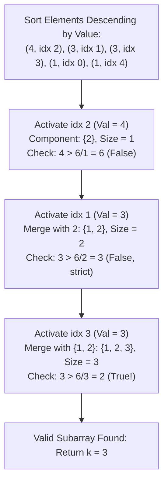

# Guided Example: Subarray With Elements Greater Than Varying Threshold

## 1. Problem Overview & Representative Instance

We are given an integer array `nums` and an integer `threshold`. We must find the length $k$ ($1 \le k \le n$) of any contiguous subarray of `nums` such that every element within that subarray is strictly greater than the threshold divided by the subarray length:

$$\forall x \in \text{subarray}: \quad x > \frac{\text{threshold}}{k}$$

If at least one such subarray exists, we return its length $k$. If multiple valid lengths exist, returning any valid length is acceptable. If no such subarray exists anywhere in `nums`, we return $-1$.

Consider the representative instance:
- `nums = [1, 3, 4, 3, 1]`
- `threshold = 6`

Examining the contiguous subarray `[3, 4, 3]` (indices 1 to 3):
- Subarray length: $k = 3$.
- Effective threshold: $\frac{\text{threshold}}{k} = \frac{6}{3} = 2$.
- Every element in `[3, 4, 3]` is $\ge 3$, which is strictly greater than $2$.
Therefore, $k = 3$ is a valid subarray length.

## 2. Mathematical & Algorithmic Principles

For any contiguous subarray of length $k$, the requirement that every element $x$ satisfies $x > \frac{\text{threshold}}{k}$ is mathematically equivalent to requiring that the **minimum element** of the subarray satisfies the condition:

$$\min_{i \in \text{subarray}} nums[i] > \frac{\text{threshold}}{k} \iff k \cdot \min_{i \in \text{subarray}} nums[i] > \text{threshold}$$

### Maximal Interval Property
Suppose an element $v = nums[i]$ serves as the minimum of some subarray. To maximize the product $k \cdot v$, we should make the subarray length $k$ as large as possible. Let $[L_i, R_i]$ be the maximal contiguous interval containing index $i$ in which every element is $\ge nums[i]$. The maximal length is $k_i = R_i - L_i + 1$.
If any subarray with minimum $nums[i]$ satisfies the condition, the maximal interval $[L_i, R_i]$ must also satisfy:

$$nums[i] > \left\lfloor \frac{\text{threshold}}{k_i} \right\rfloor$$

### Descending DSU (Disjoint Set Union) Strategy
We can discover maximal contiguous intervals dynamically:
1. Sort all indices $i$ in descending order of their values $nums[i]$.
2. Process elements one by one, marking each index as "active".
3. When index $i$ is activated:
   - Merge $i$ with active adjacent neighbor $i - 1$ (if active).
   - Merge $i$ with active adjacent neighbor $i + 1$ (if active).
4. Because elements are processed in descending order, all elements in the newly merged connected component are $\ge nums[i]$. Thus, $nums[i]$ is the minimum element of this contiguous block.
5. The size $S$ of the DSU component is the maximal length. We check:
   $$nums[i] > \left\lfloor \frac{\text{threshold}}{S} \right\rfloor$$
   If this holds, $S$ is a valid subarray size and we terminate immediately.

| Algorithmic Phase | Data Structure / Operation | Invariant Maintained |
|---|---|---|
| Descending Sort | Sorted tuple array $(v, i)$ | Future activated elements are $\le$ current element |
| DSU Union | `merge(i, i - 1)` and `merge(i, i + 1)` | Component represents a contiguous segment of elements $\ge v$ |
| Threshold Verification | $v > \lfloor \text{threshold} / S \rfloor$ | Validates if the entire component exceeds the required threshold ratio |

## 3. Step-by-Step Walkthrough with Intermediate State

We trace `nums = [1, 3, 4, 3, 1]` with `threshold = 6`.
Array length $n = 5$.
Elements sorted descending by value:
1. $(4, 2)$
2. $(3, 1)$
3. $(3, 3)$
4. $(1, 0)$
5. $(1, 4)$

Active flags initialized to all `false`. DSU initialized with parent pointers and sizes $= 1$.

- **Step 1: Process $(4, 2)$**
  - Activate index 2.
  - Neighbors 1 and 3 are inactive $\implies$ no merge.
  - Component size: $S = 1$.
  - Test: $4 > \lfloor 6 / 1 \rfloor \implies 4 > 6$ (False).

- **Step 2: Process $(3, 1)$**
  - Activate index 1.
  - Neighbor 0 is inactive.
  - Neighbor 2 is active $\implies$ merge index 1 and index 2.
  - New component: $\{1, 2\}$ with size $S = 2$.
  - Minimum element of component is $3$.
  - Test: $3 > \lfloor 6 / 2 \rfloor \implies 3 > 3$ (False, strict inequality requires $>$, not $\ge$).

- **Step 3: Process $(3, 3)$**
  - Activate index 3.
  - Neighbor 4 is inactive.
  - Neighbor 2 is active (part of component $\{1, 2\}$) $\implies$ merge index 3 with component $\{1, 2\}$.
  - New component: $\{1, 2, 3\}$ with size $S = 2 + 1 = 3$.
  - Minimum element of component is $3$.
  - Test: $3 > \lfloor 6 / 3 \rfloor \implies 3 > 2$ (True!).
  - Condition is met with component size $S = 3$.

Algorithm immediately halts and returns $3$.

## 4. Comprehensive State Trace

The sequence of element activations and component evaluations is detailed below.

| Activation Step | Processed Tuple $(v, i)$ | Adjacent Active Neighbors | Merged Component Indices | Component Size ($S$) | Effective Bound ($\lfloor \text{threshold} / S \rfloor$) | Inequality Check ($v > \lfloor \text{threshold} / S \rfloor$) |
|---|---|---|---|---|---|---|
| 1 | $(4, 2)$ | None | $\{2\}$ | 1 | $\lfloor 6 / 1 \rfloor = 6$ | $4 > 6$ (False) |
| 2 | $(3, 1)$ | Index 2 | $\{1, 2\}$ | 2 | $\lfloor 6 / 2 \rfloor = 3$ | $3 > 3$ (False) |
| 3 | $(3, 3)$ | Index 2 | $\{1, 2, 3\}$ | 3 | $\lfloor 6 / 3 \rfloor = 2$ | $3 > 2$ (True, Valid) |

## 5. Algorithmic Correctness & Soundness

1. **Exact Contiguity by DSU Merging:**
   Because unions only connect adjacent indices $i$ and $i \pm 1$, each connected set of indices represents a contiguous slice of the original array $[L, R]$.

2. **Soundness of the Minimum Element:**
   Sorting elements in descending order guarantees that every element already present in the component was activated during an earlier or identical step, meaning its value is $\ge v$. Thus, $v$ is strictly the minimum element of the entire contiguous segment. Since $v > \text{threshold} / S$, every other element in the segment is also strictly greater than $\text{threshold} / S$.

## 6. Edge Cases & Anti-Patterns

- **No Subarray Satisfies Criteria:**
  - If all elements are small compared to `threshold` (e.g. `nums = [1, 2, 3], threshold = 10`), the loop exhausts all elements and returns $-1$.
- **Strict Inequality Requirement:**
  - When $nums[i] == \lfloor \text{threshold} / S \rfloor$, the condition fails because the problem requires strictly greater ($>$).
- **Single Element Exceeds Threshold ($nums[i] > \text{threshold}$):**
  - A single-cell subarray of length $k = 1$ immediately qualifies and returns $1$.
- **Anti-Pattern (Testing All $\mathcal{O}(n^2)$ Subarrays):**
  - Evaluating all subarrays takes $\mathcal{O}(n^2)$ time, which fails for $n = 10^5$. Monotonic stack or descending DSU solves the problem in $\mathcal{O}(n \log n)$ or $\mathcal{O}(n)$ time.

## 7. Complexity Analysis

- **Time Complexity:** $\mathcal{O}(n \log n)$. Sorting the $n$ element-index pairs takes $\mathcal{O}(n \log n)$ time. Iterating through the sorted list executes at most $2n$ DSU union-find operations with path compression, which runs in near-linear $\mathcal{O}(n \cdot \alpha(n))$ time. (Alternatively, $\mathcal{O}(n)$ using a monotonic stack).
- **Space Complexity:** $\mathcal{O}(n)$ auxiliary space to store the sorted tuple array and DSU parent and size arrays.
