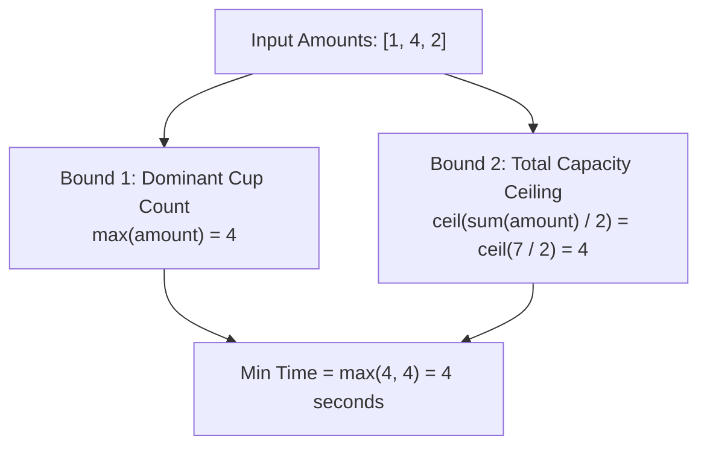

# Guided Example: Minimum Amount of Time to Fill Cups

## 1. Problem Overview & Representative Instance

A water dispenser provides three types of water: cold, warm, and hot. We are given an integer array `amount` of length 3, where `amount[0]`, `amount[1]`, and `amount[2]` denote the number of cups of cold, warm, and hot water required respectively.

In each second, the dispenser can perform exactly one of the following actions:
- Fill $2$ cups of different water types (e.g., one cold cup and one warm cup).
- Fill $1$ cup of any water type.

We must determine the minimum number of seconds needed to fill all requested cups.

Consider the representative instance:
- `amount = [1, 4, 2]`
- Cold: 1, Warm: 4, Hot: 2

Total cups required: $1 + 4 + 2 = 7$.
The most demanded water type is Warm with 4 cups.
Because each second fills at most 2 cups, at least $\lceil 7 / 2 \rceil = 4$ seconds are required. Furthermore, because warm cups can only be filled at a rate of 1 per second, at least 4 seconds are required. Pairing the 4 warm cups with cold and hot cups completes the task in exactly 4 seconds.

## 2. Mathematical & Algorithmic Principles

Let the sorted cup counts be $a \le b \le c$, with total sum $S = a + b + c$ and maximum count $M = c$.

### Fundamental Theoretical Lower Bounds
1. **Total Capacity Bound:** Since at most 2 cups are filled in each second, the number of seconds $T$ satisfies:
   $$T \ge \left\lceil \frac{a + b + c}{2} \right\rceil = \left\lfloor \frac{S + 1}{2} \right\rfloor$$
2. **Single-Type Rate Limit:** Because at most one cup of the dominant type $c$ can be filled per second (as the two cups filled must be of *different* types), $T$ satisfies:
   $$T \ge c = \max(a, b, c)$$

Combining both necessary conditions yields the global lower bound:

$$T \ge \max\left( \max(a, b, c), \, \left\lceil \frac{a + b + c}{2} \right\rceil \right)$$

### Exact Constructive Reachability
This lower bound is universally achievable:
- **Case 1 (Dominant Bottleneck, $c \ge a + b$):**
  The dominant category exceeds the other two combined. We pair each of the $a + b$ non-dominant cups with one cup of type $c$ across $a + b$ seconds. The remaining $c - (a + b)$ cups of type $c$ are filled singly. Total seconds:
  $$(a + b) + \big(c - (a + b)\big) = c = \max(a, b, c)$$
- **Case 2 (Balanced Triangle, $c < a + b$):**
  No single category dominates. By greedily pairing the two currently largest amounts at each second, all cups are paired off into pairs of 2, leaving at most 1 unpaired singleton if $S$ is odd. Total seconds:
  $$\left\lceil \frac{a + b + c}{2} \right\rceil$$

Thus, the exact minimum time is:

$$T^* = \max\left( \max(a, b, c), \, \left\lfloor \frac{a + b + c + 1}{2} \right\rfloor \right)$$

| Configuration Regime | Algebraic Condition | Bottleneck Limiting Factor | Optimal Time $T^*$ |
|---|---|---|---|
| Dominant Type | $c \ge a + b$ | The largest single category cannot be paired completely | $c$ |
| Balanced | $c < a + b$ | Total cup capacity filled two at a time | $\lceil (a + b + c) / 2 \rceil$ |

## 3. Step-by-Step Walkthrough with Intermediate State

We trace the step-by-step greedy simulation on `amount = [1, 4, 2]`.
Categories: Cold ($C = 1$), Warm ($W = 4$), Hot ($H = 2$).

- **Second 1:**
  - Sorted amounts: $C = 1, H = 2, W = 4$.
  - Pick 1 Warm and 1 Hot cup.
  - New state: $C = 1, H = 1, W = 3$.
  - Remaining total cups: 5.

- **Second 2:**
  - Sorted amounts: $C = 1, H = 1, W = 3$.
  - Pick 1 Warm and 1 Hot cup.
  - New state: $C = 1, H = 0, W = 2$.
  - Remaining total cups: 3.

- **Second 3:**
  - Sorted amounts: $H = 0, C = 1, W = 2$.
  - Pick 1 Warm and 1 Cold cup.
  - New state: $H = 0, C = 0, W = 1$.
  - Remaining total cups: 1.

- **Second 4:**
  - Sorted amounts: $H = 0, C = 0, W = 1$.
  - Only Warm remains. Fill 1 Warm cup singly.
  - New state: $H = 0, C = 0, W = 0$.
  - Remaining total cups: 0.

All cups filled in 4 seconds.

## 4. Comprehensive State Trace

The state transitions of the greedy pairing process are recorded below.

| Elapsed Second | Amounts Before Second $[C, W, H]$ | Two Largest Categories Chosen | Cups Decremented | Amounts After Second $[C, W, H]$ | Unfilled Total |
|---|---|---|---|---|---|
| Start | $[1, 4, 2]$ | - | - | $[1, 4, 2]$ | 7 |
| 1 | $[1, 4, 2]$ | Warm & Hot | $W - 1, H - 1$ | $[1, 3, 1]$ | 5 |
| 2 | $[1, 3, 1]$ | Warm & Hot | $W - 1, H - 1$ | $[1, 2, 0]$ | 3 |
| 3 | $[1, 2, 0]$ | Warm & Cold | $W - 1, C - 1$ | $[0, 1, 0]$ | 1 |
| 4 | $[0, 1, 0]$ | Warm alone | $W - 1$ | $[0, 0, 0]$ | 0 |

Evaluating the closed-form equation confirms:
$$T^* = \max\left(4, \, \left\lceil \frac{1 + 4 + 2}{2} \right\rceil\right) = \max(4, 4) = 4$$

## 5. Algorithmic Correctness & Soundness

1. **Greedy Invariant Preservation:**
   Selecting the two largest available amounts at each step keeps the remaining values as balanced as possible, maintaining the invariant that the gap between the largest count and the sum of the other two decreases monotonically until parity is achieved.

2. **Sufficiency of the Closed-Form Formula:**
   Because both bounds $\max(amount)$ and $\lceil \sum amount / 2 \rceil$ are proven theoretical necessities, no valid schedule can beat their maximum. The greedy simulation constructively matches this maximum in every case.

## 6. Edge Cases & Anti-Patterns

- **All Cups Zero (`amount = [0, 0, 0]`):**
  - Maximum is 0, sum is 0, formula evaluates to 0 seconds.
- **Only One Category Non-Zero (`amount = [5, 0, 0]`):**
  - No two distinct types exist. Cups must be filled one at a time, requiring exactly 5 seconds.
- **Equal Counts (`amount = [100, 100, 100]`):**
  - Perfectly balanced. Requires $\lceil 300 / 2 \rceil = 150$ seconds.
- **Anti-Pattern (Simulating One Second at a Time):**
  - While a while-loop decrementation runs quickly for small numbers ($\le 100$), applying the closed-form arithmetic $\max(\max, \lceil \text{sum}/2 \rceil)$ computes the exact answer in $\mathcal{O}(1)$ time.

## 7. Complexity Analysis

- **Time Complexity:** $\mathcal{O}(1)$. The closed-form evaluation computes the maximum and sum of 3 integers in constant time.
- **Space Complexity:** $\mathcal{O}(1)$ auxiliary space. Only scalar registers are used.
