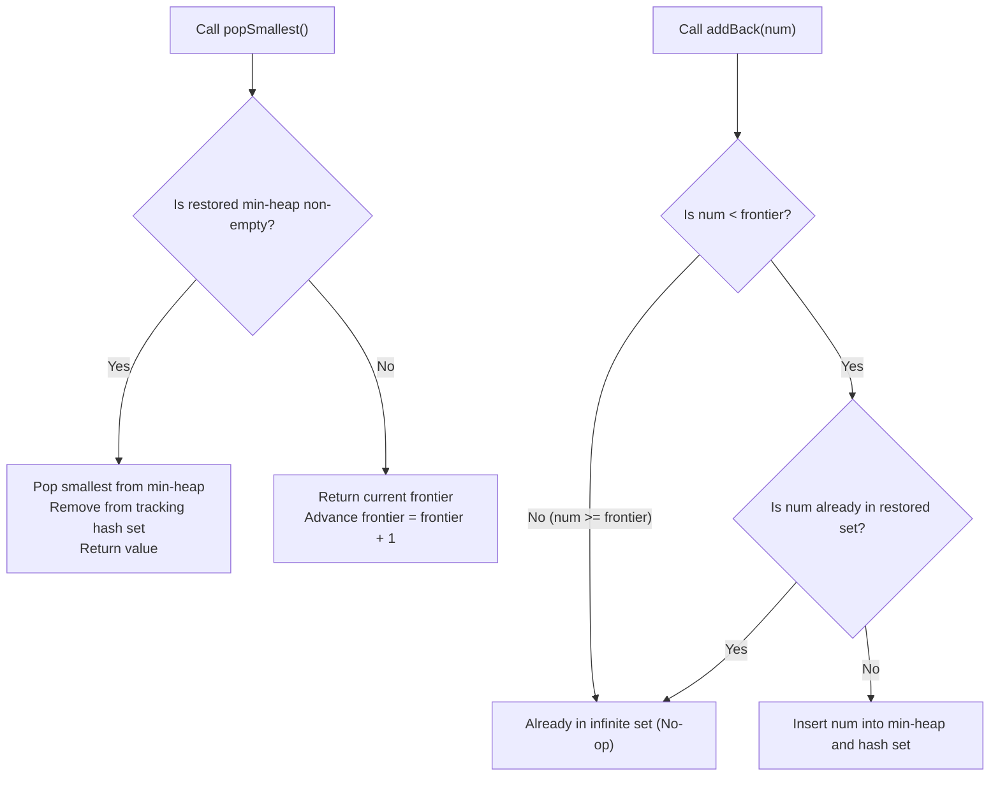

# Guided Example: Smallest Number in Infinite Set

## 1. Problem Overview & Representative Instance

We are required to design a data structure, `SmallestInfiniteSet`, that initially contains all positive integers:

$$\mathcal{S} = \{1, 2, 3, 4, 5, \dots\}$$

The class must support the following methods:
1. `SmallestInfiniteSet()`: Initializes the collection to contain all positive integers.
2. `popSmallest()`: Removes and returns the smallest integer currently present in the set.
3. `addBack(num)`: Adds the positive integer `num` back into the set if it is currently absent. If `num` is already in the set, the call has no effect.

Consider the representative sequence of operations:
1. Initialize set.
2. `addBack(2)`: Integer 2 was never removed; remains in the set.
3. `popSmallest()`: Returns $1$.
4. `popSmallest()`: Returns $2$.
5. `popSmallest()`: Returns $3$.
6. `addBack(1)`: Restores $1$ into the set.
7. `popSmallest()`: Returns $1$ (since $1 < 4$).
8. `popSmallest()`: Returns $4$.
9. `popSmallest()`: Returns $5$.

## 2. Mathematical & Algorithmic Principles

Because the universe of positive integers is infinite, storing all members explicitly is impossible. However, the set can be partitioned into two distinct subsets via a frontier cursor $F \in \mathbb{N}$:
- **Unseen Suffix:** The contiguous ray of all integers $\ge F$, which are implicitly present:
  $$\mathcal{U} = \{x \in \mathbb{N} \mid x \ge F\}$$
- **Restored Disjoint Pool:** A finite collection of previously popped integers strictly below $F$ that were subsequently returned via `addBack`:
  $$\mathcal{R} \subset \{1, 2, \dots, F - 1\}$$

The total state of available numbers is the disjoint union:

$$\mathcal{S} = \mathcal{R} \cup \mathcal{U}$$

### Priority Ordering
The minimum element of $\mathcal{S}$ is:

$$\min(\mathcal{S}) = \begin{cases} \min(\mathcal{R}) & \text{if } \mathcal{R} \ne \emptyset \\ F & \text{if } \mathcal{R} = \emptyset \end{cases}$$

### Operations Mechanics:
1. **`popSmallest()`:**
   - If $\mathcal{R}$ is non-empty, extract the minimum from $\mathcal{R}$ (using a min-heap or balanced search tree).
   - If $\mathcal{R}$ is empty, take $F$ and increment $F \leftarrow F + 1$.
2. **`addBack(num)`:**
   - If $num \ge F$, the element already belongs to $\mathcal{U}$; ignore.
   - If $num < F$ and $num \notin \mathcal{R}$, insert $num$ into $\mathcal{R}$ and its companion hash set.

| Component | Invariant Property | Storage Mechanism |
|---|---|---|
| Frontier Cursor $F$ | Lowest positive integer that has never been extracted | Integer scalar |
| Restored Set $\mathcal{R}$ | Subset of $\{1, \dots, F - 1\}$ currently present | Min-heap / Ordered set |
| Membership Filter | Fast $\mathcal{O}(1)$ existence check for $\mathcal{R}$ | Hash set |

## 3. Step-by-Step Walkthrough with Intermediate State

We trace the representative operation sequence:
Initial state: $F = 1$, $\mathcal{R} = \emptyset$, $\text{hash\_set} = \emptyset$.

- **Op 1: `SmallestInfiniteSet()`**
  - Frontier: $F = 1$. $\mathcal{R} = \emptyset$.
  - Output: `null`.

- **Op 2: `addBack(2)`**
  - Target: $num = 2$.
  - Test: $num \ge F \implies 2 \ge 1$.
  - 2 is already in the infinite suffix $\mathcal{U}$. No change.
  - Output: `null`.

- **Op 3: `popSmallest()`**
  - $\mathcal{R}$ is empty $\implies$ pop from frontier.
  - Result: $1$. Frontier advances: $F = 1 + 1 = 2$.

- **Op 4: `popSmallest()`**
  - $\mathcal{R}$ is empty $\implies$ pop from frontier.
  - Result: $2$. Frontier advances: $F = 2 + 1 = 3$.

- **Op 5: `popSmallest()`**
  - $\mathcal{R}$ is empty $\implies$ pop from frontier.
  - Result: $3$. Frontier advances: $F = 3 + 1 = 4$.

- **Op 6: `addBack(1)`**
  - Target: $num = 1$.
  - Test: $1 < F$ ($1 < 4$) and $1 \notin \text{hash\_set}$.
  - Add 1 to $\mathcal{R}$ and $\text{hash\_set}$.
  - State: $F = 4$, $\mathcal{R} = \{1\}$.
  - Output: `null`.

- **Op 7: `popSmallest()`**
  - $\mathcal{R} = \{1\}$ is non-empty.
  - Extract $\min(\mathcal{R}) = 1$. Remove 1 from $\mathcal{R}$ and $\text{hash\_set}$.
  - Frontier remains $F = 4$.
  - Result: $1$.

- **Op 8: `popSmallest()`**
  - $\mathcal{R}$ is empty $\implies$ pop from frontier.
  - Result: $4$. Frontier advances: $F = 4 + 1 = 5$.

- **Op 9: `popSmallest()`**
  - $\mathcal{R}$ is empty $\implies$ pop from frontier.
  - Result: $5$. Frontier advances: $F = 5 + 1 = 6$.

Sequence of outputs: `[null, null, 1, 2, 3, null, 1, 4, 5]`.

## 4. Comprehensive State Trace

The state of the data structure after every operation is documented below.

| Step | Operation Invoked | Argument | Frontier $F$ | Restored Pool $\mathcal{R}$ | Decision Logic Applied | Output Value |
|---|---|---|---|---|---|---|
| 0 | Constructor | - | 1 | $\emptyset$ | Initialize default frontier | `null` |
| 1 | `addBack` | 2 | 1 | $\emptyset$ | $2 \ge F \implies$ already present | `null` |
| 2 | `popSmallest` | - | 2 | $\emptyset$ | $\mathcal{R}$ empty $\implies$ take $F = 1$, advance | 1 |
| 3 | `popSmallest` | - | 3 | $\emptyset$ | $\mathcal{R}$ empty $\implies$ take $F = 2$, advance | 2 |
| 4 | `popSmallest` | - | 4 | $\emptyset$ | $\mathcal{R}$ empty $\implies$ take $F = 3$, advance | 3 |
| 5 | `addBack` | 1 | 4 | $\{1\}$ | $1 < F \implies$ insert into $\mathcal{R}$ | `null` |
| 6 | `popSmallest` | - | 4 | $\emptyset$ | $\mathcal{R}$ non-empty $\implies$ pop $\min(\mathcal{R}) = 1$ | 1 |
| 7 | `popSmallest` | - | 5 | $\emptyset$ | $\mathcal{R}$ empty $\implies$ take $F = 4$, advance | 4 |
| 8 | `popSmallest` | - | 6 | $\emptyset$ | $\mathcal{R}$ empty $\implies$ take $F = 5$, advance | 5 |

## 5. Algorithmic Correctness & Soundness

1. **Partition Invariance:**
   Every positive integer $x \in \mathbb{N}$ resides in exactly one of three states at any time:
   - Extracted and currently absent ($x < F \land x \notin \mathcal{R}$)
   - Extracted and restored ($x < F \land x \in \mathcal{R}$)
   - Never extracted ($x \ge F$)
   Because any $x \in \mathcal{R}$ satisfies $x < F$, $\min(\mathcal{R})$ is strictly smaller than $F$. Checking $\mathcal{R}$ first guarantees returning the globally minimal available integer.

2. **Deduplication on Addition:**
   Testing both $num < F$ and membership in the hash set prevents duplicate insertions into $\mathcal{R}$, ensuring the set semantics of distinct integers are strictly preserved.

## 6. Edge Cases & Anti-Patterns

- **Multiple Redundant `addBack` Calls:**
  - Repeated calls to `addBack(x)` with the same value $x$ check the hash set and do nothing after the first insertion.
- **`addBack` of Never-Popped Value:**
  - Calling `addBack(1000)` while $F = 5$ does nothing because $1000 \ge 5$.
- **Anti-Pattern (Pre-allocating a Fixed Size Array):**
  - While test constraints often state $num \le 1000$, hardcoding a static array of size 1000 limits the data structure to a finite universe. The frontier-heap architecture supports unbounded queries up to arbitrarily large integers.

## 7. Complexity Analysis

- **Time Complexity:**
  - `popSmallest()`: $\mathcal{O}(\log |\mathcal{R}|)$ when popping from the min-heap, and $\mathcal{O}(1)$ when popping from the frontier cursor.
  - `addBack(num)`: $\mathcal{O}(\log |\mathcal{R}|)$ to insert into the min-heap and $\mathcal{O}(1)$ to insert into the hash set.
  - Overall time for $Q$ operations is $\mathcal{O}(Q \log Q)$.
- **Space Complexity:** $\mathcal{O}(K)$ auxiliary space, where $K$ is the maximum number of simultaneously restored numbers in $\mathcal{R}$ ($K \le Q$).
