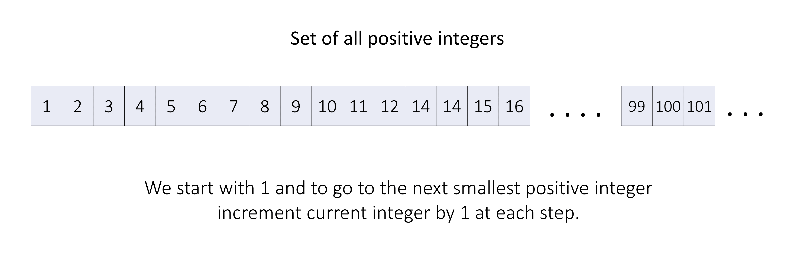

[TOC]

## Solution
---

### Approach 1: Hashset + Heap

#### Intuition

We have a set of all positive integers (a set will always contain unique elements). Now say this problem statement had only one method `popSmallest()`, then, we could have just kept one data structure (an array) and inserted `1000` numbers from $1 - 1000$ in it in increasing order, and while calling this method we will just move our index pointer from left to right by `1`.

But we know that the lowest positive integer is `1` and with each pop we move to the next positive integer which will be one larger than the previous, thus instead of using an additional array we can use one integer variable `currentInteger` initialized to `1` (denoting the smallest positive integer), and with each method call, we will return the current smallest integer and increment `currentInteger` by `1` (we move to the next greater positive integer).



But here we are also given one more method `addBack(num)`, which will insert an integer back into our set  (if the integer `num` is already present in our set then it won't do anything).

We can keep a separate space (another data structure) for re-added integers. We only need to keep only integers smaller than `currentInteger` in this data structure. That way, if the data structure is not empty, then the smallest available integer will surely be in it.

We need to insert some numbers and always keep track of the smallest number among them, we could use an array and sort it again and again after each insert, but it will be very inefficient. Instead, we can use a min-heap data structure here.

> A min-heap is a specialized tree-based data structure that is used to efficiently maintain and retrieve the minimum element from a collection of elements. A heap is typically implemented as a binary tree, where each node in the tree represents an element in the collection.

If you are new to this data structure then we recommend you visit our [Heap Explore Card](https://leetcode.com/explore/featured/card/heap/643/heap/4018/) for a better understanding.

But our heap will not support insertions of only unique elements (for example, if `addBack` is called with the same number multiple times in a row), thus we will need an additional data structure to check already inserted elements and not insert them again in the heap. We can use a hash set for this.

!?!../Documents/2336/slideshow.json:1200,700!?!

To summarize, we will use an integer variable `currentInteger ` which tracks the largest integer if we do not have `addBack`, and a min-heap `addedInteger` plus a hash set `isPresent` to handle numbers that get added back.

#### Algorithm

1. Initialize some variables:
- `isPresent`, a hash set to store the removed numbers added again.
- `addedIntegers`, a min-heap priority queue to store the minimum of all added numbers on the top.
- `currentInteger`, an integer variable initialized to `1`, used to denote the current minimum value number in the set of all positive numbers.

2. In the `popSmallest()` method:
- If we have any element present in the min-heap `addedIntegers`, then the minimum number present in it is the `answer`. We remove it from the min-heap and the hash set `isPresent`.
- Otherwise, the number denoted by `currentInteger` is our `answer`, and then we increment `currentInteger` by `1` which denotes we removed the previous number and moved to the next number in our set of all positive numbers.
- In the end, we return `answer`.

3. In the `addBack(num)` method:
- If the 'num' is already present in our set, then we do nothing and return. This is the case if $currentInteger \le num$ or `num` is in `isPresent`.
- Otherwise, we push it into min-heap `addedIntegers` and hash set `isPresent`.

#### Implementation

```python
class SmallestInfiniteSet:
    def __init__(self):
        self.is_present: {int} = set()
        self.added_integers: [int] = []
        self.current_integer = 1

    def popSmallest(self) -> int:
        # If there are numbers in the min-heap,
        # top element is lowest among all the available numbers.
        if len(self.added_integers):
            answer = heapq.heappop(self.added_integers)
            self.is_present.remove(answer)
        # Otherwise, the smallest number of large positive set
        # denoted by 'current_integer' is the answer.
        else:
            answer = self.current_integer
            self.current_integer += 1
        return answer

    def addBack(self, num: int) -> None:
        if self.current_integer <= num or num in self.is_present:
            return
        # We push 'num' in the min-heap if it isn't already present.
        heapq.heappush(self.added_integers, num)
        self.is_present.add(num)
```

#### Complexity Analysis

Here, $n$ is the number `addBack(num)` and $m$ is the number of `popSmallest()` method calls.

* Time complexity: $O((m + n) \cdot \log n)$
  - In each `popSmallest()` method call, in the worst case, we will need to remove a number from the hash set which will take $O(1)$ time, and the top of the min-heap which will take $O(\log n)$ time. Thus, for $m$ calls it will take $O(m \cdot \log n)$ time.

  - In each `addBack(num)` method call, we might push `num` in the hash set which will take $O(1)$ time and min-heap which will take $O(\log n)$ time. Thus, for $n$ calls it will take $O(n \cdot \log n)$ time.

* Space complexity: $O(n)$
  - In the worst case, we might add $n$ elements in the hash set and the min-heap. Thus, it will take $O(n)$ space.

 <br />

 ---

### Approach 2: Sorted Set

#### Intuition

As we discussed in the previous approach, we used a min-heap to keep track of the smallest added-back number and a hash set to insert only unique elements. We can combine the functionality of these two with an ordered set (also known as a sorted set) for this task.

> A sorted set contains only unique elements with maintaining a balanced binary search tree like structure to keep the elements in sorted order. The exact implementation might differ in each language.

#### Algorithm

1. Initialize some variables:
- `addedIntegers`, a sorted set to store added numbers in increasing order.
- `currentInteger`, an integer variable initialized to `1`, used to denote the current minimum value number in the set of all positive numbers.

2. In the `popSmallest()` method:
- If we have any element present in the sorted-set `addedIntegers`, then the minimum number present in it is the `answer`. We remove it from the set.
- Otherwise, the number denoted by `currentInteger` is our `answer`, and then we increment `currentInteger` by `1` which denotes we removed the previous number and moved to the next number in our set of all positive numbers.
- In the end, we return `answer`.

3. In the `addBack(num)` method:
- If the 'num' is already present in our set, then we return.
- Otherwise, we push it in the sorted-set `addedIntegers`.

#### Implementation

```python
from sortedcontainers import SortedSet

class SmallestInfiniteSet:
    def __init__(self):
        self.added_integers = SortedSet()
        self.current_integer = 1
    def popSmallest(self) -> int:
        # If there are numbers in the sorted-set,
        # top element is lowest among all the available numbers.
        if len(self.added_integers):
            answer = self.added_integers[0]
            self.added_integers.discard(answer)
        # Otherwise, the smallest number of large positive set
        # denoted by 'current_integer' is the answer.
        else:
            answer = self.current_integer
            self.current_integer += 1
        return answer
    def addBack(self, num: int) -> None:
        if self.current_integer <= num or num in self.added_integers:
            return
        # We push 'num' in the sorted-set if it isn't already present.
        self.added_integers.add(num)
```

#### Complexity Analysis

Here, $n$ is the number `addBack(num)` and $m$ is the number of `popSmallest()` method calls.

* Time complexity: $O((m + n) \cdot \log n)$
  - In each `popSmallest()` method call, in the worst case, we will need to remove the first element of the sorted set which will take $O(\log n)$ time. Thus, for $m$ calls it will take $O(m \cdot \log n)$ time.

  - In each `addBack(num)` method call, we might push `num` into the sorted set which will take $O(\log n)$ time. Thus, for $n$ calls it will take $O(n \cdot \log n)$ time.

* Space complexity: $O(n)$
  - In the worst case, we might add $n$ elements in the sorted set. Thus, it will take $O(n)$ space.