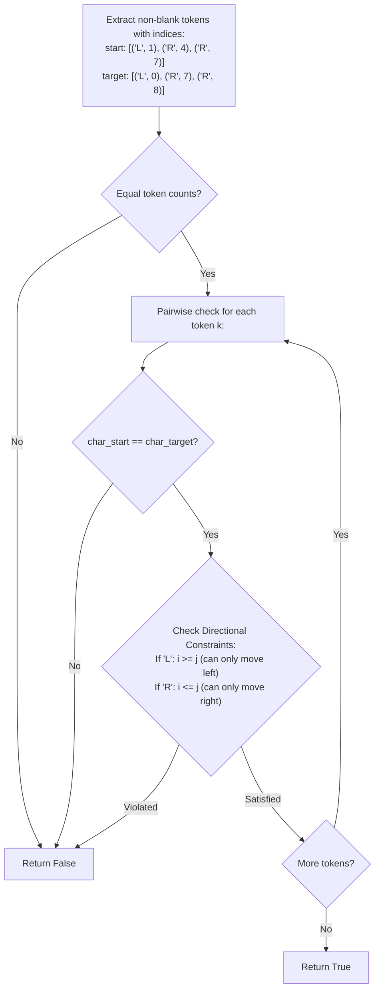

# Guided Example: Move Pieces to Obtain a String

## 1. Problem Overview & Representative Instance

We are given two strings, `start` and `target`, both of length $n$, consisting only of the characters `'L'`, `'R'`, and `'_'`:
- `'L'` represents a piece that can move to the left into an immediately adjacent blank space `'_'`.
- `'R'` represents a piece that can move to the right into an immediately adjacent blank space `'_'`.
- `'_'` represents an empty cell.
- Pieces cannot jump over one another; their relative ordering along the string is strictly preserved.

We must determine if `start` can be transformed into `target` using any number of valid moves. Return `true` if possible, and `false` otherwise.

Consider the representative instance:
- `start = "_L__R__R_"`
- `target = "L______RR"`

Both strings have length $9$.
In `start`:
- `'L'` is at index 1.
- First `'R'` is at index 4.
- Second `'R'` is at index 7.

In `target`:
- `'L'` is at index 0.
- First `'R'` is at index 7.
- Second `'R'` is at index 8.

The `'L'` at index 1 moves left to index 0. The first `'R'` at index 4 moves right to index 7, and the second `'R'` at index 7 moves right to index 8. None of the pieces collide or cross each other. Transformation is valid, returning `true`.

## 2. Mathematical & Algorithmic Principles

Because pieces cannot bypass each other, the string acts as a 1D corridor with strict collision dynamics.

### Invariant 1: Topological Sequence Preservation
Let $\operatorname{strip}(S)$ denote the subsequence of non-blank characters in $S$.
Because moves exchange a piece with an adjacent blank, no move can ever swap the relative order of two pieces. A necessary condition is:

$$\operatorname{strip}(start) = \operatorname{strip}(target)$$

If the sequence of `'L'` and `'R'` characters differs in identity or length, transformation is immediately impossible.

### Invariant 2: Directional Monotonicity Constraints
Suppose $\operatorname{strip}(start) = \operatorname{strip}(target) = \langle p_0, p_1, \dots, p_{m-1} \rangle$.
Let $i_k$ be the original index of piece $p_k$ in `start`, and $j_k$ be its target index in `target`.
- **Left Pieces ($p_k = \text{'L'}$):** A piece `'L'` can only decrement its coordinate ($i_k \to j_k$ with $j_k \le i_k$).
  $$\text{Condition: } i_k \ge j_k$$
  If $i_k < j_k$, the piece would have to move right, which is forbidden.
- **Right Pieces ($p_k = \text{'R'}$):** A piece `'R'` can only increment its coordinate ($i_k \to j_k$ with $j_k \ge i_k$).
  $$\text{Condition: } i_k \le j_k$$
  If $i_k > j_k$, the piece would have to move left, which is forbidden.

Because blank spaces permit arbitrary sliding as long as pieces do not cross, these two conditions are both necessary and sufficient.

| Piece Type | Valid Movement Direction | Mathematical Inequality Constraint | Violation Condition |
|---|---|---|---|
| `'L'` | Leftward only | $i \ge j$ (source $\ge$ target) | $i < j$ (requires moving right) |
| `'R'` | Rightward only | $i \le j$ (source $\le$ target) | $i > j$ (requires moving left) |
| `'_'` | Passive space | Displaced by moving pieces | - |

## 3. Step-by-Step Walkthrough with Intermediate State

We evaluate `start = "_L__R__R_"` and `target = "L______RR"`.

### Step 1: Extracting Non-Blank Pieces and Positions
- `start` pieces:
  - Token 0: character `'L'` at index $i_0 = 1$.
  - Token 1: character `'R'` at index $i_1 = 4$.
  - Token 2: character `'R'` at index $i_2 = 7$.
- `target` pieces:
  - Token 0: character `'L'` at index $j_0 = 0$.
  - Token 1: character `'R'` at index $j_1 = 7$.
  - Token 2: character `'R'` at index $j_2 = 8$.

### Step 2: Comparing Token Lengths and Sequences
- Length check: Both strings contain exactly 3 non-blank pieces ($3 = 3$).
- Character alignment:
  - Token 0: `'L'` vs `'L'` (Match).
  - Token 1: `'R'` vs `'R'` (Match).
  - Token 2: `'R'` vs `'R'` (Match).

### Step 3: Verifying Coordinate Inequalities
- **Token 0 (`'L'`):**
  - Source index $i_0 = 1$, target index $j_0 = 0$.
  - Required for `'L'`: $i_0 \ge j_0$.
  - Check: $1 \ge 0$ (Satisfied: moved left by 1 position).
- **Token 1 (`'R'`):**
  - Source index $i_1 = 4$, target index $j_1 = 7$.
  - Required for `'R'`: $i_1 \le j_1$.
  - Check: $4 \le 7$ (Satisfied: moved right by 3 positions).
- **Token 2 (`'R'`):**
  - Source index $i_2 = 7$, target index $j_2 = 8$.
  - Required for `'R'`: $i_2 \le j_2$.
  - Check: $7 \le 8$ (Satisfied: moved right by 1 position).

All invariants hold across all tokens. Result is `true`.

## 4. Comprehensive State Trace

The pointwise comparison between corresponding pieces in `start` and `target` is recorded below.

| Token Index $k$ | Character ($c$) | Start Position ($i_k$) | Target Position ($j_k$) | Net Displacement ($j_k - i_k$) | Feasibility Predicate | Check Outcome |
|---|---|---|---|---|---|---|
| 0 | `'L'` | 1 | 0 | $-1$ (Left) | $i_0 \ge j_0 \iff 1 \ge 0$ | Valid |
| 1 | `'R'` | 4 | 7 | $+3$ (Right) | $i_1 \le j_1 \iff 4 \le 7$ | Valid |
| 2 | `'R'` | 7 | 8 | $+1$ (Right) | $i_2 \le j_2 \iff 7 \le 8$ | Valid |

Verification on counter-example `start = "R_L_"`, `target = "__LR"`:

| Token Index $k$ | Start Token $(c, i)$ | Target Token $(d, j)$ | Character Equality | Coordinate Inequality | Result |
|---|---|---|---|---|---|
| 0 | $(\text{'R'}, 0)$ | $(\text{'L'}, 2)$ | $\text{'R'} \ne \text{'L'}$ | Mismatched characters | Infeasible (`false`) |

## 5. Algorithmic Correctness & Soundness

1. **Topological Order Invariance:**
   Because a move only allows a piece to step into an adjacent empty space, no piece can cross over another piece. The sequence of non-blank characters remains an invariant of the system.

2. **Sufficiency of Directional Inequalities:**
   Any configuration satisfying $\operatorname{strip}(start) = \operatorname{strip}(target)$ and the coordinate bounds $i \ge j$ (for L) and $i \le j$ (for R) can be reached by executing moves in topological order (e.g., shifting L pieces leftward from left to right, and shifting R pieces rightward from right to left) without ever creating deadlocks.

## 6. Edge Cases & Anti-Patterns

- **Different String Lengths:**
  - Guaranteed by problem definition to be equal ($n = |start| = |target|$).
- **Mismatched Piece Counts:**
  - If `start` has 2 pieces and `target` has 3, length check fails and returns `false`.
- **Opposing Movements:**
  - `start = "_R"`, `target = "R_"` requires R to move left ($i = 1, j = 0 \implies 1 \le 0$ fails).
  - `start = "L_"`, `target = "_L"` requires L to move right ($i = 0, j = 1 \implies 0 \ge 1$ fails).
- **Anti-Pattern (State Space Graph BFS):**
  - Exploring reachable configurations via BFS produces exponential states ($\sim \binom{n}{k}$). Two-pointer comparison checks the invariants directly in $\mathcal{O}(n)$ time.

## 7. Complexity Analysis

- **Time Complexity:** $\mathcal{O}(n)$, where $n$ is the length of strings `start` and `target`. Filtering non-blank indices and validating directional inequalities requires a single linear pass of length $n$.
- **Space Complexity:** $\mathcal{O}(n)$ to store the filtered index tuples, or $\mathcal{O}(1)$ auxiliary space if evaluated using two pointers moving through both strings concurrently.
