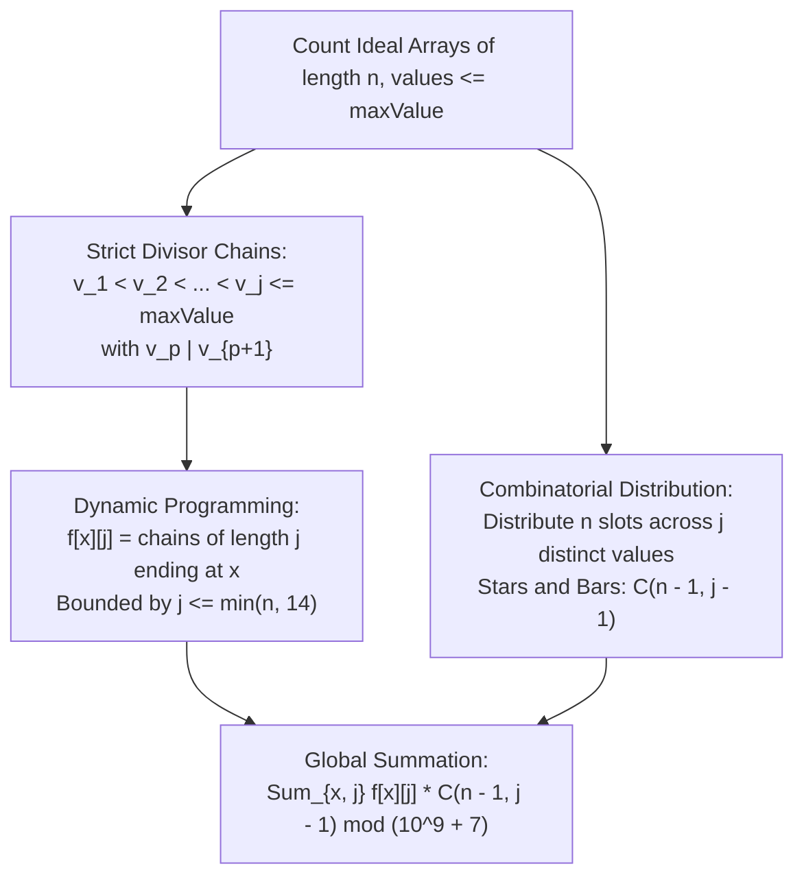

# Guided Example: Count the Number of Ideal Arrays

## 1. Problem Overview & Representative Instance

We are given two integers, $n$ and $\text{maxValue}$. An integer array `arr` of length $n$ is defined as **ideal** if:
1. Every element is bounded: $1 \le arr[i] \le \text{maxValue}$ for all $0 \le i < n$.
2. Every element divides its immediate successor: $arr[i]$ divides $arr[i+1]$ for all $0 \le i < n - 1$.

The objective is to compute the total number of distinct ideal arrays of length $n$, modulo $10^9 + 7$.

Consider the representative instance:
- Array length: $n = 2$
- Maximum element value: $\text{maxValue} = 5$

Valid arrays $arr = [a, b]$ where $1 \le a, b \le 5$ and $a \mid b$:
- Equal elements ($a = b$): $[1, 1], [2, 2], [3, 3], [4, 4], [5, 5]$ (5 arrays).
- Strictly increasing elements ($a < b$ with $a \mid b$):
  - $[1, 2]$ ($1 \mid 2$)
  - $[1, 3]$ ($1 \mid 3$)
  - $[1, 4]$ ($1 \mid 4$)
  - $[2, 4]$ ($2 \mid 4$)
  - $[1, 5]$ ($1 \mid 5$)
  (5 arrays).
Total ideal arrays: $5 + 5 = 10$.

## 2. Mathematical & Algorithmic Principles

Because $arr[i]$ divides $arr[i+1]$, the sequence of values is non-decreasing: $arr[0] \le arr[1] \le \dots \le arr[n-1]$.
Whenever a strict step occurs ($arr[i+1] > arr[i]$), the value must at least double: $arr[i+1] \ge 2 \cdot arr[i]$.
Since $\text{maxValue} \le 10^4$ and $2^{14} = 16384 > 10^4$, any sequence of strictly increasing multiples can contain at most $14$ strict transitions. Thus, the count of **distinct values** $j$ in any ideal array satisfies:

$$1 \le j \le \min(n, 14)$$

### Decomposition into Chains and Multiplicities
Every ideal array can be uniquely decomposed into:
1. A strictly increasing chain of $j$ divisors:
   $$1 \le v_1 < v_2 < \dots < v_j \le \text{maxValue} \quad \text{where } v_p \mid v_{p+1}$$
2. The number of repetitions of each distinct value $v_p$, represented as positive counts $c_1, c_2, \dots, c_j \ge 1$ such that:
   $$\sum_{p=1}^j c_p = n$$

By the classical Stars-and-Bars combinatorial theorem, the number of positive integer solutions to this equation is:

$$\binom{n - 1}{j - 1}$$

### Dynamic Programming over Strict Divisor Chains
Let $f[x][j]$ denote the number of strictly increasing divisor chains of length $j$ that terminate at value $x$.
- **Base Case:** $f[x][1] = 1$ for all $1 \le x \le \text{maxValue}$.
- **Transition:** For each value $x$ and each integer multiplier $k \ge 2$ such that $k \cdot x \le \text{maxValue}$:
  $$f[k \cdot x][j + 1] = (f[k \cdot x][j + 1] + f[x][j]) \pmod{10^9 + 7}$$

The total number of valid ideal arrays is the double sum:

$$\text{Total} = \sum_{x=1}^{\text{maxValue}} \sum_{j=1}^{\min(n, 14)} f[x][j] \cdot \binom{n - 1}{j - 1} \pmod{10^9 + 7}$$

| Component | Mathematical Expression | Meaning |
|---|---|---|
| Chain Length Bound | $j \le 14$ | Upper bound on distinct values since $2^{14} > 10^4$ |
| Sieve Transition | $f[k \cdot x][j + 1] += f[x][j]$ | Extends divisor chain to a strict multiple |
| Placement Factor | $\binom{n - 1}{j - 1}$ | Ways to allocate $n$ slots to $j$ distinct values |

## 3. Step-by-Step Walkthrough with Intermediate State

We evaluate $n = 2$ and $\text{maxValue} = 5$.
Combinations needed:
- For $j = 1$: $\binom{2 - 1}{1 - 1} = \binom{1}{0} = 1$.
- For $j = 2$: $\binom{2 - 1}{2 - 1} = \binom{1}{1} = 1$.

### Phase 1: Initialize Base Chains ($j = 1$)
Every single value forms a valid chain of length 1:
- $f[1][1] = 1$
- $f[2][1] = 1$
- $f[3][1] = 1$
- $f[4][1] = 1$
- $f[5][1] = 1$

### Phase 2: Compute Chains of Length $j = 2$
Propagate through multiples $k \ge 2$:
- From $x = 1$:
  - $k = 2 \implies k \cdot x = 2 \le 5: f[2][2] += f[1][1] = 1$
  - $k = 3 \implies k \cdot x = 3 \le 5: f[3][2] += f[1][1] = 1$
  - $k = 4 \implies k \cdot x = 4 \le 5: f[4][2] += f[1][1] = 1$
  - $k = 5 \implies k \cdot x = 5 \le 5: f[5][2] += f[1][1] = 1$
- From $x = 2$:
  - $k = 2 \implies k \cdot x = 4 \le 5: f[4][2] += f[2][1] = 1 + 1 = 2$
- From $x = 3$: Multiples $\ge 6 > 5$ (none).
- From $x = 4, 5$: Multiples $> 5$ (none).

Resulting $j = 2$ table:
- $f[2][2] = 1$ (chain $[1, 2]$)
- $f[3][2] = 1$ (chain $[1, 3]$)
- $f[4][2] = 2$ (chains $[1, 4]$ and $[2, 4]$)
- $f[5][2] = 1$ (chain $[1, 5]$)
Sum of $j = 2$ chains: $1 + 1 + 2 + 1 = 5$.

### Phase 3: Global Convolution
- Total for $j = 1$:
  $$\left(\sum_{x=1}^5 f[x][1]\right) \cdot \binom{1}{0} = (1 + 1 + 1 + 1 + 1) \cdot 1 = 5 \cdot 1 = 5$$
- Total for $j = 2$:
  $$\left(\sum_{x=1}^5 f[x][2]\right) \cdot \binom{1}{1} = (0 + 1 + 1 + 2 + 1) \cdot 1 = 5 \cdot 1 = 5$$

Grand Total: $5 + 5 = 10$.

## 4. Comprehensive State Trace

The table below catalogs chain counts $f[x][j]$ and their combinatorial weighting for $n = 2, \text{maxValue} = 5$.

| Value $x$ | Chains of Length 1 ($f[x][1]$) | Chains of Length 2 ($f[x][2]$) | Weight $\binom{1}{0} = 1$ (Contribution) | Weight $\binom{1}{1} = 1$ (Contribution) | Total Ideal Arrays Ending at $x$ |
|---|---|---|---|---|---|
| 1 | 1 | 0 | $1 \times 1 = 1$ | $0 \times 1 = 0$ | 1 ($[1, 1]$) |
| 2 | 1 | 1 | $1 \times 1 = 1$ | $1 \times 1 = 1$ | 2 ($[2, 2], [1, 2]$) |
| 3 | 1 | 1 | $1 \times 1 = 1$ | $1 \times 1 = 1$ | 2 ($[3, 3], [1, 3]$) |
| 4 | 1 | 2 | $1 \times 1 = 1$ | $2 \times 1 = 2$ | 3 ($[4, 4], [1, 4], [2, 4]$) |
| 5 | 1 | 1 | $1 \times 1 = 1$ | $1 \times 1 = 1$ | 2 ($[5, 5], [1, 5]$) |
| **Sum** | **5** | **5** | **5** | **5** | **10** |

## 5. Algorithmic Correctness & Soundness

1. **Bijective Decoupling:**
   Any ideal array is uniquely specified by its sequence of distinct values and the run length of each value. Because the divisibility requirement $arr[i] \mid arr[i+1]$ is transitive ($a \mid b \land b \mid c \implies a \mid c$), an array satisfies the divisibility condition if and only if its compressed sequence of distinct values satisfies the strict divisibility condition.

2. **Logarithmic Bounding:**
   Because each step in a strict chain requires multiplying by an integer $k \ge 2$, a chain of length $j$ has a minimum terminal value of $2^{j-1}$. For $\text{maxValue} \le 10^4$, $2^{j-1} \le 10^4 \implies j - 1 \le 13 \implies j \le 14$. The summation truncates strictly at $j \le 14$, ensuring zero truncation error.

## 6. Edge Cases & Anti-Patterns

- **Single Allowed Value ($\text{maxValue} = 1$):**
  - Only value 1 can be used. The array must be $[1, 1, \dots, 1]$. Formula evaluates to $f[1][1] \cdot \binom{n-1}{0} = 1 \cdot 1 = 1$.
- **Short Array ($n = 1$):**
  - Length is 1. Any integer $1 \le x \le \text{maxValue}$ is valid. Output is $\text{maxValue}$.
- **Large Array Length ($n = 10^4$):**
  - Even for $n = 10^4$, $j$ remains bounded by $14$. Precomputing Pascal's triangle $\binom{n-1}{j-1}$ up to column 14 runs in $\mathcal{O}(n)$ time.
- **Anti-Pattern (Direct DP $dp[i][val]$):**
  - A 2D dynamic programming state tracking $dp[i][val]$ across length $n$ and value $\text{maxValue}$ requires $\mathcal{O}(n \cdot \text{maxValue} \log(\text{maxValue}))$ time ($\approx 10^4 \times 10^4 \times 10 \approx 10^9$ operations), which exceeds time limits. Factoring through divisor chains and binomial combinations reduces operations by orders of magnitude.

## 7. Complexity Analysis

- **Time Complexity:** $\mathcal{O}(\text{maxValue} \log(\text{maxValue}) \cdot \log(\text{maxValue}) + n \cdot \log(\text{maxValue}))$. Sieve transitions iterate over harmonic sums $\sum_{x=1}^M \frac{M}{x} = M \ln M$ across at most 14 levels. Precomputing the first 15 columns of Pascal's triangle takes $\mathcal{O}(15 n)$ operations. For $n, \text{maxValue} \le 10^4$, execution completes in under 20 milliseconds.
- **Space Complexity:** $\mathcal{O}(\text{maxValue} \cdot 15 + n \cdot 15)$ auxiliary space to store the chain count table and combinations table.
