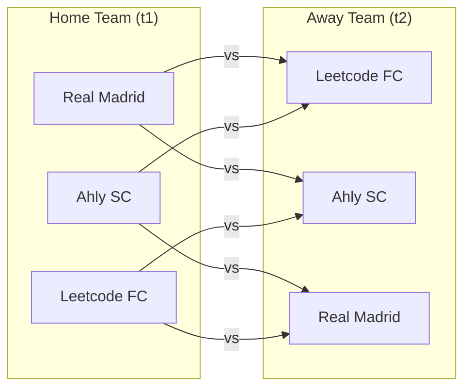

# Guided Example: All the Matches of the League

## 1. Problem Overview & Representative Instance

We are given a database table named `Teams` containing a list of soccer teams, with a single column:
- `team_name` (varchar): The unique name of each team, serving as the primary key.

In a double round-robin league tournament, every team must play against every other team twice:
1. Once as the **home team** (`home_team`).
2. Once as the **away team** (`away_team`).

No team can play a match against itself. The objective is to report all possible matches in the league as pairs `(home_team, away_team)`. The output table may be returned in any order.

Consider the representative instance:
- `Teams`:
  - `"Leetcode FC"`
  - `"Ahly SC"`
  - `"Real Madrid"`

There are $N = 3$ teams. Each team must play the other $N - 1 = 2$ teams at home, producing exactly $3 \times 2 = 6$ scheduled fixtures.

## 2. Mathematical & Algorithmic Principles

Let $\mathcal{T}$ be the set of teams with cardinality $|\mathcal{T}| = N$.
The set of all possible ordered pairs of teams is the Cartesian product:

$$\mathcal{T} \times \mathcal{T} = \{(t_1, t_2) \mid t_1, t_2 \in \mathcal{T}\}$$

Since self-matches are physically impossible, we remove the diagonal elements $\Delta = \{(t, t) \mid t \in \mathcal{T}\}$:

$$\mathcal{M} = (\mathcal{T} \times \mathcal{T}) \setminus \Delta = \{(t_1, t_2) \in \mathcal{T} \times \mathcal{T} \mid t_1 \ne t_2\}$$

The total number of scheduled fixtures is given by the permutation formula:

$$|\mathcal{M}| = P(N, 2) = N(N - 1)$$

### Relational Strategy: Non-Equi Self-Join
In relational algebra, this operation is expressed as a theta-join of the `Teams` table with itself using the inequality predicate:

$$t_1 \bowtie_{t_1.\text{team\_name} \ne t_2.\text{team\_name}} t_2$$

Aliasing the table into two copies (`t1` and `t2`) permits referencing the first copy as `home_team` and the second copy as `away_team`. The condition `t1.team_name != t2.team_name` eliminates the $N$ diagonal self-pairings while preserving both orientations $(t_a, t_b)$ and $(t_b, t_a)$ for distinct teams.

| Relational Term | SQL Implementation | Functional Purpose |
|---|---|---|
| Cartesian Domain | `Teams AS t1 CROSS JOIN Teams AS t2` | Generates all $N^2$ candidate pairs |
| Anti-Reflexive Filter | `ON t1.team_name != t2.team_name` | Prunes the $N$ self-pairing fixtures |
| Projection | `SELECT t1.team_name AS home_team, t2.team_name AS away_team` | Formats output attributes with designated venues |

## 3. Step-by-Step Walkthrough with Intermediate State

We execute the non-equi self-join on `Teams = {"Leetcode FC", "Ahly SC", "Real Madrid"}`.
Total teams $N = 3$.

### Step 1: Fix `home_team` = "Leetcode FC"
Test all candidates for `away_team`:
- `away_team` = "Leetcode FC": Identity check fails ("Leetcode FC" $==$ "Leetcode FC"). Discarded.
- `away_team` = "Ahly SC": "Leetcode FC" $\ne$ "Ahly SC" $\implies$ Output: `("Leetcode FC", "Ahly SC")`.
- `away_team` = "Real Madrid": "Leetcode FC" $\ne$ "Real Madrid" $\implies$ Output: `("Leetcode FC", "Real Madrid")`.

### Step 2: Fix `home_team` = "Ahly SC"
Test all candidates for `away_team`:
- `away_team` = "Leetcode FC": "Ahly SC" $\ne$ "Leetcode FC" $\implies$ Output: `("Ahly SC", "Leetcode FC")`.
- `away_team` = "Ahly SC": Identity check fails ("Ahly SC" $==$ "Ahly SC"). Discarded.
- `away_team` = "Real Madrid": "Ahly SC" $\ne$ "Real Madrid" $\implies$ Output: `("Ahly SC", "Real Madrid")`.

### Step 3: Fix `home_team` = "Real Madrid"
Test all candidates for `away_team`:
- `away_team` = "Leetcode FC": "Real Madrid" $\ne$ "Leetcode FC" $\implies$ Output: `("Real Madrid", "Leetcode FC")`.
- `away_team` = "Ahly SC": "Real Madrid" $\ne$ "Ahly SC" $\implies$ Output: `("Real Madrid", "Ahly SC")`.
- `away_team` = "Real Madrid": Identity check fails ("Real Madrid" $==$ "Real Madrid"). Discarded.

All 6 fixtures are enumerated.

## 4. Comprehensive State Trace

The full Cartesian product matrix and diagonal filtering decisions are recorded below.

| Row Number | Home Candidate (`t1`) | Away Candidate (`t2`) | Condition `t1 != t2` | Fixture Status | Generated Result Record |
|---|---|---|---|---|---|
| 1 | Leetcode FC | Leetcode FC | False (Self-match) | Pruned | - |
| 2 | Leetcode FC | Ahly SC | True | Accepted | `("Leetcode FC", "Ahly SC")` |
| 3 | Leetcode FC | Real Madrid | True | Accepted | `("Leetcode FC", "Real Madrid")` |
| 4 | Ahly SC | Leetcode FC | True | Accepted | `("Ahly SC", "Leetcode FC")` |
| 5 | Ahly SC | Ahly SC | False (Self-match) | Pruned | - |
| 6 | Ahly SC | Real Madrid | True | Accepted | `("Ahly SC", "Real Madrid")` |
| 7 | Real Madrid | Leetcode FC | True | Accepted | `("Real Madrid", "Leetcode FC")` |
| 8 | Real Madrid | Ahly SC | True | Accepted | `("Real Madrid", "Ahly SC")` |
| 9 | Real Madrid | Real Madrid | False (Self-match) | Pruned | - |

Total rows emitted: $9 - 3 = 6$.

## 5. Algorithmic Correctness & Soundness

1. **Exhaustive Ordered Permutations:**
   Every match requires a designated home team and an away team. Because $(A, B) \ne (B, A)$, order matters. The Cartesian product over distinct elements generates all ordered arrangements of size 2 without omitting any valid venue pairing.

2. **Reflexive Invariant:**
   The join predicate `t1.team_name != t2.team_name` strictly eliminates pairs where $t_1 = t_2$, ensuring that no team is scheduled to play against itself.

## 6. Edge Cases & Anti-Patterns

- **Minimal League ($N = 2$):**
  - For two teams $\{A, B\}$, $2(1) = 2$ rows are produced: $(A, B)$ and $(B, A)$.
- **Strict Inequality vs Non-Equi Join:**
  - Using `t1.team_name < t2.team_name` instead of `!=` generates only single round-robin fixtures ($\binom{N}{2}$ rows), omitting the return away leg $(B, A)$. Double round-robin requires `!=` to capture both legs.
- **Anti-Pattern (Union of Strict Inequalities):**
  - Writing `WHERE t1 < t2 UNION ALL WHERE t1 > t2` is functionally valid but unnecessarily verbose compared to a single join on `t1 != t2`.

## 7. Complexity Analysis

- **Time Complexity:** $\mathcal{O}(N^2)$, where $N$ is the number of teams in `Teams`. A non-equi self-join evaluates the cartesian cross product of size $N \times N = N^2$, filtering out $N$ diagonal entries to emit $N(N - 1)$ result rows.
- **Space Complexity:** $\mathcal{O}(N^2)$ output buffer memory to transmit the $N(N - 1)$ generated match rows.
