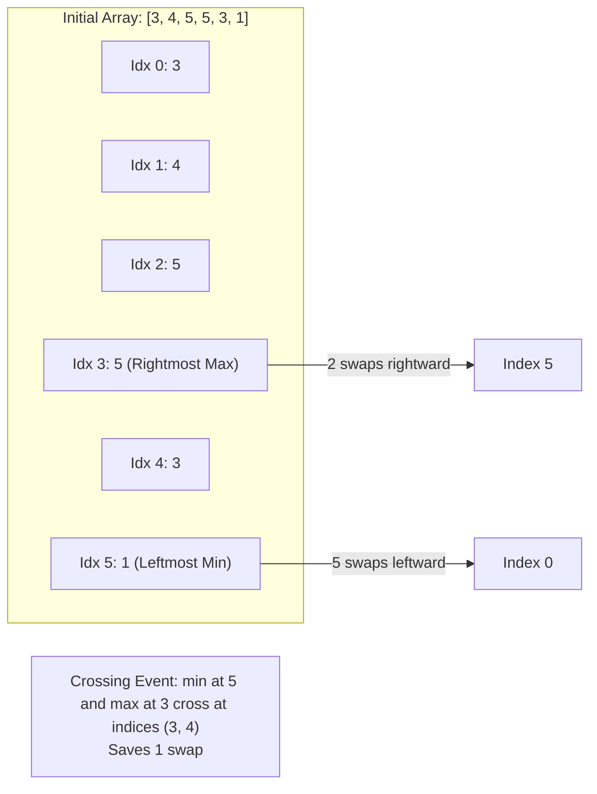

# Guided Example: Minimum Adjacent Swaps to Make a Valid Array

## 1. Problem Overview & Representative Instance

We are given a 0-indexed integer array `nums` of length $n$. An array is defined as **valid** if:
1. At least one minimum element of the array resides at the leftmost index ($0$).
2. At least one maximum element of the array resides at the rightmost index ($n - 1$).

In a single operation, we can swap any two adjacent elements $nums[k]$ and $nums[k+1]$. The objective is to determine the minimum number of adjacent swaps required to make the array valid.

Consider the representative instance:
- `nums = [3, 4, 5, 5, 3, 1]`
- Array length: $n = 6$

Elements and key extremes:
- Global minimum value: $1$, located at index $5$.
- Global maximum value: $5$, located at indices $2$ and $3$.

To minimize moves:
- Choose the leftmost minimum element at index $i = 5$ to move to index $0$.
- Choose the rightmost maximum element at index $j = 3$ to move to index $5$.

Because the minimum element starts to the right of the maximum element ($i = 5 > j = 3$), as the minimum shifts leftward and the maximum shifts rightward, they will cross each other in a single shared adjacent swap, reducing the total required operations by $1$.
Total swaps: $5 + (6 - 1 - 3) - 1 = 5 + 2 - 1 = 6$.

## 2. Mathematical & Algorithmic Principles

Moving an element from index $p$ to index $q$ solely via adjacent swaps requires $|p - q|$ operations:
- Moving an element at index $i$ to index $0$ takes $i$ adjacent swaps.
- Moving an element at index $j$ to index $n - 1$ takes $(n - 1 - j)$ adjacent swaps.

### Selection Strategy for Duplicate Extremes
To minimize distance:
1. **Leftmost Minimum ($i^*$):** If multiple elements tie for the global minimum, choosing the one with the smallest index minimizes the leftward journey:
   $$i^* = \min \{k \mid nums[k] = \min(nums)\}$$
2. **Rightmost Maximum ($j^*$):** If multiple elements tie for the global maximum, choosing the one with the largest index minimizes the rightward journey:
   $$j^* = \max \{k \mid nums[k] = \max(nums)\}$$

### Path Intersection and Crossing Correction
- **No Crossing ($i^* \le j^*$):**
  The minimum is already to the left of the maximum. The minimum shifts leftward to $0$ and the maximum shifts rightward to $n - 1$ without interfering with each other:
  $$\text{Swaps} = i^* + (n - 1 - j^*)$$
- **Crossing Case ($i^* > j^*$):**
  The minimum is positioned to the right of the maximum. When shifting the minimum leftward, it must swap positions with the maximum. That single mutual swap advances the minimum 1 step closer to index $0$ AND advances the maximum 1 step closer to index $n - 1$ simultaneously. Hence, exactly 1 swap is shared:
  $$\text{Swaps} = i^* + (n - 1 - j^*) - 1$$

Combining both cases into a unified formula:

$$\text{Swaps} = i^* + (n - 1 - j^*) - \mathbb{I}(i^* > j^*)$$

where $\mathbb{I}$ is the indicator function evaluating to 1 if $i^* > j^*$, and 0 otherwise. (If all elements are identical, $i^* = j^* = 0$, giving 0 swaps).

| Structural Case | Geometric Relative Position | Mutual Interaction | Swaps Formula |
|---|---|---|---|
| Disjoint Paths | $i^* \le j^*$ (Min left of Max) | Moving apart, paths do not intersect | $i^* + n - 1 - j^*$ |
| Crossing Paths | $i^* > j^*$ (Min right of Max) | Move toward each other, swap mutually once | $i^* + n - 1 - j^* - 1$ |

## 3. Step-by-Step Walkthrough with Intermediate State

We evaluate `nums = [3, 4, 5, 5, 3, 1]` with $n = 6$.

### Step 1: Linear Scan to Locate Extremes
Iterate through the array tracking the leftmost minimum and rightmost maximum:
- Index 0 ($3$): Initial minimum at 0, initial maximum at 0.
- Index 1 ($4$): $4 > 3 \implies$ update maximum to index 1.
- Index 2 ($5$): $5 > 4 \implies$ update maximum to index 2.
- Index 3 ($5$): $5 \ge 5 \implies$ update rightmost maximum to index 3.
- Index 4 ($3$): No update.
- Index 5 ($1$): $1 < 3 \implies$ update leftmost minimum to index 5.

Identified optimal coordinates:
- Leftmost minimum: $i^* = 5$ (value 1)
- Rightmost maximum: $j^* = 3$ (value 5)

### Step 2: Distance Calculations
- Distance to move minimum from index 5 to 0:
  $$d_{\text{min}} = i^* = 5$$
- Distance to move maximum from index 3 to 5:
  $$d_{\text{max}} = n - 1 - j^* = 6 - 1 - 3 = 2$$

### Step 3: Crossing Adjustment
- Compare relative positions: $i^* = 5$ and $j^* = 3$.
- Because $5 > 3$, the minimum lies to the right of the maximum.
- As the minimum shifts left, it crosses the maximum at the boundary between index 3 and 4.
- Deduction applied: $-1$.

### Step 4: Total Swap Count
$$\text{Total Swaps} = 5 + 2 - 1 = 6$$

## 4. Comprehensive State Trace

The state of the array through an explicit execution of the 6 optimal adjacent swaps is tabulated below.

| Step | Swap Operation | Array Configuration | Distance of Min to Idx 0 | Distance of Max to Idx 5 | Crossing Status |
|---|---|---|---|---|---|
| 0 | Initial state | `[3, 4, 5, 5, 3, 1]` | 5 | 2 | Not yet crossed |
| 1 | Swap `nums[4]` and `nums[5]` | `[3, 4, 5, 5, 1, 3]` | 4 | 2 | Approaching |
| 2 | Swap `nums[3]` and `nums[4]` | `[3, 4, 5, 1, 5, 3]` | 3 | 1 | **Mutual Swap** (Max at 3 and Min at 4 cross) |
| 3 | Swap `nums[2]` and `nums[3]` | `[3, 4, 1, 5, 5, 3]` | 2 | 1 | Separating |
| 4 | Swap `nums[1]` and `nums[2]` | `[3, 1, 4, 5, 5, 3]` | 1 | 1 | Separating |
| 5 | Swap `nums[0]` and `nums[1]` | `[1, 3, 4, 5, 5, 3]` | 0 (Reached!) | 1 | Min at index 0 |
| 6 | Swap `nums[4]` and `nums[5]` | `[1, 3, 4, 5, 3, 5]` | 0 | 0 (Reached!) | Max at index 5 |

Array is valid in exactly 6 swaps.

## 5. Algorithmic Correctness & Soundness

1. **Independent Sub-goal Decomposition:**
   A valid array requires the minimum at index 0 and the maximum at index $n - 1$. No constraint specifies the ordering of intermediate elements. By focusing exclusively on transporting the chosen minimum and maximum to their target endpoints, extraneous swaps are avoided.

2. **Single Crossing Invariant:**
   If $i^* > j^*$, shifting the minimum left to 0 and maximum right to $n - 1$ causes their index trajectories to cross at exactly one adjacent transposition. That mutual swap reduces the remaining distance to 0 for the minimum and the remaining distance to $n - 1$ for the maximum in the same single move, proving the $-1$ deduction is exact.

## 6. Edge Cases & Anti-Patterns

- **Array Already Valid (`nums = [1, 4, 2, 9]`):**
  - $i^* = 0, j^* = 3$. Total swaps: $0 + (4 - 1 - 3) = 0$.
- **All Elements Equal (`nums = [7, 7, 7, 7]`):**
  - Any element is both minimum and maximum. Leftmost min is at 0, rightmost max can be chosen at $n - 1$, returning 0.
- **Single Element (`nums = [9]`):**
  - $n = 1 \implies i^* = 0, j^* = 0$. Swaps: $0 + 0 - 0 = 0$.
- **Anti-Pattern (Simulating Array Swaps Step-by-Step):**
  - Physically modifying an array across simulation loops incurs unnecessary overhead. The arithmetic closed form computes the exact minimal swap count directly from the extreme indices in $\mathcal{O}(1)$ operations.

## 7. Complexity Analysis

- **Time Complexity:** $\mathcal{O}(n)$, where $n$ is the length of `nums`. A single linear pass finds the leftmost index of the minimum element and the rightmost index of the maximum element. The final formula evaluates in $\mathcal{O}(1)$ time.
- **Space Complexity:** $\mathcal{O}(1)$ auxiliary space. Only integer index variables and element comparators are stored.
