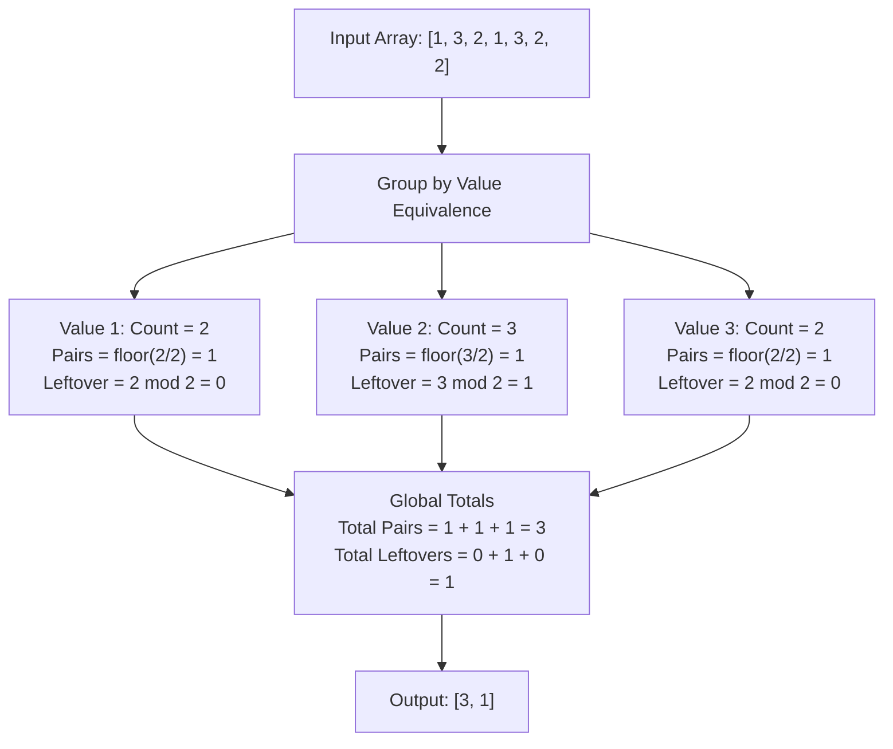

# Guided Example: Maximum Number of Pairs in Array

## 1. Problem Overview & Representative Instance

We are given a 0-indexed integer array `nums`. In a single operation, we select two equal integers from `nums` and remove them from the array. This pairing operation is repeated as many times as possible until no two identical elements remain. The objective is to return an integer array of length $2$:
1. The first entry is the total count of pairs formed.
2. The second entry is the number of leftover integers that cannot be paired.

Consider the representative instance:
- `nums = [1, 3, 2, 1, 3, 2, 2]`
- Total elements: $n = 7$

By inspecting the distinct values present in `nums`:
- Value $1$ occurs $2$ times.
- Value $2$ occurs $3$ times.
- Value $3$ occurs $2$ times.

Pairing proceeds by taking two identical elements at a time:
- The two copies of $1$ form $1$ pair with $0$ leftover.
- The three copies of $2$ form $1$ pair with $1$ leftover.
- The two copies of $3$ form $1$ pair with $0$ leftover.

Summing these independent results yields $1 + 1 + 1 = 3$ pairs formed, leaving $0 + 1 + 0 = 1$ leftover integer. The final output is `[3, 1]`.

## 2. Mathematical & Algorithmic Principles

The operation requires both members of a pair to have identical numeric values. Consequently, elements with different values can never interact, pair, or interfere with each other. The input array is partitioned into mutually disjoint equivalence classes according to value equality:

$$V = \{v \in \mathbb{Z} \mid \exists i \text{ with } nums[i] = v\}$$

For each distinct value $v \in V$, let $C(v)$ denote the total multiplicity of $v$ in `nums`:

$$C(v) = \sum_{i=0}^{n-1} \mathbb{I}(nums[i] = v)$$

### Integer Division and Remainder Decompositions

Every multiplicity $C(v)$ can be uniquely decomposed via Euclidean division by $2$:

$$C(v) = 2 \cdot P(v) + R(v)$$

where:
- $P(v) = \lfloor \frac{C(v)}{2} \rfloor$ is the maximum number of disjoint pairs that can be constructed from elements with value $v$.
- $R(v) = C(v) \bmod 2 \in \{0, 1\}$ is the count of leftover elements for value $v$.

Because equivalence classes are orthogonal, the global number of pairs formed is the sum of pairs across all distinct values:

$$\text{Pairs} = \sum_{v \in V} P(v) = \sum_{v \in V} \left\lfloor \frac{C(v)}{2} \right\rfloor$$

Similarly, the total count of leftover elements is:

$$\text{Leftovers} = \sum_{v \in V} R(v) = \sum_{v \in V} (C(v) \bmod 2)$$

Alternatively, notice that each formed pair removes exactly $2$ elements from the array. Hence, the total number of leftover elements satisfies the conservation equation:

$$\text{Leftovers} = n - 2 \cdot \text{Pairs}$$

| Multiplicity Parity | Arithmetic Relation | Contribution to Pairs $P(v)$ | Contribution to Leftovers $R(v)$ |
|---|---|---|---|
| Even ($C(v) = 2k$) | $2k = 2 \cdot k + 0$ | $k$ pairs | $0$ leftover elements |
| Odd ($C(v) = 2k + 1$) | $2k + 1 = 2 \cdot k + 1$ | $k$ pairs | $1$ leftover element |

## 3. Step-by-Step Walkthrough with Intermediate State

Let us trace the execution on `nums = [1, 3, 2, 1, 3, 2, 2]` with $n = 7$.

### Phase 1: Frequency Histogram Construction
We scan through `nums` from left to right, accumulating counts in a frequency map:
- Index 0, value 1: count of 1 becomes 1.
- Index 1, value 3: count of 3 becomes 1.
- Index 2, value 2: count of 2 becomes 1.
- Index 3, value 1: count of 1 becomes 2.
- Index 4, value 3: count of 3 becomes 2.
- Index 5, value 2: count of 2 becomes 2.
- Index 6, value 2: count of 2 becomes 3.

The resulting frequency histogram is:
- $C(1) = 2$
- $C(2) = 3$
- $C(3) = 2$

### Phase 2: Quotient and Remainder Aggregation
Now iterate across each distinct key in the histogram:
- **For value 1:**
  - Pairs contribution: $\lfloor 2 / 2 \rfloor = 1$.
  - Leftover contribution: $2 \bmod 2 = 0$.
  - Cumulative pairs: $1$. Cumulative leftovers: $0$.
- **For value 2:**
  - Pairs contribution: $\lfloor 3 / 2 \rfloor = 1$.
  - Leftover contribution: $3 \bmod 2 = 1$.
  - Cumulative pairs: $1 + 1 = 2$. Cumulative leftovers: $0 + 1 = 1$.
- **For value 3:**
  - Pairs contribution: $\lfloor 2 / 2 \rfloor = 1$.
  - Leftover contribution: $2 \bmod 2 = 0$.
  - Cumulative pairs: $2 + 1 = 3$. Cumulative leftovers: $1 + 0 = 1$.

### Phase 3: Final Verification
Total elements processed: $2 \times 3 + 1 = 7 = n$.
Final array constructed: `[3, 1]`.

## 4. Comprehensive State Trace

The following table summarizes the evaluation of each distinct frequency bucket.

| Value $v$ | Multiplicity $C(v)$ | Floor Division $\lfloor C(v)/2 \rfloor$ | Modulo $C(v) \bmod 2$ | Cumulative Pairs | Cumulative Leftovers | Conservation Check $2 \cdot P + R$ |
|---|---|---|---|---|---|---|
| $1$ | $2$ | $1$ | $0$ | $1$ | $0$ | $2 \cdot 1 + 0 = 2$ |
| $2$ | $3$ | $1$ | $1$ | $2$ | $1$ | $2 \cdot 1 + 1 = 3$ |
| $3$ | $2$ | $1$ | $0$ | $3$ | $1$ | $2 \cdot 1 + 0 = 2$ |

Summing the respective columns gives Total Pairs $= 3$ and Total Leftovers $= 1$.

## 5. Algorithmic Correctness & Soundness

1. **Orthogonality of Equivalence Classes:**
   Because a pairing operation requires two elements with the same value, pairing an element of value $u$ with another element of value $u$ never consumes or modifies an element of value $w \ne u$. The global maximum pairing problem factors into independent subproblems across distinct keys.

2. **Optimality of Greedy Quotient Pairing:**
   Within any single class of multiplicity $C(v)$, the maximum number of disjoint subsets of size $2$ is strictly bounded from above by $\lfloor C(v) / 2 \rfloor$. Since we can pair element $(2k-1)$ with element $2k$ for all $k \in \{1, \dots, \lfloor C(v) / 2 \rfloor\}$, this upper bound is always achieved.

3. **Invariance of Leftover Count:**
   Every single element either belongs to a formed pair or remains unpaired. Since $2 \cdot P(v) + R(v) = C(v)$, the sum $\sum R(v)$ is invariant under any choice of pairing within classes.

## 6. Edge Cases & Anti-Patterns

- **All Elements Distinct (`nums = [1, 2, 3, 4, 5]`):**
  - Every frequency is $1$.
  - Pairs $= 0$, Leftovers $= n = 5$.
- **All Elements Equal and Even (`nums = [4, 4, 4, 4]`):**
  - Single key with frequency $4$.
  - Pairs $= \lfloor 4 / 2 \rfloor = 2$, Leftovers $= 4 \bmod 2 = 0$.
- **All Elements Equal and Odd (`nums = [7, 7, 7]`):**
  - Single key with frequency $3$.
  - Pairs $= \lfloor 3 / 2 \rfloor = 1$, Leftovers $= 3 \bmod 2 = 1$.
- **Single Element (`nums = [0]`):**
  - Frequency is $1$.
  - Pairs $= 0$, Leftovers $= 1$. Output is `[0, 1]`.
- **Anti-Pattern (Physical Simulation via Array Deletion):**
  - Repeatedly searching for matching pairs and performing in-place deletion leads to $\mathcal{O}(n^2)$ time. Counting frequencies achieves $\mathcal{O}(n)$ time in a single linear pass.

## 7. Complexity Analysis

- **Time Complexity:** $\mathcal{O}(n)$, where $n$ is the length of `nums`. Populating the frequency counts requires a single pass of $n$ elements. Aggregating quotients and remainders scans over $|V| \le n$ distinct elements. Thus, overall time is linear $\mathcal{O}(n)$.
- **Space Complexity:** $\mathcal{O}(u)$, where $u = |V|$ is the number of distinct values in `nums`. Since values are bounded by $0 \le nums[i] \le 100$, space is bounded by $\mathcal{O}(\min(n, 101))$, which is strictly $\mathcal{O}(1)$ auxiliary space when using a fixed-size array or hash table.
