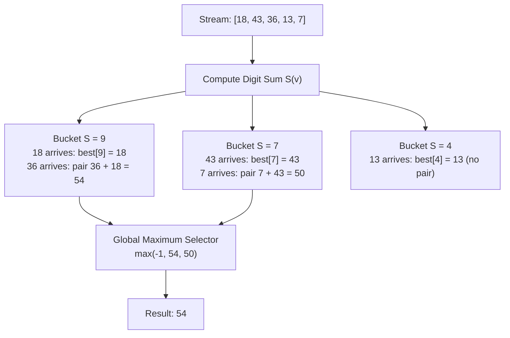

# Guided Example: Max Sum of a Pair With Equal Sum of Digits

## 1. Problem Overview & Representative Instance

We are given a 0-indexed array `nums` of positive integers. We seek to choose two distinct indices $i$ and $j$ ($i \ne j$) such that the sum of the digits of $nums[i]$ is equal to the sum of the digits of $nums[j]$. Among all such valid index pairs, we wish to maximize the arithmetic sum $nums[i] + nums[j]$. If no pair of numbers shares the same sum of digits, we return $-1$.

Consider the representative instance:
- `nums = [18, 43, 36, 13, 7]`
- Array length: $n = 5$

Let us compute the base-10 digit sum $S(x)$ for each element:
- $S(18) = 1 + 8 = 9$
- $S(43) = 4 + 3 = 7$
- $S(36) = 3 + 6 = 9$
- $S(13) = 1 + 3 = 4$
- $S(7) = 7$

Grouping elements by their digit sums:
- Group $S = 9$: elements $\{18, 36\}$, with pairwise sum $18 + 36 = 54$.
- Group $S = 7$: elements $\{43, 7\}$, with pairwise sum $43 + 7 = 50$.
- Group $S = 4$: singleton $\{13\}$, cannot form a pair.

Comparing valid pair sums: $\max(54, 50) = 54$. The optimal answer is $54$.

## 2. Mathematical & Algorithmic Principles

Let $S(v)$ denote the digit sum function defined on $\mathbb{N}$:

$$S(v) = \sum_{k=0}^{\lfloor \log_{10} v \rfloor} \left( \left\lfloor \frac{v}{10^k} \right\rfloor \bmod 10 \right)$$

The condition for pairing indices $i$ and $j$ is the equivalence relation:

$$i \sim j \iff S(nums[i]) = S(nums[j])$$

This partitions the index set into disjoint equivalence classes $\{E_s\}_{s \ge 1}$, where:

$$E_s = \{k \in \{0, \dots, n-1\} \mid S(nums[k]) = s\}$$

### Extremal Sum Property Within a Class
For any class $E_s$ with $|E_s| \ge 2$, the maximum pairwise sum is achieved strictly by the two largest elements in that class:

$$\max_{i, j \in E_s, i \ne j} (nums[i] + nums[j]) = m_1(s) + m_2(s)$$

where $m_1(s)$ and $m_2(s)$ are the first and second order statistics of the multiset $\{nums[k] \mid k \in E_s\}$.

### Online Single-Pass Maintenance
Instead of collecting all elements per bucket and sorting, we can maintain the maximum element observed so far for each digit sum class. As we inspect an element $v = nums[k]$ with digit sum $s = S(v)$:
1. If a prior element exists in class $s$ with value $M(s)$, then $(v, M(s))$ forms a valid pair with sum $v + M(s)$. We update our running answer:
   $$\text{ans} \leftarrow \max(\text{ans}, v + M(s))$$
2. We then update the class record:
   $$M(s) \leftarrow \max(M(s), v)$$

Because every candidate pair $\{i, j\}$ is evaluated when its later-occurring member is processed against the maximum of all earlier members, no optimal pair is missed.

### Bounded Domain of Digit Sums
For numbers satisfying $1 \le nums[i] \le 10^9$, the largest possible value is $10^9 - 1 = 999{,}999{,}999$, which has $9$ nines. Hence:

$$1 \le S(nums[i]) \le 9 \times 9 = 81$$

The number of distinct classes is bounded by $82$, meaning bucket storage operates in $\mathcal{O}(1)$ space.

| Digit Sum Class $s$ | Member Property | Size Requirement $\lvert E_s \rvert$ | Max Pairwise Contribution |
|---|---|---|---|
| Active Class | $S(nums[i]) = s$ | $\ge 2$ | $m_1(s) + m_2(s)$ |
| Singleton Class | $S(nums[i]) = s$ | $1$ | Cannot form pair |
| Empty Class | No element matches $s$ | $0$ | Inactive |

## 3. Step-by-Step Walkthrough with Intermediate State

We trace the representative instance `nums = [18, 43, 36, 13, 7]` with initial global answer $\text{ans} = -1$ and an initially empty lookup table $M$.

### Step 1: Element $nums[0] = 18$
- Digit sum: $1 + 8 = 9$.
- Lookup $M[9]$: Empty. No pair can be formed yet.
- Record $M[9] \leftarrow 18$.
- State: $\text{ans} = -1$, $M = \{9: 18\}$.

### Step 2: Element $nums[1] = 43$
- Digit sum: $4 + 3 = 7$.
- Lookup $M[7]$: Empty.
- Record $M[7] \leftarrow 43$.
- State: $\text{ans} = -1$, $M = \{9: 18, 7: 43\}$.

### Step 3: Element $nums[2] = 36$
- Digit sum: $3 + 6 = 9$.
- Lookup $M[9]$: Found $18$.
- Form candidate pair: $36 + 18 = 54$.
- Update answer: $\text{ans} \leftarrow \max(-1, 54) = 54$.
- Update bucket: $M[9] \leftarrow \max(18, 36) = 36$.
- State: $\text{ans} = 54$, $M = \{9: 36, 7: 43\}$.

### Step 4: Element $nums[3] = 13$
- Digit sum: $1 + 3 = 4$.
- Lookup $M[4]$: Empty.
- Record $M[4] \leftarrow 13$.
- State: $\text{ans} = 54$, $M = \{9: 36, 7: 43, 4: 13\}$.

### Step 5: Element $nums[4] = 7$
- Digit sum: $7$.
- Lookup $M[7]$: Found $43$.
- Form candidate pair: $7 + 43 = 50$.
- Compare with global answer: $\max(54, 50) = 54$.
- Update bucket: $M[7] \leftarrow \max(43, 7) = 43$.
- State: $\text{ans} = 54$, $M = \{9: 36, 7: 43, 4: 13\}$.

Stream complete. Final answer is $54$.

## 4. Comprehensive State Trace

The table below traces the exact step-by-step state transitions across the input array.

| Index $k$ | Value $v$ | Digit Sum $s$ | Historical Max $M[s]$ | Pair Formed | Candidate Sum | Running Max $\text{ans}$ | Updated $M[s]$ |
|---|---|---|---|---|---|---|---|
| $0$ | $18$ | $9$ | None | None | None | $-1$ | $18$ |
| $1$ | $43$ | $7$ | None | None | None | $-1$ | $43$ |
| $2$ | $36$ | $9$ | $18$ | $(36, 18)$ | $54$ | $54$ | $36$ |
| $3$ | $13$ | $4$ | None | None | None | $54$ | $13$ |
| $4$ | $7$ | $7$ | $43$ | $(7, 43)$ | $50$ | $54$ | $43$ |

## 5. Algorithmic Correctness & Soundness

1. **Completeness Over All Pairs:**
   Let $(i^*, j^*)$ with $i^* < j^*$ be the pair that maximizes $nums[i] + nums[j]$ subject to $S(nums[i]) = S(nums[j]) = s^*$. When the online algorithm reaches index $j^*$, the table entry $M[s^*]$ contains $\max_{k < j^*, S(nums[k]) = s^*} nums[k] \ge nums[i^*]$. Thus, the candidate sum considered at index $j^*$ satisfies:
   $$nums[j^*] + M[s^*] \ge nums[j^*] + nums[i^*]$$
   Consequently, the maximum sum is guaranteed to be equaled or exceeded, ensuring completeness.

2. **Soundness of Candidate Pairs:**
   Every evaluated pair strictly consists of the current element $nums[k]$ and a previously stored element $M[s]$ whose digit sum was verified to equal $s$. No pair of elements with distinct digit sums is ever formed.

3. **Absence of Self-Pairing:**
   Because the candidate pair evaluation precedes the update of $M[s]$ with the current element's value, an element can never be paired with itself.

## 6. Edge Cases & Anti-Patterns

- **No Eligible Pairs (`nums = [10, 12, 19, 14]`):**
  - Digit sums: $1, 3, 10, 5$.
  - All digit sums are mutually distinct. No entry in $M$ is queried twice. Answer remains $-1$.
- **Duplicate Identical Values (`nums = [55, 55, 55]`):**
  - First $55$: $M[10] = 55$.
  - Second $55$: Pair $55 + 55 = 110$. $M[10] = 55$.
  - Third $55$: Pair $55 + 55 = 110$. Correctly handles identical numbers at different indices.
- **Array of Length 1 (`nums = [1]`):**
  - Loop executes once. No pair formed. Correctly returns $-1$.
- **Anti-Pattern (Nested Pair Enumeration):**
  - Comparing every pair $(i, j)$ requires $\mathcal{O}(n^2)$ time, which times out for $n = 10^5$. Online hashing or fixed-size bucket arrays reduce the time to strictly $\mathcal{O}(n)$.

## 7. Complexity Analysis

- **Time Complexity:** $\mathcal{O}(n \cdot \log_{10}(\max(nums)))$. For each of the $n$ elements, we extract its digits via repeated division by $10$, which takes $\mathcal{O}(\log_{10} v)$ operations (at most $9$ iterations for values up to $10^9$). Hash table lookups and scalar maximum updates take $\mathcal{O}(1)$ time. Overall time is linear $\mathcal{O}(n)$.
- **Space Complexity:** $\mathcal{O}(D)$, where $D$ is the number of possible digit sums. Since the maximum value in `nums` is $10^9$, the maximum digit sum is $9 \times 9 = 81$. Thus, $D \le 81$, which is $\mathcal{O}(1)$ auxiliary space.
