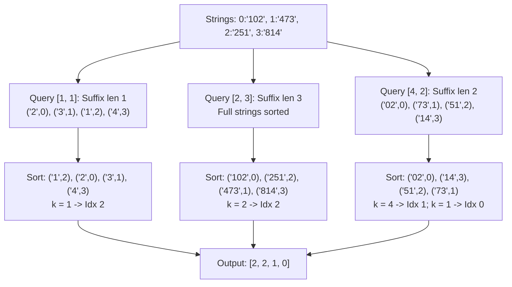

# Guided Example: Query Kth Smallest Trimmed Number

## 1. Problem Overview & Representative Instance

We are given a 0-indexed array `nums` of numeric strings, where every string possesses identical length $L$. We are also provided a 2D integer array `queries`, where each query is a pair $[k, \text{trim}]$. For each query:
1. Each string in `nums` is trimmed to its rightmost $\text{trim}$ digits (its suffix of length $\text{trim}$).
2. The trimmed strings are sorted in ascending numerical order. If two trimmed values evaluate to the exact same numeric value, ties are broken strictly in favor of the smaller original index in `nums`.
3. We identify the index in the original `nums` array of the $k$-th smallest trimmed number ($1$-indexed rank $k$).
4. Each query operates independently without modifying the underlying strings for subsequent queries.

Consider the representative instance:
- `nums = ["102", "473", "251", "814"]`
- String length: $L = 3$, Array size: $n = 4$
- `queries = [[1, 1], [2, 3], [4, 2], [1, 2]]`

Let us evaluate the queries:
- **Query 1 ($k = 1, \text{trim} = 1$):** Suffixes of length 1 are `"2"`, `"3"`, `"1"`, `"4"`. The smallest trimmed string is `"1"`, originating at index $2$.
- **Query 2 ($k = 2, \text{trim} = 3$):** Suffixes of length 3 are the full strings `"102"`, `"473"`, `"251"`, `"814"`. Sorted ascending: `"102"` (index 0), `"251"` (index 2), `"473"` (index 1), `"814"` (index 3). The 2nd smallest is `"251"`, originating at index $2$.
- **Query 3 ($k = 4, \text{trim} = 2$):** Suffixes of length 2 are `"02"`, `"73"`, `"51"`, `"14"`. Sorted: `"02"` (idx 0), `"14"` (idx 3), `"51"` (idx 2), `"73"` (idx 1). The 4th smallest is `"73"`, originating at index $1$.
- **Query 4 ($k = 1, \text{trim} = 2$):** Using the same length-2 suffixes, the 1st smallest is `"02"`, originating at index $0$.

The resulting answer vector is `[2, 2, 1, 0]`.

## 2. Mathematical & Algorithmic Principles

For a string $s$ of length $L$ and an integer $\text{trim} \in [1, L]$, the suffix function extracts:

$$\text{suffix}(s, \text{trim}) = s[L - \text{trim} \dots L - 1]$$

Because every string in the candidate pool for a fixed query has the identical length $\text{trim}$, numerical comparison between two trimmed strings $u$ and $v$ coincides with standard character-by-character lexicographical comparison:

$$\text{val}(u) < \text{val}(v) \iff u <_{\text{lex}} v$$

This equivalence holds because leading zeros are preserved: for example, `"02"` and `"14"` have identical length $2$, and character `'0'` precedes `'1'`, correctly mirroring $2 < 14$.

### Total Order on Suffix-Index Tuples

To incorporate the deterministic tie-breaking rule, we define a composite tuple for each original array entry $i \in \{0, \dots, n-1\}$:

$$T_i(\text{trim}) = (\text{suffix}(nums[i], \text{trim}), i)$$

The strict total order $\prec$ on these tuples is defined lexicographically:

$$(u, i) \prec (v, j) \iff (u <_{\text{lex}} v) \lor (u = v \land i < j)$$

Because the secondary coordinate $i$ is strictly unique across all $n$ elements, the relation $\prec$ is an anti-symmetric, transitive, and total ordering. For any query $[k, \text{trim}]$, the desired output is the index coordinate of the $k$-th element in the sorted sequence of tuples:

$$\text{ans}_q = \pi_2 \left( \text{Select}_k \left( \{ T_i(\text{trim}) \}_{i=0}^{n-1}, \prec \right) \right)$$

where $\pi_2(u, i) = i$ projects the original array index.

| Query Parameter | Mathematical Extraction | Ordering Criteria | Tie-Breaking Role |
|---|---|---|---|
| Trim Length $\text{trim}$ | Suffix slice $[L - \text{trim} : L]$ | Primary key: string lexicographical comparison | Equal suffix strings |
| Rank Target $k$ | $k$-th order statistic ($1$-indexed) | Secondary key: index ascending order $i < j$ | Preserves stability |

## 3. Step-by-Step Walkthrough with Intermediate State

Let us trace `nums = ["102", "473", "251", "814"]` across all four queries.

### Query 1: $[k = 1, \text{trim} = 1]$
- Extract suffix of length 1 for each index:
  - $i = 0$: `"102"[-1:] = "2" \implies ("2", 0)$`
  - $i = 1$: `"473"[-1:] = "3" \implies ("3", 1)$`
  - $i = 2$: `"251"[-1:] = "1" \implies ("1", 2)$`
  - $i = 3$: `"814"[-1:] = "4" \implies ("4", 3)$`
- Sort tuples under $\prec$:
  1. Rank 1: `("1", 2)`
  2. Rank 2: `("2", 0)`
  3. Rank 3: `("3", 1)`
  4. Rank 4: `("4", 3)`
- Select rank $k = 1$: index is $2$.

### Query 2: $[k = 2, \text{trim} = 3]$
- Extract suffix of length 3:
  - $i = 0 \implies ("102", 0)$
  - $i = 1 \implies ("473", 1)$
  - $i = 2 \implies ("251", 2)$
  - $i = 3 \implies ("814", 3)$
- Sort tuples under $\prec$:
  1. Rank 1: `("102", 0)`
  2. Rank 2: `("251", 2)`
  3. Rank 3: `("473", 1)`
  4. Rank 4: `("814", 3)`
- Select rank $k = 2$: index is $2$.

### Query 3: $[k = 4, \text{trim} = 2]$
- Extract suffix of length 2:
  - $i = 0 \implies ("02", 0)$
  - $i = 1 \implies ("73", 1)$
  - $i = 2 \implies ("51", 2)$
  - $i = 3 \implies ("14", 3)$
- Sort tuples under $\prec$:
  1. Rank 1: `("02", 0)`
  2. Rank 2: `("14", 3)`
  3. Rank 3: `("51", 2)`
  4. Rank 4: `("73", 1)`
- Select rank $k = 4$: index is $1$.

### Query 4: $[k = 1, \text{trim} = 2]$
- Reusing the sorted tuples from $\text{trim} = 2$:
  - Sorted sequence: `[("02", 0), ("14", 3), ("51", 2), ("73", 1)]`.
- Select rank $k = 1$: index is $0$.

Combining results: `[2, 2, 1, 0]`.

## 4. Comprehensive State Trace

The table below summarizes the extracted suffixes, ranked positions, and selected outputs for all queries.

| Query Index | Parameters $[k, \text{trim}]$ | Extracted Tuples $(v, i)$ | Sorted Tuple Sequence | Chosen Rank $k$ | Resulting Index |
|---|---|---|---|---|---|
| $0$ | $[1, 1]$ | $(2, 0), (3, 1), (1, 2), (4, 3)$ | $(1, 2), (2, 0), (3, 1), (4, 3)$ | $1$ | $2$ |
| $1$ | $[2, 3]$ | $(102, 0), (473, 1), (251, 2), (814, 3)$ | $(102, 0), (251, 2), (473, 1), (814, 3)$ | $2$ | $2$ |
| $2$ | $[4, 2]$ | $(02, 0), (73, 1), (51, 2), (14, 3)$ | $(02, 0), (14, 3), (51, 2), (73, 1)$ | $4$ | $1$ |
| $3$ | $[1, 2]$ | $(02, 0), (73, 1), (51, 2), (14, 3)$ | $(02, 0), (14, 3), (51, 2), (73, 1)$ | $1$ | $0$ |

## 5. Algorithmic Correctness & Soundness

1. **Equal Length Preserves Numeric Ordering:**
   Since all trimmed slices for a given $\text{trim}$ parameter have exactly the same number of characters $\text{trim}$, their natural lexicographical order is identical to their numerical value order. Converting strings to large integer representations is completely unnecessary and avoids potential arbitrary-precision integer overflow.

2. **Strict Stability via Index Augmentation:**
   By binding the original array index $i$ as the secondary element of the tuple $(s_i, i)$, any two identical trimmed strings $s_i = s_j$ with $i < j$ evaluate to $(s_i, i) \prec (s_j, j)$. This enforces the tie-breaking condition required by the problem specification.

3. **Independence of Query Evaluations:**
   Extracting suffixes creates temporary tuples without mutating `nums`. Each query is computed on the unaltered base strings, preventing cross-query interference.

## 6. Edge Cases & Anti-Patterns

- **Duplicate Trimmed Values (`nums = ["24", "37", "96", "04"]`, `query = [1, 1]`):**
  - Length-1 suffixes: `"4"` at index 0, `"7"` at index 1, `"6"` at index 2, `"4"` at index 3.
  - Suffix `"4"` appears at index 0 and index 3.
  - Tuples: `("4", 0)` and `("4", 3)`.
  - Since $0 < 3$, `("4", 0) \prec ("4", 3)`. The smallest is correctly index 0.
- **Leading Zeros in Suffixes (`nums = ["001", "010"]`, `query = [1, 2]`):**
  - Trimming 2 digits yields `"01"` at index 0 and `"10"` at index 1. Lexicographically `'0' < '1'`, matching $1 < 10$.
- **Anti-Pattern (Converting Suffixes to Native Integers):**
  - Converting suffixes to standard 32-bit or 64-bit integers fails when strings have length up to $100$, causing numeric overflow in fixed-width arithmetic. String comparison handles arbitrary digit lengths directly.

## 7. Complexity Analysis

- **Time Complexity:**
  - For each query $q \in [1, Q]$, extracting the suffix of length $\text{trim}$ across $n$ strings takes $\mathcal{O}(n \cdot \text{trim})$ time.
  - Sorting $n$ tuples of length $\text{trim}$ takes $\mathcal{O}(n \log n \cdot \text{trim})$ time.
  - Summing over $Q$ queries yields $\mathcal{O}(Q \cdot n \log n \cdot L)$, where $L$ is the maximum string length ($L \le 100$, $n \le 100$, $Q \le 100$). This easily finishes within standard limits.
  - Alternatively, Radix Sort can precompute sorted indices for all trim lengths from $1$ to $L$ in $\mathcal{O}(L \cdot n)$ total time, allowing each query to be answered in $\mathcal{O}(1)$ time.
- **Space Complexity:** $\mathcal{O}(n \cdot L)$ auxiliary space to hold the extracted suffix tuples and query output buffer.
