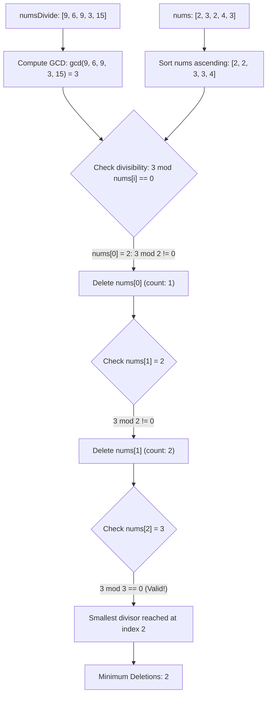

# Guided Example: Minimum Deletions to Make Array Divisible

## 1. Problem Overview & Representative Instance

We are given two arrays of positive integers, `nums` and `numsDivide`. In a single operation, we may choose and delete any element from `nums`. Our goal is to perform the minimum number of deletions such that the smallest element remaining in `nums` divides every element in `numsDivide`. If no remaining element can satisfy this condition regardless of how many deletions are executed, we return $-1$.

Consider the representative instance:
- `nums = [2, 3, 2, 4, 3]`
- `numsDivide = [9, 6, 9, 3, 15]`

Let us analyze the divisibility requirement across `numsDivide`:
- The common divisors of $\{9, 6, 9, 3, 15\}$ are the divisors of their greatest common divisor:
  $$\gcd(9, 6, 9, 3, 15) = 3$$
- Therefore, an integer $v$ divides every element of `numsDivide` if and only if $v$ divides $3$.
- Divisors of $3$ among positive integers are $\{1, 3\}$.

Now inspect `nums` in sorted order:
$$\text{sorted}(nums) = [2, 2, 3, 3, 4]$$
- Index 0: value $2$. Does $2$ divide $3$? No ($3 \bmod 2 = 1$).
- Index 1: value $2$. Does $2$ divide $3$? No ($3 \bmod 2 = 1$).
- Index 2: value $3$. Does $3$ divide $3$? Yes ($3 \bmod 3 = 0$).

To make $3$ the minimum element in `nums`, we must delete the two preceding elements with value $2$. This requires $2$ deletions. The answer is $2$.

## 2. Mathematical & Algorithmic Principles

The divisibility requirement states that there must exist some remaining element $m \in nums$ such that:

$$\forall y \in numsDivide, \quad y \equiv 0 \pmod m$$

and simultaneously:

$$\forall x \in nums_{\text{remaining}}, \quad x \ge m$$

### Fundamental Lemma of Greatest Common Divisors
By the definition of the greatest common divisor in number theory:

$$m \mid y_1 \land m \mid y_2 \land \dots \land m \mid y_k \iff m \mid \gcd(y_1, y_2, \dots, y_k)$$

Let $G = \gcd(numsDivide)$. The condition that $m$ divides every element in $numsDivide$ collapses to the single modular arithmetic test:

$$G \bmod m = 0$$

### Minimizing Deletions via Prefix Deletion on Sorted Array
Suppose we choose an element $v^* \in nums$ as our retained minimum element.
1. Any element $u \in nums$ strictly smaller than $v^*$ ($u < v^*$) cannot remain in the array, because its presence would prevent $v^*$ from being the smallest remaining element.
2. Therefore, every occurrence of any value strictly less than $v^*$ must be deleted.
3. If $nums$ is sorted ascending, all elements strictly less than $v^*$ (and any copies of non-divisor values preceding the chosen instance) form a contiguous prefix of indices $0, 1, \dots, i - 1$.
4. Deleting this prefix requires precisely $i$ deletions.

To minimize $i$, we simply find the minimal index $i \ge 0$ in the sorted array such that $G \bmod nums[i] = 0$. If no such index exists across the entire array, no candidate can satisfy the condition, and we return $-1$.

| Step Component | Mathematical Role | Property / Invariant |
|---|---|---|
| Target GCD $G$ | Greatest Common Divisor of `numsDivide` | $v \mid y \iff G \bmod v = 0$ |
| Sorted Array `nums` | Monotonic ordering of candidate elements | $nums[0] \le nums[1] \le \dots \le nums[n-1]$ |
| Index $i$ | Count of elements strictly preceding $nums[i]$ | Exactly $i$ elements must be removed |

## 3. Step-by-Step Walkthrough with Intermediate State

Let us trace `nums = [2, 3, 2, 4, 3]` and `numsDivide = [9, 6, 9, 3, 15]`.

### Phase 1: Compute Target GCD $G$
We iteratively apply the Euclidean algorithm across `numsDivide`:
- Initial: $G = 9$.
- Incorporate $6$: $\gcd(9, 6) = 3$.
- Incorporate $9$: $\gcd(3, 9) = 3$.
- Incorporate $3$: $\gcd(3, 3) = 3$.
- Incorporate $15$: $\gcd(3, 15) = 3$.
Final target GCD: $G = 3$.

### Phase 2: Sort Candidates
Ascending sort of `nums`:
$$\text{sorted}(nums) = [2, 2, 3, 3, 4]$$

### Phase 3: Monotonic Linear Scan
We inspect indices $i = 0, 1, 2, \dots$:
- **Index 0 ($v = 2$):**
  - Check $3 \bmod 2 = 1 \ne 0$.
  - Value $2$ does not divide $G$.
  - Must be deleted. Cumulative deletions needed if we stop later: at least $1$.
- **Index 1 ($v = 2$):**
  - Check $3 \bmod 2 = 1 \ne 0$.
  - Value $2$ does not divide $G$.
  - Must be deleted. Cumulative deletions: at least $2$.
- **Index 2 ($v = 3$):**
  - Check $3 \bmod 3 = 0$.
  - Value $3$ divides $G$ evenly.
  - Since $nums[2] = 3$ divides $G$, it can serve as the minimum element.
  - Deletions required: indices $0$ and $1$, for a total of $2$ deletions.

Scan terminates immediately. The minimum operations required is $2$.

## 4. Comprehensive State Trace

The evaluation of each element in sorted `nums` is displayed below.

| Index $i$ | Element $nums[i]$ | Remainder $G \bmod nums[i]$ | Divisibility Status | Deletion Action | Cumulative Deletions |
|---|---|---|---|---|---|
| $0$ | $2$ | $3 \bmod 2 = 1$ | False | Delete index 0 | $1$ |
| $1$ | $2$ | $3 \bmod 2 = 1$ | False | Delete index 1 | $2$ |
| $2$ | $3$ | $3 \bmod 3 = 0$ | **True** | Retain as new minimum | **Terminated at 2** |
| $3$ | $3$ | $3 \bmod 3 = 0$ | True | Unreached (redundant) | — |
| $4$ | $4$ | $3 \bmod 4 = 3$ | False | Unreached (redundant) | — |

## 5. Algorithmic Correctness & Soundness

1. **Equivalence of Global Divisibility:**
   By the fundamental theorem of arithmetic and properties of ideals in $\mathbb{Z}$, the set of common multiples of an integer set is generated by their least common multiple, and the set of common divisors is the set of all divisors of their greatest common divisor. Thus, checking $G \bmod v = 0$ is mathematically equivalent to testing divisibility against every individual element of `numsDivide`.

2. **Minimality of First Divisor Index:**
   In any sorted array, retaining $nums[k]$ as the minimum element requires deleting all elements $nums[j]$ with $j < k$, demanding at least $k$ deletions. Because $k$ increases monotonically with index, the smallest index $i$ satisfying $G \bmod nums[i] = 0$ minimizes the required deletion count.

3. **Soundness of Negative Return:**
   If the loop finishes without encountering any $v$ dividing $G$, then no element in `nums` divides $G$. Therefore, no valid subset of `nums` exists, and returning $-1$ is correct.

## 6. Edge Cases & Anti-Patterns

- **Array Already Valid (`nums = [3, 6, 9]`, `numsDivide = [9, 12]`):**
  - $G = \gcd(9, 12) = 3$.
  - Smallest element is $3$, and $3 \bmod 3 = 0$.
  - First index is $0 \implies 0$ deletions.
- **Impossible Case (`nums = [4, 3, 6]`, `numsDivide = [8, 2, 6, 10]`):**
  - $G = \gcd(8, 2, 6, 10) = 2$.
  - Sorted `nums`: `[3, 4, 6]`.
  - Remainders modulo 2: $2 \bmod 3 = 2$, $2 \bmod 4 = 2$, $2 \bmod 6 = 2$.
  - No element divides $2$. Returns $-1$.
- **Duplicate Minimal Divisors (`nums = [3, 3, 3]`, $G = 3$):**
  - First element divides $G$ at index $0$. Answer is $0$.
- **Anti-Pattern (Testing Every Element of `numsDivide` Directly):**
  - For each element in `nums`, verifying divisibility against all $m$ elements in `numsDivide` takes $\mathcal{O}(n \cdot m)$ time. Precomputing $G$ via Euclidean algorithm reduces divisibility testing to a single $\mathcal{O}(1)$ modulo operation per candidate.

## 7. Complexity Analysis

- **Time Complexity:** $\mathcal{O}(m \log(\min(numsDivide)) + n \log n)$, where $n$ is the length of `nums` and $m$ is the length of `numsDivide`.
  - Computing the cumulative GCD of $m$ integers requires $m$ GCD operations, taking $\mathcal{O}(m \log(\min(numsDivide)))$ time via the Euclidean algorithm.
  - Sorting `nums` takes $\mathcal{O}(n \log n)$ time.
  - The linear scan performs at most $n$ modulo operations, taking $\mathcal{O}(n)$ time.
  - Alternatively, scanning `nums` in $\mathcal{O}(n)$ to find the minimum divisor $v$ and then counting elements strictly smaller than $v$ avoids sorting, achieving $\mathcal{O}(m \log(\min) + n)$ time.
- **Space Complexity:** $\mathcal{O}(1)$ auxiliary space beyond input storage when sorting in-place or scanning for the minimum element.
