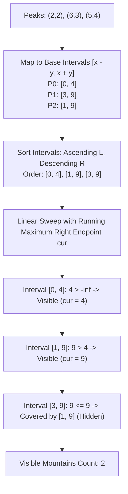

# Guided Example: Finding the Number of Visible Mountains

## 1. Problem Overview & Representative Instance

We are given a 0-indexed 2D integer array `peaks` where `peaks[i] = [x_i, y_i]` indicates the peak of the $i$-th mountain. Each mountain is shaped as an isosceles right triangle with its apex located at $(x_i, y_i)$ and its base situated on the x-axis ($y = 0$). The sides of each mountain have slopes of $+1$ (left face) and $-1$ (right face). 

A mountain is defined as **visible** if its peak does not lie strictly inside or on the boundary of any other mountain. If two mountains have identical coordinates, each covers the other, rendering both invisible. Our goal is to determine the total number of visible mountains.

Consider the representative instance:
- `peaks = [[2, 2], [6, 3], [5, 4]]`
- Number of mountains: $n = 3$

Let us compute the base span $[L_i, R_i]$ along the x-axis for each peak $(x_i, y_i)$:
- Peak 0 at $(2, 2)$: Base spans from $2 - 2 = 0$ to $2 + 2 = 4$, giving interval $[0, 4]$.
- Peak 1 at $(6, 3)$: Base spans from $6 - 3 = 3$ to $6 + 3 = 9$, giving interval $[3, 9]$.
- Peak 2 at $(5, 4)$: Base spans from $5 - 4 = 1$ to $5 + 4 = 9$, giving interval $[1, 9]$.

Comparing the intervals:
- Interval $[0, 4]$ is not contained in any other interval $\implies$ Mountain 0 is **visible**.
- Interval $[1, 9]$ contains interval $[3, 9]$ because $1 \le 3$ and $9 \ge 9$. Hence, Mountain 2 covers Mountain 1.
- Mountain 1 is completely obscured by Mountain 2 $\implies$ Mountain 1 is **not visible**.
- Mountain 2 is not contained by any other mountain $\implies$ Mountain 2 is **visible**.

Total visible mountains: $2$.

## 2. Mathematical & Algorithmic Principles

Each mountain $i$ occupies the 2D geometric region defined by the set of inequalities:

$$\mathcal{M}_i = \{(x, y) \in \mathbb{R}^2 \mid y \ge 0 \land y - y_i \le x - x_i \land y - y_i \le -(x - x_i)\}$$

Rewriting the constraints in terms of distance from the apex:

$$\mathcal{M}_i = \{(x, y) \in \mathbb{R}^2 \mid y \ge 0 \land y \le y_i - |x - x_i|\}$$

### Reduction to 1D Interval Containment
The base of mountain $\mathcal{M}_i$ along the line $y = 0$ is the closed interval:

$$[L_i, R_i] = [x_i - y_i, x_i + y_i]$$

**Geometric Containment Lemma:** Mountain $\mathcal{M}_A$ covers mountain $\mathcal{M}_B$ ($\mathcal{M}_B \subseteq \mathcal{M}_A$) if and only if the base footprint of $\mathcal{M}_B$ is a subset of the base footprint of $\mathcal{M}_A$:

$$\mathcal{M}_B \subseteq \mathcal{M}_A \iff L_A \le L_B \land R_A \ge R_B$$

*Proof:*
- $(\implies)$ Setting $y = 0$ directly restricts the containment $\mathcal{M}_B \subseteq \mathcal{M}_A$ to their base intervals $[L_B, R_B] \subseteq [L_A, R_A]$, requiring $L_A \le L_B$ and $R_A \ge R_B$.
- $(\impliedby)$ Because all mountains share identical boundary slopes ($\pm 1$), the envelope boundary of $\mathcal{M}_A$ at coordinate $x$ is given by $f_A(x) = \max(0, \min(x - L_A, R_A - x))$. If $L_A \le L_B$ and $R_A \ge R_B$, then for every $x \in [L_B, R_B]$:
  $$f_A(x) = \min(x - L_A, R_A - x) \ge \min(x - L_B, R_B - x) = f_B(x)$$
  Hence every point $(x, y) \in \mathcal{M}_B$ satisfies $y \le f_B(x) \le f_A(x)$, establishing $\mathcal{M}_B \subseteq \mathcal{M}_A$.

### Sorting Order and Sweep-Line Invariant
To evaluate containment efficiently:
1. Sort all intervals primarily by $L_i$ in ascending order, and secondarily by $R_i$ in descending order:
   $$(L_A, -R_A) \le (L_B, -R_B)$$
2. Maintain a running cursor $R_{\max}$, which tracks the maximum right boundary observed among all previously processed intervals.
3. For the current interval $[L_i, R_i]$:
   - If $R_i \le R_{\max}$: There exists some earlier interval $j$ such that $L_j \le L_i$ and $R_j \ge R_{\max} \ge R_i$. Thus, interval $i$ is completely covered and cannot be visible.
   - If $R_i > R_{\max}$: No earlier interval can cover interval $i$ because all earlier intervals had right endpoints $\le R_{\max} < R_i$. Furthermore, no subsequent interval $k$ can cover interval $i$ because $L_k \ge L_i$.
   - Hence, interval $i$ is visible if and only if $R_i > R_{\max}$ AND no identical duplicate mountain exists with the exact same $(L_i, R_i)$.
   - We update $R_{\max} \leftarrow R_i$.

| Geometric Property | Mathematical Condition | Interval Invariant |
|---|---|---|
| Complete Containment | $\mathcal{M}_B \subseteq \mathcal{M}_A$ | $L_A \le L_B$ and $R_A \ge R_B$ |
| Primary Sweep Order | Left boundary ascending | $L_0 \le L_1 \le \dots \le L_{n-1}$ |
| Tie-Breaking Order | Right boundary descending | For equal $L$, larger $R$ processed first |
| Duplicate Invisibility | Two mountains share exact same peak | Both cover each other; neither is visible |

## 3. Step-by-Step Walkthrough with Intermediate State

Let us trace `peaks = [[2, 2], [6, 3], [5, 4]]`.

### Phase 1: Transform to Intervals & Count Multiplicities
- Peak $(2, 2) \implies [2 - 2, 2 + 2] = [0, 4]$. Count: $1$.
- Peak $(6, 3) \implies [6 - 3, 6 + 3] = [3, 9]$. Count: $1$.
- Peak $(5, 4) \implies [5 - 4, 5 + 4] = [1, 9]$. Count: $1$.

### Phase 2: Lexicographical Interval Sort
Sort criteria: $L$ ascending, $-R$ ascending (so $R$ descending):
- Candidate 0: $[0, 4]$ ($L = 0, R = 4$)
- Candidate 1: $[1, 9]$ ($L = 1, R = 9$)
- Candidate 2: $[3, 9]$ ($L = 3, R = 9$)

Sorted order: $[[0, 4], [1, 9], [3, 9]]$.

### Phase 3: Linear Sweep
Initialize $R_{\max} = -\infty$, $\text{visible\_count} = 0$.

- **Interval 0: $[0, 4]$**
  - Check containment: $R = 4 > R_{\max} (-\infty)$.
  - Not covered by any preceding mountain.
  - Multiplicity check: $\text{count}([0, 4]) = 1$ (unique).
  - Verdict: **Visible**. $\text{visible\_count} \leftarrow 0 + 1 = 1$.
  - Update running envelope: $R_{\max} \leftarrow \max(-\infty, 4) = 4$.

- **Interval 1: $[1, 9]$**
  - Check containment: $R = 9 > R_{\max} (4)$.
  - Not covered by any preceding mountain.
  - Multiplicity check: $\text{count}([1, 9]) = 1$ (unique).
  - Verdict: **Visible**. $\text{visible\_count} \leftarrow 1 + 1 = 2$.
  - Update running envelope: $R_{\max} \leftarrow \max(4, 9) = 9$.

- **Interval 2: $[3, 9]$**
  - Check containment: $R = 9 \le R_{\max} (9)$.
  - Covered by an earlier interval with larger or equal coverage.
  - Verdict: **Covered (Hidden)**.
  - $R_{\max}$ remains $9$.

Final count of visible mountains is $2$.

## 4. Comprehensive State Trace

The state of the sweep-line algorithm is captured in the trace table below.

| Step | Peak $(x, y)$ | Interval $[L, R]$ | Multiplicity | Condition $R > R_{\max}$ | Action Taken | Running $R_{\max}$ | Total Visible |
|---|---|---|---|---|---|---|---|
| $0$ | $(2, 2)$ | $[0, 4]$ | $1$ | $4 > -\infty$ (True) | Counted as visible | $4$ | $1$ |
| $1$ | $(5, 4)$ | $[1, 9]$ | $1$ | $9 > 4$ (True) | Counted as visible | $9$ | $2$ |
| $2$ | $(6, 3)$ | $[3, 9]$ | $1$ | $9 \le 9$ (False) | Skipped (Covered) | $9$ | $2$ |

## 5. Algorithmic Correctness & Soundness

1. **Sufficiency of Preceding Intervals:**
   Because intervals are sorted in non-decreasing order of $L$, any interval $k$ that appears after interval $i$ satisfies $L_k \ge L_i$. For interval $k$ to cover interval $i$, it would require $L_k \le L_i$, which can only happen if $L_k = L_i$. But by tie-breaking on descending $R$, any interval with $L_k = L_i$ and $R_k \ge R_i$ was already processed before $i$. Therefore, no interval appearing after $i$ can cover $i$.

2. **Completeness of Running Maximum:**
   If an earlier interval $j < i$ covers $i$, it must satisfy $R_j \ge R_i$. Since $R_{\max} = \max_{j < i} R_j$, the condition $R_{\max} \ge R_i$ is both necessary and sufficient for the existence of some containing ancestor interval.

3. **Handling of Identical Mountains:**
   When two mountains share the exact same $(x, y)$, their intervals are identical. The first instance encounters $R > R_{\max}$ and updates $R_{\max} \leftarrow R$. However, checking $\text{count}([L, R]) == 1$ prevents incrementing the answer, ensuring neither duplicate mountain is credited.

## 6. Edge Cases & Anti-Patterns

- **Duplicate Coincident Mountains (`peaks = [[1, 3], [1, 3]]`):**
  - Both intervals are $[-2, 4]$. Count is $2$.
  - First interval updates $R_{\max} = 4$, but is skipped because $\text{count} > 1$.
  - Second interval has $R = 4 \le R_{\max}$, so it is skipped as covered.
  - Output is $0$.
- **Nested Concentric Mountains (`peaks = [[5, 5], [5, 4], [5, 2]]`):**
  - Intervals: $[0, 10]$, $[1, 9]$, $[3, 7]$.
  - $[0, 10]$ is visible; the inner two are covered. Output is $1$.
- **Mountains Touching at Boundary:**
  - One mountain has right endpoint $4$, adjacent mountain has left endpoint $4$.
  - Intervals $[0, 4]$ and $[4, 8]$ do not contain each other. Both are visible.
- **Anti-Pattern (Pairwise Geometric Polygon Clipping):**
  - Checking pairwise polygon intersection requires $\mathcal{O}(n^2)$ geometric tests. The 1D interval projection and sorting reduces the problem to an optimal $\mathcal{O}(n \log n)$ sweep.

## 7. Complexity Analysis

- **Time Complexity:** $\mathcal{O}(n \log n)$, where $n$ is the number of peaks.
  - Computing the $n$ intervals takes $\mathcal{O}(n)$ arithmetic operations.
  - Hashing intervals into a frequency map takes $\mathcal{O}(n)$ average time.
  - Sorting the $n$ intervals takes $\mathcal{O}(n \log n)$ time.
  - The linear sweep takes $\mathcal{O}(n)$ time.
  - Total running time is dominated by the sort: $\mathcal{O}(n \log n)$.
- **Space Complexity:** $\mathcal{O}(n)$ auxiliary space to store the mapped intervals and the frequency map.
