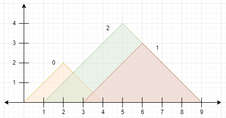
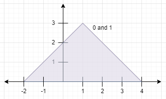

### 1. Description

You are given a **0-indexed** 2D integer array `peaks` where $\text{peaks}[i] = [x_{i}, y_{i}]$ states that mountain `i` has a peak at coordinates $(x_{i}, y_{i})$. A mountain can be described as a right-angled isosceles triangle, with its base along the `x`-axis and a right angle at its peak. More formally, the **gradients** of ascending and descending the mountain are `1` and `-1` respectively.

A mountain is considered **visible** if its peak does not lie within another mountain (including the border of other mountains).

Return *the number of visible mountains*.

### 2. Function Contract

**Inputs**

- `peaks`: A list of $n$ coordinate pairs $[x_{i}, y_{i}]$ ($1 \le n \le 10^5$).

**Return value**

Return an integer representing the number of mountains whose peaks are not contained inside or on the border of any other mountain.

### 3. Examples

#### Example 1

- **Input:** $peaks = [[2,2],[6,3],[5,4]]$
- **Output:** `2`
- **Explanation:** The diagram above shows the mountains.
- Mountain 0 is visible since its peak does not lie within another mountain or its sides.
- Mountain 1 is not visible since its peak lies within the side of mountain 2.
- Mountain 2 is visible since its peak does not lie within another mountain or its sides.
There are 2 mountains that are visible.
#### Example 2

- **Input:** $peaks = [[1,3],[1,3]]$
- **Output:** `0`
- **Explanation:** The diagram above shows the mountains (they completely overlap).
Both mountains are not visible since their peaks lie within each other.

### 4. Constraints

- $1 \le \text{peaks.length} \le 10^{5}$

- $\text{peaks}[i].length = 2$

- $1 \le x_{i}, y_{i} \le 10^{5}$