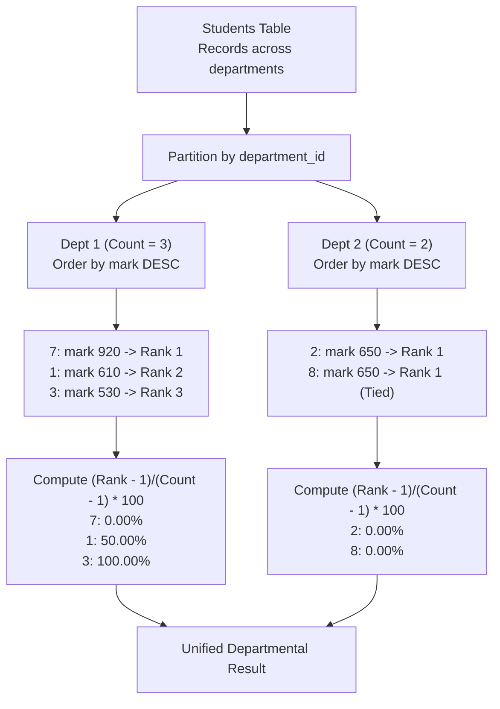

# Guided Example: Compute the Rank as a Percentage

## 1. Problem Overview & Representative Instance

We are given a relational database table named `Students` comprising `student_id`, `department_id`, and `mark`. For each student, we must determine their relative percentage ranking within their department according to their mark, rounded to $2$ decimal places.

The percentage rank is defined by the formula:

$$\text{percentage} = \frac{\text{rank} - 1}{\text{total\_students} - 1} \times 100$$

where:
- $\text{rank}$ is determined by ordering students in descending order of `mark` within each department. Students with identical marks receive the same rank, mirroring standard SQL `RANK()` semantics.
- $\text{total\_students}$ is the total headcount of students in that student's department.
- If a department has exactly $1$ student, the denominator $\text{total\_students} - 1 = 0$; in this case, the percentage rank is defined to be $0.00$.

Consider the representative instance:
- Department 1:
  - Student 7: mark $920$
  - Student 1: mark $610$
  - Student 3: mark $530$
- Department 2:
  - Student 2: mark $650$
  - Student 8: mark $650$

Let us evaluate both departments:
- **Department 1 ($N = 3$ students):**
  - Student 7 has mark $920$, the highest mark $\implies \text{rank} = 1$. Percentage: $\frac{1 - 1}{3 - 1} \times 100 = \frac{0}{2} \times 100 = 0.00\%$.
  - Student 1 has mark $610$, the second highest mark $\implies \text{rank} = 2$. Percentage: $\frac{2 - 1}{3 - 1} \times 100 = \frac{1}{2} \times 100 = 50.00\%$.
  - Student 3 has mark $530$, the lowest mark $\implies \text{rank} = 3$. Percentage: $\frac{3 - 1}{3 - 1} \times 100 = \frac{2}{2} \times 100 = 100.00\%$.
- **Department 2 ($N = 2$ students):**
  - Both Student 2 and Student 8 have mark $650$. Because their marks are identical, both receive $\text{rank} = 1$.
  - Percentage for both: $\frac{1 - 1}{2 - 1} \times 100 = \frac{0}{1} \times 100 = 0.00\%$.

## 2. Mathematical & Algorithmic Principles

In statistical relational algebra, percentile rank measures the proportion of scores in a distribution that a specific score equals or exceeds. The formulation here normalizes the rank metric to the closed interval $[0, 100]$:

$$\text{pct}(i) = \begin{cases} 0.00 & \text{if } N_d = 1 \\ \text{round}\left( \frac{r_i - 1}{N_d - 1} \times 100, \; 2 \right) & \text{if } N_d > 1 \end{cases}$$

where:
- $d = \text{department\_id}(i)$
- $N_d = |\{j \mid \text{department\_id}(j) = d\}|$ is the group cardinality.
- $r_i$ is the standard competition rank (1-2-2-4 ranking scheme) defined by:
  $$r_i = 1 + |\{j \mid \text{department\_id}(j) = d \land \text{mark}(j) > \text{mark}(i)\}|$$

### Properties of Competition Ranking
1. **Top Score Anchoring:** Any student who holds the strictly greatest mark within department $d$ has zero strictly greater peers. Hence $r_i = 1$, yielding numerator $r_i - 1 = 0$, which maps to $0.00\%$.
2. **Bottom Score Anchoring:** If all marks are distinct, the lowest scoring student has $N_d - 1$ superior peers, giving rank $r_{\text{last}} = N_d$. The ratio becomes $\frac{N_d - 1}{N_d - 1} = 1.0$, mapping to $100.00\%$.
3. **Equivalence of Tied Ranks:** If multiple students share the identical mark, they share the identical count of strictly superior peers. Thus, their calculated ranks $r_i$ and resulting percentage ranks are identical.

### Division by Zero Protection
When $N_d = 1$, the denominator $N_d - 1 = 0$ is undefined in classical arithmetic. In SQL systems, a conditional `CASE` expression or `NULLIF(N_d - 1, 0)` combined with `COALESCE` guarantees that single-student cohorts evaluate safely to $0.00$ rather than triggering a runtime divide-by-zero exception.

| Mathematical Component | Relational Window Equivalent | Numerical Behavior |
|---|---|---|
| Group Cardinality $N_d$ | Window count partitioned by department | Denominator base $N_d - 1$ |
| Competition Rank $r_i$ | Window rank partitioned by department | Numerator offset $r_i - 1$ |
| Normalized Ratio | Ratio of offsets scaled by $100$ | Range within $[0.00, 100.00]$ |
| Single-Student Fallback | Conditional zero substitution | Avoids division by zero when $N_d = 1$ |

## 3. Step-by-Step Walkthrough with Intermediate State

Let us trace the representative instance through relational window evaluation.

### Phase 1: Partitioning by Department
The input table is partitioned into two independent relational groups:
- **Group $d = 1$:**
  - Student 7 (mark 920)
  - Student 1 (mark 610)
  - Student 3 (mark 530)
  - Total count: $N_1 = 3$. Denominator: $N_1 - 1 = 2$.
- **Group $d = 2$:**
  - Student 2 (mark 650)
  - Student 8 (mark 650)
  - Total count: $N_2 = 2$. Denominator: $N_2 - 1 = 1$.

### Phase 2: Computing Descending Window Ranks
- **For Group $d = 1$:**
  - Mark 920 has 0 peers with higher mark $\implies \text{rank} = 1 + 0 = 1$.
  - Mark 610 has 1 peer (Student 7) with higher mark $\implies \text{rank} = 1 + 1 = 2$.
  - Mark 530 has 2 peers (Students 7 and 1) with higher mark $\implies \text{rank} = 1 + 2 = 3$.
- **For Group $d = 2$:**
  - Student 2 (mark 650) has 0 peers with higher mark $\implies \text{rank} = 1$.
  - Student 8 (mark 650) has 0 peers with higher mark $\implies \text{rank} = 1$.

### Phase 3: Applying Percentage Formula
- Student 7: $\frac{1 - 1}{3 - 1} \times 100 = \frac{0}{2} \times 100 = 0.00$.
- Student 1: $\frac{2 - 1}{3 - 1} \times 100 = \frac{1}{2} \times 100 = 50.00$.
- Student 3: $\frac{3 - 1}{3 - 1} \times 100 = \frac{2}{2} \times 100 = 100.00$.
- Student 2: $\frac{1 - 1}{2 - 1} \times 100 = \frac{0}{1} \times 100 = 0.00$.
- Student 8: $\frac{1 - 1}{2 - 1} \times 100 = \frac{0}{1} \times 100 = 0.00$.

All results match the required rounded precision.

## 4. Comprehensive State Trace

The complete intermediate and final values for every student row are detailed below.

| Student ID | Department ID | Mark | Group Size $N_d$ | Window Rank $r_i$ | Raw Fraction $\frac{r_i - 1}{N_d - 1}$ | Scaled Percentage | Final Rounded Value |
|---|---|---|---|---|---|---|---|
| $7$ | $1$ | $920$ | $3$ | $1$ | $\frac{0}{2} = 0.0$ | $0.00\%$ | $0.00$ |
| $1$ | $1$ | $610$ | $3$ | $2$ | $\frac{1}{2} = 0.5$ | $50.00\%$ | $50.00$ |
| $3$ | $1$ | $530$ | $3$ | $3$ | $\frac{2}{2} = 1.0$ | $100.00\%$ | $100.00$ |
| $2$ | $2$ | $650$ | $2$ | $1$ | $\frac{0}{1} = 0.0$ | $0.00\%$ | $0.00$ |
| $8$ | $2$ | $650$ | $2$ | $1$ | $\frac{0}{1} = 0.0$ | $0.00\%$ | $0.00$ |

## 5. Algorithmic Correctness & Soundness

1. **Competition Ranking Fidelity:**
   The specification demands that tied marks receive identical rank, leaving rank gaps equal to the multiplicity of the tie. Utilizing `RANK()` rather than `DENSE_RANK()` or `ROW_NUMBER()` guarantees this behavior.

2. **Denominator Invariance:**
   The total department student count $N_d$ is invariant across all rows belonging to department $d$. Using a window aggregate partition guarantees every row in the same group divides by the exact same group-wide scaling factor $N_d - 1$.

3. **Total Domain Coverage:**
   The metric is well-defined for all valid department sizes $N_d \ge 1$. For $N_d > 1$, the percentage strictly lies in $[0, 100]$. For $N_d = 1$, the zero-division guard deterministically produces $0.00$.

## 6. Edge Cases & Anti-Patterns

- **Single Student Department ($N_d = 1$):**
  - Mark is arbitrary; $r_i = 1$, $N_d = 1$.
  - Formula denominator is $1 - 1 = 0$.
  - The zero-safe fallback yields $0.00$.
- **All Students Tied in Department:**
  - Suppose three students in department 3 all score $800$.
  - All three receive $r_i = 1$.
  - Percentage: $\frac{1 - 1}{3 - 1} \times 100 = 0.00$ for all three students.
- **Anti-Pattern (Using `DENSE_RANK`):**
  - If two students tie for rank 1, `DENSE_RANK` assigns the next student rank 2 instead of rank 3. This shrinks the rank span and distorts the percentage calculation. `RANK()` must be used.

## 7. Complexity Analysis

- **Time Complexity:** $\mathcal{O}(M \log M)$, where $M$ is the total number of student records.
  - Sorting records by `department_id` and `mark DESC` during the window evaluation takes $\mathcal{O}(M \log M)$ time.
  - Linear passes to assign window ranks and compute scalar fractions take $\mathcal{O}(M)$ time.
- **Space Complexity:** $\mathcal{O}(M)$ working space for the query engine to maintain the partitioned window frames and output dataset.
