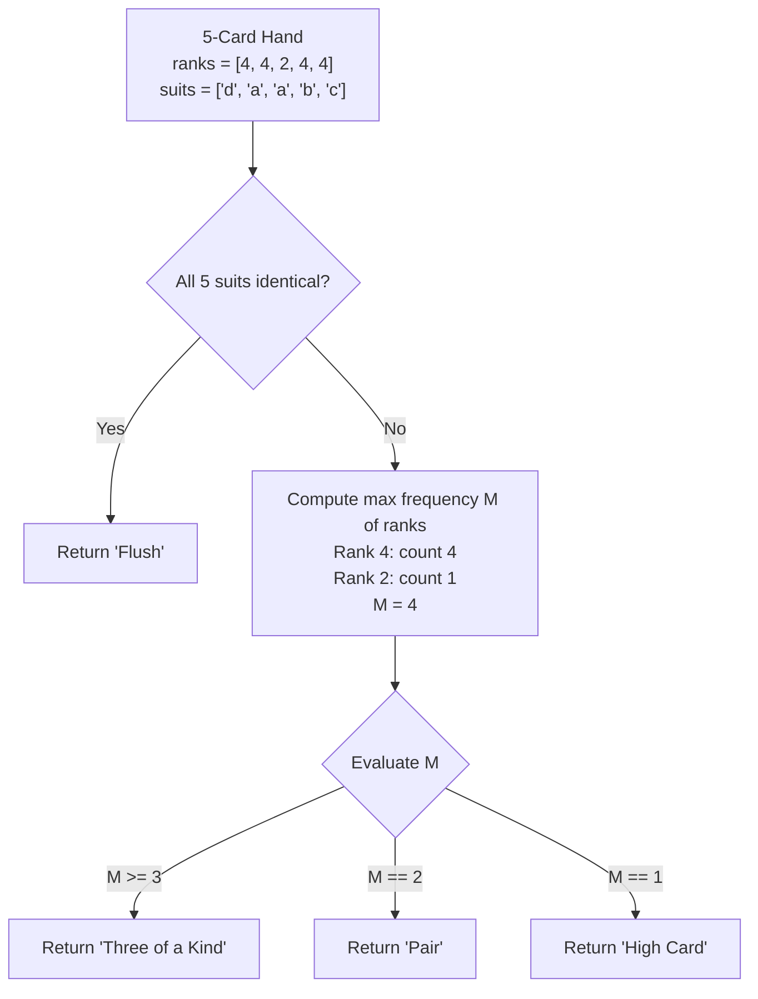

# Guided Example: Best Poker Hand

## 1. Problem Overview & Representative Instance

We are given two 0-indexed arrays representing a hand of $5$ cards: an integer array `ranks` of length $5$ and a character array `suits` of length $5$. The $i$-th card has rank `ranks[i]` and suit `suits[i]`.

We must determine the highest-ranking poker hand category achieved by this 5-card collection. The four candidate hand types, listed in strict descending order of priority, are defined as follows:
1. `"Flush"`: All $5$ cards share the exact same suit.
2. `"Three of a Kind"`: There are at least $3$ cards that share the exact same rank.
3. `"Pair"`: There are at least $2$ cards that share the exact same rank (and fewer than $3$).
4. `"High Card"`: All $5$ cards have distinct ranks and do not share the same suit.

Consider the representative instance:
- `ranks = [4, 4, 2, 4, 4]`
- `suits = ["d", "a", "a", "b", "c"]`

Let us evaluate the hand according to the decision priority:
1. **Flush Evaluation:** The suits are `["d", "a", "a", "b", "c"]`. There are $4$ distinct suits (`d`, `a`, `b`, `c`). Because the cards do not all share the same suit, the hand is not a Flush.
2. **Rank Multiplicity Evaluation:** The ranks are `[4, 4, 2, 4, 4]`.
   - Rank $4$ appears $4$ times.
   - Rank $2$ appears $1$ time.
   - The maximum rank frequency is $4$.
3. **Classification:** Because the maximum rank frequency is $\ge 3$, the hand qualifies as `"Three of a Kind"`.

The resulting classification is `"Three of a Kind"`.

## 2. Mathematical & Algorithmic Principles

Let a 5-card hand be represented as a multiset of pairs:

$$\mathcal{H} = \{(r_i, s_i) \mid 0 \le i < 5\}, \quad r_i \in \{1, \dots, 13\}, \; s_i \in \{'a', 'b', 'c', 'd'\}$$

### Predicate Hierarchy and Mutual Exclusivity
The evaluation operates as a prioritized decision list over property predicates:

$$f(\mathcal{H}) = \begin{cases} \text{"Flush"} & \text{if } P_{\text{flush}}(\mathcal{H}) \\ \text{"Three of a Kind"} & \text{if } \neg P_{\text{flush}}(\mathcal{H}) \land M(ranks) \ge 3 \\ \text{"Pair"} & \text{if } \neg P_{\text{flush}}(\mathcal{H}) \land M(ranks) = 2 \\ \text{"High Card"} & \text{otherwise} \end{cases}$$

where:
- The flush predicate tests set cardinality of the suit projection:
  $$P_{\text{flush}}(\mathcal{H}) \iff |\pi_s(\mathcal{H})| = 1 \iff \forall i \in \{1, 2, 3, 4\}, \; s_i = s_0$$
- The maximum rank frequency is:
  $$M(ranks) = \max_{v \in \{1, \dots, 13\}} \sum_{i=0}^4 \mathbb{I}(ranks[i] = v)$$

### Partition of Rank Multiset Partitions of Size 5
Since $\sum_{v} \text{count}(v) = 5$, the integer partitions of 5 characterize all possible rank distributions:

| Integer Partition of 5 | Maximum Frequency $M$ | Hand Outcome (assuming not Flush) |
|---|---|---|
| $(5)$ | $5$ | "Three of a Kind" |
| $(4, 1)$ | $4$ | "Three of a Kind" |
| $(3, 2)$ | $3$ | "Three of a Kind" |
| $(3, 1, 1)$ | $3$ | "Three of a Kind" |
| $(2, 2, 1)$ | $2$ | "Pair" |
| $(2, 1, 1, 1)$ | $2$ | "Pair" |
| $(1, 1, 1, 1, 1)$ | $1$ | "High Card" |

This partition table shows that any hand with $M \ge 3$ unambiguously falls into "Three of a Kind", $M = 2$ corresponds to "Pair", and $M = 1$ corresponds to "High Card".

## 3. Step-by-Step Walkthrough with Intermediate State

Let us trace the representative instance `ranks = [4, 4, 2, 4, 4]` and `suits = ["d", "a", "a", "b", "c"]`.

### Phase 1: Suit Consistency Check
We inspect `suits = ['d', 'a', 'a', 'b', 'c']`:
- Reference suit from card 0: `'d'`.
- Card 1: `'a' \ne 'd'`.
- Consistency fails immediately on the second card.
- Result: Flush condition is **False**. Proceed to rank frequency evaluation.

### Phase 2: Rank Frequency Accumulation
Initialize an array or map of counts for ranks $1$ through $13$:
- Card 0 ($r = 4$): count of 4 becomes $1$.
- Card 1 ($r = 4$): count of 4 becomes $2$.
- Card 2 ($r = 2$): count of 2 becomes $1$.
- Card 3 ($r = 4$): count of 4 becomes $3$.
- Card 4 ($r = 4$): count of 4 becomes $4$.

Final non-zero frequency counts:
- Rank 4: multiplicity 4.
- Rank 2: multiplicity 1.

### Phase 3: Maximum Frequency Selection
Compute $M$:
$$M = \max(4, 1) = 4$$

### Phase 4: Priority Branch Matching
1. Check $M \ge 3$: $4 \ge 3$ is **True**.
2. Hand category assigned: `"Three of a Kind"`.

The algorithm returns `"Three of a Kind"`.

## 4. Comprehensive State Trace

The table below contrasts multiple diverse hands through the sequential evaluation pipeline.

| Hand Ranks | Hand Suits | Uniform Suit Test | Rank Frequencies | Max Frequency $M$ | Hand Classification |
|---|---|---|---|---|---|
| `[13, 2, 3, 1, 9]` | `['a', 'a', 'a', 'a', 'a']` | **True** (all 'a') | $1, 1, 1, 1, 1$ | $1$ | `"Flush"` |
| `[4, 4, 2, 4, 4]` | `['d', 'a', 'a', 'b', 'c']` | False | $4: 4, \; 2: 1$ | $4$ | `"Three of a Kind"` |
| `[10, 10, 2, 10, 9]` | `['a', 'b', 'c', 'a', 'd']` | False | $10: 3, \; 2: 1, \; 9: 1$ | $3$ | `"Three of a Kind"` |
| `[10, 10, 2, 12, 9]` | `['a', 'b', 'c', 'a', 'd']` | False | $10: 2, \; 2: 1, \; 12: 1, \; 9: 1$ | $2$ | `"Pair"` |
| `[1, 2, 3, 4, 5]` | `['a', 'b', 'c', 'd', 'a']` | False | All $1$ | $1$ | `"High Card"` |

## 5. Algorithmic Correctness & Soundness

1. **Precedence Hierarchy Adherence:**
   Testing the Flush condition first strictly honors the problem specification, which ranks Flush strictly above Three of a Kind, Pair, and High Card.

2. **Soundness of Threshold Comparison:**
   The specification groups four-of-a-kind and full house hands into `"Three of a Kind"` (requiring at least three cards of the same rank). The predicate $M \ge 3$ correctly identifies all instances where at least three identical ranks exist.

3. **Disjoint Exhaustiveness:**
   Since $M$ is an integer in $\{1, 2, 3, 4, 5\}$, the conditions $M \ge 3$, $M = 2$, and $M = 1$ partition the remaining non-Flush outcome space without gaps or overlaps.

## 6. Edge Cases & Anti-Patterns

- **All Five Cards Identical Rank and Different Suits (`ranks = [7, 7, 7, 7, 7]`, different suits):**
  - $M = 5 \ge 3 \implies$ returns `"Three of a Kind"`.
- **All Five Cards Identical Rank and Same Suit (`ranks = [7, 7, 7, 7, 7]`, all suit 'a'):**
  - All suits match $\implies$ returns `"Flush"` because Flush has higher priority than Three of a Kind.
- **Two Pairs (`ranks = [3, 3, 5, 5, 8]`):**
  - Frequencies: $3: 2, 5: 2, 8: 1$.
  - $M = 2 \implies$ returns `"Pair"`.
- **Anti-Pattern (Standard Poker Rules Confusion):**
  - Traditional poker distinguishes Four of a Kind and Full House from Three of a Kind, and Two Pair from One Pair. Implementing standard poker hierarchies causes incorrect classifications because this problem defines strictly four simplified categories.

## 7. Complexity Analysis

- **Time Complexity:** $\mathcal{O}(1)$. The hand contains exactly $5$ cards. Verifying suit uniformity checks $4$ character equality comparisons. Counting ranks processes $5$ integers into a frequency table of size $\le 13$. The entire classification executes in bounded constant time.
- **Space Complexity:** $\mathcal{O}(1)$ auxiliary space. A frequency table of at most $13$ integer entries is allocated.
