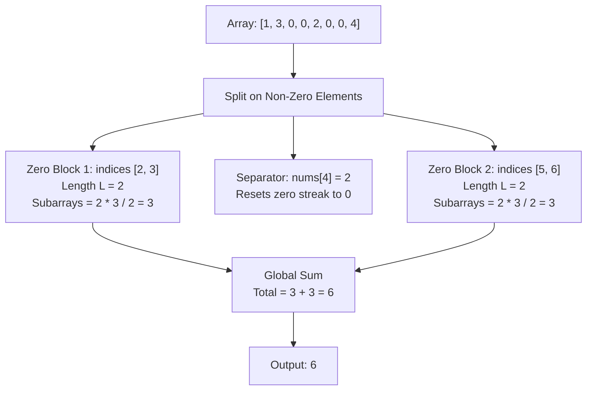

# Guided Example: Number of Zero-Filled Subarrays

## 1. Problem Overview & Representative Instance

We are given an integer array `nums`. A subarray is defined as a contiguous non-empty sequence of elements within an array. A subarray is **zero-filled** if every single element contained in that subarray is equal to $0$. Our objective is to calculate the total number of zero-filled subarrays present in `nums`.

Consider the representative instance:
- `nums = [1, 3, 0, 0, 2, 0, 0, 4]`
- Array length: $n = 8$

Let us identify all maximal contiguous runs of zeros:
1. First run: occurs at indices $[2, 3]$, which contains two consecutive zeros: `[0, 0]`.
   - Subarrays of length 1: `nums[2..2]` and `nums[3..3]` ($2$ subarrays).
   - Subarrays of length 2: `nums[2..3]` ($1$ subarray).
   - Contribution from this run: $2 + 1 = 3$ zero-filled subarrays.
2. Second run: occurs at indices $[5, 6]$, which also contains two consecutive zeros: `[0, 0]`.
   - Subarrays of length 1: `nums[5..5]` and `nums[6..6]` ($2$ subarrays).
   - Subarrays of length 2: `nums[5..6]` ($1$ subarray).
   - Contribution from this run: $2 + 1 = 3$ zero-filled subarrays.

The non-zero elements at indices $0, 1, 4, 7$ (values $1, 3, 2, 4$) can never belong to any zero-filled subarray and act as strict boundaries isolating the zero runs.
Total zero-filled subarrays: $3 + 3 = 6$.

## 2. Mathematical & Algorithmic Principles

A subarray is defined by a pair of indices $(i, j)$ such that $0 \le i \le j < n$. It is zero-filled if and only if:

$$\forall k \in [i, j], \quad nums[k] = 0$$

### Disjoint Component Decomposition
Let the array be partitioned into maximal contiguous runs of zeros $R_1, R_2, \dots, R_m$, where each run $R_p$ consists of $L_p$ consecutive zero elements.
Because any subarray crossing a non-zero element immediately contains at least one non-zero value, every zero-filled subarray must be entirely contained within some single maximal run $R_p$. The total count of valid subarrays is therefore strictly additive across runs:

$$\text{Total Zero Subarrays} = \sum_{p=1}^m \binom{L_p + 1}{2} = \sum_{p=1}^m \frac{L_p(L_p + 1)}{2}$$

### Online Right-Endpoint Contribution Invariant
Rather than identifying and measuring runs after a full pass, we can accumulate valid subarrays online as we scan the array from left to right.
Let $C_t$ denote the length of the uninterrupted streak of zeros ending at index $t$:

$$C_t = \begin{cases} C_{t-1} + 1 & \text{if } nums[t] = 0 \\ 0 & \text{if } nums[t] \ne 0 \end{cases}$$

with $C_{-1} = 0$.

When $nums[t] = 0$, index $t$ serves as the right endpoint for exactly $C_t$ valid zero-filled subarrays:
- The subarray of length 1: $nums[t \dots t]$
- The subarray of length 2: $nums[t-1 \dots t]$
- $\dots$
- The subarray of length $C_t$: $nums[t - C_t + 1 \dots t]$

Any subarray ending at $t$ with length greater than $C_t$ includes $nums[t - C_t] \ne 0$, which invalidates it.
Hence, the total number of zero-filled subarrays across the entire array is simply the sum of running streak lengths:

$$\text{Total} = \sum_{t=0}^{n-1} C_t$$

| Element Type | Transition Rule | Subarrays Ending at Current Index | Effect on Total Sum |
|---|---|---|---|
| Zero ($nums[t] = 0$) | $C_t = C_{t-1} + 1$ | Exactly $C_t$ subarrays | Total increases by $C_t$ |
| Non-Zero ($nums[t] \ne 0$) | $C_t = 0$ | $0$ subarrays | Total unchanged |

## 3. Step-by-Step Walkthrough with Intermediate State

Let us trace `nums = [1, 3, 0, 0, 2, 0, 0, 4]` from left to right, tracking streak counter $C$ and total answer accumulator $A$.

### Initialization
- Counter: $C = 0$
- Accumulator: $A = 0$

### Step 0: $nums[0] = 1$
- Value is non-zero.
- Reset streak: $C \leftarrow 0$.
- Contribution: $0$.
- State: $C = 0, A = 0$.

### Step 1: $nums[1] = 3$
- Value is non-zero.
- Streak remains: $C \leftarrow 0$.
- Contribution: $0$.
- State: $C = 0, A = 0$.

### Step 2: $nums[2] = 0$
- Value is zero.
- Extend streak: $C \leftarrow 0 + 1 = 1$.
- New subarrays ending at index 2: `nums[2..2]` (1 subarray).
- Accumulator: $A \leftarrow 0 + 1 = 1$.
- State: $C = 1, A = 1$.

### Step 3: $nums[3] = 0$
- Value is zero.
- Extend streak: $C \leftarrow 1 + 1 = 2$.
- New subarrays ending at index 3: `nums[3..3]` and `nums[2..3]` (2 subarrays).
- Accumulator: $A \leftarrow 1 + 2 = 3$.
- State: $C = 2, A = 3$.

### Step 4: $nums[4] = 2$
- Value is non-zero.
- Reset streak: $C \leftarrow 0$.
- Contribution: $0$.
- State: $C = 0, A = 3$.

### Step 5: $nums[5] = 0$
- Value is zero.
- Extend streak: $C \leftarrow 0 + 1 = 1$.
- New subarrays ending at index 5: `nums[5..5]` (1 subarray).
- Accumulator: $A \leftarrow 3 + 1 = 4$.
- State: $C = 1, A = 4$.

### Step 6: $nums[6] = 0$
- Value is zero.
- Extend streak: $C \leftarrow 1 + 1 = 2$.
- New subarrays ending at index 6: `nums[6..6]` and `nums[5..6]` (2 subarrays).
- Accumulator: $A \leftarrow 4 + 2 = 6$.
- State: $C = 2, A = 6$.

### Step 7: $nums[7] = 4$
- Value is non-zero.
- Reset streak: $C \leftarrow 0$.
- Contribution: $0$.
- State: $C = 0, A = 6$.

Traversal finished. Final total is $6$.

## 4. Comprehensive State Trace

The exact trace across every index is tabulated below.

| Index $t$ | Value $nums[t]$ | Streak Update Rule | Consecutive Zeros $C_t$ | Added Subarrays | Running Total $A$ |
|---|---|---|---|---|---|
| $0$ | $1$ | Reset | $0$ | $0$ | $0$ |
| $1$ | $3$ | Reset | $0$ | $0$ | $0$ |
| $2$ | $0$ | Increment | $1$ | $1$ (`[0]`) | $1$ |
| $3$ | $0$ | Increment | $2$ | $2$ (`[0]`, `[0, 0]`) | $3$ |
| $4$ | $2$ | Reset | $0$ | $0$ | $3$ |
| $5$ | $0$ | Increment | $1$ | $1$ (`[0]`) | $4$ |
| $6$ | $0$ | Increment | $2$ | $2$ (`[0]`, `[0, 0]`) | $6$ |
| $7$ | $4$ | Reset | $0$ | $0$ | $6$ |

Total answer: $6$.

## 5. Algorithmic Correctness & Soundness

1. **Partition by Right Endpoint:**
   Every non-empty subarray has a unique right endpoint $j \in \{0, \dots, n-1\}$. Partitioning the set of all zero-filled subarrays by their ending index ensures that no subarray is counted twice (disjointness) and that every valid subarray is counted (exhaustiveness).

2. **Equivalence to Triangular Formula:**
   For a maximal contiguous block of zeros of length $L$, the streak counter values are $1, 2, \dots, L$. Summing these values yields:
   $$\sum_{k=1}^L k = \frac{L(L + 1)}{2}$$
   This matches the combinatorial count of choosing any starting point $i$ and ending point $j$ within the block such that $i \le j$.

3. **Strict Isolation by Non-Zero Boundaries:**
   Setting $C \leftarrow 0$ upon encountering any non-zero element guarantees that no subsequent subarray can extend leftward beyond that non-zero delimiter.

## 6. Edge Cases & Anti-Patterns

- **No Zeros in Array (`nums = [2, 10, 2019]`):**
  - Streak remains $0$ at every step. Total is $0$.
- **All Zeros in Array (`nums = [0, 0, 0, 0]`):**
  - $n = 4$. Running streaks: $1, 2, 3, 4$.
  - Total: $1 + 2 + 3 + 4 = 10 = \frac{4 \times 5}{2}$.
- **Large Zero Array (Integer Overflow Consideration):**
  - If $n = 10^5$ and all elements are zero, total count is $\frac{10^5 \times (10^5 + 1)}{2} \approx 5 \times 10^9$.
  - This exceeds the 32-bit signed integer limit ($2^{31} - 1 \approx 2.14 \times 10^9$). The accumulator must use a 64-bit integer (`long long` in C++, `long` in Java) to prevent arithmetic overflow.
- **Anti-Pattern (Two-Pointer Subarray Generation):**
  - Iterating over all pairs $(i, j)$ and verifying all zeros takes $\mathcal{O}(n^3)$ or $\mathcal{O}(n^2)$ time. The single-pass streaming counter requires only $\mathcal{O}(n)$ time and $\mathcal{O}(1)$ space.

## 7. Complexity Analysis

- **Time Complexity:** $\mathcal{O}(n)$, where $n$ is the length of `nums`. The algorithm scans through the array in a single sequential pass, performing constant $\mathcal{O}(1)$ arithmetic and branch operations per element.
- **Space Complexity:** $\mathcal{O}(1)$ auxiliary space. Only two integer variables (the streak counter and the running answer accumulator) are maintained in memory.
