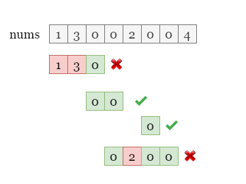
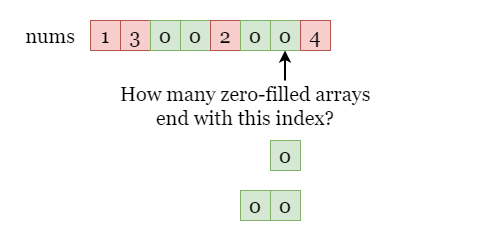
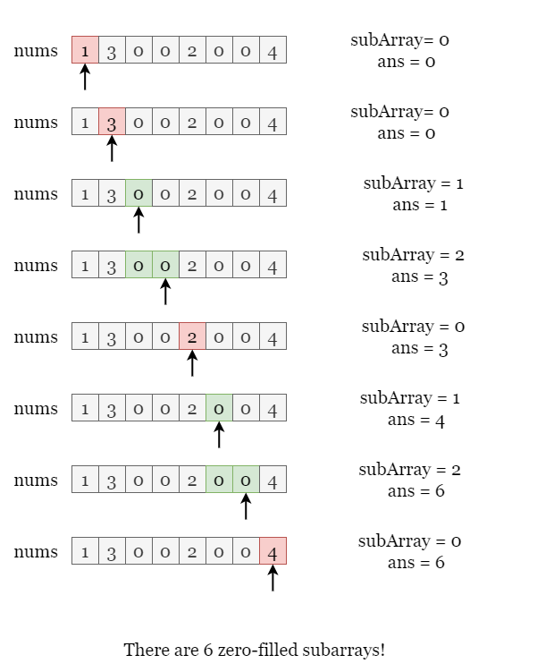

[TOC]

## Solution

---

### Overview

In this problem, we are given an array of integers `nums` and the task is to find the number of zero-filled subarrays.

A zero-filled subarray only contains `0`, as shown in the picture below.



---

### Approach: Count the number of consecutive 0's.

#### Intuition

Since every subarray ends with a number in the array, let's check that for each number `num`, how many subarrays end with it?



If $num \neq 0$, there will not be any subarray ends with it. Otherwise, it depends on how many zero-filled subarrays end with the **previous** number. Suppose there are `k` subarrays end with the previous number, we can append `num` to them to make `k` longer subarrays that end with this number! Plus `num` itself is a zero-filled subarray, we have $k + 1$ zero-filled subarrays end with `num`. Note that the first number doesn't have a previous number, which equals $k = 0$.

Therefore, we can iterate over `nums` and update two variables, `ans` for the total number of zero-filled subarrays, and `subArray` for the number of zero-filled subarrays end with the current number `num`. As shown in the picture below.



<br>

#### Algorithm

1) Initialize $ans = 0$, $numSubarray = 0$.
2) Iterate over `nums`, for each number `num`:
- If $num = 0$, increment `numSubarray` by 1.
- Otherwise, set $numSubarray = 0$.

    Then increment `ans` by `numSubarray`.
3) Return `ans` at the end of the iteration.

#### Implementation

```python
class Solution:
    def zeroFilledSubarray(self, nums: List[int]) -> int:
        ans, num_subarray = 0, 0

        # Iterate over nums, if num = 0, it has 1 more zero-filled subarray
        # than the previous one, otherwise, it has 0 zero-filled subarray.
        for num in nums:
            if num == 0:
                num_subarray += 1
            else:
                num_subarray = 0
            ans += num_subarray

        return ans
```

#### Complexity Analysis

Let $n$ be the length of the input array `nums`.

* Time complexity: $O(n)$

- We need to iterate over `nums`.
- At each step, we update two variables $\text{num}_{subarray}$ and `ans`, which take constant time.
- The overall time complexity is $O(n)$.

* Space complexity: $O(1)$

- We only need record two variables $\text{num}_{subarray}$ and `ans`, which require constant space.

<br/>