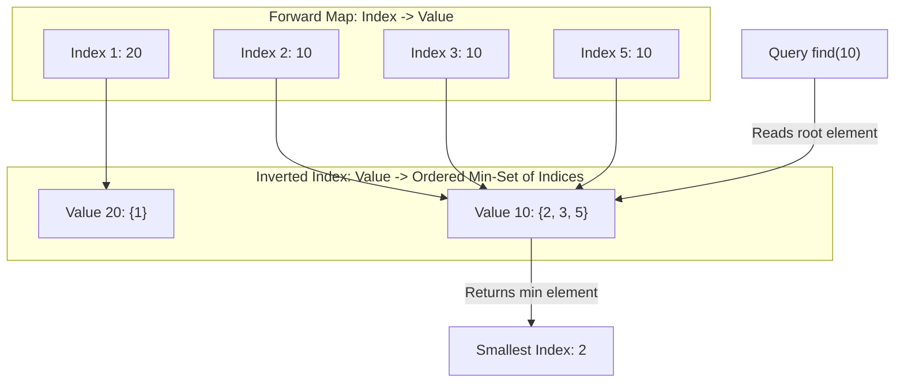

# Guided Example: Design a Number Container System

## 1. Problem Overview & Representative Instance

We are tasked with designing a dynamic data structure, the Number Container System, that maintains an associative mapping between integer indices and numeric values. The system must support two primary operations:
1. **`change(index, number)`:** Sets or overwrites the integer stored at the specified `index` with `number`.
2. **`find(number)`:** Returns the smallest index that currently contains `number`. If no index in the system currently holds `number`, it returns $-1$.

Consider the representative sequence of operations:
- Step 1: Query `find(10)`. The container is currently empty, so no index holds $10$. Returns $-1$.
- Step 2: Call `change(2, 10)`. Index $2$ is assigned the value $10$.
- Step 3: Call `change(1, 10)`. Index $1$ is assigned the value $10$.
- Step 4: Call `change(3, 10)`. Index $3$ is assigned the value $10$.
- Step 5: Call `change(5, 10)`. Index $5$ is assigned the value $10$.
- Step 6: Query `find(10)`. The indices currently holding $10$ are $\{1, 2, 3, 5\}$. The smallest index is $1$. Returns $1$.
- Step 7: Call `change(1, 20)`. The value at index $1$ is reassigned from $10$ to $20$. As a result, index $1$ is removed from the set of indices containing $10$, leaving $\{2, 3, 5\}$ for $10$, and index $1$ is added to the set for $20$.
- Step 8: Query `find(10)`. The active indices holding $10$ are now $\{2, 3, 5\}$. The smallest index is $2$. Returns $2$.

## 2. Mathematical & Algorithmic Principles

The container represents a time-varying partial function:

$$f: \mathbb{Z}^+ \to \mathbb{Z}^+$$

where $f(i)$ is the number currently stored at index $i$.

The `find(v)` query corresponds to finding the infimum of the pre-image of value $v$:

$$\text{find}(v) = \begin{cases} \min f^{-1}(\{v\}) & \text{if } f^{-1}(\{v\}) \ne \emptyset \\ -1 & \text{if } f^{-1}(\{v\}) = \emptyset \end{cases}$$

where the pre-image is $f^{-1}(\{v\}) = \{i \in \text{dom}(f) \mid f(i) = v\}$.

### Inverted Index and Duality
A forward map $I: \text{index} \mapsto \text{value}$ allows $\mathcal{O}(1)$ lookup of what number currently resides at an index. However, evaluating the pre-image $f^{-1}(\{v\})$ directly from the forward map would require scanning all active indices in $\mathcal{O}(|\text{dom}(f)|)$ time.

To achieve logarithmic retrieval, we maintain a dual inverted index structure:

$$N: \text{value} \mapsto \text{OrderedSet}(\text{indices})$$

Every distinct value $v$ is mapped to a priority-ordered collection of indices (implemented via a self-balancing binary search tree, skip list, or min-heap with lazy eviction).

### Transition Semantics for Overwrite
When `change(i, v)` is invoked:
1. **Check Prior Assignment:** Query the forward map for existing value $u = I[i]$.
2. **Old Membership Revocation:** If index $i$ was previously assigned value $u$ ($u \ne v$):
   - Remove $i$ from $N[u]$.
3. **New Value Association:**
   - Set $I[i] \leftarrow v$.
   - Insert $i$ into $N[v]$.

### Lazy Deletion Alternative with Min-Heaps
If language libraries lack an efficient ordered set with logarithmic item removal, each value $v$ can maintain a standard binary min-heap of indices. When overwriting index $i$, we insert $i$ into the min-heap for the new value without immediately pruning $i$ from the old value's heap. During `find(v)`:
- We peek at the heap's minimum element $i_{\text{top}}$.
- If $I[i_{\text{top}}] \ne v$ (the index was overwritten with another number), $i_{\text{top}}$ is a stale entry; we pop it and discard it.
- We repeat this pruning until the heap is empty (return $-1$) or $I[i_{\text{top}}] = v$ (return $i_{\text{top}}$).
Because each insertion adds at most one element to a heap, each stale entry is pruned at most once, yielding amortized $\mathcal{O}(\log K)$ time per operation.

| System Component | Data Representation | Invariant Maintained | Query Role |
|---|---|---|---|
| Forward Table $I$ | Hash Map (Index $\to$ Value) | $I[i] = v \iff$ current content of index $i$ is $v$ | Ground truth for active values |
| Inverted Table $N$ | Hash Map (Value $\to$ Min-Queue / BST) | Contains all $i$ such that $f(i) = v$ | Provides instantaneous access to minimal index |

## 3. Step-by-Step Walkthrough with Intermediate State

Let us trace the representative sequence through the dual-mapping system using an ordered set representation.

### Step 1: `find(10)`
- Query inverted map $N[10]$. Key $10$ is not present in $N$.
- Pre-image is empty: $f^{-1}(\{10\}) = \emptyset$.
- Return $-1$.

### Step 2: `change(2, 10)`
- Index $2$ has no previous entry in $I$.
- Update forward map: $I[2] = 10$.
- Update inverted map: Insert $2$ into $N[10]$.
- State: $I = \{2: 10\}$, $N[10] = \{2\}$.

### Step 3: `change(1, 10)`
- Index $1$ has no previous entry in $I$.
- Update forward map: $I[1] = 10$.
- Update inverted map: Insert $1$ into $N[10]$.
- State: $I = \{1: 10, 2: 10\}$, $N[10] = \{1, 2\}$.

### Step 4: `change(3, 10)`
- Update forward map: $I[3] = 10$.
- Update inverted map: Insert $3$ into $N[10]$.
- State: $I = \{1: 10, 2: 10, 3: 10\}$, $N[10] = \{1, 2, 3\}$.

### Step 5: `change(5, 10)`
- Update forward map: $I[5] = 10$.
- Update inverted map: Insert $5$ into $N[10]$.
- State: $I = \{1: 10, 2: 10, 3: 10, 5: 10\}$, $N[10] = \{1, 2, 3, 5\}$.

### Step 6: `find(10)`
- Query $N[10]$: set contains $\{1, 2, 3, 5\}$.
- Smallest element is $\min(\{1, 2, 3, 5\}) = 1$.
- Return $1$.

### Step 7: `change(1, 20)`
- Inspect prior value: $I[1] = 10$. Old value is $10$.
- Revoke from old set: Remove index $1$ from $N[10]$. $N[10]$ becomes $\{2, 3, 5\}$.
- Update forward map: $I[1] = 20$.
- Insert into new set: $N[20] = \{1\}$.
- State: $I = \{1: 20, 2: 10, 3: 10, 5: 10\}$, $N[10] = \{2, 3, 5\}$, $N[20] = \{1\}$.

### Step 8: `find(10)`
- Query $N[10]$: set contains $\{2, 3, 5\}$.
- Smallest element is $\min(\{2, 3, 5\}) = 2$.
- Return $2$.

## 4. Comprehensive State Trace

The state of both data structures after every operation in the sequence is recorded below.

| Step | Operation | Arguments | Forward Map $I$ | Inverted Set $N[10]$ | Inverted Set $N[20]$ | Output |
|---|---|---|---|---|---|---|
| $1$ | `find` | `10` | $\emptyset$ | $\emptyset$ | $\emptyset$ | $-1$ |
| $2$ | `change` | `2, 10` | $\{2: 10\}$ | $\{2\}$ | $\emptyset$ | null |
| $3$ | `change` | `1, 10` | $\{1: 10, 2: 10\}$ | $\{1, 2\}$ | $\emptyset$ | null |
| $4$ | `change` | `3, 10` | $\{1: 10, 2: 10, 3: 10\}$ | $\{1, 2, 3\}$ | $\emptyset$ | null |
| $5$ | `change` | `5, 10` | $\{1: 10, 2: 10, 3: 10, 5: 10\}$ | $\{1, 2, 3, 5\}$ | $\emptyset$ | null |
| $6$ | `find` | `10` | $\{1: 10, 2: 10, 3: 10, 5: 10\}$ | $\{1, 2, 3, 5\}$ | $\emptyset$ | $1$ |
| $7$ | `change` | `1, 20` | $\{1: 20, 2: 10, 3: 10, 5: 10\}$ | $\{2, 3, 5\}$ | $\{1\}$ | null |
| $8$ | `find` | `10` | $\{1: 20, 2: 10, 3: 10, 5: 10\}$ | $\{2, 3, 5\}$ | $\{1\}$ | $2$ |

## 5. Algorithmic Correctness & Soundness

1. **Pre-image Invariant:**
   At all times, an index $i$ belongs to the collection $N[v]$ if and only if $I[i] = v$. When `change(i, v)` modifies $I[i]$, the deletion from $N[\text{old}]$ and insertion into $N[v]$ preserve this bi-directional equivalence.

2. **Order Preservation:**
   Because each $N[v]$ is maintained as an ordered set or min-heap, querying its minimum element deterministically yields the infimum $\min \{i \mid I[i] = v\}$.

3. **Stale Entry Elimination:**
   Under the lazy heap deletion strategy, whenever a queried top index $i_{\text{top}}$ fails the verification $I[i_{\text{top}}] = v$, it is permanently discarded. Because an index is only re-inserted into $N[v]$ upon explicit reassignment, valid entries are never prematurely purged.

## 6. Edge Cases & Anti-Patterns

- **Reassigning an Index to the Exact Same Number (`change(2, 10)` followed by `change(2, 10)`):**
  - Old value equals new value. Either skipping the remove/add or removing and re-inserting correctly maintains the index in $N[10]$.
- **Querying Unseen Numbers:**
  - If a number has never been introduced into the container, the inverted table contains no key, immediately returning $-1$.
- **Complete Eviction of a Number:**
  - If all indices holding $10$ are reassigned to other values, $N[10]$ becomes empty. Subsequent `find(10)` correctly returns $-1$.
- **Anti-Pattern (Single Linear Forward Scan):**
  - Maintaining only the `index -> value` map requires iterating over all indices for every `find` call, taking $\mathcal{O}(N)$ per query, which results in time-limit exceeded under $10^5$ operations.

## 7. Complexity Analysis

- **Time Complexity:**
  - **`change(index, number)`:** $\mathcal{O}(\log K)$, where $K$ is the number of indices assigned to the respective numbers. Querying and updating the forward hash map takes $\mathcal{O}(1)$ average time. Inserting and removing from the ordered set (or pushing onto the min-heap) takes $\mathcal{O}(\log K)$ time.
  - **`find(number)`:** $\mathcal{O}(1)$ for ordered sets (reading the first element). For lazy min-heaps, it takes amortized $\mathcal{O}(\log K)$ time, as each stale entry is popped at most once across the execution lifecycle.
- **Space Complexity:** $\mathcal{O}(N)$ auxiliary space, where $N$ is the total number of distinct indices updated across all operations. Each active index is stored once in the forward map and at least once in the inverted collection.
