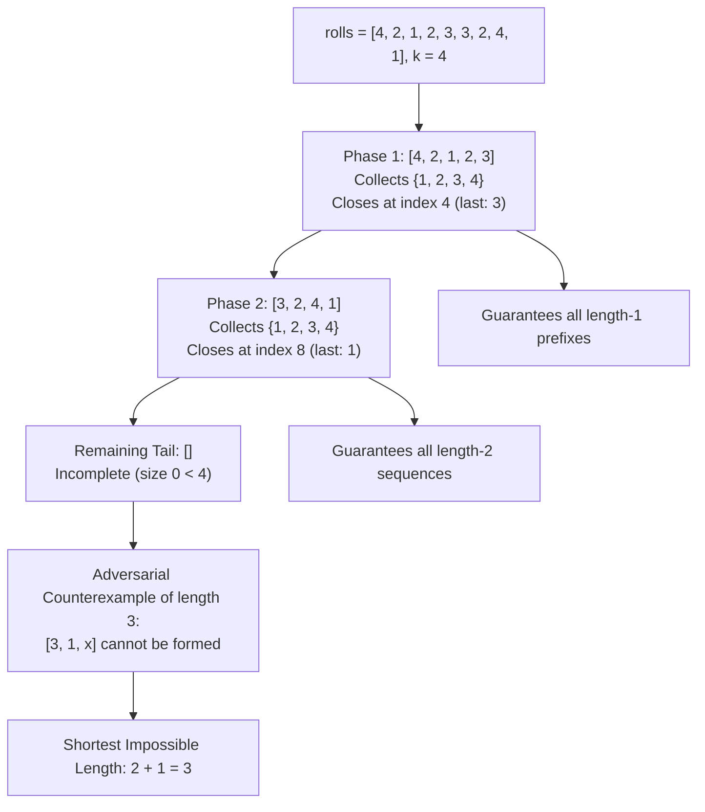

# Guided Example: Shortest Impossible Sequence of Rolls

## 1. Problem Overview & Representative Instance

We are given an integer array `rolls` of length $n$ and an integer $k$. This array represents the outcomes of rolling a fair $k$-sided die $n$ times, where each outcome is an integer from $1$ to $k$. We wish to determine the length of the shortest sequence of rolls (each term taking a value in $\{1, \dots, k\}$) that **cannot** be obtained as a subsequence of `rolls`.

A sequence $S$ is a subsequence of `rolls` if $S$ can be derived from `rolls` by deleting some (or no) elements without changing the relative order of the remaining elements.

Consider the representative instance:
- `rolls = [4, 2, 1, 2, 3, 3, 2, 4, 1]`
- Alphabet size: $k = 4$
- Array length: $n = 9$

Let us partition `rolls` greedily into phases where all $4$ distinct die faces $\{1, 2, 3, 4\}$ appear:
1. **First Phase:** Reading from the left:
   - Elements encountered: $4, 2, 1, 2, 3$.
   - The set of distinct values accumulated is $\{1, 2, 3, 4\}$.
   - All $4$ faces have appeared at least once. This phase completes at index $4$ (value $3$).
2. **Second Phase:** Reading subsequent elements:
   - Elements encountered: $3, 2, 4, 1$.
   - The set of distinct values accumulated is $\{1, 2, 3, 4\}$.
   - All $4$ faces have appeared again. This phase completes at index $8$ (value $1$).
3. **Third Phase:** No remaining elements exist in `rolls`.

Because we completed $2$ full phases containing all $k$ symbols, every sequence of length $2$ can be formed as a subsequence. However, we cannot guarantee forming every sequence of length $3$. For example, the sequence $[3, 1, 4]$ cannot be formed because matching the final element of each phase forces the search to the end of the array, leaving no elements to match the third symbol. The shortest impossible sequence length is $2 + 1 = 3$.

## 2. Mathematical & Algorithmic Principles

Let $\Sigma = \{1, 2, \dots, k\}$ be the alphabet of possible die roll values. A string $w = (w_1, w_2, \dots, w_m) \in \Sigma^m$ is a subsequence of `rolls` (denoted $w \sqsubseteq rolls$) if there exist indices $0 \le i_1 < i_2 < \dots < i_m < n$ such that:

$$rolls[i_j] = w_j \quad \text{for all } j \in \{1, \dots, m\}$$

We seek the minimal $m \ge 1$ such that:

$$\exists w \in \Sigma^m, \quad w \not\sqsubseteq rolls$$

### Alphabet Partitioning Lemma
Suppose `rolls` is greedily partitioned from left to right into $M$ non-overlapping contiguous blocks $B_1, B_2, \dots, B_M$ such that:
1. Each block $B_p$ contains every symbol in $\Sigma$ at least once:
   $$\{rolls[t] \mid t \in B_p\} = \Sigma$$
2. Each block $B_p$ is minimal: its final element $rolls[\text{end}(B_p)]$ is the first time all $k$ symbols have appeared within $B_p$.
3. The remaining suffix $T = rolls[\text{end}(B_M) + 1 \dots n - 1]$ does not contain all $k$ symbols ($|\{rolls[t] \mid t \in T\}| < k$).

**Theorem:** The shortest sequence impossible to form from `rolls` has length exactly $M + 1$.

*Proof:*
1. **Sufficiency (Every sequence of length $M$ exists):**
   Let $w = (w_1, w_2, \dots, w_M) \in \Sigma^M$ be an arbitrary sequence of length $M$.
   Because block $B_1$ contains all symbols in $\Sigma$, symbol $w_1$ appears somewhere in $B_1$. Let $i_1 \in B_1$ be its earliest occurrence.
   Next, because block $B_2$ contains all symbols in $\Sigma$, symbol $w_2$ appears somewhere in $B_2$ at index $i_2 \in B_2$. Since all indices in $B_2$ are strictly greater than all indices in $B_1$, $i_1 < i_2$.
   By induction across all $M$ blocks, there exist indices $i_1 < i_2 < \dots < i_M$ matching $w$. Since $w$ was arbitrary, every sequence of length $M$ is a valid subsequence of `rolls`.

2. **Necessity (An impossible sequence of length $M + 1$ exists):**
   By definition, the remaining suffix $T$ lacks at least one symbol $x \in \Sigma$.
   Let $u_p = rolls[\text{end}(B_p)]$ be the closing element of block $B_p$. By minimality, $u_p$ appeared nowhere else earlier in block $B_p$.
   Construct the specific adversarial sequence:
   $$w^* = (u_1, u_2, \dots, u_M, x)$$
   To match $u_1$, any subsequence search must advance at least to $\text{end}(B_1)$.
   To match $u_2$, the search must advance at least to $\text{end}(B_2)$.
   By induction, matching the prefix $(u_1, \dots, u_M)$ forces the scan to reach or exceed $\text{end}(B_M)$.
   The final symbol $x$ must then be matched within the remaining suffix $T$. But $x$ does not appear in $T$.
   Therefore, $w^*$ cannot be formed, proving that at least one sequence of length $M + 1$ is impossible.

Thus, the answer is unconditionally $M + 1$.

| Partition Segment | Symbol Coverage | Subsequence Guarantee | Next Action |
|---|---|---|---|
| Complete Block $B_p$ | Contains all $k$ distinct symbols | Extends guaranteed universal length by $+1$ | Clear set, start new block |
| Final Incomplete Suffix $T$ | Contains strictly fewer than $k$ symbols | Identifies missing terminal symbol $x$ | Impossible length is $M + 1$ |

## 3. Step-by-Step Walkthrough with Intermediate State

Let us trace `rolls = [4, 2, 1, 2, 3, 3, 2, 4, 1]` with $k = 4$.
We maintain:
- $M = 0$: count of completed blocks.
- $S = \emptyset$: set of distinct symbols observed in the current active block.

### Phase 1: Processing Block 1
- **Index 0 ($v = 4$):** $S \leftarrow \{4\}$. $|S| = 1 < 4$.
- **Index 1 ($v = 2$):** $S \leftarrow \{2, 4\}$. $|S| = 2 < 4$.
- **Index 2 ($v = 1$):** $S \leftarrow \{1, 2, 4\}$. $|S| = 3 < 4$.
- **Index 3 ($v = 2$):** $2 \in S$, no change. $|S| = 3 < 4$.
- **Index 4 ($v = 3$):** $S \leftarrow \{1, 2, 3, 4\}$. $|S| = 4 = k$.
  - All $k$ symbols observed.
  - Complete block 1: $M \leftarrow 0 + 1 = 1$.
  - Reset set: $S \leftarrow \emptyset$.

### Phase 2: Processing Block 2
- **Index 5 ($v = 3$):** $S \leftarrow \{3\}$. $|S| = 1 < 4$.
- **Index 6 ($v = 2$):** $S \leftarrow \{2, 3\}$. $|S| = 2 < 4$.
- **Index 7 ($v = 4$):** $S \leftarrow \{2, 3, 4\}$. $|S| = 3 < 4$.
- **Index 8 ($v = 1$):** $S \leftarrow \{1, 2, 3, 4\}$. $|S| = 4 = k$.
  - All $k$ symbols observed.
  - Complete block 2: $M \leftarrow 1 + 1 = 2$.
  - Reset set: $S \leftarrow \emptyset$.

### Phase 3: Final Output Computation
Traversal of `rolls` terminates.
Total complete blocks: $M = 2$.
The shortest impossible sequence length is:

$$M + 1 = 2 + 1 = 3$$

## 4. Comprehensive State Trace

The state of the streaming partition algorithm across all indices is tabulated below.

| Index $t$ | Roll $rolls[t]$ | Active Set $S$ Before | Updated Set $S$ | Set Size $\lvert S \rvert$ | Threshold Met ($\lvert S \rvert = k$)? | Completed Blocks $M$ |
|---|---|---|---|---|---|---|
| $0$ | $4$ | $\emptyset$ | $\{4\}$ | $1$ | No | $0$ |
| $1$ | $2$ | $\{4\}$ | $\{2, 4\}$ | $2$ | No | $0$ |
| $2$ | $1$ | $\{2, 4\}$ | $\{1, 2, 4\}$ | $3$ | No | $0$ |
| $3$ | $2$ | $\{1, 2, 4\}$ | $\{1, 2, 4\}$ | $3$ | No | $0$ |
| $4$ | $3$ | $\{1, 2, 4\}$ | $\{1, 2, 3, 4\}$ | $4$ | **Yes** (Reset $S \to \emptyset$) | $1$ |
| $5$ | $3$ | $\emptyset$ | $\{3\}$ | $1$ | No | $1$ |
| $6$ | $2$ | $\{3\}$ | $\{2, 3\}$ | $2$ | No | $1$ |
| $7$ | $4$ | $\{2, 3\}$ | $\{2, 3, 4\}$ | $3$ | No | $1$ |
| $8$ | $1$ | $\{2, 3, 4\}$ | $\{1, 2, 3, 4\}$ | $4$ | **Yes** (Reset $S \to \emptyset$) | $2$ |

Completed blocks: $2$. Result: $2 + 1 = 3$.

## 5. Algorithmic Correctness & Soundness

1. **Greedy Choice Property:**
   Completing each block at the earliest possible index where all $k$ symbols have appeared maximizes the remaining suffix available to form subsequent blocks. Since symbol appearances are monotonic, postponing the closure of a block cannot increase the total number of blocks formed.

2. **Tightness of Lower Bound:**
   Because each of the $M$ blocks contains the complete alphabet $\Sigma$, any arbitrary combination of $M$ symbols can be greedily matched one symbol per block. Thus, no impossible sequence of length $\le M$ can exist.

3. **Constructive Counterexample:**
   Selecting the closing symbol of each block followed by any symbol absent from the remaining tail constructs an explicit sequence of length $M + 1$ that cannot be matched by any greedy or non-greedy alignment.

## 6. Edge Cases & Anti-Patterns

- **Missing Symbol in Entire Array (`rolls = [1, 2, 2, 1]`, $k = 3$):**
  - Symbol $3$ never appears.
  - Set never reaches size $3 \implies M = 0$.
  - Shortest impossible length: $0 + 1 = 1$ (the sequence `[3]`).
- **Array Size Smaller than $k$ ($n < k$):**
  - Impossible to see all $k$ symbols in fewer than $k$ rolls.
  - $M = 0 \implies$ returns $1$.
- **All Rolls Form Perfect Blocks of Length $k$:**
  - `rolls = [1, 2, 3, 1, 2, 3]`, $k = 3$.
  - $M = 2$, tail is empty.
  - Output is $2 + 1 = 3$.
- **Anti-Pattern (Generating and Testing Candidate Sequences):**
  - There are $k^L$ possible roll sequences of length $L$. Testing whether each sequence is a subsequence takes exponential time $\mathcal{O}(k^L \cdot n)$. The greedy alphabet-partitioning theorem reduces the problem to an optimal single linear scan in $\mathcal{O}(n)$ time.

## 7. Complexity Analysis

- **Time Complexity:** $\mathcal{O}(n)$, where $n$ is the length of `rolls`. We perform a single linear scan through the array. Inserting each element into a hash set or boolean marker array takes $\mathcal{O}(1)$ time. When the set size reaches $k$, clearing the set takes $\mathcal{O}(k)$ time, which occurs at most $\lfloor n / k \rfloor$ times. Thus, overall time is strictly linear $\mathcal{O}(n)$.
- **Space Complexity:** $\mathcal{O}(k)$ auxiliary space to maintain the set of distinct integers observed in the current block, where $1 \le k \le 10^5$.
