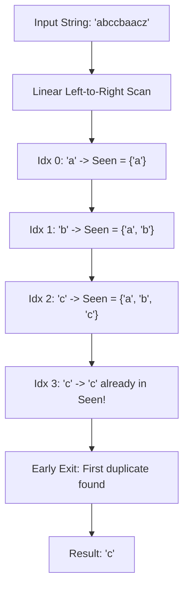

# Guided Example: First Letter to Appear Twice

## 1. Problem Overview & Representative Instance

We are given a string `s` consisting of lowercase English letters. We are tasked with finding the first letter to appear twice. The problem specifies that a letter $x$ appears twice before another letter $y$ if the second occurrence of $x$ occurs at a strictly smaller index than the second occurrence of $y$. The problem guarantees that `s` contains at least one repeated character.

Consider the representative instance:
- `s = "abccbaacz"`
- String length: $n = 9$

Let us identify all occurrences of each character:
- Character `'a'` appears at indices $0, 5, 6$: its second occurrence is at index $5$.
- Character `'b'` appears at indices $1, 4$: its second occurrence is at index $4$.
- Character `'c'` appears at indices $2, 3, 7$: its second occurrence is at index $3$.
- Character `'z'` appears once at index $8$.

Comparing the indices of the second occurrences:
- Second occurrence of `'c'`: index $3$.
- Second occurrence of `'b'`: index $4$.
- Second occurrence of `'a'`: index $5$.

Because index $3 < 4 < 5$, the character whose second occurrence appears earliest is `'c'`. The algorithm must return `'c'`.

## 2. Mathematical & Algorithmic Principles

Let string $s$ be an indexed sequence of symbols $(s_0, s_1, \dots, s_{n-1})$ drawn from an alphabet $\Sigma = \{'a', \dots, 'z'\}$ with $|\Sigma| = 26$.
For each character $c \in \Sigma$, let its occurrence indices be denoted by the ordered set:

$$\text{Occ}(c) = \{i \in \{0, \dots, n-1\} \mid s_i = c\}$$

If $|\text{Occ}(c)| \ge 2$, let $\tau(c)$ denote the index of its second occurrence:

$$\tau(c) = \min \{j \in \text{Occ}(c) \mid j > \min \text{Occ}(c)\}$$

Our goal is to find the symbol $c^*$ that minimizes the second occurrence timestamp:

$$c^* = \arg\min_{c \in \Sigma, |\text{Occ}(c)| \ge 2} \tau(c)$$

### Equivalence to First Invariant Violation
Consider maintaining the prefix set of distinct characters observed up to index $t$:

$$P_t = \{s_0, s_1, \dots, s_t\}$$

At each index $t$:
- If $s_t \notin P_{t-1}$, then $s_t$ has appeared exactly once so far. The cardinality increases: $|P_t| = |P_{t-1}| + 1$.
- If $s_t \in P_{t-1}$, then $s_t$ has appeared at least once prior to $t$. Because this is the first index where $s_t \in P_{t-1}$ occurs, index $t$ is precisely the second occurrence of $s_t$.

By definition, the minimal index $t^*$ where $s_{t^*} \in P_{t^*-1}$ corresponds to:

$$t^* = \min \{t \in \{1, \dots, n-1\} \mid s_t \in P_{t-1}\} = \min_{c} \tau(c) = \tau(c^*)$$

Therefore, a single left-to-right scan that terminates upon the very first set membership collision is guaranteed to return $c^*$.

### The Pigeonhole Bounding Principle
Because $|\Sigma| = 26$, any prefix of length $27$ must contain at least two identical characters by Dirichlet's Pigeonhole Principle:

$$t^* \le |\Sigma| = 26$$

The search is mathematically guaranteed to terminate within at most $27$ character inspections (indices $0$ to $26$), irrespective of how long the input string $s$ is.

| State Component | Implementation Mechanism | Mathematical Role |
|---|---|---|
| Prefix Membership Set | 26-bit Integer Bitmask / Boolean Array | Tracks distinct characters seen in the current prefix |
| Collision Predicate | Bitwise AND / Set containment query | Detects whether the current character already appeared |
| Search Cursor | Index $t \in [0, 26]$ | Advances linearly until the first collision |

## 3. Step-by-Step Walkthrough with Intermediate State

Let us trace `s = "abccbaacz"`.
Initialize an empty set of seen characters: $S = \emptyset$.

### Step 0: Index 0, Character `'a'`
- Query membership: `'a' \in S \implies` False.
- Insert `'a'` into $S$: $S \leftarrow \{'a'\}$.
- State: $S = \{'a'\}$.

### Step 1: Index 1, Character `'b'`
- Query membership: `'b' \in S \implies` False.
- Insert `'b'` into $S$: $S \leftarrow \{'a', 'b'\}$.
- State: $S = \{'a', 'b'\}$.

### Step 2: Index 2, Character `'c'`
- Query membership: `'c' \in S \implies` False.
- Insert `'c'` into $S$: $S \leftarrow \{'a', 'b', 'c'\}$.
- State: $S = \{'a', 'b', 'c'\}$.

### Step 3: Index 3, Character `'c'`
- Query membership: `'c' \in S \implies` **True**.
- Collision detected: character `'c'` has already appeared at index $2$.
- Index $3$ is the second occurrence of `'c'`.
- Terminate scan immediately. Return `'c'`.

Subsequent indices ($4$ through $8$) are never evaluated, preventing redundant comparisons.

## 4. Comprehensive State Trace

The evaluation of each character up to the termination point is recorded in the table below.

| Step Index $t$ | Character $s_t$ | Alphabet Index ($0-25$) | Membership Query $s_t \in S_{t-1}$ | Collision? | Action Taken | Resulting Set $S_t$ |
|---|---|---|---|---|---|---|
| $0$ | `'a'` | $0$ | False | No | Insert `'a'` | $\{'a'\}$ |
| $1$ | `'b'` | $1$ | False | No | Insert `'b'` | $\{'a', 'b'\}$ |
| $2$ | `'c'` | $2$ | False | No | Insert `'c'` | $\{'a', 'b', 'c'\}$ |
| $3$ | `'c'` | $2$ | **True** | **Yes** | **Early Exit (Return `'c'`)** | Terminated |

## 5. Algorithmic Correctness & Soundness

1. **Minimality of Second Occurrence Index:**
   Suppose there exists some character $y \ne c^*$ with $\tau(y) < \tau(c^*)$. As the linear scan advances index-by-index, it would reach index $\tau(y)$ before index $\tau(c^*)$. At index $\tau(y)$, $y$ is already in the seen set (from its first occurrence), causing the algorithm to terminate and return $y$. This contradicts the assumption that $c^*$ was the first collision returned. Thus, the returned character strictly minimizes the second occurrence index.

2. **Independence from First Occurrence Order:**
   A common fallacy assumes the first letter in the string must be the first to repeat. In `s = "bacab"`, `'b'` appears first at index $0$, but repeats at index $4$. Meanwhile `'a'` appears at index $1$ and repeats at index $3$. Because $3 < 4$, `'a'` repeats before `'b'`. The membership collision correctly flags `'a'` at index $3$.

3. **Guaranteed Termination:**
   The problem guarantees that at least one character repeats. By the Pigeonhole Principle, the loop is guaranteed to find a collision within the first $27$ indices.

## 6. Edge Cases & Anti-Patterns

- **Immediate Consecutive Duplicate (`s = "aa"`):**
  - Index 0: seen = `{'a'}`.
  - Index 1: `'a'` repeats immediately at index 1. Returns `'a'`.
- **First Character Repeats Last (`s = "bacab"`):**
  - Index 0: 'b'
  - Index 1: 'a'
  - Index 2: 'c'
  - Index 3: 'a' repeats! Returns `'a'`.
- **Latest Possible Duplicate (27th character):**
  - 26 unique characters followed by a repetition of the first. The loop terminates on step 26 without error.
- **Anti-Pattern (Counting Full Frequencies First):**
  - Performing a complete pass over the entire string of length $n$ to compute total frequencies, and then finding the first character with count $\ge 2$, is incorrect. A character might appear 10 times at the end of the string while another character appears twice at the beginning. The second occurrence index dictates the answer, not total frequency.

## 7. Complexity Analysis

- **Time Complexity:** $\mathcal{O}(1)$ bounded time (or $\mathcal{O}(\min(n, |\Sigma|))$). Due to the Pigeonhole Principle on an alphabet of size $|\Sigma| = 26$, the loop executes at most $27$ iterations before returning. Each hash lookup or bitwise shift operation takes $\mathcal{O}(1)$ time. Thus, the running time is strictly bounded by a constant.
- **Space Complexity:** $\mathcal{O}(1)$ auxiliary space. The seen characters are stored in a single 32-bit integer bitmask (or a boolean array of length $26$), requiring constant space.
