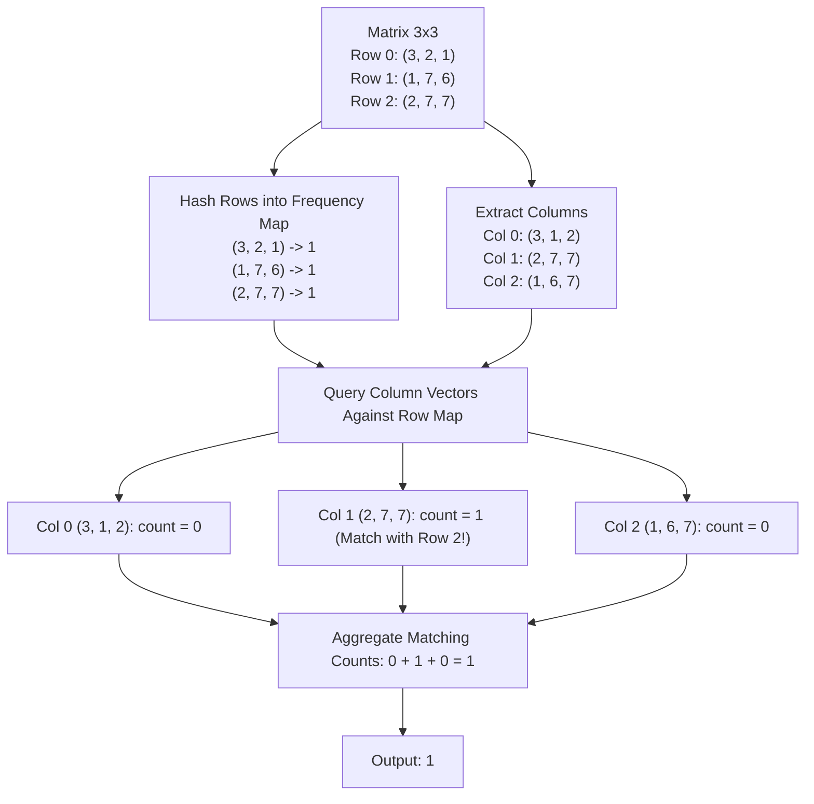

# Guided Example: Equal Row and Column Pairs

## 1. Problem Overview & Representative Instance

We are given an $n \times n$ integer matrix `grid`. A row-column pair $(r_i, c_j)$ is considered **equal** if row $i$ and column $j$ contain the exact same elements in the exact same order (that is, $grid[i][k] = grid[k][j]$ for all $0 \le k < n$). Our goal is to determine the total number of equal pairs $(r_i, c_j)$ across all combinations of $0 \le i, j < n$.

Consider the representative instance:
- `grid = [[3, 2, 1], [1, 7, 6], [2, 7, 7]]`
- Matrix dimensions: $n = 3$

Let us extract all three horizontal row tuples and all three vertical column tuples:
- **Row Tuples:**
  - Row 0: $(3, 2, 1)$
  - Row 1: $(1, 7, 6)$
  - Row 2: $(2, 7, 7)$
- **Column Tuples:**
  - Column 0: $(3, 1, 2)$
  - Column 1: $(2, 7, 7)$
  - Column 2: $(1, 6, 7)$

Comparing every row against every column:
- Row 0 $(3, 2, 1)$ matches no column.
- Row 1 $(1, 7, 6)$ matches no column.
- Row 2 $(2, 7, 7)$ matches Column 1 $(2, 7, 7)$ element-by-element:
  $$grid[2][0] = grid[0][1] = 2, \quad grid[2][1] = grid[1][1] = 7, \quad grid[2][2] = grid[2][1] = 7$$

There is exactly $1$ matching row-column pair: $(r_2, c_1)$. The answer is $1$.

## 2. Mathematical & Algorithmic Principles

Let $M \in \mathbb{Z}^{n \times n}$ denote the square grid. The $i$-th row vector $R_i \in \mathbb{Z}^n$ and the $j$-th column vector $C_j \in \mathbb{Z}^n$ are defined as:

$$R_i = (M_{i, 0}, M_{i, 1}, \dots, M_{i, n-1})$$

$$C_j = (M_{0, j}, M_{1, j}, \dots, M_{n-1, j})$$

The total number of equal row-column pairs is the double summation of the equality indicator:

$$\text{Total Pairs} = \sum_{i=0}^{n-1} \sum_{j=0}^{n-1} \mathbb{I}(R_i = C_j)$$

### Factorization via Multiset Multiplicities
Comparing all $n$ rows against all $n$ columns naively requires $n^2$ vector comparisons, where each vector comparison inspects $n$ coordinates, totaling $\mathcal{O}(n^3)$ operations.
We can factor the summation by grouping equal vectors into equivalence classes. Let $\mathcal{U} \subset \mathbb{Z}^n$ be the set of unique vector tuples. For each $v \in \mathcal{U}$:
- Let $f_{\text{row}}(v) = |\{i \in \{0, \dots, n-1\} \mid R_i = v\}|$ denote the multiplicity of vector $v$ as a row.
- Let $f_{\text{col}}(v) = |\{j \in \{0, \dots, n-1\} \mid C_j = v\}|$ denote the multiplicity of vector $v$ as a column.

Any row with value $v$ can be paired with any column with value $v$. The total number of valid pairs contributed by vector $v$ is the Cartesian product size:

$$\text{Total Pairs} = \sum_{v \in \mathcal{U}} f_{\text{row}}(v) \times f_{\text{col}}(v)$$

### Hash-Accelerated Evaluation
1. **Row Hashing:** Construct a hash map $H$ where keys are $n$-tuples and values are integer frequencies. Scan $i \in \{0, \dots, n-1\}$ and increment $H[R_i] \leftarrow H[R_i] + 1$.
2. **Column Probing:** For each column index $j \in \{0, \dots, n-1\}$, extract the tuple $C_j$. Add $H[C_j]$ (defaulting to 0 if absent) to our running answer:
   $$\text{ans} \leftarrow \text{ans} + H[C_j]$$

This achieves optimal $\mathcal{O}(n^2)$ time because reading each cell and computing tuple hashes is linear in the number of matrix entries.

| Vector Role | Extraction Formula | Storage Format | Multiplicity Interpretation |
|---|---|---|---|
| Row Vector $R_i$ | Horizontal slice $grid[i][0 \dots n-1]$ | Key in Hash Table | Frequency of identical rows |
| Column Vector $C_j$ | Vertical slice $grid[0 \dots n-1][j]$ | Query Key against Hash Table | Each occurrence earns $f_{\text{row}}(C_j)$ pairs |

## 3. Step-by-Step Walkthrough with Intermediate State

We trace `grid = [[3, 2, 1], [1, 7, 6], [2, 7, 7]]` with $n = 3$.

### Phase 1: Row Vector Registration
Initialize frequency map $H = \emptyset$.
- **Row 0:** Tuple is $(3, 2, 1)$.
  - Record: $H[(3, 2, 1)] = 1$.
- **Row 1:** Tuple is $(1, 7, 6)$.
  - Record: $H[(1, 7, 6)] = 1$.
- **Row 2:** Tuple is $(2, 7, 7)$.
  - Record: $H[(2, 7, 7)] = 1$.

Final frequency map contains $3$ distinct entries:
- $(3, 2, 1) \mapsto 1$
- $(1, 7, 6) \mapsto 1$
- $(2, 7, 7) \mapsto 1$

### Phase 2: Column Vector Extraction & Accumulation
Initialize $\text{ans} = 0$.
- **Column 0 ($j = 0$):**
  - Elements: $grid[0][0]=3, grid[1][0]=1, grid[2][0]=2 \implies (3, 1, 2)$.
  - Query $H[(3, 1, 2)]$: Key not found.
  - Matches: $0$.
  - State: $\text{ans} = 0$.
- **Column 1 ($j = 1$):**
  - Elements: $grid[0][1]=2, grid[1][1]=7, grid[2][1]=7 \implies (2, 7, 7)$.
  - Query $H[(2, 7, 7)]$: Found with frequency $1$ (originating from Row 2).
  - Matches: $1$.
  - Update: $\text{ans} \leftarrow 0 + 1 = 1$.
  - State: $\text{ans} = 1$.
- **Column 2 ($j = 2$):**
  - Elements: $grid[0][2]=1, grid[1][2]=6, grid[2][2]=7 \implies (1, 6, 7)$.
  - Query $H[(1, 6, 7)]$: Key not found.
  - Matches: $0$.
  - State: $\text{ans} = 1$.

Column iteration complete. Final matching pair count: $1$.

## 4. Comprehensive State Trace

The full comparison between all rows and columns is summarized in the matrix trace table below.

| Row Index $i$ | Row Vector $R_i$ | Col 0: $(3, 1, 2)$ | Col 1: $(2, 7, 7)$ | Col 2: $(1, 6, 7)$ | Row Matching Total |
|---|---|---|---|---|---|
| $0$ | $(3, 2, 1)$ | Mismatch ($2 \ne 1$) | Mismatch ($3 \ne 2$) | Mismatch ($2 \ne 6$) | $0$ |
| $1$ | $(1, 7, 6)$ | Mismatch ($1 \ne 3$) | Mismatch ($1 \ne 2$) | Mismatch ($7 \ne 6$) | $0$ |
| $2$ | $(2, 7, 7)$ | Mismatch ($7 \ne 1$) | **Equal Match** | Mismatch ($2 \ne 1$) | $1$ (Pair $(2, 1)$) |
| **Total** | — | $0$ | $1$ | $0$ | **Global Answer: 1** |

## 5. Algorithmic Correctness & Soundness

1. **Exact Vector Equality:**
   A row vector $R_i$ and column vector $C_j$ match if and only if all $n$ corresponding coordinates are identical. Tuple equality strictly enforces ordered element-by-element equality.

2. **Full Multiplicity Accounting:**
   If multiple rows have the identical vector $v$ (say count $a$) and multiple columns have the identical vector $v$ (say count $b$), then each of the $a$ rows can be paired with each of the $b$ columns, creating $a \times b$ valid pairs. Incrementing by $H[C_j]$ for every matching column correctly accumulates $\sum_{j} H[C_j] = \sum_{v} a \times b$.

3. **Orthogonality of Indices:**
   A row and column sharing the same numerical index ($i = j$) are distinct geometric entities (one horizontal, one vertical). Self-intersection is valid: if a row matches the column with the same index, it is legitimately counted.

## 6. Edge Cases & Anti-Patterns

- **Duplicate Rows and Columns (`grid = [[3, 1, 2, 2], [1, 4, 4, 5], [2, 4, 2, 2], [2, 4, 2, 2]]`):**
  - Row 2 and Row 3 are identical: `(2, 4, 2, 2)`.
  - Col 2 is `(2, 4, 2, 2)`.
  - Both Row 2 and Row 3 match Col 2, producing $2$ distinct pairs: $(2, 2)$ and $(3, 2)$.
- **Symmetric Matrix ($M = M^T$):**
  - Every row $i$ is identical to column $i$.
  - At least $n$ equal pairs are guaranteed (one along the main diagonal for each $i$).
- **Single Element Matrix (`grid = [[5]]`):**
  - $n = 1$. Row 0 is `(5)`, Col 0 is `(5)`. Total pairs: $1$.
- **Anti-Pattern (Comparing Elements without Positional Order):**
  - Checking multiset equality (e.g., matching sorted rows to sorted columns) is incorrect. The elements must match at the exact same index positions.

## 7. Complexity Analysis

- **Time Complexity:** $\mathcal{O}(n^2)$, where $n$ is the number of rows/columns in `grid`.
  - There are $n^2$ total integers in the matrix.
  - Hashing $n$ rows of length $n$ takes $\mathcal{O}(n^2)$ time.
  - Extracting and looking up $n$ columns of length $n$ takes $\mathcal{O}(n^2)$ time.
  - Overall time is $\mathcal{O}(n^2)$, which is asymptotically optimal since every matrix entry must be inspected.
- **Space Complexity:** $\mathcal{O}(n^2)$ auxiliary space to store the row tuples in the hash map.
