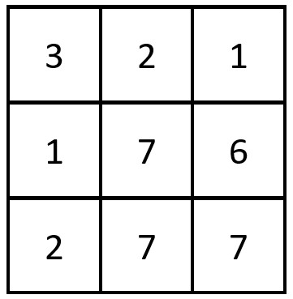
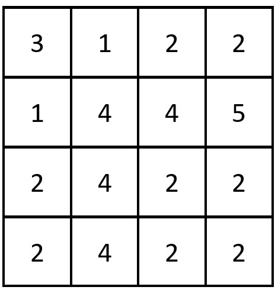

### 1. Description

Given a **0-indexed** `n x n` integer matrix `grid`, *return the number of pairs *$(r_{i}, c_{j})$* such that row *$r_{i}$* and column *$c_{j}$* are equal*.

A row and column pair is considered equal if they contain the same elements in the same order (i.e., an equal array).

### 2. Function Contract

- `n`: Input parameter.
- Returns expected result.

### 3. Examples

#### Example 1

- **Input:** `grid = [[3,2,1],[1,7,6],[2,7,7]]`
- **Output:** `1`
- **Explanation:** There is 1 equal row and column pair:
- (Row 2, Column 1): [2,7,7]
#### Example 2

- **Input:** `grid = [[3,1,2,2],[1,4,4,5],[2,4,2,2],[2,4,2,2]]`
- **Output:** `3`
- **Explanation:** There are 3 equal row and column pairs:
- (Row 0, Column 0): [3,1,2,2]
- (Row 2, Column 2): [2,4,2,2]
- (Row 3, Column 2): [2,4,2,2]

### 4. Constraints

- $n = \text{grid.length} = \text{grid}[i].length$

- $1 \le n \le 200$

- $1 \le \text{grid}[i][j] \le 10^{5}$