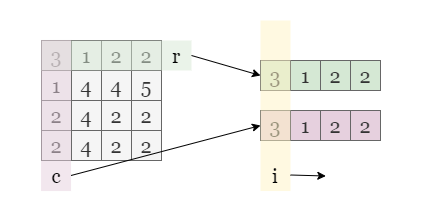
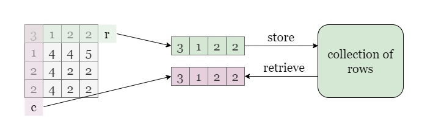
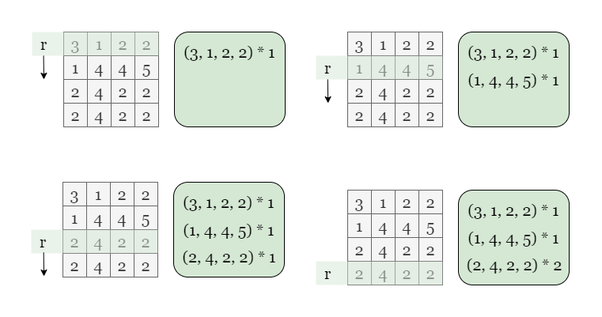
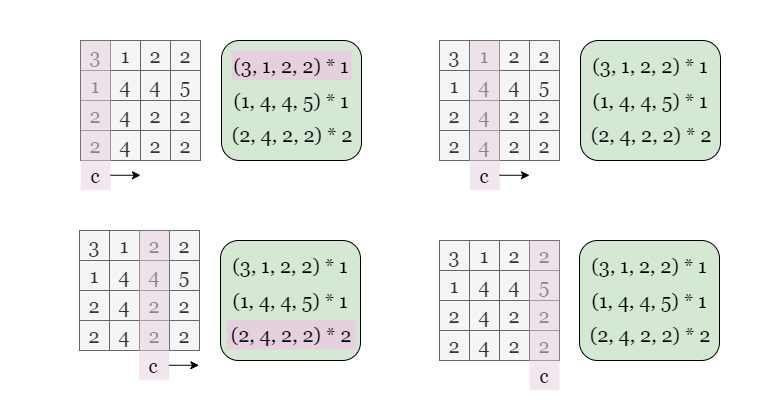
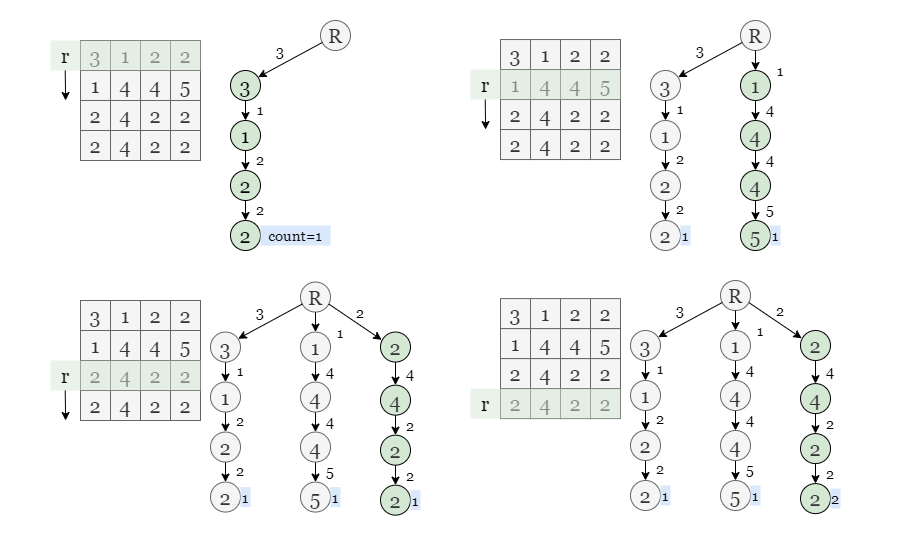
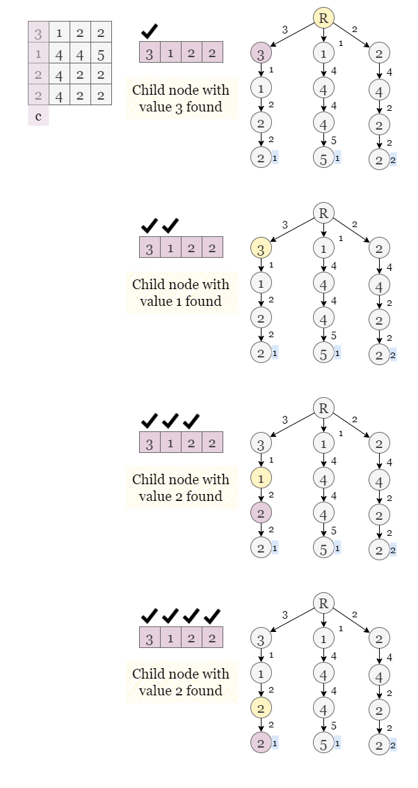
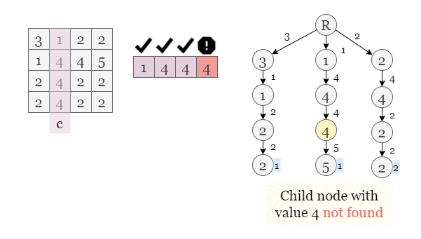

[TOC]

## Solution

---

### Approach 1: Brute Force

#### Intuition

Let's start with the most intuitive approach, which is brute force. Since we need to find the number of matching rows and columns, we traverse through every possible combination of rows and columns (row R, col C) and check if all elements at the same position in R and C are equal to each other.



<br>

#### Algorithm

1) Initialize `count` to 0.

2) Iterate over each row R in `grid`.

3) For each row, iterate over each column C in `grid`.

4) Check if row R equals column C by comparing each element at the same index `i` in both R and C. If row R equals column C, increment `count` by 1.

5) Return `count` after iterating over all row-column pairs.

#### Implementation

```python
class Solution:
    def equalPairs(self, grid: List[List[int]]) -> int:
        count = 0
        n = len(grid)

        # Check each row r against each column c.
        for r in range(n):
            for c in range(n):
                match = True

                # Iterate over row r and column c.
                for i in range(n):
                    if grid[r][i] != grid[i][c]:
                        match = False
                        break

                # If row r equals column c, increment count by 1.
                count += int(match)

        return count
```

#### Complexity Analysis

Let $n \times n$ be the size of `grid`.

* Time complexity: $O(n^3)$

- There are a total of $O(n^2)$ pairs when iterating over each row R and column C. Traversing each element in R and C takes $O(n)$ time.

* Space complexity: $O(1)$

- we are use constant amount of extra space to store the answer `count`.

<br/>

---

### Approach 2: Hash Map

#### Intuition

The brute force approach involves comparing each row R with each column C, resulting in a time complexity of $O(n^3)$. However, we can optimize this approach by using a hash map data structure to reduce the time complexity.

In this approach, we can consider each row as the key and store it in a hash map. The corresponding value for each key would be the frequency of that row in the grid. Then, we can traverse through each column of the grid and increment the answer by the frequency of the equivalent row in the hash map.



Taking the example shown in the picture, we traverse each row of the grid and use it as a key and record its frequency in a hash map.

> Note that arrays cannot typically be used as keys, so we need to convert them into equivalent **hashable** objects, such as tuples in Python or strings in Java. The converted object still maintains a one-to-one correspondence with the original object, allowing us to record the frequency of the original array by hash map.



Next, we traverse through each column of the grid, convert the array of each column into a hashable object of the same type as the previous keys, and then retrieve its number of occurrences in the hash map. This provides us with the number of rows in the grid that are equal to this column.



We found that `[3,1,2,2]` appears once and `[2,4,2,2]` appears twice. Therefore, the final answer is 3.

<br>

#### Algorithm

1) Create an empty hash map $\text{row}_{counter}$ and set `count` to 0.

2) For each row `row` in the grid, convert it into an equivalent hashable object and use it as a key to the $\text{row}_{counter}$. Increment the value of the corresponding key by 1.

3) For each column in the grid, convert it into the same type of hashable object and check if it appears in the $\text{row}_{counter}$. If it does, increment `count` by the frequency.

4) Return the answer `count`.

#### Implementation

```python
class Solution:
    def equalPairs(self, grid: List[List[int]]) -> int:
        count = 0
        n = len(grid)

        # Keep track of the frequency of each row.
        row_counter = collections.Counter(tuple(row) for row in grid)

        # Add up the frequency of each column in map.
        for c in range(n):
            col = [grid[i][c] for i in range(n)]
            count += row_counter[tuple(col)]

        return count
```

#### Complexity Analysis

Let $n \times n$ be the size of `grid`.

* Time complexity: $O(n^2)$

- We iterate over each row and column only once, converting one array of length $n$ into a hashable object takes $O(n)$ time.
- Operations like adding or checking on hash map take $O(1)$ time.

* Space complexity: $O(n^2)$

- We store each row of the grid in the hash map, in the worst-case scenario, $\text{row}_{counter}$ might contains $n$ distinct rows of length $n$.

<br/>

---

### Approach 3: Trie

#### Intuition

> If you are not familiar with trie, please refer to this problem [Implement Trie](https://leetcode.com/problems/implement-trie-prefix-tree/solution/). In this article, we will focus on the usage of trie rather than on implementation details.

Trie, also known as prefix tree, is a tree-like data structure which is often used to store strings (In this problem, we store arrays of integers instead of strings). The key advantage of trie is its efficient search time, which can be achieved in $O(n)$ time where $n$ is the length of the array. Trie works by storing each element of the array in a separate node, and each node has an array of children representing the possible characters that can follow the current element.

Depending on the requirements, we can modify the original trie by adding more elements. In this problem, we need to determine the frequency of each row, so we add a variable called `count` into the trie node. To construct the trie, we traverse each row of the grid and insert the row into the trie by traversing down the trie based on each element in the row. At the end of the row, we increment `count` associated with the last node in the trie to indicate that we have recorded the occurrence of this row.



To count the number of pairs of equal row and column, we traverse through each column $\text{col}_{array}$ of the grid and search for it in the trie by traversing down the trie based on each element in $\text{col}_{array}$. If we reach the end of the array and encounter a node, we know that there are rows in `grid` equal to this column, and we can increment the answer by the value of `count` of this node.



In the above image, we see that the value of `count` of the last node is 1, indicating that there is one row in the grid that matches the column $\text{col}_{array}$ we are searching for.

<br>

If we can't find a node associated with current value in $\text{col}_{array}$, it means that there is no such array stored in the trie that is equal to $\text{col}_{array}$, so we stop the search.



<br>

#### Algorithm

1) Initialize a empty trie $\text{my}_{trie}$ and set `count` as 0.

2) Insert each row of `grid` into $\text{my}_{trie}$.

3) Search for each column $\text{col}_{array}$ in the trie.

4) If the $\text{col}_{array}$ is found in the trie, add the frequency count to the `count`.

5) Return the answer `count`.

#### Implementation

```python
class TrieNode:
    def __init__(self):
        self.count = 0
        self.children = {}

class Trie:
    def __init__(self):
        self.trie = TrieNode()

    def insert(self, array):
        my_trie = self.trie
        for a in array:
            if a not in my_trie.children:
                my_trie.children[a] = TrieNode()
            my_trie = my_trie.children[a]
        my_trie.count += 1

    def search(self, array):
        my_trie = self.trie
        for a in array:
            if a in my_trie.children:
                my_trie = my_trie.children[a]
            else:
                return 0
        return my_trie.count

class Solution:
    def equalPairs(self, grid: List[List[int]]) -> int:
        my_trie = Trie()
        count = 0
        n = len(grid)

        for row in grid:
            my_trie.insert(row)

        for c in range(n):
            col_array = [grid[i][c] for i in range(n)]
            count += my_trie.search(col_array)

        return count
```

#### Complexity Analysis

Let $n \times n$ be the size of `grid`.

* Time complexity: $O(n^2)$

- The length of input rows is fixed to $n$, the time complexity of building a trie for $n$ rows is $O(n^2)$, since we need to traverse each element in the array to insert it into the trie.

- The time complexity of search an array of length $n$ is $O(n)$ as we need to iterate over the entire array in the worst-case scenario.

* Space complexity: $O(n^2)$

- In a trie, each node represents a number. Therefore, for $n$ rows of length $n$, the trie has $n^2$ nodes in the worst-case scenario.

<br/>