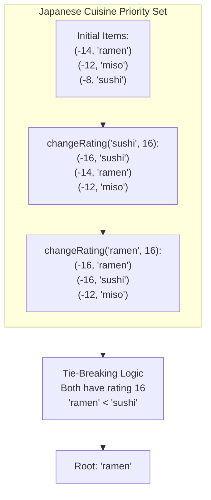

# Guided Example: Design a Food Rating System

## 1. Problem Overview & Representative Instance

We are tasked with designing a food rating system that maintains a menu of food items, their associated culinary cuisines, and their current numeric ratings. The system must support two primary operations:
1. **`changeRating(food, newRating)`:** Modifies the rating of the specified food item to `newRating`.
2. **`highestRated(cuisine)`:** Returns the name of the top-rated food item associated with the specified `cuisine`. If multiple food items in that cuisine tie for the highest rating, the tie is broken in favor of the food item with the strictly smaller lexicographical name.

Consider the representative instance initialized with the following menu:
- Korean cuisine: `"kimchi"` (rating $9$), `"bulgogi"` (rating $7$)
- Japanese cuisine: `"miso"` (rating $12$), `"sushi"` (rating $8$), `"ramen"` (rating $14$)
- Greek cuisine: `"moussaka"` (rating $15$)

Let us trace the following sequence of operations:
- Step 1: Query `highestRated("korean")`. The items are `"kimchi"` ($9$) and `"bulgogi"` ($7$). Highest rating is $9 \implies$ returns `"kimchi"`.
- Step 2: Query `highestRated("japanese")`. Ratings are `"ramen"` ($14$), `"miso"` ($12$), and `"sushi"` ($8$). Highest rating is $14 \implies$ returns `"ramen"`.
- Step 3: Call `changeRating("sushi", 16)`. The rating of `"sushi"` increases from $8$ to $16$.
- Step 4: Query `highestRated("japanese")`. Current ratings are `"sushi"` ($16$), `"ramen"` ($14$), and `"miso"` ($12$). Highest rating is now $16 \implies$ returns `"sushi"`.
- Step 5: Call `changeRating("ramen", 16)`. The rating of `"ramen"` increases from $14$ to $16$.
- Step 6: Query `highestRated("japanese")`. Both `"sushi"` and `"ramen"` share the peak rating of $16$. Comparing names lexicographically: `"ramen"` precedes `"sushi"` (`"ramen" < "sushi"`). Returns `"ramen"`.

## 2. Mathematical & Algorithmic Principles

Let $\mathcal{F}$ denote the set of all food items, and let $\mathcal{C}$ denote the set of cuisines. The food rating system maintains two coupled functions:
- $\text{cuisine}: \mathcal{F} \to \mathcal{C}$ (static mapping from each food item to its unique cuisine)
- $\text{rating}: \mathcal{F} \to \mathbb{Z}^+$ (dynamic mapping from each food item to its current rating)

The query `highestRated(c)` seeks the food item:

$$f^* = \arg\min_{f \in \mathcal{F}, \text{cuisine}(f) = c} \left( -\text{rating}(f), \; f \right)$$

where the minimization is taken under standard lexicographical tuple comparison on $\mathbb{Z} \times \Sigma^*$.

### The Composite Key Representation
Notice how the tuple $(-\text{rating}(f), f)$ naturally encodes the desired priority:
1. **Primary Key ($-\text{rating}(f)$):** Minimizing the negated rating is mathematically equivalent to maximizing the positive rating:
   $$-\text{rating}(a) < -\text{rating}(b) \iff \text{rating}(a) > \text{rating}(b)$$
2. **Secondary Key ($f$):** If two food items share the same rating ($-\text{rating}(a) = -\text{rating}(b)$), the tuple order falls back to string comparison $a <_{\text{lex}} b$.

Under this total order, the minimal element of the set is unconditionally the correct highest-rated food item.

### Structural Architecture: Hash Table + Balanced Trees / Heaps
To avoid linear scans of cuisine menus:
- **Food Registry (Hash Map):** Maps each food item $f$ to its current metadata: $f \mapsto (\text{rating}(f), \text{cuisine}(f))$. This allows constant-time retrieval of a food item's previous rating during updates.
- **Cuisine Priority Structures (Hash Map of Ordered Sets or Min-Heaps):** Maps each cuisine $c$ to an ordered set or binary min-heap storing tuples $(-\text{rating}(f), f)$.

### Eager Deletion vs. Lazy Invalidation
- **Eager Deletion (Balanced BST / Skip List):**
  Upon `changeRating(f, r_{\text{new}})`:
  Lookup old rating $r_{\text{old}}$ and cuisine $c$.
  Remove $(-r_{\text{old}}, f)$ from the tree for cuisine $c$.
  Insert $(-r_{\text{new}}, f)$ into the tree.
  Both operations take $\mathcal{O}(\log K)$ time, where $K$ is the number of items in that cuisine.
- **Lazy Heap Invalidation:**
  Push $(-r_{\text{new}}, f)$ onto the min-heap for cuisine $c$.
  During `highestRated(c)`: peek at the top tuple $(-r, f)$. If $r \ne \text{rating}(f)$ (the entry is obsolete), pop and discard it. Repeat until a fresh entry is found.

| Data Structure Role | Target Entity | Invariant Maintained | Time Cost |
|---|---|---|---|
| Food Lookup Map | Food Name $\to$ (Rating, Cuisine) | Exact current rating and immutable cuisine | $\mathcal{O}(1)$ query |
| Cuisine Priority Collection | Cuisine $\to$ Ordered Tuples $(-\text{rating}, \text{food})$ | Minimal tuple contains top food item | $\mathcal{O}(\log K)$ update/peek |

## 3. Step-by-Step Walkthrough with Intermediate State

Let us trace the representative sequence through the composite-key ordered structure.

### Initialization
- Registry:
  - `"kimchi"` $\mapsto (9, \text{"korean"})$
  - `"bulgogi"` $\mapsto (7, \text{"korean"})$
  - `"miso"` $\mapsto (12, \text{"japanese"})$
  - `"sushi"` $\mapsto (8, \text{"japanese"})$
  - `"ramen"` $\mapsto (14, \text{"japanese"})$
  - `"moussaka"` $\mapsto (15, \text{"greek"})$
- Priority Sets:
  - Korean: $\{(-9, \text{"kimchi"}), (-7, \text{"bulgogi"})\}$
  - Japanese: $\{(-14, \text{"ramen"}), (-12, \text{"miso"}), (-8, \text{"sushi"})\}$
  - Greek: $\{(-15, \text{"moussaka"})\}$

### Step 1: `highestRated("korean")`
- Inspect minimal element of Korean set: $(-9, \text{"kimchi"})$.
- Food name at index 1 of tuple: `"kimchi"`.
- Return `"kimchi"`.

### Step 2: `highestRated("japanese")`
- Inspect minimal element of Japanese set: $(-14, \text{"ramen"})$.
- Food name: `"ramen"`.
- Return `"ramen"`.

### Step 3: `changeRating("sushi", 16)`
- Lookup `"sushi"` in registry: old rating $8$, cuisine `"japanese"`.
- Update registry: `"sushi"` $\mapsto (16, \text{"japanese"})$.
- Remove old tuple $(-8, \text{"sushi"})$ from Japanese set.
- Insert new tuple $(-16, \text{"sushi"})$ into Japanese set.
- Updated Japanese set: $\{(-16, \text{"sushi"}), (-14, \text{"ramen"}), (-12, \text{"miso"})\}$.

### Step 4: `highestRated("japanese")`
- Inspect minimal element of Japanese set: $(-16, \text{"sushi"})$.
- Return `"sushi"`.

### Step 5: `changeRating("ramen", 16)`
- Lookup `"ramen"`: old rating $14$, cuisine `"japanese"`.
- Update registry: `"ramen"` $\mapsto (16, \text{"japanese"})$.
- Remove $(-14, \text{"ramen"})$ and insert $(-16, \text{"ramen"})$ into Japanese set.
- Updated Japanese set: $\{(-16, \text{"ramen"}), (-16, \text{"sushi"}), (-12, \text{"miso"})\}$.

### Step 6: `highestRated("japanese")`
- Inspect minimal element: compare $(-16, \text{"ramen"})$ and $(-16, \text{"sushi"})$.
- Primary keys equal ($-16 = -16$).
- Secondary keys: `"ramen" < "sushi"`.
- Minimal element is $(-16, \text{"ramen"})$.
- Return `"ramen"`.

## 4. Comprehensive State Trace

The state of the Japanese cuisine priority collection across the operation stream is summarized below.

| Step | Operation | Mutated Food | New Rating | Japanese Collection Tuples in Order | Top Tuple | Returned Value |
|---|---|---|---|---|---|---|
| $0$ | Initialization | — | — | $(-14, \text{"ramen"}), (-12, \text{"miso"}), (-8, \text{"sushi"})$ | $(-14, \text{"ramen"})$ | — |
| $2$ | `highestRated` | — | — | (Unchanged) | $(-14, \text{"ramen"})$ | `"ramen"` |
| $3$ | `changeRating` | `"sushi"` | $16$ | $(-16, \text{"sushi"}), (-14, \text{"ramen"}), (-12, \text{"miso"})$ | $(-16, \text{"sushi"})$ | null |
| $4$ | `highestRated` | — | — | (Unchanged) | $(-16, \text{"sushi"})$ | `"sushi"` |
| $5$ | `changeRating` | `"ramen"` | $16$ | $(-16, \text{"ramen"}), (-16, \text{"sushi"}), (-12, \text{"miso"})$ | $(-16, \text{"ramen"})$ | null |
| $6$ | `highestRated` | — | — | (Unchanged) | $(-16, \text{"ramen"})$ | `"ramen"` |

## 5. Algorithmic Correctness & Soundness

1. **Total Ordering of Composite Tuples:**
   Because food item names are guaranteed to be unique across the entire system, the secondary coordinate $f$ in $(-\text{rating}(f), f)$ is strictly unique. Hence, no two tuples in the priority collection can be equal, guaranteeing a well-defined strict total order.

2. **Equivalence of Lexicographical Tie-Breaking:**
   When ratings coincide, the negated rating components match: $-r_a = -r_b$. The tuple comparator directly resolves the equality by evaluating $a <_{\text{lex}} b$. Thus, the smaller string name naturally occupies the superior position in the min-collection.

3. **Consistency Under Re-Rating:**
   Updating a food item's rating removes its prior identity and inserts its updated tuple into the appropriate cuisine group. A food item can never have duplicate conflicting entries in an ordered set representation, preventing stale data contamination.

## 6. Edge Cases & Anti-Patterns

- **Single Food Item in Cuisine:**
  - That item is always returned regardless of its rating.
- **Identical Ratings with Deep Name Distinctions:**
  - Suppose `"apple_pie"` and `"apple_tart"` both have rating 10. `"apple_pie" < "apple_tart"`, so `"apple_pie"` is returned.
- **Repeated Rating Modifications:**
  - Increasing and decreasing the rating of the same item multiple times correctly shifts its position up and down within the cuisine set.
- **Anti-Pattern (Scanning all Foods on Query):**
  - Iterating through all $N$ food items to find the maximum during `highestRated` takes $\mathcal{O}(N)$ per query, resulting in time-limit exceeded when $10^5$ operations are performed.

## 7. Complexity Analysis

- **Time Complexity:**
  - **Initialization:** $\mathcal{O}(N \log N)$ to construct the priority structures for all $N$ initial food items.
  - **`changeRating(food, newRating)`:** $\mathcal{O}(\log K)$, where $K$ is the number of food items belonging to that cuisine ($K \le N$). Lookup in the food registry takes $\mathcal{O}(1)$ average time, and removing and re-inserting into the ordered set takes $\mathcal{O}(\log K)$ time.
  - **`highestRated(cuisine)`:** $\mathcal{O}(1)$ for ordered sets (reading the minimum element). For lazy min-heaps, peeking takes $\mathcal{O}(1)$ while popping stale entries takes amortized $\mathcal{O}(\log K)$ time per update.
- **Space Complexity:** $\mathcal{O}(N)$ auxiliary space to store the food registry and cuisine collections across all $N$ food items.
