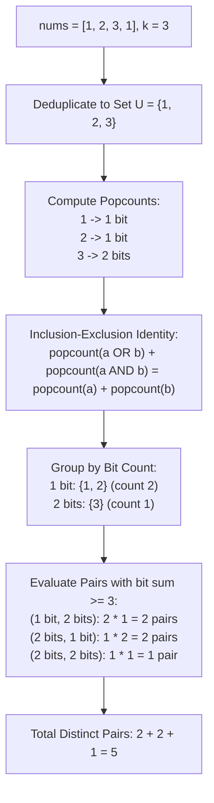

# Guided Example: Number of Excellent Pairs

## 1. Problem Overview & Representative Instance

We are given a 0-indexed positive integer array `nums` and a positive integer $k$. A pair of numbers $(a, b)$ is defined as **excellent** if:
1. Both $a$ and $b$ belong to the set of unique values in `nums`.
2. The total count of set bits (ones in binary representation) in $(a \text{ OR } b)$ plus the count of set bits in $(a \text{ AND } b)$ is at least $k$:
   $$\text{popcount}(a \text{ OR } b) + \text{popcount}(a \text{ AND } b) \ge k$$

We are asked to return the total number of distinct ordered pairs $(a, b)$ that are excellent. Note that pairs are formed over the unique values of `nums`; duplicate values in the input array do not produce duplicate distinct pairs, and a value can pair with itself (e.g. $(a, a)$ is a valid pair if its bit sum meets the condition).

Consider the representative instance:
- `nums = [1, 2, 3, 1]`
- Threshold: $k = 3$

First, deduplicate `nums` into its unique value set:
$$U = \{1, 2, 3\}$$

Now examine the popcount (number of set bits) of each unique element:
- $\text{popcount}(1) = \text{popcount}(01_2) = 1$
- $\text{popcount}(2) = \text{popcount}(10_2) = 1$
- $\text{popcount}(3) = \text{popcount}(11_2) = 2$

Let us test all $3 \times 3 = 9$ candidate ordered pairs $(a, b) \in U \times U$:
- $(1, 1)$: $\text{popcount}(1) + \text{popcount}(1) = 1 + 1 = 2 < 3$ (Invalid)
- $(1, 2)$: $\text{popcount}(1) + \text{popcount}(2) = 1 + 1 = 2 < 3$ (Invalid)
- $(1, 3)$: $\text{popcount}(1) + \text{popcount}(3) = 1 + 2 = 3 \ge 3$ (**Valid**)
- $(2, 1)$: $\text{popcount}(2) + \text{popcount}(1) = 1 + 1 = 2 < 3$ (Invalid)
- $(2, 2)$: $\text{popcount}(2) + \text{popcount}(2) = 1 + 1 = 2 < 3$ (Invalid)
- $(2, 3)$: $\text{popcount}(2) + \text{popcount}(3) = 1 + 2 = 3 \ge 3$ (**Valid**)
- $(3, 1)$: $\text{popcount}(3) + \text{popcount}(1) = 2 + 1 = 3 \ge 3$ (**Valid**)
- $(3, 2)$: $\text{popcount}(3) + \text{popcount}(2) = 2 + 1 = 3 \ge 3$ (**Valid**)
- $(3, 3)$: $\text{popcount}(3) + \text{popcount}(3) = 2 + 2 = 4 \ge 3$ (**Valid**)

Total excellent pairs: $5$.

## 2. Mathematical & Algorithmic Principles

For any non-negative integer $x$, let $\text{bitset}(x) = \{m \in \mathbb{N}_0 \mid (x \gg m) \mathbin{\&} 1 = 1\}$ be the set of bit positions where $x$ has a $1$. The popcount function is the set cardinality:

$$\text{popcount}(x) = |\text{bitset}(x)|$$

The bitwise operations correspond directly to set union and intersection:

$$\text{bitset}(a \text{ OR } b) = \text{bitset}(a) \cup \text{bitset}(b)$$

$$\text{bitset}(a \text{ AND } b) = \text{bitset}(a) \cap \text{bitset}(b)$$

### The Bitwise Inclusion-Exclusion Theorem
By the fundamental principle of inclusion-exclusion for finite sets:

$$|A \cup B| + |A \cap B| = |A| + |B|$$

Substituting the bitset representations yields the exact algebraic identity:

$$\text{popcount}(a \text{ OR } b) + \text{popcount}(a \text{ AND } b) = \text{popcount}(a) + \text{popcount}(b)$$

This identity decouples the joint bitwise relationship into independent scalar properties of $a$ and $b$. The condition for an excellent pair simplifies to:

$$\text{popcount}(a) + \text{popcount}(b) \ge k$$

### Popcount Histogram Aggregation
Because the condition depends solely on individual popcounts, we group unique numbers by their bit counts:
1. Let $U = \text{unique}(nums)$.
2. For each possible bit count $c \in \{0, \dots, 30\}$:
   $$H[c] = |\{x \in U \mid \text{popcount}(x) = c\}|$$
3. For any fixed unique element $a \in U$ with $\text{popcount}(a) = c_a$, the number of eligible partners $b \in U$ is:
   $$\text{eligible}(a) = \sum_{c_b = \max(0, k - c_a)}^{30} H[c_b]$$
4. Summing across all $a \in U$ gives the total distinct pairs:
   $$\text{Total Excellent Pairs} = \sum_{a \in U} \sum_{c_b \ge k - \text{popcount}(a)} H[c_b]$$

Because bit counts range only from $0$ to $30$ for 32-bit integers, the inner summation takes at most $31$ operations per unique element.

| Bit Structure | Set Theory Dual | Property Value | Contribution to Sum |
|---|---|---|---|
| Bitwise OR $a \mid b$ | Set Union $\text{bitset}(a) \cup \text{bitset}(b)$ | $|\text{bitset}(a) \cup \text{bitset}(b)|$ | Adds union size |
| Bitwise AND $a \mathbin{\&} b$ | Set Intersection $\text{bitset}(a) \cap \text{bitset}(b)$ | $|\text{bitset}(a) \cap \text{bitset}(b)|$ | Adds intersection size |
| Decoupled Form | Sum of Cardinals $|A| + |B|$ | $\text{popcount}(a) + \text{popcount}(b)$ | Linearizes pair test |

## 3. Step-by-Step Walkthrough with Intermediate State

Let us trace `nums = [1, 2, 3, 1]` with $k = 3$.

### Phase 1: Deduplication
Input array: `[1, 2, 3, 1]`.
Set of unique values: $U = \{1, 2, 3\}$.
Total unique elements: $|U| = 3$.

### Phase 2: Compute Popcounts & Build Histogram
Compute set bits for each unique element:
- Element $1$: binary $001_2 \implies$ bit count $1$.
- Element $2$: binary $010_2 \implies$ bit count $1$.
- Element $3$: binary $011_2 \implies$ bit count $2$.

Construct frequency histogram $H$ of bit counts:
- $H[1] = 2$ (elements $1$ and $2$)
- $H[2] = 1$ (element $3$)
- All other $H[c] = 0$.

### Phase 3: Sum Eligible Partners
Iterate through all unique elements $a \in U$:
- **Element $a = 1$:**
  - $\text{popcount}(a) = 1$.
  - Required partner bit count: $c_b \ge k - 1 = 3 - 1 = 2$.
  - Eligible bit counts: $c_b \ge 2 \implies H[2] = 1$.
  - Eligible partners: $1$ (namely, element $3$).
  - Cumulative answer: $0 + 1 = 1$.
- **Element $a = 2$:**
  - $\text{popcount}(a) = 1$.
  - Required partner bit count: $c_b \ge 3 - 1 = 2$.
  - Eligible bit counts: $H[2] = 1$.
  - Eligible partners: $1$ (element $3$).
  - Cumulative answer: $1 + 1 = 2$.
- **Element $a = 3$:**
  - $\text{popcount}(a) = 2$.
  - Required partner bit count: $c_b \ge 3 - 2 = 1$.
  - Eligible bit counts: $H[1] + H[2] = 2 + 1 = 3$.
  - Eligible partners: $3$ (elements $1, 2, 3$).
  - Cumulative answer: $2 + 3 = 5$.

Final count of excellent pairs: $5$.

## 4. Comprehensive State Trace

The state of all $9$ potential unique pairs is tabulated below.

| Pair $(a, b)$ | Binary $a$ | Binary $b$ | $\text{popcount}(a)$ | $\text{popcount}(b)$ | Sum of Popcounts | Condition $\ge 3$? | Status |
|---|---|---|---|---|---|---|---|
| $(1, 1)$ | $01_2$ | $01_2$ | $1$ | $1$ | $2$ | False | Ineligible |
| $(1, 2)$ | $01_2$ | $10_2$ | $1$ | $1$ | $2$ | False | Ineligible |
| $(1, 3)$ | $01_2$ | $11_2$ | $1$ | $2$ | $3$ | **True** | **Excellent Pair** |
| $(2, 1)$ | $10_2$ | $01_2$ | $1$ | $1$ | $2$ | False | Ineligible |
| $(2, 2)$ | $10_2$ | $10_2$ | $1$ | $1$ | $2$ | False | Ineligible |
| $(2, 3)$ | $10_2$ | $11_2$ | $1$ | $2$ | $3$ | **True** | **Excellent Pair** |
| $(3, 1)$ | $11_2$ | $01_2$ | $2$ | $1$ | $3$ | **True** | **Excellent Pair** |
| $(3, 2)$ | $11_2$ | $10_2$ | $2$ | $1$ | $3$ | **True** | **Excellent Pair** |
| $(3, 3)$ | $11_2$ | $11_2$ | $2$ | $2$ | $4$ | **True** | **Excellent Pair** |

Sum of eligible pairs: $1 + 1 + 1 + 1 + 1 = 5$.

## 5. Algorithmic Correctness & Soundness

1. **Exact Equivalence of Inclusion-Exclusion:**
   Because the bitwise OR accounts for bits set in either operand and the bitwise AND accounts for bits set in both operands, every bit set in $a$ contributes exactly $1$ to the sum, and every bit set in $b$ contributes exactly $1$ to the sum. The identity $\text{popcount}(a \text{ OR } b) + \text{popcount}(a \text{ AND } b) = \text{popcount}(a) + \text{popcount}(b)$ holds with mathematical certainty.

2. **Deduplication Invariant:**
   The problem specifies counting distinct pairs of numbers from `nums`. Forming pairs over the unique set $U$ ensures that multiplicity in the input array does not falsely inflate the pair count.

3. **Self-Pair Soundness:**
   A distinct pair $(a, a)$ with $a \in U$ satisfies $\text{popcount}(a \text{ OR } a) + \text{popcount}(a \text{ AND } a) = 2 \cdot \text{popcount}(a)$. Our condition $2 \cdot \text{popcount}(a) \ge k$ matches this test.

## 6. Edge Cases & Anti-Patterns

- **Single Element Forming Self-Pair (`nums = [1]`, $k = 2$):**
  - $\text{popcount}(1) = 1$.
  - Pair $(1, 1)$ has bit sum $1 + 1 = 2 \ge 2$. Returns $1$.
- **Large Threshold Exceeding All Combinations (`nums = [5, 1, 1]`, $k = 10$):**
  - Unique numbers have at most $2$ bits. Max bit sum is $2 + 2 = 4 < 10$.
  - Returns $0$.
- **All Elements Identical (`nums = [7, 7, 7, 7]`, $k = 3$):**
  - $U = \{7\}$. Popcount is $3$.
  - Pair $(7, 7)$ has bit sum $3 + 3 = 6 \ge 3$. Returns $1$.
- **Anti-Pattern (Pairwise Bitwise Simulation):**
  - Testing every pair $(a, b)$ with $(a \text{ OR } b)$ and $(a \text{ AND } b)$ requires $\mathcal{O}(|U|^2)$ time, which times out when $|U| = 10^5$. Decoupling via popcount histogram reduces execution to $\mathcal{O}(n + |U| \cdot B)$ where $B \le 30$.

## 7. Complexity Analysis

- **Time Complexity:** $\mathcal{O}(n + |U| \cdot B)$, where $n$ is the length of `nums`, $|U| \le n$ is the count of unique elements, and $B \le 30$ is the maximum number of bits.
  - Deduplicating $n$ integers into a set takes $\mathcal{O}(n)$ average time.
  - Computing popcount for each unique integer takes $\mathcal{O}(|U|)$ time.
  - Populating and querying the $B$-element frequency array takes $\mathcal{O}(|U| \cdot B)$ time.
  - Since $B \le 30$ is a small constant, overall time is strictly linear $\mathcal{O}(n)$.
- **Space Complexity:** $\mathcal{O}(|U|)$ auxiliary space to store the set of unique values and an $\mathcal{O}(B)$ fixed-size array for bit count frequencies.