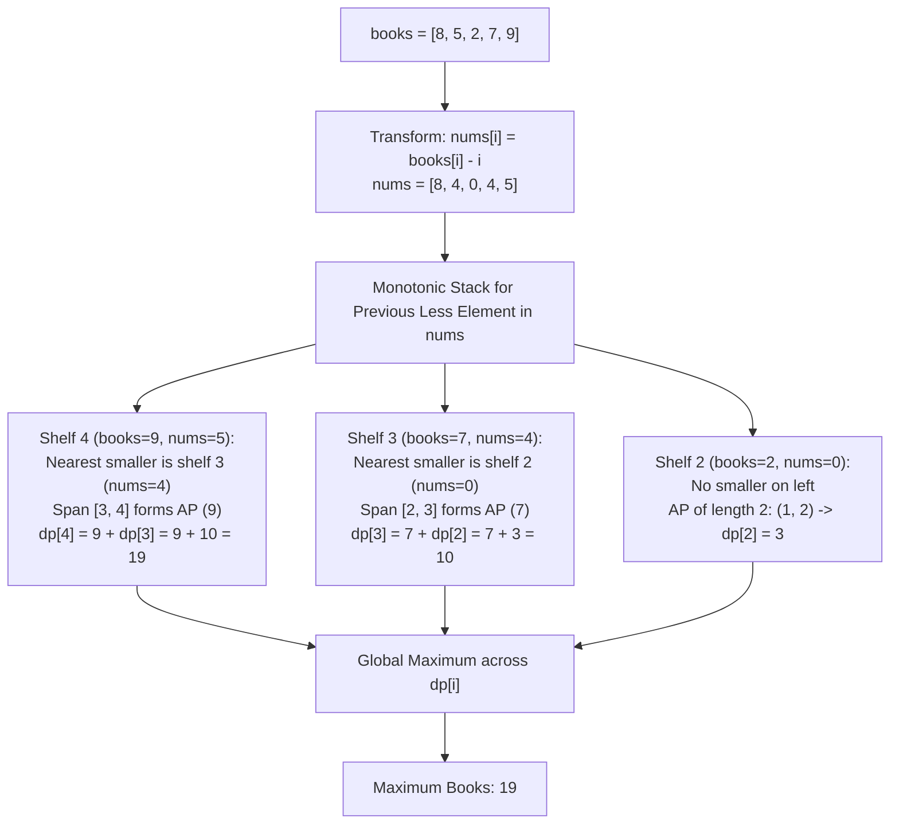

# Guided Example: Maximum Number of Books You Can Take

## 1. Problem Overview & Representative Instance

We are given a 0-indexed integer array `books` of length $n$, where `books[i]` represents the number of books available on the $i$-th shelf. We wish to select a contiguous range of shelves $[l, r]$ ($0 \le l \le r < n$) and take books from each shelf in this range such that:
1. For every shelf $i \in [l, r]$, the number of books taken $t_i$ satisfies $1 \le t_i \le books[i]$.
2. For every adjacent pair of shelves $i, i+1$ within the range ($l \le i < r$), the number of books taken is strictly increasing: $t_i < t_{i+1}$.

Our goal is to maximize the total number of books taken: $\sum_{i=l}^r t_i$.

Consider the representative instance:
- `books = [8, 5, 2, 7, 9]`
- Array length: $n = 5$

Let us test choosing the rightmost shelf $r = 4$ (with capacity $books[4] = 9$) as our terminal shelf:
- Shelf 4: take $t_4 = 9$ books (capacity $9$).
- Shelf 3: must satisfy $t_3 < 9$ and $t_3 \le books[3] = 7$. Optimal take is $t_3 = \min(7, 8) = 7$ books.
- Shelf 2: must satisfy $t_2 < 7$ and $t_2 \le books[2] = 2$. Optimal take is $t_2 = \min(2, 6) = 2$ books.
- Shelf 1: must satisfy $t_1 < 2$ and $t_1 \le books[1] = 5$. Optimal take is $t_1 = \min(5, 1) = 1$ book.
- Shelf 0: must satisfy $t_0 < 1 \implies t_0 \le 0$, so no positive books can be taken from shelf 0 or earlier.

The chosen contiguous range of shelves is $[l, r] = [1, 4]$ with book counts:
$$t = [1, 2, 7, 9]$$
Total books taken: $1 + 2 + 7 + 9 = 19$. No other contiguous interval yields a larger sum. The answer is $19$.

## 2. Mathematical & Algorithmic Principles

Let $t_k$ denote the number of books taken from shelf $k$. The strictly increasing condition requires:

$$t_{k-1} \le t_k - 1 \iff t_k - t_{k-1} \ge 1$$

Iterating this inequality backwards from rightmost shelf $i$ with $t_i = books[i]$:

$$t_{i-d} \le books[i] - d \quad \text{for all } d \ge 0$$

Simultaneously, we must respect shelf capacities: $t_k \le books[k]$. Therefore:

$$t_k \le \min(books[k], \; books[i] - (i - k))$$

Rewriting the capacity bottleneck condition $books[k] < books[i] - (i - k)$:

$$books[k] - k < books[i] - i$$

### The Linear Slope Coordinate Transformation
Define the shifted potential array:

$$A[k] = books[k] - k$$

A prior shelf $j < i$ bottlenecks shelf $i$'s unconstrained arithmetic progression if and only if:

$$A[j] < A[i]$$

Let $j$ be the **nearest smaller element to the left** of index $i$ in array $A$:

$$j = \max \{k \in \{0, \dots, i-1\} \mid A[k] < A[i]\}$$

If no such shelf exists, set $j = -1$.

### Dynamic Programming Decomposition
For all shelves $k \in \{j+1, \dots, i\}$, no shelf bottlenecks the progression because $A[k] \ge A[i] \implies books[k] \ge books[i] - (i - k)$.
On this subsegment, we take an unconstrained arithmetic progression ending at $books[i]$ with common difference $1$:
1. The available length of this progression is $i - j$.
2. The progression cannot drop below $1$, so its length is bounded by $books[i]$:
   $$\text{cnt} = \min(books[i], \; i - j)$$
3. The smallest term taken in this progression is:
   $$u = books[i] - \text{cnt} + 1$$
4. The sum of this arithmetic progression is:
   $$S = \frac{(u + books[i]) \cdot \text{cnt}}{2}$$

If the progression is capped by shelf $j$ (which occurs when $\text{cnt} = i - j$ and $j \ge 0$), the optimal configuration directly chains onto the optimal solution ending at shelf $j$:

$$dp[i] = S + dp[j]$$

If the progression terminates because book counts reach $1$ before reaching shelf $j$ ($\text{cnt} < i - j$ or $j = -1$), no books can be taken from shelf $j$ or earlier, so $dp[i] = S$.

A monotonic increasing stack computes all nearest smaller elements $j$ in linear time $\mathcal{O}(n)$.

| State Variable | Mathematical Definition | Role in Algorithm |
|---|---|---|
| Transformed Array $A[i]$ | $books[i] - i$ | Enables nearest smaller element lookup via monotonic stack |
| Bottleneck Shelf $j$ | $\max \{k < i \mid A[k] < A[i]\}$ | Identifies where the arithmetic progression transitions |
| Segment Count $\text{cnt}$ | $\min(books[i], i - j)$ | Number of terms in the rightmost continuous progression |
| Subproblem Value $dp[i]$ | Max books taken ending at shelf $i$ | Reuses optimal sub-answer from shelf $j$ |

## 3. Step-by-Step Walkthrough with Intermediate State

Let us trace `books = [8, 5, 2, 7, 9]` with $n = 5$.

### Phase 1: Coordinate Shift
Compute $A[i] = books[i] - i$:
- $A[0] = 8 - 0 = 8$
- $A[1] = 5 - 1 = 4$
- $A[2] = 2 - 2 = 0$
- $A[3] = 7 - 3 = 4$
- $A[4] = 9 - 4 = 5$
Transformed array: $A = [8, 4, 0, 4, 5]$.

### Phase 2: Compute Left Bottlenecks via Monotonic Stack
We maintain a stack of indices with strictly increasing values of $A$:
- **Index 0 ($A[0] = 8$):** Stack empty $\implies j = -1$. Push $0$.
- **Index 1 ($A[1] = 4$):** Pop $0$ ($8 \ge 4$). Stack empty $\implies j = -1$. Push $1$.
- **Index 2 ($A[2] = 0$):** Pop $1$ ($4 \ge 0$). Stack empty $\implies j = -1$. Push $2$.
- **Index 3 ($A[3] = 4$):** Top is $2$ ($A[2] = 0 < 4$). Stack top valid $\implies j = 2$. Push $3$.
- **Index 4 ($A[4] = 5$):** Top is $3$ ($A[3] = 4 < 5$). Stack top valid $\implies j = 3$. Push $4$.

Bottleneck array: $left = [-1, -1, -1, 2, 3]$.

### Phase 3: Dynamic Programming Recurrence
- **Shelf 0 ($books[0] = 8, j = -1$):**
  - $\text{cnt} = \min(8, 0 - (-1)) = 1$.
  - Progression: $[8]$. Sum: $S = 8$.
  - $dp[0] = 8$.
- **Shelf 1 ($books[1] = 5, j = -1$):**
  - $\text{cnt} = \min(5, 1 - (-1)) = 2$.
  - Smallest term: $5 - 2 + 1 = 4$. Progression: $[4, 5]$.
  - Sum: $S = \frac{(4 + 5) \cdot 2}{2} = 9$.
  - $dp[1] = 9$.
- **Shelf 2 ($books[2] = 2, j = -1$):**
  - $\text{cnt} = \min(2, 2 - (-1)) = 2$.
  - Smallest term: $2 - 2 + 1 = 1$. Progression: $[1, 2]$.
  - Sum: $S = \frac{(1 + 2) \cdot 2}{2} = 3$.
  - $dp[2] = 3$.
- **Shelf 3 ($books[3] = 7, j = 2$):**
  - $\text{cnt} = \min(7, 3 - 2) = 1$.
  - Progression: $[7]$. Sum: $S = 7$.
  - Chains to shelf $j = 2$: $dp[3] = S + dp[2] = 7 + 3 = 10$.
- **Shelf 4 ($books[4] = 9, j = 3$):**
  - $\text{cnt} = \min(9, 4 - 3) = 1$.
  - Progression: $[9]$. Sum: $S = 9$.
  - Chains to shelf $j = 3$: $dp[4] = S + dp[3] = 9 + 10 = 19$.

The maximum across all $dp$ values is $\max(8, 9, 3, 10, 19) = 19$.

## 4. Comprehensive State Trace

The evaluation of each shelf index is tabulated below.

| Shelf $i$ | $books[i]$ | $A[i]$ | Stack Before | Bottleneck $j$ | Count $\text{cnt}$ | Progression Sum $S$ | Recurrence Formula | $dp[i]$ | Running Max |
|---|---|---|---|---|---|---|---|---|---|
| $0$ | $8$ | $8$ | `[]` | $-1$ | $1$ | $8$ | $8 + 0$ | $8$ | $8$ |
| $1$ | $5$ | $4$ | `[0]` | $-1$ | $2$ | $9$ ($[4, 5]$) | $9 + 0$ | $9$ | $9$ |
| $2$ | $2$ | $0$ | `[1]` | $-1$ | $2$ | $3$ ($[1, 2]$) | $3 + 0$ | $3$ | $9$ |
| $3$ | $7$ | $4$ | `[2]` | $2$ | $1$ | $7$ ($[7]$) | $7 + dp[2]$ | $10$ | $10$ |
| $4$ | $9$ | $5$ | `[2, 3]` | $3$ | $1$ | $9$ ($[9]$) | $9 + dp[3]$ | $19$ | **19** |

## 5. Algorithmic Correctness & Soundness

1. **Greedy Rightmost Saturation:**
   To maximize the sum ending at shelf $i$, setting $t_i = books[i]$ is always optimal. Lowering $t_i$ strictly lowers the upper bound on all preceding shelf takes $t_{i-d} \le t_i - d$.

2. **Absence of Capacity Violations on $(j, i]$:**
   By definition of the nearest smaller element, every shelf $k \in (j, i]$ satisfies $A[k] \ge A[i]$, which rearranges to $books[k] \ge books[i] - (i - k)$. Therefore, the unconstrained arithmetic progression $books[i] - (i - k)$ never exceeds the available books on shelf $k$.

3. **Optimal Substructure at Bottleneck $j$:**
   At shelf $j$, the progression requires taking at most $books[i] - (i - j) > books[j]$ books. Because this requirement is strictly looser than shelf $j$'s actual capacity $books[j]$, shelf $j$ can independently take up to its full capacity $books[j]$. Hence, the maximum books taken from shelves $\le j$ is precisely the optimal subproblem answer $dp[j]$.

## 6. Edge Cases & Anti-Patterns

- **Shelves with Zero Books (`books = [7, 0, 3, 4, 5]`):**
  - Shelf 1 has $0$ books. No positive number of books can be taken from shelf 1, naturally resetting the progression.
  - Subarray $[2, 4]$ takes $[3, 4, 5]$ with sum $12$.
- **Monotonically Decreasing Capacities (`books = [5, 4, 3, 2, 1]`):**
  - Taking ends at shelf 0 with $5$ books. Ending at later shelves yields smaller sums.
- **Large Capacities (64-Bit Integer Requirement):**
  - If $books[i] = 10^5$ and $n = 10^5$, sum can reach $\approx 10^{10}$, exceeding standard 32-bit signed integers. 64-bit integer accumulators are necessary.
- **Anti-Pattern (Nested Backward Scan per Shelf):**
  - Scanning backwards from each shelf $i$ until hitting capacity takes $\mathcal{O}(n^2)$ worst-case time (e.g. for strictly increasing arrays). The monotonic stack optimizes this to strictly $\mathcal{O}(n)$ time.

## 7. Complexity Analysis

- **Time Complexity:** $\mathcal{O}(n)$, where $n$ is the length of `books`.
  - Computing the shifted array $A$ takes $\mathcal{O}(n)$ time.
  - In the monotonic stack traversal, each index is pushed onto the stack exactly once and popped at most once, taking $\mathcal{O}(n)$ amortized time.
  - The dynamic programming loop performs $\mathcal{O}(1)$ arithmetic operations per shelf.
  - Overall time complexity is strictly linear $\mathcal{O}(n)$.
- **Space Complexity:** $\mathcal{O}(n)$ auxiliary space to store the transformed array $A$, the monotonic stack, and the $dp$ table.
