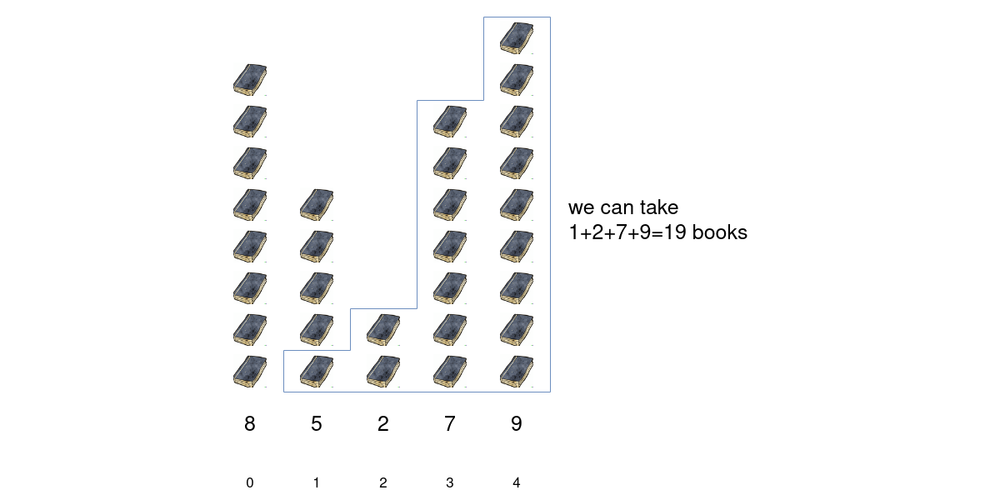
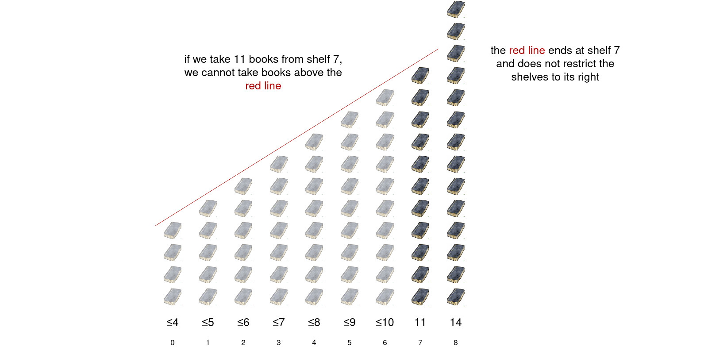
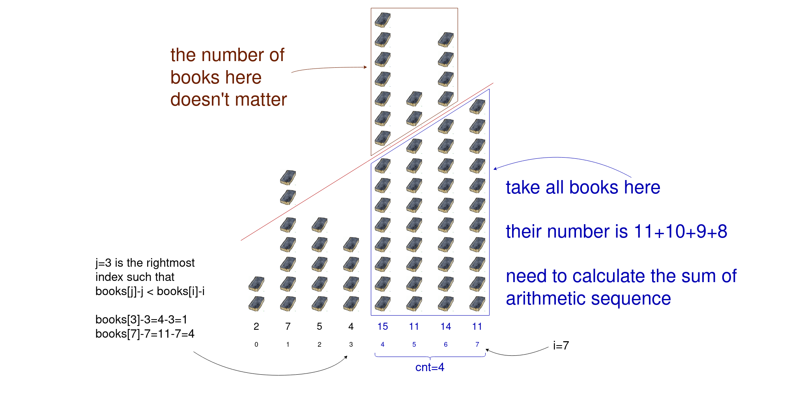
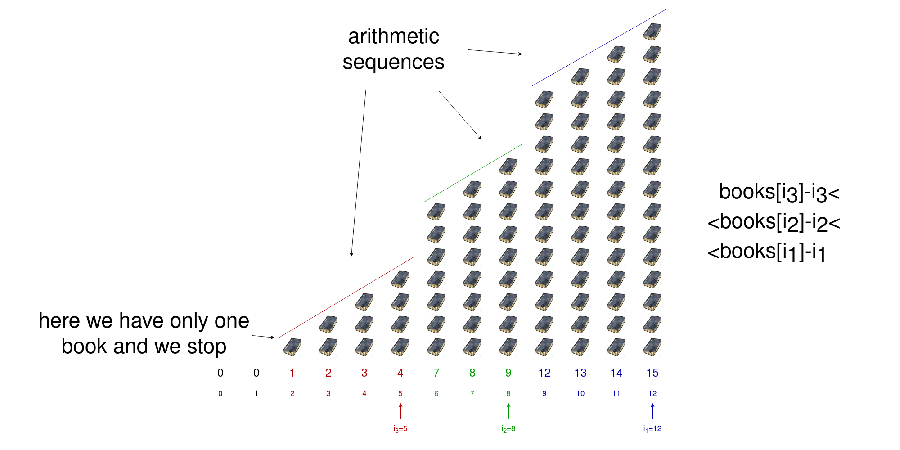

## Solution

---

### Overview

>**Note.** For this problem, we assume that you already know what the stack is and are figuring out how to apply it to a wide range of problems, such as this one. If you are not yet at this stage, we recommend checking out our relevant [Queue & Stack Explore Card](https://leetcode.com/explore/learn/card/queue-stack/) before coming back to this article.

---

### Approach 1: Dynamic Programming

#### Intuition

Consider the first example from the problem statement.



In this example, we take $1$ book from shelf $1$, $2$ books from shelf $2$, $7$ books from shelf $3$, and $9$ books from shelf $4$. The total number of books taken is $19$.

Let $a_i$ be the number of books we take from the $i^\text{th}$ shelf.

We have two constraints on $a_i$.

1. $a_i \le \text{books}[i]$ – we cannot take more books from the shelf than there are.
2. $a_i \le a_{i + 1} - 1$ – we must take **strictly fewer** books from shelf $i$ than shelf $i + 1$.

Let's examine the second constraint more thoroughly. For example, we take $11$ books from the shelf $7$. It means that we can take at most $10$ books from the shelf $6$, at most $9$ books from the shelf $5$, $8$ books from the shelf $4$, and so on.
We can show this constraint in the picture with a straight line.



Imagine that we have taken $\text{books}[i]$ books from shelf $i$. We try to take $\text{books}[i] - 1$ books from shelf $i - 1$, if there are enough of them there (if $\text{books}[i - 1] \ge \text{books}[i] - 1$). Then we proceed to shelf $i - 2$: take $\text{books}[i] - 2$ books from shelf $i - 2$, if $\text{books}[i - 2] \ge \text{books}[i] - 2$. At some point, we will encounter index $j$ such that $j < i$ and $\text{books}[j] < \text{books}[i] - (i - j)$, or written differently, $\text{books}[j] - j < \text{books}[i] - i$.



In the above example, we take $11$ books from shelf $7$, $10$ books from shelf $6$ ($14 \ge 10$), $9$ books from shelf $5$ ($11 \ge 9$), $8$ books from shelf $4$ ($15 \ge 8$). The numbers $11$, $10$, $9$, and $8$ form a finite arithmetic progression. We cannot take $7$ books from shelf $3$ and continue this progression, because there are not enough books there $(4 < 7)$. Thus we must stop the progression just before index $j=3$.

The sequence of numbers of books taken from shelves in the range $[j + 1, i]$ is an arithmetic progression.

The number of books taken from shelves in range $[l, r]$ is $\text{books}[r] + (\text{books}[r] - 1) + (\text{books}[r] - 2) + \dots + (\text{books}[r] - (\text{cnt} - 1))$, where $\text{cnt}$ is the number of summands. Each summand represents the number of books taken from the corresponding shelf. We need to find the sum of a finite arithmetic progression.

How do we find the number of summands $\text{cnt}$? Firstly, $\text{cnt}$ does not exceed $r - l + 1$, because there are that many shelves in the range $[l, r]$. Secondly, the last summand $\text{books}[r] - (\text{cnt} - 1)$ must be positive (we don't take a nonpositive number of books from any shelf), thus $\text{cnt} \le \text{books}[r]$ must hold. Combining two constraints on $\text{cnt}$, we obtain $\text{cnt} = \min (\text{\text{books}[r]}, r - l + 1)$.

The sum of a finite arithmetic progression with $\text{cnt}$ elements with the first one being $\text{books}[r]$ and the last one – $\text{books}[r] - (\text{cnt} - 1)$, is $\frac{1}{2}(\text{firstElement} + \text{lastElement}) \cdot \text{cnt} = \frac{1}{2}(2 \cdot \text{books}[r] - (\text{cnt} - 1)) \cdot \text{cnt}$.

In code, we will use a helper function $\text{calculateSum}(l, r)$ that computes the sum of a finite arithmetic progression using this formula.

We will use dynamic programming to solve the problem. Let $\text{dp}[i]$ be the maximum number of books we can take from all the shelves in range $[0, i]$ when we take exactly $\text{books}[i]$ books from shelf $i$.

How to compute $\text{dp}[i]$? We already know that the number of books in the range $[j + 1, i]$ equals the sum of an arithmetic progression $\text{calculateSum}(j + 1, i)$. However, what is the maximum number of books taken from the range $[0, j]$ before it? This is actually a smaller subproblem whose answer is $\text{dp}[j]$. So if we iterate through each bookshelf starting at $0$, when we process the $\text{dp}[i]$, we've got the value of $\text{dp}[j]$ and can utilize it directly.

We can write down the DP relation: $\text{dp}[i] = \text{dp}[j] + \text{calculateSum}(j + 1, i)$. However, if such $j$ does not exist, $\text{dp}[i] = \text{calculateSum}(0, i)$, because in this case we have only one range $[0, i]$ with arithmetic progression.

Now the problem reduces to finding $j$ for each $i$. We use the following approach for this.

Let the rightmost shelf we take books from, has index $i=i_1$. Denote $i_2$ the largest index such that $i_2 < i_1$ and $\text{books}[i_2] - i_2 < \text{books}[i_1] - i_1$. We have already concluded that the numbers of books taken from the shelves in range $[i_2 + 1, i_1]$ form a finite arithmetic progression.

Now do the same for index $i_2$ – find the maximum $i_3$ such that $i_3 < i_2$ and $\text{books}[i_3] - i_3 < \text{books}[i_2] - i_2$. The sequence in range $[i_3 + 1, i_2]$ is also a finite arithmetic progression.

We continue this process until we reach shelf $0$, or we will not be able to take books anymore.



Let's say we have already found the answer for some $i_1$. Now, a new shelf to the right of $i_1$ appears. Let's see what happens.

!?!../Documents/2355/slideshow.json:960,540!?!

We can simulate the process in the slideshow with a *monotonic stack*. The stack will keep the indices (shown with colorful arrows) in order of $\text{books}[i] - i$ with the index with the largest value being at the top of the stack. When a new index comes, we pop some elements from the stack, and push the new index,  keeping the $\text{books}[i] - i$ values of the elements on the stack in ascending order.

In the slideshow, the stack was `[5, 8, 12]` (index $12$ at the top) due to inequalities $\text{books}[5] - 5 < \text{books}[8] - 8 < \text{books}[12] - 12$. The stack means that we have ranges `[0, 5]`, `[6, 8]` and `[9, 12]`. We could compute $\text{dp}[12]$ as $\text{dp}[8] + \text{calculateSum}(9, 12)$.

After adding index $13$, the stack becomes `[5, 13]` (index $13$ at the top) and ranges are `[0, 5]`, `[6, 13]`. Now we can calculate $\text{dp}[13]$ as $\text{dp}[5] + \text{calculateSum}(6, 13)$.

To summarize, we iterate over all shelves $i$ from left to right keeping the monotonic stack of indices. For each $i$, we find the previous index in the stack $j$ and compute $\text{dp}[i]$ via $\text{dp}[j]$, or calculate $\text{dp}[i] = \text{calculateSum}(0, i)$ if such $j$ does not exist.

The answer to the problem is the maximum element in $\text{dp}$ array.

#### Algorithm

1. Let $n$ be the number of books.
2. Declare the stack $s$.
3. Iterate $i$ over all shelves from $0$ to $n-1$.
* While $s$ is not empty and $\text{books}[s.\text{top}()] - s.\text{top}() \ge \text{books}[i] - i$ (pushing $i$ would violate order in the stack), pop the element from $s$.
* If $s$ is empty, set $\text{dp}[i] = \text{calculateSum}(0, i)$
* Otherwise, $j = s.\text{top}()$. Compute $\text{dp}[i]$ as $\text{dp}[j] + \text{calculateSum}(j + 1, i)$.
* Push index $i$ onto $s$.
4. Return the maximum element in $\text{dp}$ array.

The helper function $\text{calculateSum}(l, r)$ computes the sum of a finite arithmetic progression on the range $[l, r]$, where we take $\text{books}[r]$ books from shelf $r$, $\text{books}[r] - 1$ books from shelf $r - 1$ and so on.
1. Set $\text{cnt} = \min (\text{books}[r], r - l + 1)$ – the number of elements in the sequence.
2. Return $\frac{1}{2}(2 \cdot \text{books}[r] - (\text{cnt} - 1)) \cdot \text{cnt}$.

#### Implementation

```python
class Solution:
    def maximumBooks(self, books: List[int]) -> int:
        n = len(books)

        # Helper function to calculate the sum of books in a given range [l, r]
        def calculateSum(l, r):
            cnt = min(books[r], r - l + 1)
            return (2 * books[r] - (cnt - 1)) * cnt // 2

        stack = []
        dp = [0] * n

        for i in range(n):
            # While we cannot push i, we pop from the stack
            while stack and books[stack[-1]] - stack[-1] >= books[i] - i:
                stack.pop()

            # Compute dp[i]
            if not stack:
                dp[i] = calculateSum(0, i)
            else:
                j = stack[-1]
                dp[i] = dp[j] + calculateSum(j + 1, i)

            # Push the current index onto the stack
            stack.append(i)

        # Return the maximum element in the dp array
        return max(dp)
```

#### Complexity Analysis

* Time complexity: $O(n)$.

The algorithm iterates all the shelves once from left to right.

Inside the loop, there's a `while` loop that pops elements from a stack. However, each element can be pushed and popped from the stack at most once. This inner `while` loop doesn't lead to nested iterations, so it doesn't affect the overall time complexity.

Other operations inside the loop, such as calculating $\text{dp}[i]$, have constant time complexity.

As a result, the dominant factor in the time complexity is the single loop that iterates through the shelves, making the overall time complexity linear, $O(n)$.

* Space complexity: $O(n)$.

The algorithm uses a stack to keep track of the indices of the shelves. In the worst case when all shelves from $0$ to $n-1$ are pushed onto the stack, it may contain all $n$ indices.

Additionally, there is an array $\text{dp}$ containing $n$ elements.

Therefore, the overall space complexity is $O(n)$.