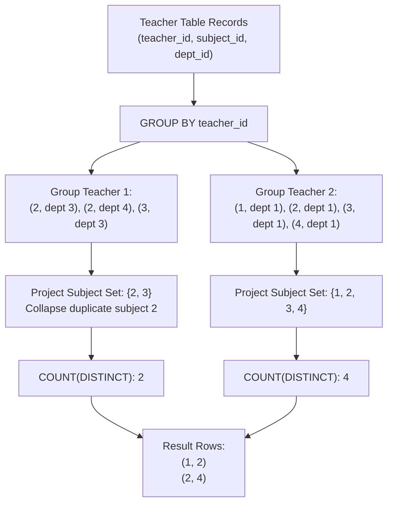

# Guided Example: Number of Unique Subjects Taught by Each Teacher

## 1. Problem Overview & Representative Instance

We are given a relational database table named `Teacher` containing teaching assignments with columns `teacher_id`, `subject_id`, and `dept_id`. Each row records that a specific instructor teaches a given subject within a specific university department. A teacher may teach the same subject across multiple distinct departments.

Our objective is to compute the number of distinct (unique) subjects each teacher teaches across the entire university. The resulting relation must contain `teacher_id` and `cnt`, representing the unique subject headcount for that teacher.

Consider the representative instance:
- `Teacher` table records:
  - Row 1: Teacher $1$, Subject $2$, Department $3$
  - Row 2: Teacher $1$, Subject $2$, Department $4$
  - Row 3: Teacher $1$, Subject $3$, Department $3$
  - Row 4: Teacher $2$, Subject $1$, Department $1$
  - Row 5: Teacher $2$, Subject $2$, Department $1$
  - Row 6: Teacher $2$, Subject $3$, Department $1$
  - Row 7: Teacher $2$, Subject $4$, Department $1$

Let us analyze each instructor:
- **Teacher 1:**
  - Associated records have subject values: $[2, 2, 3]$.
  - The distinct set of subjects is $\{2, 3\}$.
  - Even though Subject $2$ is taught across two separate departments ($3$ and $4$), it represents only a single unique academic subject.
  - Unique subject count: $2$.
- **Teacher 2:**
  - Associated records have subject values: $[1, 2, 3, 4]$.
  - The distinct set of subjects is $\{1, 2, 3, 4\}$.
  - Unique subject count: $4$.

The final result table maps Teacher $1 \mapsto 2$ and Teacher $2 \mapsto 4$.

## 2. Mathematical & Algorithmic Principles

In relational algebra, let the relation `Teacher` be denoted by:

$$T \subseteq \mathbb{Z}^+ \times \mathbb{Z}^+ \times \mathbb{Z}^+$$

where each tuple is $(t, s, d)$ denoting teacher, subject, and department.

The query specifies an aggregation partitioned by teacher:

$$\gamma_{\text{teacher\_id}, \; \text{count\_distinct}(\text{subject\_id}) \to \text{cnt}}(T)$$

For each unique teacher $t \in \pi_{\text{teacher\_id}}(T)$, we construct the set of subjects taught by $t$ by projecting the subject column:

$$S(t) = \{s \in \mathbb{Z}^+ \mid \exists d \text{ such that } (t, s, d) \in T\}$$

The desired aggregate metric `cnt` is the cardinality of this projected set:

$$\text{cnt}(t) = |S(t)|$$

### Set Semantics vs. Multiset Semantics
In relational query engines, a standard `COUNT(subject_id)` counts all tuples in the partitioned group, reflecting multiset cardinality:

$$|T_t| = |\{(t, s, d) \in T\}|$$

If Teacher $1$ teaches Subject $2$ in five departments, standard `COUNT` would evaluate to $5$. However, the `DISTINCT` modifier eliminates duplicate values from the multiset before counting, reducing the evaluation to pure set cardinality $|S(t)|$.

### Algorithmic Evaluation Strategies
1. **Hash-Based Grouping:**
   Maintain a primary hash map from `teacher_id` to a secondary hash set of `subject_id`s.
   As each row $(t, s, d)$ is read, insert $s$ into the hash set associated with key $t$.
   After scanning the table, output the size of each secondary hash set: $|S(t)|$.
2. **Sort-Based Aggregation:**
   Sort the table by `(teacher_id, subject_id)`.
   Scan the sorted stream linearly. Within each contiguous block of identical `teacher_id`, count transitions where `subject_id` changes value.

| Algebraic Operator | Multiset Expression | Mathematical Role |
|---|---|---|
| Group Partitioning | $\{r \in T \mid r.\text{teacher\_id} = t\}$ | Isolates records belonging to a single instructor |
| Distinct Projection | $\pi_{\text{subject\_id}}(\text{Group}_t)$ | Eliminates departmental duplicates of the same course |
| Cardinality Count | $|S(t)|$ | Produces the scalar metric `cnt` |

## 3. Step-by-Step Walkthrough with Intermediate State

Let us trace the representative table through hash-based set aggregation.

### Phase 1: Partition and Set Insertion
Initialize an empty associative mapping $M$:
- **Row 1: $(1, 2, 3)$**
  - Teacher $1$. Insert Subject $2$ into $M[1]$.
  - Set for Teacher 1: $\{2\}$.
- **Row 2: $(1, 2, 4)$**
  - Teacher $1$. Insert Subject $2$ into $M[1]$.
  - Element $2$ is already present. Set remains $\{2\}$.
- **Row 3: $(1, 3, 3)$**
  - Teacher $1$. Insert Subject $3$ into $M[1]$.
  - Set for Teacher 1 becomes $\{2, 3\}$.
- **Row 4: $(2, 1, 1)$**
  - Teacher $2$. Insert Subject $1$ into $M[2]$.
  - Set for Teacher 2: $\{1\}$.
- **Row 5: $(2, 2, 1)$**
  - Teacher $2$. Insert Subject $2$ into $M[2]$.
  - Set for Teacher 2: $\{1, 2\}$.
- **Row 6: $(2, 3, 1)$**
  - Teacher $2$. Insert Subject $3$ into $M[2]$.
  - Set for Teacher 2: $\{1, 2, 3\}$.
- **Row 7: $(2, 4, 1)$**
  - Teacher $2$. Insert Subject $4$ into $M[2]$.
  - Set for Teacher 2: $\{1, 2, 3, 4\}$.

### Phase 2: Cardinality Extraction
Iterate over the grouped keys in $M$:
- For `teacher_id = 1`: Set is $\{2, 3\} \implies |M[1]| = 2$.
- For `teacher_id = 2`: Set is $\{1, 2, 3, 4\} \implies |M[2]| = 4$.

Output rows formed:
- `(1, 2)`
- `(2, 4)`

## 4. Comprehensive State Trace

The row-by-row state updates and intermediate distinct subject sets are detailed below.

| Row Number | Tuple $(t, s, d)$ | Target Group $t$ | Subject Inserted $s$ | Active Distinct Set $S(t)$ | Running Set Size $|S(t)|$ |
|---|---|---|---|---|---|
| $1$ | $(1, 2, 3)$ | Teacher 1 | $2$ | $\{2\}$ | $1$ |
| $2$ | $(1, 2, 4)$ | Teacher 1 | $2$ (Duplicate) | $\{2\}$ | $1$ |
| $3$ | $(1, 3, 3)$ | Teacher 1 | $3$ | $\{2, 3\}$ | $2$ |
| $4$ | $(2, 1, 1)$ | Teacher 2 | $1$ | $\{1\}$ | $1$ |
| $5$ | $(2, 2, 1)$ | Teacher 2 | $2$ | $\{1, 2\}$ | $2$ |
| $6$ | $(2, 3, 1)$ | Teacher 2 | $3$ | $\{1, 2, 3\}$ | $3$ |
| $7$ | $(2, 4, 1)$ | Teacher 2 | $4$ | $\{1, 2, 3, 4\}$ | $4$ |

Final grouped output:
- Teacher $1 \implies 2$
- Teacher $2 \implies 4$

## 5. Algorithmic Correctness & Soundness

1. **Department Dimension Irrelevance:**
   The requirement asks for the unique subjects taught by each teacher across the entire university, without departmental subdivision. Department identifiers act solely as relational context; projecting them out before counting guarantees that course offerings across multiple faculties do not artificially inflate the teacher's subject count.

2. **Idempotence of Set Membership:**
   Because set insertion is idempotent ($S \cup \{x\} = S$ if $x \in S$), any subject taught $m$ times by teacher $t$ contributes exactly $1$ to the set cardinality.

3. **Exhaustive Partitioning:**
   Grouping strictly by `teacher_id` ensures that every assigned subject is mapped to its responsible instructor and that no subjects are conflated across different teachers.

## 6. Edge Cases & Anti-Patterns

- **Single Assignment per Teacher:**
  - If an instructor teaches only one subject in one department, the set is a singleton, returning `cnt = 1`.
- **Teacher Offering the Same Subject in Many Departments:**
  - An instructor teaching subject $101$ in ten departments has ten rows, but `COUNT(DISTINCT)` collapses them to $1$.
- **Anti-Pattern (Omitting the `DISTINCT` Keyword):**
  - Using `COUNT(subject_id)` counts the number of classes/sections rather than unique subjects. If an instructor teaches the same subject in two departments, omitting `DISTINCT` erroneously returns $2$ instead of $1$.

## 7. Complexity Analysis

- **Time Complexity:** $\mathcal{O}(R \log R)$ under sort-based aggregation, or $\mathcal{O}(R)$ under hash-based aggregation, where $R$ is the total number of rows in the `Teacher` table.
  - In a relational query engine, hashing or sorting the $R$ records requires at most linear or linearithmic time.
  - Calculating set cardinality across the partitioned groups takes $\mathcal{O}(R)$ total operations.
- **Space Complexity:** $\mathcal{O}(R)$ auxiliary working memory to store the hash tables or temporary sorting buffers for the grouped partitions.
