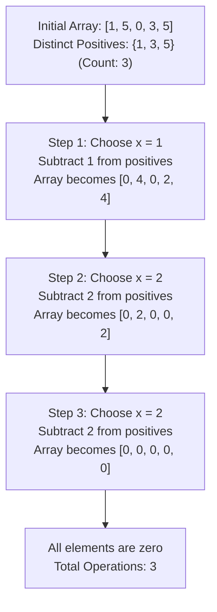

# Guided Example: Make Array Zero by Subtracting Equal Amounts

## 1. Problem Overview & Representative Instance

We are given a 0-indexed non-negative integer array `nums`. In a single operation, we must:
1. Select a positive integer $x$ such that $x$ is less than or equal to the smallest non-zero element in `nums`.
2. Subtract $x$ from every positive element in `nums`.

Our goal is to determine the minimum number of operations required to reduce every element in `nums` to $0$.

Consider the representative instance:
- `nums = [1, 5, 0, 3, 5]`
- Array length: $n = 5$

Let us trace the operations when greedily choosing $x$ as the minimum positive element at each step:
- **Operation 1:** The positive elements are $\{1, 5, 3, 5\}$. The smallest positive element is $x_1 = 1$.
  - Subtract $1$ from all positive elements:
    $$nums \to [1 - 1, 5 - 1, 0, 3 - 1, 5 - 1] = [0, 4, 0, 2, 4]$$
  - The value $1$ has been reduced to $0$.
- **Operation 2:** The remaining positive elements are $\{4, 2, 4\}$. The smallest positive element is $x_2 = 2$.
  - Subtract $2$ from all positive elements:
    $$nums \to [0, 4 - 2, 0, 2 - 2, 4 - 2] = [0, 2, 0, 0, 2]$$
  - The value $2$ (originally $3$) has been reduced to $0$.
- **Operation 3:** The remaining positive elements are $\{2, 2\}$. The smallest positive element is $x_3 = 2$.
  - Subtract $2$ from all positive elements:
    $$nums \to [0, 2 - 2, 0, 0, 2 - 2] = [0, 0, 0, 0, 0]$$
  - The value $2$ (originally $5$) has been reduced to $0$.

All elements are now $0$. Exactly $3$ operations were performed.
Notice that the distinct positive numbers in the initial array were $\{1, 3, 5\}$, exactly $3$ distinct values.

## 2. Mathematical & Algorithmic Principles

Let the multiset of positive elements in `nums` be partitioned into $m$ distinct positive values:

$$0 < u_1 < u_2 < \dots < u_m$$

Let $E_k = \{i \mid nums[i] = u_k\}$ be the set of indices containing the $k$-th distinct positive value.

### Order Preservation Under Uniform Subtraction
Suppose in any valid operation we choose $x = \min \{nums[i] \mid nums[i] > 0\} = u_1$.
When $x$ is subtracted from all positive elements:
1. Every element in $E_1$ had value $u_1$; after subtracting $u_1$, its value becomes $u_1 - u_1 = 0$.
2. For any $k > 1$, every element in $E_k$ had value $u_k$; after subtracting $u_1$, its value becomes $u_k - u_1 > 0$.
3. Two elements that were previously equal ($nums[i] = nums[j] = u_k$) remain equal ($u_k - u_1 = u_k - u_1$).
4. Two elements that were strictly distinct ($nums[i] = u_j < nums[k] = u_l$) remain strictly distinct ($u_j - u_1 < u_l - u_1$).

Therefore, subtracting the minimum positive element maps the value $u_1$ to $0$ and preserves the relative distinctions among all strictly larger values. The number of distinct positive values decreases by exactly $1$:

$$m' = m - 1$$

### Invariance of Necessary Operations
- **Upper Bound:** By choosing $x = \min_{v > 0} v$ at each step, exactly $m$ operations suffice to eliminate all $m$ distinct positive values.
- **Lower Bound:** In any single operation, at most one distinct value can be mapped to $0$. Specifically, only elements equal to $x$ can become $0$, because $v - x = 0 \iff v = x$. Any element with $v > x$ remains strictly positive ($v - x > 0$). Thus, no single operation can reduce more than one distinct positive value to $0$.
- To reduce $m$ distinct positive values to $0$, any valid sequence of operations requires at least $m$ operations.

Combining the bounds, the minimum number of operations is unconditionally equal to the number of distinct strictly positive values in `nums`:

$$\text{Min Operations} = |\{v \in nums \mid v > 0\}|$$

| Value Category | Initial Property | Action in Step 1 ($x = u_1$) | Effect on Distinct Positives |
|---|---|---|---|
| Zero ($nums[i] = 0$) | Ignored | Untouched | Remains $0$ |
| Smallest Positive ($nums[i] = u_1$) | Positive layer $1$ | Reduced to $u_1 - u_1 = 0$ | Eliminated from positive set |
| Strictly Greater ($nums[i] = u_k, k > 1$) | Positive layer $k$ | Shifts to $u_k - u_1 > 0$ | Preserved as positive layer $k-1$ |

## 3. Step-by-Step Walkthrough with Intermediate State

Let us trace `nums = [1, 5, 0, 3, 5]`.

### Phase 1: Filter and Extract Positive Values
Scan through the array and extract elements strictly greater than $0$:
- Index 0: value $1 > 0 \implies$ keep $1$.
- Index 1: value $5 > 0 \implies$ keep $5$.
- Index 2: value $0 \le 0 \implies$ ignore.
- Index 3: value $3 > 0 \implies$ keep $3$.
- Index 4: value $5 > 0 \implies$ keep $5$.

Extracted positive multiset: $\{1, 5, 3, 5\}$.

### Phase 2: Deduplication via Set Insertion
Insert positive numbers into a set $S$:
- Insert $1 \implies S = \{1\}$
- Insert $5 \implies S = \{1, 5\}$
- Insert $3 \implies S = \{1, 3, 5\}$
- Insert $5 \implies 5$ already present, $S = \{1, 3, 5\}$

### Phase 3: Evaluate Cardinality
Compute the size of the set:
$$|S| = |\{1, 3, 5\}| = 3$$

The algorithm outputs $3$ directly without simulating any subtractions.

## 4. Comprehensive State Trace

The state of the array across the theoretical physical simulation is contrasted with the mathematical set view below.

| Step | Array State | Active Positive Values | Minimum Positive $x$ | Elements Zeroed | Remaining Distinct Positives |
|---|---|---|---|---|---|
| Initial | `[1, 5, 0, 3, 5]` | $\{1, 3, 5\}$ | $1$ | — | $3$ |
| After Op 1 | `[0, 4, 0, 2, 4]` | $\{2, 4\}$ | $2$ | All copies of $1$ (Idx 0) | $2$ |
| After Op 2 | `[0, 2, 0, 0, 2]` | $\{2\}$ | $2$ | All copies of $3$ (Idx 3) | $1$ |
| After Op 3 | `[0, 0, 0, 0, 0]` | $\emptyset$ | — | All copies of $5$ (Idx 1, 4) | $0$ |

Total operations required: $3$.

## 5. Algorithmic Correctness & Soundness

1. **Substraction Monotonicity:**
   Because all positive elements are shifted by the same amount $x$, their pairwise differences remain identical: $(nums[i] - x) - (nums[j] - x) = nums[i] - nums[j]$. Thus, elements that are distinct before an operation remain distinct after the operation, unless one of them is equal to $x$ and vanishes to $0$.

2. **Optimality of Choosing the Minimum:**
   Choosing $x < \min_{v > 0} v$ reduces no element to $0$, wasting an operation without decreasing the count of positive values. Choosing $x = \min_{v > 0} v$ is the maximal legal reduction permitted by the rules, ensuring each operation eliminates a distinct positive value.

3. **Insignificance of Zeros:**
   Zeros present in the initial array are bypassed by the rule "subtract $x$ from every positive element". Hence, the presence, count, or positions of zeros has zero impact on the required operations.

## 6. Edge Cases & Anti-Patterns

- **Array Already All Zeros (`nums = [0, 0, 0]`):**
  - Set of positive values is empty: $S = \emptyset$.
  - Cardinality is $0$. Returns $0$.
- **All Elements Equal and Positive (`nums = [7, 7, 7, 7]`):**
  - Unique positive values: $\{7\}$.
  - Cardinality is $1$. In a single operation with $x = 7$, all elements become $0$. Returns $1$.
- **Single Element (`nums = [0]` vs `nums = [9]`):**
  - `[0]`: $|S| = 0 \implies 0$.
  - `[9]`: $|S| = 1 \implies 1$.
- **Anti-Pattern (Simulating Array Subtractions via Repeated Loops):**
  - Performing physical in-place subtractions across array loops takes $\mathcal{O}(m \cdot n)$ time. The mathematical equivalence computes the result in a single pass of $\mathcal{O}(n)$ time and $\mathcal{O}(n)$ auxiliary space.

## 7. Complexity Analysis

- **Time Complexity:** $\mathcal{O}(n)$, where $n$ is the length of `nums`. A single linear scan inspects each element and inserts non-zero values into a hash set (or boolean frequency array). Each set insertion takes $\mathcal{O}(1)$ average time.
- **Space Complexity:** $\mathcal{O}(u)$, where $u \le n$ is the number of distinct positive values. Since values satisfy $0 \le nums[i] \le 100$, space is strictly bounded by $\mathcal{O}(\min(n, 100)) = \mathcal{O}(1)$ auxiliary space.
