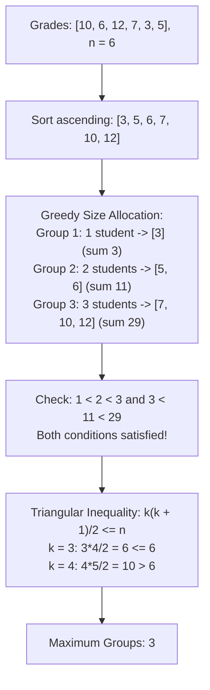

# Guided Example: Maximum Number of Groups Entering a Competition

## 1. Problem Overview & Representative Instance

We are given a positive integer array `grades` representing the test scores of $n$ students entering a competition. We wish to partition all $n$ students into $k$ non-empty groups such that for every adjacent pair of groups $i$ and $i+1$ ($1 \le i < k$):
1. **Strictly Increasing Cardinality:** The total number of students in group $i$ is strictly less than the total number of students in group $i+1$.
2. **Strictly Increasing Grade Sum:** The total sum of the grades of students in group $i$ is strictly less than the total sum of grades in group $i+1$.

Students do not need to remain in their original array order, but each student must belong to exactly one group (or extra students can be merged into groups without violating constraints). Our objective is to determine the maximum number of groups $k$ that can be formed.

Consider the representative instance:
- `grades = [10, 6, 12, 7, 3, 5]`
- Total students: $n = 6$

Let us sort the grades in non-decreasing order:
$$\text{sorted}(grades) = [3, 5, 6, 7, 10, 12]$$

Now partition the sorted students into $k = 3$ groups with consecutive increasing sizes $1, 2, 3$:
- Group 1 (size $1$): `[3]`, sum of grades $= 3$
- Group 2 (size $2$): `[5, 6]`, sum of grades $= 5 + 6 = 11$
- Group 3 (size $3$): `[7, 10, 12]`, sum of grades $= 7 + 10 + 12 = 29$

Checking the conditions:
- Sizes: $1 < 2 < 3$ (strictly increasing).
- Sums: $3 < 11 < 29$ (strictly increasing).

Could we form $k = 4$ groups?
The minimum headcount to form $4$ strictly increasing group sizes is $1 + 2 + 3 + 4 = 10 > 6$.
With only $6$ students, $4$ groups are mathematically impossible.
Therefore, the maximum number of groups is $k = 3$.

## 2. Mathematical & Algorithmic Principles

Let $s_1, s_2, \dots, s_k$ denote the sizes of the $k$ groups, and let $S_1, S_2, \dots, S_k$ denote their respective grade sums.
The constraints require:

$$1 \le s_1 < s_2 < \dots < s_k$$

$$S_1 < S_2 < \dots < S_k$$

### Minimum Headcount Lower Bound
Because the group sizes $s_i$ are strictly increasing positive integers, they must satisfy $s_1 \ge 1$, $s_2 \ge 2$, $\dots$, $s_k \ge k$.
Summing across all $k$ groups:

$$n = \sum_{i=1}^k s_i \ge \sum_{i=1}^k i = \frac{k(k + 1)}{2}$$

Therefore, any valid partition into $k$ groups requires at least $\frac{k(k + 1)}{2}$ total students.

### Sufficiency via Monotonic Sorting
We claim that the triangular bound $n \ge \frac{k(k + 1)}{2}$ is both necessary and sufficient.
*Proof:*
1. Sort all $n$ grades ascending: $g_1 \le g_2 \le \dots \le g_n$. Because every test grade is strictly positive ($g_i \ge 1$):
2. Assign the first $1$ student to Group 1: $\{g_1\}$.
3. Assign the next $2$ students to Group 2: $\{g_2, g_3\}$.
4. $\dots$
5. Assign the next $k-1$ students to Group $k-1$.
6. Assign all remaining $n - \frac{(k-1)k}{2} \ge k$ students to Group $k$.

Now compare Group $i$ and Group $i+1$:
- Group $i+1$ has strictly more students than Group $i$: $s_{i+1} > s_i$.
- Every student in Group $i+1$ has a grade that is greater than or equal to the largest grade in Group $i$:
  $$\min_{x \in \text{Group } i+1} x \ge \max_{y \in \text{Group } i} y$$
- Since all grades are positive ($x \ge 1$) and Group $i+1$ has more elements with equal or higher individual values, the sum strictly increases:
  $$S_{i+1} \ge s_{i+1} \cdot (\min \text{Group } i+1) > s_i \cdot (\max \text{Group } i) \ge S_i$$

Consequently, the grade sum constraint $S_i < S_{i+1}$ is automatically satisfied for any sorted positive array whenever the size constraint $s_i < s_{i+1}$ is met.

### Closed-Form Quadratic Solution
To find the maximal integer $k$:

$$\frac{k(k + 1)}{2} \le n \iff k^2 + k - 2n \le 0$$

Applying the quadratic formula to the positive root:

$$k = \left\lfloor \frac{-1 + \sqrt{1 + 8n}}{2} \right\rfloor$$

The answer depends strictly on the scalar array length $n$; the individual grade values have no effect on the maximum number of groups.

| Student Count $n$ | Maximal $k$ | Triangular Threshold $\frac{k(k+1)}{2}$ | Minimum Group Sizes |
|---|---|---|---|
| $1 - 2$ | $1$ | $1$ | $[1]$ |
| $3 - 5$ | $2$ | $3$ | $[1, 2]$ |
| $6 - 9$ | $3$ | $6$ | $[1, 2, 3]$ |
| $10 - 14$ | $4$ | $10$ | $[1, 2, 3, 4]$ |
| $15 - 20$ | $5$ | $15$ | $[1, 2, 3, 4, 5]$ |

## 3. Step-by-Step Walkthrough with Intermediate State

Let us trace `grades = [10, 6, 12, 7, 3, 5]` with $n = 6$.

### Step 1: Extract Problem Dimension
Count the total number of students:
$$n = \text{length}(grades) = 6$$

### Step 2: Test Progressive Group Sizes
We increment candidate group count $k = 1, 2, 3, \dots$ until the cumulative student requirement exceeds $n$:
- **Candidate $k = 1$:**
  - Cumulative students needed: $\frac{1 \times 2}{2} = 1$.
  - Feasibility: $1 \le 6$ (Valid).
- **Candidate $k = 2$:**
  - Cumulative students needed: $\frac{2 \times 3}{2} = 3$.
  - Feasibility: $3 \le 6$ (Valid).
- **Candidate $k = 3$:**
  - Cumulative students needed: $\frac{3 \times 4}{2} = 6$.
  - Feasibility: $6 \le 6$ (Valid).
- **Candidate $k = 4$:**
  - Cumulative students needed: $\frac{4 \times 5}{2} = 10$.
  - Feasibility: $10 > 6$ (Exceeds available headcount).

### Step 3: Closed-Form Quadratic Verification
Evaluate the closed-form equation:
$$k = \left\lfloor \frac{-1 + \sqrt{1 + 8 \times 6}}{2} \right\rfloor = \left\lfloor \frac{-1 + \sqrt{49}}{2} \right\rfloor = \left\lfloor \frac{-1 + 7}{2} \right\rfloor = \left\lfloor \frac{6}{2} \right\rfloor = 3$$

Both methods yield $k = 3$.

## 4. Comprehensive State Trace

The feasibility of various group counts for $n = 6$ is tabulated below.

| Group Count $k$ | Size Sequence $s_1, \dots, s_k$ | Minimum Students $\frac{k(k+1)}{2}$ | Headcount Check $\le 6$ | Grade Sums for Sorted `[3, 5, 6, 7, 10, 12]` | Status |
|---|---|---|---|---|---|
| $1$ | $[6]$ | $1$ | $1 \le 6$ (True) | $S_1 = 43$ | Valid |
| $2$ | $[1, 5]$ | $3$ | $3 \le 6$ (True) | $S_1 = 3, \; S_2 = 40$ ($3 < 40$) | Valid |
| $3$ | $[1, 2, 3]$ | $6$ | $6 \le 6$ (True) | $S_1 = 3, \; S_2 = 11, \; S_3 = 29$ ($3 < 11 < 29$) | **Optimal ($k = 3$)** |
| $4$ | $[1, 2, 3, 4]$ | $10$ | $10 \le 6$ (False) | Cannot form $4$ distinct sizes | Impossible |
| $5$ | $[1, 2, 3, 4, 5]$ | $15$ | $15 \le 6$ (False) | Exceeds headcount | Impossible |

Maximum valid group count is $3$.

## 5. Algorithmic Correctness & Soundness

1. **Necessity of Triangular Bound:**
   Any partition into $k$ groups with strictly increasing cardinalities must have group sizes $s_1 < s_2 < \dots < s_k$. The minimal integer sequence is $1, 2, \dots, k$, whose sum is $\frac{k(k+1)}{2}$. If $n < \frac{k(k+1)}{2}$, no partition of strictly increasing sizes can exist.

2. **Sufficiency via Ascending Grade Property:**
   Sorting positive integers guarantees that when we partition into contiguous blocks of sizes $1, 2, \dots, k$, each group has both more students and larger individual grades than the preceding group. The product and sum of larger elements over a larger set strictly dominate the previous group, making the sum condition strictly satisfied.

3. **Absorption of Remainder Students:**
   If $n > \frac{k(k+1)}{2}$, placing all remainder students $n - \frac{k(k+1)}{2}$ into the final group $k$ increases its size to $s_k > k$ and increases its grade sum $S_k$, preserving all inequalities.

## 6. Edge Cases & Anti-Patterns

- **Single Student (`grades = [42]`):**
  - $n = 1 \implies \lfloor \frac{-1 + \sqrt{9}}{2} \rfloor = 1$.
- **Two Students (`grades = [8, 8]`):**
  - $n = 2$.
  - $k = 2$ requires $1 + 2 = 3$ students.
  - Returns $1$.
- **All Identical Grades (`grades = [5, 5, 5, 5, 5, 5]`):**
  - $n = 6$.
  - Group 1: 1 five $\implies$ sum 5.
  - Group 2: 2 fives $\implies$ sum 10.
  - Group 3: 3 fives $\implies$ sum 15.
  - $5 < 10 < 15$ holds strictly because group sizes strictly increase. Returns $3$.
- **Anti-Pattern (Sorting and Simulating Groups):**
  - Physically sorting the array takes $\mathcal{O}(n \log n)$ time. Because the answer depends exclusively on $n$, the closed-form quadratic formula evaluates in $\mathcal{O}(1)$ time without sorting.

## 7. Complexity Analysis

- **Time Complexity:** $\mathcal{O}(1)$ using the closed-form integer square root formula $\lfloor \frac{-1 + \sqrt{1 + 8n}}{2} \rfloor$, or $\mathcal{O}(\log n)$ using binary search over $k \in [1, n]$. Neither approach requires sorting or inspecting individual grade values.
- **Space Complexity:** $\mathcal{O}(1)$ auxiliary space. Only a few scalar arithmetic registers are used.
