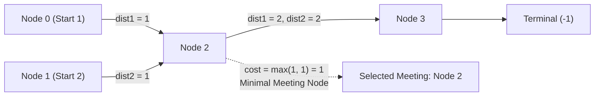

# Guided Example: Find Closest Node to Given Two Nodes

## 1. Problem Overview & Representative Instance

We are given a directed graph of $n$ nodes indexed from $0$ to $n - 1$, where each node has **at most one outgoing edge**. The graph is described by an array `edges` where `edges[i]` is the node that node $i$ has an edge directed to. If node $i$ has no outgoing edge, then `edges[i] == -1`. We are also given two starting nodes, `node1` and `node2`.

A node $u$ is a valid meeting point if it is reachable from both `node1` and `node2` along directed edges. The meeting cost for node $u$ is defined as the maximum of the distance from `node1` to $u$ and the distance from `node2` to $u$:

$$\text{cost}(u) = \max(\text{dist}(node1, u), \; \text{dist}(node2, u))$$

Our goal is to find the node $u$ that minimizes $\text{cost}(u)$. If multiple candidate meeting nodes achieve the same minimal cost, we break ties by returning the node with the strictly smallest numerical index. If no node can be reached from both starting nodes, we return $-1$.

Consider the representative instance:
- `edges = [2, 2, 3, -1]`
- `node1 = 0`, `node2 = 1`
- Number of nodes: $n = 4$

Tracing paths from both start nodes:
- **From `node1 = 0`:**
  - $0 \to 2$ (distance 1)
  - $2 \to 3$ (distance 2)
  - Node $3$ has outgoing edge $-1$, terminating the path.
  - Reachable set from $0$: $\{0: 0, 2: 1, 3: 2\}$.
- **From `node2 = 1`:**
  - $1 \to 2$ (distance 1)
  - $2 \to 3$ (distance 2)
  - Reachable set from $1$: $\{1: 0, 2: 1, 3: 2\}$.

Intersection of reachable nodes: $\{2, 3\}$.
Evaluating meeting costs:
- For node $2$: $\text{cost}(2) = \max(\text{dist}(0, 2), \text{dist}(1, 2)) = \max(1, 1) = 1$.
- For node $3$: $\text{cost}(3) = \max(\text{dist}(0, 3), \text{dist}(1, 3)) = \max(2, 2) = 2$.

The minimum cost is $1$, achieved at node $2$. The answer is $2$.

## 2. Mathematical & Algorithmic Principles

A directed graph where every vertex has out-degree at most $1$ is a collection of disjoint functional components (trees rooted on directed cycles or terminal sinks).

### Uniqueness of Traversal Trajectories
Because the out-degree of any node $v$ is at most $1$, the path starting from any node $s$ is deterministic. At each step $t \ge 0$:

$$p_0 = s, \quad p_{t+1} = edges[p_t]$$

The walk terminates when:
1. $edges[p_t] = -1$ (reaches a sink node with no outgoing edges).
2. $p_{t+1}$ has already been visited (detects a cycle).

Because no branch choices exist, the shortest path distance from $s$ to any reachable node $u$ is simply the number of steps taken when $u$ is first encountered:

$$\text{dist}(s, u) = \min \{t \ge 0 \mid p_t = u\}$$

Any node not encountered before termination is unreachable: $\text{dist}(s, u) = \infty$.

### Bottleneck Objective Function
Let $D_1(u) = \text{dist}(node1, u)$ and $D_2(u) = \text{dist}(node2, u)$.
The optimization problem is:

$$u^* = \arg\min_{u \in \{0, \dots, n-1\}} \left( \max(D_1(u), D_2(u)), \; u \right)$$

subject to $D_1(u) < \infty$ and $D_2(u) < \infty$.

Here the tuple $(\max(D_1(u), D_2(u)), u)$ uses standard lexicographical ordering, naturally breaking distance ties in favor of the lower node index $u$.

| Traversal Path | Source Node | Termination Condition | Metric Collected |
|---|---|---|---|
| Trajectory 1 | `node1` | $edges[v] = -1$ or node seen again | $D_1[u] = \text{distance from } node1$ |
| Trajectory 2 | `node2` | $edges[v] = -1$ or node seen again | $D_2[u] = \text{distance from } node2$ |
| Joint Optimization | Intersection | $\min_{u} \max(D_1[u], D_2[u])$ | Optimal rendezvous node $u^*$ |

## 3. Step-by-Step Walkthrough with Intermediate State

Let us trace `edges = [2, 2, 3, -1]`, `node1 = 0`, `node2 = 1` with $n = 4$.

### Phase 1: Compute Distances from `node1 = 0`
Initialize $D_1 = [\infty, \infty, \infty, \infty]$.
- Step 0: Visit node $0$. $D_1[0] = 0$. Outgoing edge: $edges[0] = 2$.
- Step 1: Visit node $2$. $D_1[2] = 1$. Outgoing edge: $edges[2] = 3$.
- Step 2: Visit node $3$. $D_1[3] = 2$. Outgoing edge: $edges[3] = -1$.
- Terminate (sink reached).
Distance vector: $D_1 = [0, \infty, 1, 2]$.

### Phase 2: Compute Distances from `node2 = 1`
Initialize $D_2 = [\infty, \infty, \infty, \infty]$.
- Step 0: Visit node $1$. $D_2[1] = 0$. Outgoing edge: $edges[1] = 2$.
- Step 1: Visit node $2$. $D_2[2] = 1$. Outgoing edge: $edges[2] = 3$.
- Step 2: Visit node $3$. $D_2[3] = 2$. Outgoing edge: $edges[3] = -1$.
- Terminate (sink reached).
Distance vector: $D_2 = [\infty, 0, 1, 2]$.

### Phase 3: Evaluate Convergence Candidates
Initialize best cost $C^* = \infty$, best node $u^* = -1$.
Scan all candidate nodes $u \in \{0, 1, 2, 3\}$:
- **Node 0:** $D_1[0] = 0$, $D_2[0] = \infty$. Unreachable from `node2`. Skip.
- **Node 1:** $D_1[1] = \infty$, $D_2[1] = 0$. Unreachable from `node1`. Skip.
- **Node 2:** $D_1[2] = 1$, $D_2[2] = 1$.
  - Bottleneck cost: $\max(1, 1) = 1$.
  - Compare with $C^*$: $1 < \infty$.
  - Update: $C^* \leftarrow 1$, $u^* \leftarrow 2$.
- **Node 3:** $D_1[3] = 2$, $D_2[3] = 2$.
  - Bottleneck cost: $\max(2, 2) = 2$.
  - Compare with $C^*$: $2 \not< 1$. Skip.

Scan complete. The optimal meeting node is $u^* = 2$.

## 4. Comprehensive State Trace

The state for every node in the graph is recorded in the table below.

| Node Index $u$ | Distance from $node1$ ($D_1$) | Distance from $node2$ ($D_2$) | Both Reachable? | Bottleneck $\max(D_1, D_2)$ | Running Best Cost $C^*$ | Best Node $u^*$ |
|---|---|---|---|---|---|---|
| $0$ | $0$ | $\infty$ | False | $\infty$ | $\infty$ | $-1$ |
| $1$ | $\infty$ | $0$ | False | $\infty$ | $\infty$ | $-1$ |
| $2$ | $1$ | $1$ | **True** | $1$ | $1$ | **2** |
| $3$ | $2$ | $2$ | **True** | $2$ | $1$ | **2** |

Optimal meeting node is $2$ with cost $1$.

## 5. Algorithmic Correctness & Soundness

1. **Cycle Robustness:**
   In a functional graph, a trajectory can loop indefinitely inside a directed cycle. By recording the distance upon the first arrival at each node and stopping traversal when encountering an already-visited node, cycles are detected in $\mathcal{O}(1)$ additional operations without infinite looping.

2. **Global Minimality over Common Nodes:**
   Scanning every node $u$ from $0$ to $n-1$ guarantees that every mutually reachable node is evaluated. Testing the strict inequality $\max(D_1[u], D_2[u]) < C^*$ ensures that in case of identical minimum costs, the smallest index is preserved.

3. **Exhaustive Failure Handling:**
   If no node is reachable by both paths, the boolean condition $D_1[u] < \infty \land D_2[u] < \infty$ evaluates to false for all $u$, safely returning the default value $-1$.

## 6. Edge Cases & Anti-Patterns

- **Identical Starting Nodes (`node1 == node2`):**
  - Node `node1` is reached with distance 0 from both sources.
  - $\max(0, 0) = 0$, which is the theoretical minimum. Returns `node1`.
- **Disjoint Components / No Path (`edges = [-1, -1]`, `node1 = 0`, `node2 = 1`):**
  - Path from 0 stops at 0; path from 1 stops at 1. No common node exists. Returns $-1$.
- **Meeting at One of the Start Nodes (`edges = [1, 2, -1]`, `node1 = 0`, `node2 = 2`):**
  - Node 0 reaches: $0 \to 1 \to 2$.
  - Node 2 reaches: $2$.
  - Common node is $2$: $D_1[2] = 2, D_2[2] = 0 \implies \text{cost} = 2$. Returns $2$.
- **Anti-Pattern (Bidirectional Breadth-First Search on General Graphs):**
  - Attempting bidirectional BFS without accounting for directed edges will traverse backwards across edges where traversal is illegal. Single-pass forward tracing along the directed pointers respects edge orientation.

## 7. Complexity Analysis

- **Time Complexity:** $\mathcal{O}(n)$, where $n$ is the number of nodes in the graph.
  - Tracing the trajectory from `node1` visits each node at most once, taking at most $n$ pointer hops: $\mathcal{O}(n)$ time.
  - Tracing the trajectory from `node2` similarly takes at most $n$ hops: $\mathcal{O}(n)$ time.
  - Scanning through the $n$ nodes to find the minimum bottleneck cost takes $\mathcal{O}(n)$ time.
  - Total time complexity is strictly linear $\mathcal{O}(n)$.
- **Space Complexity:** $\mathcal{O}(n)$ auxiliary space to store the two distance arrays of size $n$.
