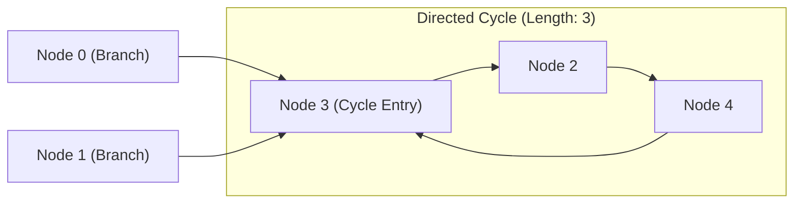

# Guided Example: Longest Cycle in a Graph

## 1. Problem Overview & Representative Instance

We are given a directed graph of $n$ nodes indexed from $0$ to $n - 1$, where each node has **at most one outgoing edge**. The graph is represented by a 0-indexed array `edges` of length $n$, where `edges[i]` denotes a directed edge from node $i$ to node `edges[i]`. If node $i$ has no outgoing edge, then `edges[i] == -1`.

A cycle is a path that starts and ends at the same node without visiting any intermediate node more than once. We must find the length of the longest cycle in the graph. If no cycle exists, we return $-1$.

Consider the representative instance:
- `edges = [3, 3, 4, 2, 3]`
- Node count: $n = 5$

Let us trace the directed connections:
- Node $0 \to 3$
- Node $1 \to 3$
- Node $2 \to 4$
- Node $3 \to 2$
- Node $4 \to 3$

Notice that nodes $2, 4, 3$ form a directed cycle:
$$3 \to 2 \to 4 \to 3$$
The cycle comprises exactly $3$ edges: $(3 \to 2)$, $(2 \to 4)$, and $(4 \to 3)$. Nodes $0$ and $1$ are external tree branches feeding into this cycle. Because no other cycles exist in the graph, the longest cycle has length $3$.

## 2. Mathematical & Algorithmic Principles

A directed graph where every vertex has an out-degree of at most $1$ is a **functional graph** (also known as a successor graph).

### Topological Structure of Functional Graphs
Every connected component in a functional graph has a very rigid topology:
1. It either consists of a directed tree whose edges point toward a terminal sink node (a node with outgoing edge $-1$).
2. Or it contains **exactly one directed cycle**, with zero or more directed trees rooted on the cycle whose edges point inward toward the cycle.

Because out-degrees are bounded by $1$, cycles in a functional graph are strictly vertex-disjoint. No two distinct simple cycles can share a vertex or cross each other.

### Traversal Timestamp Invariant
To identify cycles and measure their exact length in linear time, we can maintain an entry timestamp during traversal:
1. Maintain an array `visited` initialized to $0$ across all $n$ nodes.
2. For each node $i \in \{0, \dots, n-1\}$, if node $i$ has not yet been visited:
   - Initiate a forward traversal starting from $i$.
   - Maintain a local mapping $\text{step}(u)$ recording the step index ($1, 2, 3, \dots$) at which node $u$ was reached along the current path.
   - Follow the outgoing edge: $u \leftarrow edges[u]$.
   - If $u = -1$, the current trajectory terminates in a sink without forming a cycle.
   - If $u$ was already visited in a **previous** traversal path, the current path simply merges into an already explored component. No new cycle can be formed.
   - If $u$ was visited in the **current** traversal path (i.e. $\text{step}(u)$ is defined in the current exploration):
     A directed cycle has been closed! The length of the cycle is the difference in timestamps:
     $$\text{length} = \text{current\_step} - \text{step}(u)$$
3. Global visited markers ensure each node is explored at most once, providing an optimal linear-time algorithm.

| Component State | Traversal Condition | Cycle Conclusion | Next Action |
|---|---|---|---|
| Unexplored Node | Node not present in global visited set | Begins new path search | Assign sequential step timestamps |
| Current Path Collision | Reaches a node with timestamp in active path | Cycle detected with length $\Delta t$ | Update max cycle length, finish component |
| Prior Component Collision | Reaches a node visited in earlier iteration | Path joins explored branch/cycle | Terminate current walk immediately |
| Sink Collision | Reaches $edges[u] = -1$ | Acyclic branch ending at sink | Terminate current walk |

## 3. Step-by-Step Walkthrough with Intermediate State

Let us trace `edges = [3, 3, 4, 2, 3]` with $n = 5$ and initial answer $\text{ans} = -1$.
Global visited tracking: `visited = [False, False, False, False, False]`.

### Traversal 1: Starting at Node 0
- Initialize path map: $\text{step} = \{\}$. Current step $t = 1$.
- **At Node 0:**
  - Record: $\text{step}[0] = 1, visited[0] = \text{True}$.
  - Outgoing edge: $edges[0] = 3$.
- **At Node 3:**
  - $visited[3]$ is False.
  - Record: $\text{step}[3] = 2, visited[3] = \text{True}$.
  - Outgoing edge: $edges[3] = 2$.
- **At Node 2:**
  - $visited[2]$ is False.
  - Record: $\text{step}[2] = 3, visited[2] = \text{True}$.
  - Outgoing edge: $edges[2] = 4$.
- **At Node 4:**
  - $visited[4]$ is False.
  - Record: $\text{step}[4] = 4, visited[4] = \text{True}$.
  - Outgoing edge: $edges[4] = 3$.
- **At Node 3 (Collision!):**
  - Node $3$ is present in the current path map: $\text{step}[3] = 2$.
  - Current step is $5$.
  - Cycle closed! Length is:
    $$\text{length} = 5 - \text{step}[3] = 5 - 2 = 3$$
  - Cycle vertices: $\{3, 2, 4\}$.
  - Update answer: $\text{ans} \leftarrow \max(-1, 3) = 3$.
- End of Traversal 1.

### Traversal 2: Starting at Node 1
- $visited[1]$ is False. Start new path with $\text{step} = \{\}, t = 1$.
- **At Node 1:**
  - Record: $\text{step}[1] = 1, visited[1] = \text{True}$.
  - Outgoing edge: $edges[1] = 3$.
- **At Node 3:**
  - $visited[3]$ is already True, but $3 \notin \text{step}$ of the current traversal.
  - Path merges into previously analyzed component. No new cycle can exist.
- End of Traversal 2.

### Remaining Nodes
- Nodes $2, 3, 4$ are already marked in $visited$.
- Outer loop skips them.

Final longest cycle length is $3$.

## 4. Comprehensive State Trace

The exact trace across the traversal sequence is summarized below.

| Traversal Source | Node Visited $u$ | Current Step $t$ | Outgoing Target $v$ | Collision Type | Detected Cycle Length | Running Max Length |
|---|---|---|---|---|---|---|
| Node 0 | $0$ | $1$ | $3$ | None (New node) | — | $-1$ |
| Node 0 | $3$ | $2$ | $2$ | None (New node) | — | $-1$ |
| Node 0 | $2$ | $3$ | $4$ | None (New node) | — | $-1$ |
| Node 0 | $4$ | $4$ | $3$ | None (New node) | — | $-1$ |
| Node 0 | $3$ | $5$ | — | **Current Path Loop ($t=5, \text{step}[3]=2$)** | $5 - 2 = 3$ | **3** |
| Node 1 | $1$ | $1$ | $3$ | None (New node) | — | $3$ |
| Node 1 | $3$ | $2$ | — | **Prior Visited Component** | None | $3$ |

The maximum cycle length across the entire graph is $3$.

## 5. Algorithmic Correctness & Soundness

1. **Cycle Isolation in Functional Graphs:**
   Because every node has out-degree $\le 1$, any directed walk is strictly unique. If a cycle exists in the component containing node $i$, following the directed edges must either encounter a cycle node or hit a sink ($edges[u] = -1$). Once a node in the cycle is entered, the path is trapped inside the cycle, guaranteeing that the cycle will be fully traversed and detected.

2. **Exactness of Timestamp Delta:**
   If a walk reaches node $u$ at step $t_2$, and node $u$ was previously recorded at step $t_1$ along the exact same path, the subpath $u \to \dots \to u$ constitutes a valid simple directed cycle with exactly $t_2 - t_1$ edges and vertices.

3. **Global Linear Work Invariant:**
   By marking every visited node in a global boolean array, no node is traversed more than once during the search phase. Even if a path terminates by colliding with a previously explored node, the search aborts immediately, guaranteeing total work is bounded by $\mathcal{O}(n)$.

## 6. Edge Cases & Anti-Patterns

- **Acyclic Graph with Sinks (`edges = [2, -1, 3, 1]`):**
  - All paths eventually lead to node 1 (outgoing edge $-1$).
  - No cycle is formed. Returns $-1$.
- **Smallest 2-Node Cycle (`edges = [1, 0]`):**
  - $0 \to 1 \to 0$.
  - Step 1: node 0. Step 2: node 1. Step 3: node 0.
  - Cycle length: $3 - 1 = 2$. Returns $2$.
- **Self-Loop Cycle (`edges = [0]`):**
  - $0 \to 0$.
  - Step 1: node 0. Step 2: node 0.
  - Cycle length: $2 - 1 = 1$. Returns $1$.
- **Anti-Pattern (Unbounded DFS without Visited States):**
  - Performing a standard depth-first search without distinguishing between nodes on the current recursion call stack and nodes explored in prior passes can lead to infinite loops or incorrect cycle length calculations when merging into old components.

## 7. Complexity Analysis

- **Time Complexity:** $\mathcal{O}(n)$, where $n$ is the number of nodes in `edges`.
  - Every node is added to the global visited array at most once.
  - Each directed edge is traversed at most once across all components.
  - The inner loop executes at most $n$ total iterations across all outer iterations combined, ensuring strict linear running time $\mathcal{O}(n)$.
- **Space Complexity:** $\mathcal{O}(n)$ auxiliary space to maintain the global visited array and path timestamp mapping.
