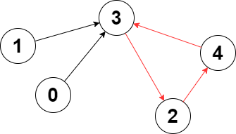
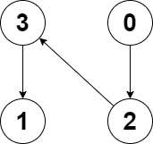

## Description

You are given a **directed** graph of `n` nodes numbered from `0` to $n - 1$, where each node has **at most one** outgoing edge.

The graph is represented with a given **0-indexed** array `edges` of size `n`, indicating that there is a directed edge from node `i` to node $\text{edges}[i]$. If there is no outgoing edge from node `i`, then $\text{edges}[i] = -1$.

Return *the length of the **longest** cycle in the graph*. If no cycle exists, return `-1`.

A cycle is a path that starts and ends at the **same** node.
### Function Contract

- `n`: Input parameter.
- Returns expected result.

### Examples
#### Example 1

- **Input:** $edges = [3,3,4,2,3]$
- **Output:** `3`
- **Explanation:** The longest cycle in the graph is the cycle: 2 -> 4 -> 3 -> 2.
The length of this cycle is 3, so 3 is returned.
#### Example 2

- **Input:** $edges = [2,-1,3,1]$
- **Output:** `-1`
- **Explanation:** There are no cycles in this graph.
### Constraints

- $n = \text{edges.length}$

- $2 \le n \le 10^{5}$

- $-1 \le \text{edges}[i] < n$

- $\text{edges}[i] \neq i$